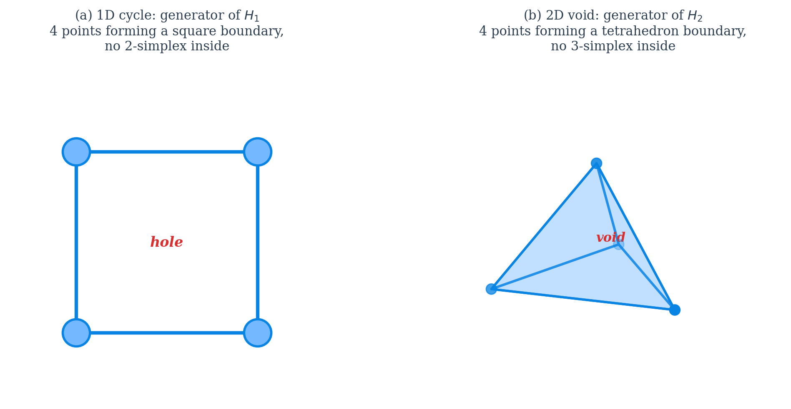
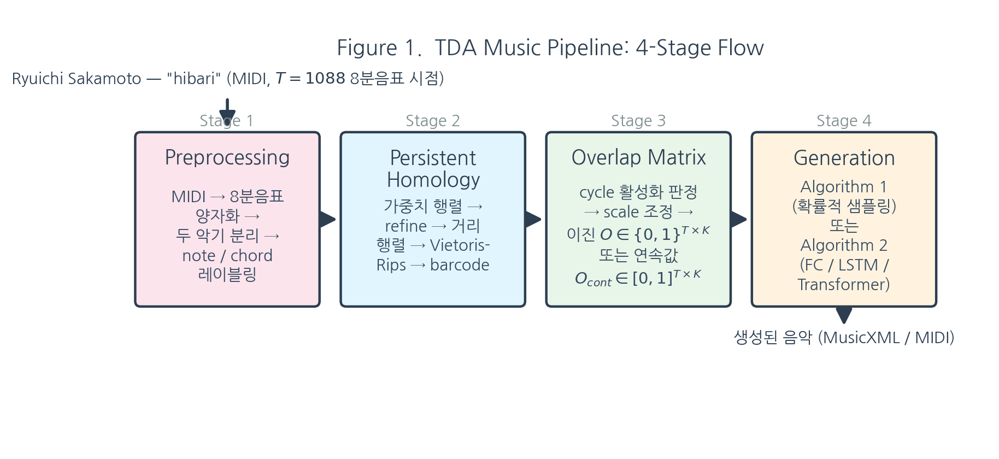
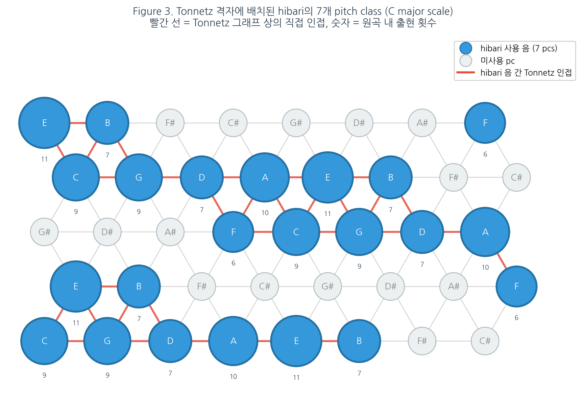
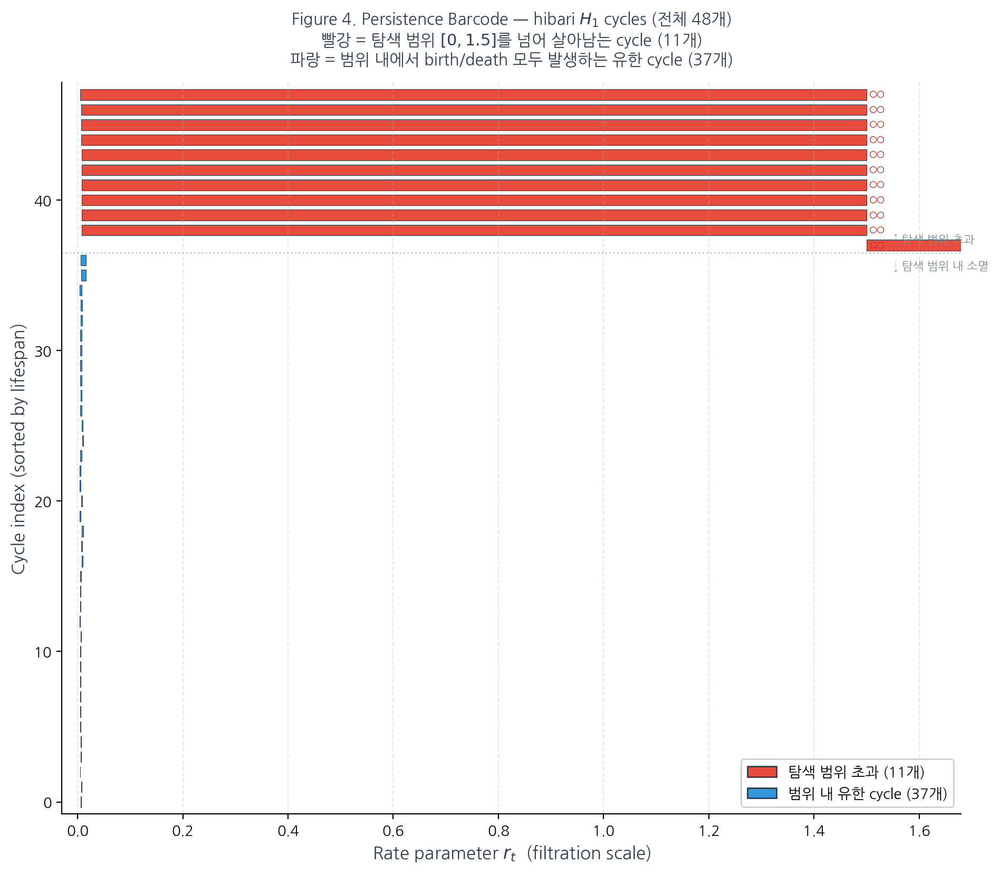
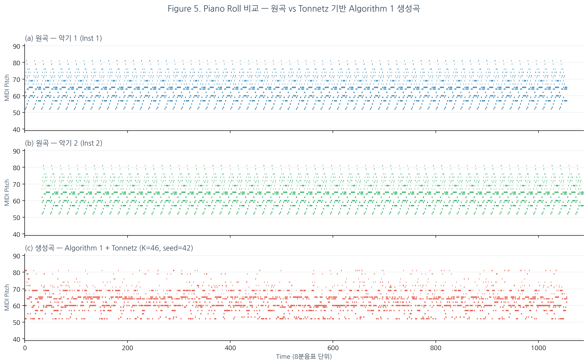
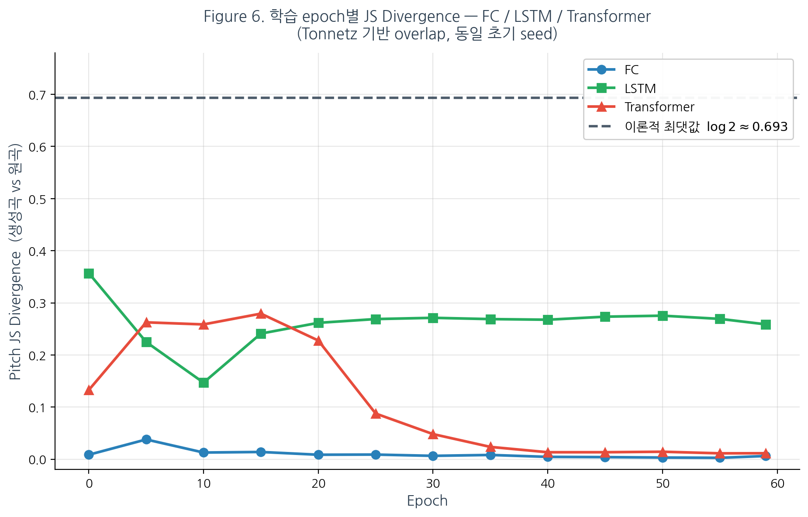
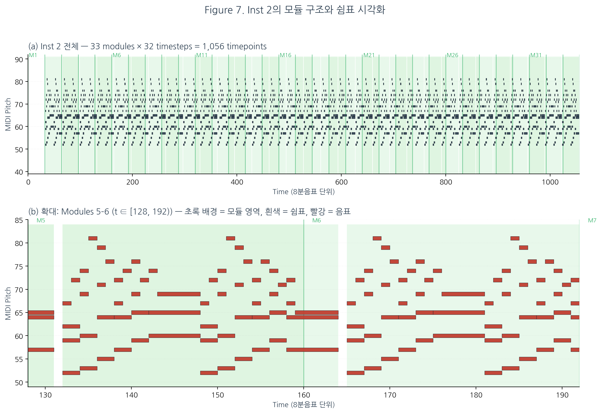

# Topological Data Analysis를 활용한 음악 구조 분석 및 위상 구조 보존 기반 AI 작곡 파이프라인

**저자:** 김민주
**지도:** 정재훈 (KIAS 초학제 독립연구단)
**작성일:** 2026
**키워드:** Topological Data Analysis, Persistent Homology, Tonnetz, Music Generation, Vietoris-Rips Complex, Jensen-Shannon Divergence

---

## 초록 (Abstract)

본 연구는 사카모토 류이치의 2009년 앨범 *out of noise* 수록곡 "hibari"를 대상으로, 음악의 구조를 **위상수학적으로 분석**하고 그 위상 구조를 **보존하면서 새로운 음악을 생성**하는 계산적 파이프라인을 제안한다. 전체 과정은 네 단계로 구성된다. (1) MIDI 전처리: 두 악기를 분리하고 8분음표 단위로 양자화. (2) Persistent Homology: 네 가지 거리 함수(frequency, Tonnetz, voice-leading, DFT)로 note 간 거리 행렬을 구성한 뒤 Vietoris-Rips 복합체의 $H_1$ cycle을 추출. (3) 중첩행렬 구축: cycle의 시간별 활성화를 이진 또는 연속값 행렬로 기록. (4) 음악 생성: 확률적 샘플링 기반의 Algorithm 1과 FC / LSTM / Transformer 신경망 기반의 Algorithm 2 두 방식을 제공.

$N = 20$회 통계적 반복을 통한 정량 검증에서 Tonnetz 거리 함수가 frequency baseline 대비 pitch Jensen-Shannon divergence를 $0.0753 \pm 0.0033$에서 $0.0398 \pm 0.0031$로 **약 $47\%$ 감소**시켰으며, 이는 Welch's $t = 35.1$, Cohen's $d = 11.1$, $p < 10^{-20}$로 극도로 유의한 개선이다. 연속값 중첩행렬을 임계값 $\tau = 0.5$로 이진화한 변형은 기존 이진 중첩행렬 대비 추가로 JS divergence를 $11.4\%$ 개선했으며 ($0.0387 \to 0.0343$, Welch $t = 5.16$), 이 역시 통계적으로 유의했다. 가장 단순한 FC 신경망이 LSTM / Transformer보다 낮은 JS divergence($0.0015$)를 기록한 것은, hibari가 수록된 *out of noise* 앨범의 미학적 성격 — 전통적 선율 인과보다 음들의 공간적 배치에 의존 — 과 정확히 공명하는 관찰이다.

본 연구의 intra / inter / simul 세 갈래 가중치 분리 설계는 사카모토가 인터뷰에서 밝힌 작곡 방식("한 악기를 시간 방향으로 충분히 채운 뒤 다른 악기를 그 위에 겹쳐 배치")을 수학적 구조에 그대로 반영한 것이며, 실제로 두 악기의 활성/쉼 패턴 관측 (inst 1 쉼 $0$개, inst 2 쉼 $64$개) 이 이 설계를 경험적으로 정당화한다. 본 논문은 수학적 정의부터 통계 실험, 시각자료, 향후 연구 방향까지를 하나의 일관된 흐름으로 정리한다.

---

## 1. 서론 — 연구 배경과 동기

### 1.1 연구 질문

음악은 시간 위에 흐르는 소리들의 집합이지만, 그 "구조"는 단순한 시간 순서만으로 포착되지 않는다. 같은 동기가 여러 번 반복되고, 서로 다른 선율이 같은 화성 기반 위에서 엮이며, 전혀 관계없어 보이는 두 음이 같은 조성 체계 안에서 등가적 역할을 한다. 이러한 층위의 구조를 수학적으로 포착하려면 "어떤 두 대상이 같다(혹은 가깝다)"를 정의하는 **거리 함수**와, 그로부터 파생되는 **위상 구조**를 다루는 도구가 필요하다.

본 연구는 다음의 세 가지 질문에서 출발한다.

1. __음악의 위상 구조는 어떻게 수학적으로 정의되는가?__ 한 곡의 note들 사이에 거리 함수를 두고 Vietoris-Rips 복합체를 구성한 뒤, 거리 임계값 $\varepsilon$을 변화시키며 $H_1$ persistence를 추적하면 그 결과 나오는 cycle들은 음악적으로 어떤 의미를 가지는가?

2. __이 위상 구조를 "보존한 채" 새로운 음악을 생성할 수 있는가?__ 보존의 기준은 무엇이며, 보존 정도를 어떻게 정량적으로 측정하는가?

3. __거리 함수의 선택이 실제로 생성 품질에 유의미한 영향을 주는가?__ 단순 빈도 기반 거리 대신 음악 이론적 거리 (Tonnetz, voice-leading, DFT)를 사용하면 얼마나 나은가?

### 1.2 연구 대상 — 왜 hibari인가

본 연구의 대상곡은 사카모토 류이치의 *out of noise* (2009) 수록곡 "hibari" 이다. 이 곡을 선택한 이유는 다음과 같다.

- __크기 적정성.__ 약 $1{,}088$개의 8분음표 시점, 두 악기(피아노 계열 + 스트링 계열), 고유 (pitch, duration) 쌍 $23$개, 고유 화음 $17$개 — persistent homology의 입력으로 적당한 규모이다. 너무 작지 않아 위상 구조가 풍부하고, 너무 크지 않아 수 초 안에 전체 barcode를 계산할 수 있다.
- __단순함과 복잡함의 균형.__ hibari는 C major scale 7개 pitch class만 사용하는 조성적 단순함을 가지면서도, 두 악기가 서로 다른 역할을 맡아 modular 구조를 형성한다는 점에서 충분히 풍부한 위상 구조를 드러낸다.
- __미학적 특수성.__ *out of noise* 앨범은 "소음과 음악의 경계"를 탐구하는 실험적 작업이며, hibari는 전통적 선율 진행이 아니라 음들의 *공간적 배치*에 가까운 작곡 방식을 사용한다. 이 특성은 본 연구의 실험 결과 (§3.4)에서 DL 모델 선택과 직접적으로 공명한다.
- __작곡가 본인의 작곡 방식 기록.__ 사카모토는 동 앨범 발매 시기 인터뷰에서 작업 방식을 상세히 공개했으며, 이 정보는 본 연구의 가중치 행렬 분리 설계의 직접적 근거가 된다 (§2.9).

### 1.3 본 연구의 구조

본 논문은 다음과 같이 구성된다.

- **§2** 수학적 배경 — Vietoris-Rips, simplicial homology, persistent homology, Tonnetz와 음악적 거리 함수, 중첩행렬, KL/JS divergence, greedy forward selection, multi-label BCE, 음악 네트워크 구축.
- **§3** 두 가지 음악 생성 알고리즘 — Algorithm 1 (확률적 샘플링) 과 Algorithm 2 (신경망 시퀀스 모델).
- **§4** 실험 설계와 결과 — 거리 함수 baseline 비교, cycle subset ablation, continuous overlap 실험, DL 모델 비교, 통계적 유의성 분석.
- **§5** 시각자료 — 6개의 figure와 각각의 음악적/수학적 해석.
- **§6** 차별화 포인트 — 기존 음악 생성 연구 및 기존 TDA-music 연구와의 비교.
- **§7** 향후 연구 방향 — 모듈 단위 생성, 다른 곡으로의 일반화, 실시간/상호작용적 작곡 도구 등.

---

## 2. 수학적 배경

본 절에서는 본 연구의 파이프라인을 이해하기 위해 필요한 수학적 도구들을 정의하고, 각 도구가 음악 구조 분석에서 어떻게 사용되는지를 서술한다.

---

### 2.1 Vietoris-Rips Complex

**정의 2.1.** 거리 공간 $(X, d)$와 양의 실수 $\varepsilon > 0$이 주어졌을 때, **Vietoris-Rips complex** $\text{VR}_\varepsilon(X)$는 다음과 같이 정의되는 복합체(simplicial complex)이다:

$$
\text{VR}_\varepsilon(X) = \left\{ \sigma \subseteq X \,\middle|\, \forall x_i, x_j \in \sigma,\ d(x_i, x_j) \le \varepsilon \right\}
$$

즉, 점 집합 $X$의 부분집합 $\sigma$에 속한 **모든 점 쌍 사이의 거리가 $\varepsilon$ 이하**이면 $\sigma$를 심플렉스(simplex)로 포함시킨다.

**구성 요소:**
- 0-simplex (vertex): 각 점 $x_i \in X$. 단일 점은 거리 조건이 없으므로 어떤 $\varepsilon$에서도 포함된다.
- 1-simplex (edge): $d(x_i, x_j) \le \varepsilon$인 두 점의 쌍 $\{x_i, x_j\}$
- 2-simplex (triangle): 세 점이 서로 모두 $\varepsilon$ 이내인 부분집합
- $k$-simplex: $k+1$개의 점이 서로 모두 $\varepsilon$ 이내인 부분집합

**Filtration 구조와 포함관계(nested sequence).** $\varepsilon$ 값을 0부터 연속적으로 키우면, 점 집합 $X$ 자체는 변하지 않은 채 **새로운 심플렉스만 점차 추가된다**. 점 자체는 $\varepsilon = 0$부터 이미 0-simplex로 존재하므로 사라지지 않으며, 어떤 두 점 사이 거리가 $\varepsilon$ 임계를 처음 넘는 순간에 그 두 점을 잇는 1-simplex가 추가된다. 마찬가지로 세 점이 모두 $\varepsilon$ 이내가 되는 순간 2-simplex(삼각형)가 추가된다. 즉, $\varepsilon_1 < \varepsilon_2$이면 $\text{VR}_{\varepsilon_1}(X)$의 모든 심플렉스가 $\text{VR}_{\varepsilon_2}(X)$에도 그대로 들어 있으며, 새 심플렉스가 추가될 뿐이다. 따라서 다음의 포함관계는 항상 성립한다:

$$
\emptyset \subseteq \text{VR}_{\varepsilon_0}(X) \subseteq \text{VR}_{\varepsilon_1}(X) \subseteq \text{VR}_{\varepsilon_2}(X) \subseteq \cdots \subseteq \text{VR}_{\varepsilon_n}(X)
$$

여기서 $\varepsilon_0 < \varepsilon_1 < \varepsilon_2 < \cdots$는 새로운 심플렉스가 추가되어 복합체의 **연결 구조**(이를 위상이라 부른다)가 변하는 임계값들이다. 즉, 점이 추가되거나 사라지는 것이 아니라, 같은 점들 사이에 새로운 연결(edge, 삼각형 등)이 생기면서 cycle이나 void가 형성되거나 채워지는 변화이다.

표기 편의를 위해 $K_{\varepsilon_i} := \text{VR}_{\varepsilon_i}(X)$로 두면:

$$
\emptyset \subseteq K_{\varepsilon_0} \subseteq K_{\varepsilon_1} \subseteq K_{\varepsilon_2} \subseteq \cdots \subseteq K_{\varepsilon_n}
$$

이를 **filtration**이라 부르며, 변화가 일어나는 미지수 $\varepsilon_i$들이 곧 위상의 birth/death 시점이 된다.

**본 연구에서의 사용:** $X = \{n_1, n_2, \ldots, n_{23}\}$은 hibari에 등장하는 23개의 고유 note이며, $d(n_i, n_j)$는 두 note 간 거리이다. $\varepsilon$를 점진적으로 증가시키며 simplex complex의 변화를 추적하여, 어떤 거리 척도에서 어떤 cycle이 탄생·소멸하는지를 분석한다.

---

### 2.2 Simplicial Homology

**정의 2.2.** Simplex complex $K$에 대해 $n$차 호몰로지 군(homology group) $H_n(K)$는 $K$ 안에 존재하는 $n$차원 "구멍"의 대수적 표현이다. 직관적으로:

- $H_0(K)$: 연결 성분(connected components)의 개수
- $H_1(K)$: cycle의 개수 (1차원 구멍, 즉 닫힌 고리 모양으로 둘러싸인 영역)
- $H_2(K)$: 2차원 빈 공간(void)의 개수 (3차원 공동을 둘러싼 표면)

**구멍을 만들기 위해 필요한 최소 점의 개수.**
- 1차원 cycle (1차원 구멍): 최소 3개의 점이 필요하다. 세 점을 잇는 1-simplex 3개가 삼각형 모양의 폐곡선을 만들되, 그 내부를 채우는 2-simplex(삼각형)가 없어야 cycle로 인식된다.
- 2차원 void (2차원 구멍): 최소 4개의 점이 필요하다. 4개의 점이 사면체(tetrahedron)의 boundary를 이루되, 사면체 내부를 채우는 3-simplex가 없어야 void로 인식된다.
- $n$차원 구멍: 최소 $n+2$개의 점이 필요하다.

**Betti number** $\beta_n = \text{rank}(H_n(K))$는 $n$차원 위상 특징의 개수를 나타낸다. 예컨대 $\beta_1 = 3$이면 이 simplex complex 안에 서로 독립적인 cycle이 3개 있다는 뜻이다.



*그림 2.2. (좌) 1차원 cycle의 예: 4개 점과 4개 edge가 사각형 모양의 닫힌 boundary를 이루며, 그 내부를 채우는 2-simplex(삼각형)가 없다. 이 사각형은 한 개의 1차원 구멍을 둘러싸므로 $\beta_1 = 1$, 즉 $H_1$의 generator가 1개 있다. (우) 2차원 void의 예: 4개 점이 4개의 삼각형 면으로 사면체의 표면(boundary)을 이루지만 내부를 채우는 3-simplex(사면체)가 없다. 표면이 둘러싼 3차원 빈 공간이 하나의 void이므로 $\beta_2 = 1$, 즉 $H_2$의 generator가 1개 있다.*

**본 연구에서의 사용:** 본 연구는 주로 $H_1$ (1차 호몰로지)을 다룬다. 이는 음악 네트워크에서 서로 가까운 note들이 만드는 닫힌 cycle, 즉 순환적으로 연결된 note 그룹을 포착한다. 발견된 각 cycle은 곡의 구조적 반복 단위로 해석된다.

---

### 2.3 Persistent Homology

Filtration $K_{\varepsilon_0} \subseteq K_{\varepsilon_1} \subseteq \cdots \subseteq K_{\varepsilon_n}$에서, 각 단계마다 $H_1$의 cycle 구성이 달라진다. **Persistent homology**는 이 과정에서 각 cycle이 어느 $\varepsilon_i$에서 처음 나타나고(**birth**) 어느 $\varepsilon_j$에서 사라지는지(**death**)를 추적한다.

**Birth와 death의 음악적 의미:**
- **Birth** $b$: 거리 임계값 $\varepsilon$가 충분히 커져서 새로운 cycle이 형성되는 순간. 음악적으로는 "이 거리 척도에서 처음으로 닫힌 반복 구조가 발견되는 시점".
- **Death** $d$: 더 큰 $\varepsilon$에서 그 cycle이 다른 cycle들의 합(정확히는 boundary)으로 표현될 수 있게 되어, 호몰로지 군 안에서 더 이상 독립적인 generator가 아니게 되는 순간. 음악적으로는 "거리 척도가 너무 느슨해져서 이 반복 구조가 다른 구조에 흡수되는 시점".

각 cycle은 $(b, d)$ 쌍과, 그 cycle을 구성하는 vertex/edge 집합인 **cycle representative**가 함께 기록된다. 본 연구에서는 birth-death 쌍은 cycle의 "수명"을 측정하는 데, cycle representative는 어떤 note들이 그 cycle을 이루는지 식별하는 데 사용한다. 이 정보를 모은 것이 곡의 **위상적 지문(topological signature)**이다.

**Persistence:** $\text{pers}(\text{cycle}) = d - b$. (death가 birth보다 항상 크므로 양수.) 큰 persistence를 갖는 cycle은 다양한 거리 척도에서 살아남으므로 **위상적으로 안정한 구조**이며, 작은 persistence는 일시적이거나 노이즈에 가까운 구조이다.

**알고리즘적 측면:** 본 연구의 대부분의 실험에서는 선행연구(정재훈 외, 2024)의 **pHcol algorithm** 순수 Python 구현을 사용하였다. 이 구현은 cycle representative까지 함께 추출해주므로 본 연구의 후속 단계(중첩행렬 구축)에 그대로 활용할 수 있다. 별도로 계산 속도가 중요한 일부 단계에서는 C++ 기반 **Ripser** (Bauer, 2021) 구현을 보조적으로 활용하였으며, 두 구현이 동일한 birth-death 결과를 내는지 검증하였다.

**본 연구에서의 사용:** 거리 행렬 $D \in \mathbb{R}^{23 \times 23}$로부터 Vietoris-Rips filtration을 구성하고, 각 rate parameter $r$ (가중치 비율, 후술)에서의 $H_1$ persistence를 계산한다. 발견된 모든 $(b, d)$ 쌍과 cycle representative가 함께 cycle 집합을 정의하며, 이 cycle들이 다음 절의 중첩행렬 구축에 사용된다.

---

### 2.4 Tonnetz와 음악적 거리 함수

**정의 2.4.** Tonnetz(또는 tone-network)는 pitch class 집합 $\mathbb{Z}/12\mathbb{Z}$를 평면 격자에 배치한 구조이다. 여기서 **pitch class**는 옥타브 차이를 무시한 음의 동치류로, 예컨대 C4 (가운데 도), C5 (한 옥타브 위 도), C3 등은 모두 같은 pitch class "C"에 속한다. 12음 평균율(12-TET)에서는 한 옥타브 안에 12개의 pitch class가 있으며, 이를 정수 $\{0, 1, 2, \ldots, 11\}$에 대응시켜 $\mathbb{Z}/12\mathbb{Z}$로 표기한다 (0=C, 1=C♯, 2=D, ..., 11=B). 두 pitch class가 격자 위에서 가까운 것은 음악 이론적으로 어울리는 음(consonant)임을 의미한다.

**Tonnetz의 격자 구조.** pitch class $p \in \mathbb{Z}/12$를 좌표 $(x, y)$에 배치하되, 다음 관계를 만족시킨다:
- 가로 이동 (+1 in $x$): 완전5도 (perfect fifth, +7 semitones)
- 대각선 이동 (+1 in $y$): 장3도 (major third, +4 semitones)

이렇게 배치하면 자연스럽게 단3도(+3 semitones) 관계도 다른 대각선 방향으로 형성되어 삼각형 격자가 만들어진다. 그림 2.1은 hibari의 C장조 음역에 해당하는 일부분을 보여준다.


*그림 2.1. Tonnetz 격자 구조. 가로 방향은 완전5도(C→G→D→A→E…), 대각선 방향은 장3도(C→E→G♯…)와 단3도(C→A→F♯…)로 이동한다. 삼각형 하나는 하나의 장3화음(major triad) 또는 단3화음(minor triad)에 대응된다.*

**Tonnetz 거리.** 두 pitch class $p_1, p_2$ 사이의 Tonnetz 거리 $d_T(p_1, p_2)$는 격자 위 최단 경로 길이(즉, edge 수)로 정의된다:

$$
d_T(p_1, p_2) = \min \left\{ |x_1 - x_2| + |y_1 - y_2| \,\middle|\, (x_i, y_i)\ \mathrm{represents}\ p_i \right\}
$$

본 연구에서는 12개 pitch class 모두에 대해 사전 계산된 $12 \times 12$ 거리 테이블을 사용한다.

**빈도 기반 거리.** 본 연구의 기준 거리 $d_{\text{freq}}$는 두 note의 인접도(adjacency)의 역수로 정의된다. 인접도 $w(n_i, n_j)$는 곡 안에서 note $n_i$와 $n_j$가 시간적으로 연달아 등장한 횟수이다:

$$
w(n_i, n_j) = \#\!\left\{\,t : n_i\ \mathrm{at\ time}\ t\ \mathrm{and}\ n_j\ \mathrm{at\ time}\ t+1\,\right\}
$$

거리는 $d_{\text{freq}}(n_i, n_j) = 1 / w(n_i, n_j)$로 정의되며 (인접도가 0인 경우는 도달 불가능한 큰 값으로 처리), 자주 연달아 등장하는 음일수록 가까워진다. 이는 곡의 통계적 흐름만 반영하며 화성 관계는 직접 포착하지 못한다는 한계가 있다.

**그 외의 음악적 거리 함수.**

**(1) Voice-leading distance** (Tymoczko, 2008): 두 pitch class 사이의 절대 차이로 정의된다.

$$
d_V(p_1, p_2) = |p_1 - p_2|
$$

이 정의가 "두 pitch class의 반음 차이"가 되는 이유는 12음 평균율에서 인접한 두 pitch class(예: C와 C♯, 또는 E와 F)의 정수 표현이 정확히 1만큼 차이나며, 그 음정 차이가 1 반음(semitone)이기 때문이다. 즉, $|p_1 - p_2|$는 두 pitch class 사이를 이동하기 위해 거쳐야 하는 반음의 개수와 같다. 음악 이론에서 voice-leading은 한 화음에서 다른 화음으로 옮겨갈 때 각 성부가 가능한 한 적은 음정으로 이동하는 것을 미덕으로 삼으며, 이 거리는 그러한 "최소 이동" 원리를 직접 수치화한 것이다.

**(2) DFT distance** (Tymoczko, 2008): pitch class 집합을 12차원 indicator vector로 표현한 후 이산 푸리에 변환(Discrete Fourier Transform)을 적용하여 푸리에 공간(Fourier space)으로 옮긴 뒤, 그 공간에서의 $L_2$ 거리를 측정한다.

$$
d_F(p_1, p_2) = \left\| \hat{f}(p_1) - \hat{f}(p_2) \right\|_2
$$

여기서 $\hat{f}(p) \in \mathbb{C}^{12}$는 pitch class $p$의 indicator vector $e_p \in \mathbb{R}^{12}$ ($e_p$는 $p$번째 성분만 1이고 나머지가 0)에 12점 DFT를 적용한 결과이며, 그 $k$번째 성분 $\hat{f}_k$를 $k$번째 **푸리에 계수**라 부른다.

**왜 DFT를 사용하는가.** 12음 평균율은 한 옥타브를 12등분한 주기 구조를 가지므로, pitch class 집합은 본질적으로 $\mathbb{Z}/12\mathbb{Z}$ 위의 함수로 볼 수 있다. 이러한 주기 함수는 시간 영역에서 비교하기 어렵지만(인접 비교만으로는 화성적 의미를 포착하기 힘들다), 푸리에 공간으로 옮기면 각 계수가 특정 음악적 속성에 직접 대응된다. 예를 들어 $|\hat{f}_3|$은 옥타브를 4등분하는 단3도 대칭성(증3화음 등), $|\hat{f}_5|$는 옥타브를 5도권으로 도는 온음계성(diatonicity)과 연관된다 (Tymoczko, 2008). 따라서 푸리에 공간의 $L_2$ 거리는 두 pitch class의 화성적 성격이 얼마나 닮았는지를 측정한다.

**복합 거리(Hybrid distance).** 본 연구는 빈도 기반 거리 $d_{\text{freq}}$와 음악적 거리 $d_{\text{music}}$ (Tonnetz, Voice-leading, DFT 중 하나)을 선형 결합한다:

$$
d_{\text{hybrid}}(n_i, n_j) = \alpha \cdot d_{\text{freq}}(n_i, n_j) + (1 - \alpha) \cdot d_{\text{music}}(n_i, n_j)
$$

여기서 $\alpha \in [0, 1]$은 두 거리의 비중을 조절하는 파라미터이다. Grid search 결과, hibari에 대해서는 $\alpha = 0.3$ (음악적 거리 70% + 빈도 거리 30%)이 최적임을 확인하였다 (구체적 수치는 추후 작성될 실험 결과 절에 정리).

**본 연구에서의 사용:** 거리 함수의 선택은 발견되는 cycle 구조에 직접적으로 영향을 미친다. 빈도 기반 거리만 사용하면 곡의 통계적 특성만 반영되어 화성적·선율적 의미가 있는 구조를 포착하지 못한다. Tonnetz 거리를 도입함으로써 hibari의 C장조/A단조 화성 구조와 정합적인 cycle을 발견할 수 있었다.

---

### 2.5 활성화 행렬과 중첩행렬

본 연구에서는 곡의 시간축 위에서 cycle 구조가 어떻게 전개되는지를 두 단계의 행렬로 표현한다. 첫 단계는 **활성화 행렬(activation matrix)**, 두 번째 단계는 그것을 가공한 **중첩행렬(overlap matrix)**이다.

**정의 2.5 (활성화 행렬).** 음악의 시간축 길이를 $T$, 발견된 cycle의 수를 $C$라 하자. 활성화 행렬 $A \in \{0, 1\}^{T \times C}$는 raw 활성 정보를 담는다:

시점 $t$에서 cycle $c$를 구성하는 note 중 **적어도 하나가 원곡에서 연주되고 있으면** $A[t, c] = 1$, 아니면 $A[t, c] = 0$이다. 형식적으로:

$$
A[t, c] = \mathbb{1}\!\left[\,\exists\ n \in V(c)\ \mathrm{such\ that}\ n\ \mathrm{is\ played\ at\ time}\ t\,\right]
$$

여기서 $V(c)$는 cycle $c$의 vertex(=note) 집합이며, $\mathbb{1}[\cdot]$은 indicator function이다. 활성화 행렬은 산발적인 단일 시점 활성화까지 모두 포함하므로 노이즈가 많다.

**정의 2.6 (중첩행렬).** 중첩행렬 $O \in \{0, 1\}^{T \times C}$는 활성화 행렬에서 **연속적이고 충분히 긴 활성 구간만 남긴 것**이다.

$$
O[t, c] = \mathbb{1}\!\left[\,t \in R(c)\,\right], \qquad R(c) = \bigcup_{i} [s_i,\ s_i + L_i]
$$

여기서 $R(c)$는 cycle $c$의 "지속 활성 구간(sustained intervals)"의 합집합이며, 각 구간 $[s_i, s_i + L_i]$는 활성화 행렬 $A[\cdot, c]$에서 길이가 임계값 $\mathrm{scale}_c$ 이상인 연속 1의 구간이다.

**활성화 행렬과 중첩행렬의 차이.**
- $A[t, c]$: 시점 $t$에 cycle $c$의 note가 단 한 번이라도 울리면 1. **순간적 활성을 모두 잡음.**
- $O[t, c]$: cycle $c$의 활성이 일정 시간 이상 **지속되는 구간**에서만 1. 산발적 노이즈 제거됨.

예를 들어 $\mathrm{scale}_c = 3$일 때 (3 시점 이상 지속된 활성만 인정), 다음과 같은 cycle $c$의 한 행을 생각해보자.

```
시점:  1  2  3  4  5  6  7  8  9 10 11 12 13 14 15
A[·,c]: 0  1  1  0  1  1  1  1  0  0  1  0  1  1  1
O[·,c]: 0  0  0  0  1  1  1  1  0  0  0  0  1  1  1
```

활성화 행렬 $A$는 시점 2~3, 5~8, 11, 13~15에서 모두 활성화되어 있다. 중첩행렬 $O$는 그중 길이가 $\mathrm{scale}_c = 3$ 이상인 두 구간(시점 5~8과 13~15)만 1로 남기고, 길이가 짧은 시점 2~3과 단발성 시점 11은 0으로 처리한다. 본 연구에서 중첩행렬을 음악 생성의 seed로 사용하는 이유는, 잠시 스쳐가는 활성보다 일정 시간 유지되는 cycle만이 곡의 구조적 단위로 의미 있다고 보기 때문이다.

**구축 과정:**

1. **활성화 행렬 계산**: 위 정의 2.5에 따라 $A \in \{0,1\}^{T \times C}$를 구한다.

2. **연속 활성 구간 추출**: 각 cycle $c$에 대해 길이가 $\mathrm{scale}_c$ 이상인 연속 1 구간을 모두 찾는다.

3. **Scale 동적 조정**: cycle마다 ON 비율 $\rho(c) = |R(c)|/T$가 목표치 $\rho^* = 0.35$에 근접하도록 $\mathrm{scale}_c$를 조정한다 (구간이 너무 많으면 scale을 키우고, 너무 적으면 줄인다).

**목표 ON 비율 $\rho^* = 0.35$의 근거.** 이 값은 본 연구에서 새로 결정한 것이 아니라 선행연구(정재훈 외, 2024)에서 사용된 휴리스틱 값을 계승한 것이다. 직관적으로 한 cycle이 곡 전체의 약 1/3 정도 활성화되면 "그 cycle이 곡의 구조적 모티프로서 충분히 자주 등장하면서도, 모든 시점을 점유하지 않아 다른 cycle과 구분된다"는 균형을 만든다. 이 값의 최적성은 본 연구에서 정량적으로 검증하지 않았으며, 향후 곡 또는 데이터에 따라 적응적으로 조정 가능한 파라미터로 일반화할 예정이다 (예: ON 비율 자체를 최적화 대상으로 설정).

**연속값 확장.** 본 연구에서는 이진 중첩행렬 외에, cycle의 활성 정도를 [0,1] 사이의 실수값으로 표현하는 연속값 버전도 도입하였다:

$$
O_{\text{cont}}[t, c] = \frac{\sum_{n \in V(c)} w(n) \cdot \mathbb{1}\!\left[\,n\ \mathrm{is\ played\ at\ time}\ t\,\right]}{\sum_{n \in V(c)} w(n)}
$$

여기서 $V(c)$는 cycle $c$의 vertex 집합, $w(n) = 1 / N_{\text{cyc}}(n)$은 note $n$의 **희귀도 가중치**이며 $N_{\text{cyc}}(n)$은 note $n$이 등장하는 cycle의 개수이다. 적은 cycle에만 등장하는 희귀한 note가 활성화되면 더 큰 가중치를 받는다.

**음악적 의미:** 중첩행렬은 곡의 **위상적 뼈대(topological skeleton)**를 시각화한 것이다. 시간이 흐름에 따라 어떤 반복 구조가 켜지고 꺼지는지를 나타내며, 이것이 음악 생성의 seed 역할을 한다.

---

### 2.6 Kullback-Leibler Divergence와 Jensen-Shannon Divergence

**정의 2.7 (KL Divergence).** 두 이산 확률 분포 $P$와 $Q$에 대해, **Kullback-Leibler divergence**는 다음과 같이 정의된다:

$$
D_{\text{KL}}(P \,\|\, Q) = \sum_{i} P(i) \log \frac{P(i)}{Q(i)}
$$

직관적으로 $D_{\text{KL}}(P \,\|\, Q)$는 "참 분포가 $P$인데 우리가 $Q$로 잘못 알고 있을 때 발생하는 정보 손실(information loss)"의 평균으로 해석된다. 두 분포가 똑같으면 손실이 없으므로 $D_{\text{KL}} = 0$이고, 분포의 차이가 클수록 값이 커진다. 항상 $D_{\text{KL}}(P \,\|\, Q) \ge 0$이며, 등호는 $P = Q$일 때만 성립한다 (Gibbs' inequality).

**비대칭성:** $D_{\text{KL}}(P \,\|\, Q) \ne D_{\text{KL}}(Q \,\|\, P)$. 예를 들어, $P$에는 자주 나오는 사건이 $Q$에는 거의 없으면 $D_{\text{KL}}(P \,\|\, Q)$는 매우 크지만 그 반대는 작을 수 있다. 이 비대칭성 때문에 두 곡을 "공정하게" 비교하기 위해서는 대칭화된 지표가 필요하다.

**정의 2.8 (Jensen-Shannon Divergence).** KL을 대칭화한 지표로, **JS divergence**는 다음과 같이 정의된다:

$$
D_{\text{JS}}(P \,\|\, Q) = \frac{1}{2} D_{\text{KL}}(P \,\|\, M) + \frac{1}{2} D_{\text{KL}}(Q \,\|\, M)
$$

여기서 $M = \frac{1}{2}(P + Q)$는 두 분포의 평균이다.

**핵심 성질:**
- 대칭성: $D_{\text{JS}}(P \,\|\, Q) = D_{\text{JS}}(Q \,\|\, P)$
- 유계성: $0 \le D_{\text{JS}}(P \,\|\, Q) \le \log 2$ ($\log_2$ 사용 시 최대값 1)
- $D_{\text{JS}}$ 자체는 metric은 아니지만, $\sqrt{D_{\text{JS}}}$는 삼각 부등식까지 만족하는 metric이다 (Endres & Schindelin, 2003)

**본 연구에서의 사용:** 생성된 음악과 원곡의 유사도를 평가하는 주요 지표로 사용한다. 두 가지 분포를 비교한다.

**(1) Pitch 빈도 분포.** 곡에 등장하는 모든 note에 대해, 그 pitch 값의 출현 횟수를 세어 정규화한 확률 분포이다. 곡의 모든 note 집합을 $\mathcal{N} = \{(s_k, p_k, e_k)\}_{k=1}^{K}$ ($s_k$=시작, $p_k$=pitch, $e_k$=종료)라 하자. 여기서 $K = |\mathcal{N}|$은 곡 전체의 총 note 개수(중복 포함)이다. 즉 같은 pitch라도 곡 안에서 두 번 연주되면 두 번 세어진다. 이 때 pitch 빈도 분포는 다음과 같이 정의된다:

$$
P_{\text{pitch}}(p) = \frac{|\{k : p_k = p\}|}{K}
$$

원곡과 생성곡 각각에서 이 분포를 계산하고 둘 사이의 JS divergence를 측정한다. 값이 0에 가까울수록 두 곡의 pitch 사용 비율이 일치한다.

**(2) Transition 빈도 분포.** 시간 순서대로 인접한 두 note 쌍 $(p_k, p_{k+1})$의 출현 횟수를 세어 정규화한 분포이다. note들을 시작 시점 $s_k$ 순으로 정렬하여 pitch 시퀀스 $(p_1, p_2, \ldots, p_K)$를 만들고:

$$
P_{\text{trans}}(a, b) = \frac{|\{k : p_k = a,\ p_{k+1} = b\}|}{K - 1}
$$

이는 $|P| \times |P|$ 크기의 transition matrix를 정규화한 것과 동일하다. 원곡과 생성곡의 transition 분포 간 JS divergence는 "어떤 음 다음에 어떤 음이 오는가"의 패턴이 얼마나 유사한지를 측정한다.

**두 지표의 차이.** Pitch 분포는 "어떤 음들이 얼마나 자주 쓰였는가"라는 빈도 정보만 담는 반면, transition 분포는 "어떤 음 다음에 어떤 음이 오는가"라는 시간적 진행 정보까지 담는다. 두 지표는 다음과 같은 차이를 가진다.

- 음의 사용 비율 (시간 순서 무시):
$$
D_{\text{JS}}\!\left(P_{\text{pitch}}^{\text{orig}} \,\|\, P_{\text{pitch}}^{\text{gen}}\right)
$$

- 음의 진행 패턴 (시간 순서 반영):
$$
D_{\text{JS}}\!\left(P_{\text{trans}}^{\text{orig}} \,\|\, P_{\text{trans}}^{\text{gen}}\right)
$$

따라서 전자는 작더라도 후자는 클 수 있으며, 두 지표를 함께 사용함으로써 "음을 비슷하게 쓰는가"와 "비슷한 순서로 쓰는가"를 별도로 측정할 수 있다.

**최댓값이 $\log 2$인 이유.** JS divergence는 두 분포 $P, Q$의 평균 $M = (P+Q)/2$에 대해 $D_{\text{JS}}(P\|Q) = \frac{1}{2}D_{\text{KL}}(P\|M) + \frac{1}{2}D_{\text{KL}}(Q\|M)$로 정의된다. 두 분포가 서로 완전히 분리된 경우(즉, $P$의 support와 $Q$의 support가 겹치지 않는 경우), $P$의 영역에서는 $M = P/2$이므로 $\log(P/M) = \log 2$가 되고, 마찬가지로 $Q$의 영역에서도 $\log 2$가 된다. 따라서 $D_{\text{KL}}(P\|M) = D_{\text{KL}}(Q\|M) = \log 2$가 되어 $D_{\text{JS}} = \log 2 \approx 0.693$이 최댓값이 된다.

본 연구의 최우수 조합(Tonnetz hybrid + FC, $\alpha = 0.3$)에서 pitch JS divergence는 $D_{\text{JS}} \approx 0.002$를 달성하였다. 이는 가능한 최댓값 $\log 2 \approx 0.693$의 약 $0.3\%$에 해당하는 값이다.

---

### 2.7 Greedy Forward Selection과 Submodularity

**정의 2.9.** 유한 집합 $V$에 대한 함수 $f : 2^V \to \mathbb{R}$이 **submodular**라 함은, 모든 $A \subseteq B \subseteq V$와 $x \in V \setminus B$에 대해 다음이 성립한다는 것이다:

$$
f(A \cup \{x\}) - f(A) \ge f(B \cup \{x\}) - f(B)
$$

이는 "한계 효용 체감(diminishing returns)" 성질로, 큰 집합에 원소를 추가할 때의 이득이 작은 집합에 같은 원소를 추가할 때의 이득보다 작거나 같다는 것을 의미한다.

**정리 (Nemhauser et al., 1978).** $f$가 submodular이고 monotone이며 $f(\emptyset) = 0$일 때, $|S| \le k$를 만족시키면서 $f(S)$를 최대화하는 문제에 대해 **greedy forward selection** 알고리즘은 $(1 - 1/e) \approx 0.632$ 근사 보장을 갖는다:

$$
f(S_{\text{greedy}}) \ge \left(1 - \frac{1}{e}\right) f(S^*)
$$

여기서 $S^*$는 최적해이다.

**본 연구에서의 사용:** 발견된 모든 cycle 중에서 원곡의 위상 구조를 가장 잘 보존하는 부분집합 $S$를 선택하는 데 사용한다. 보존도 함수 $f(S)$는 세 가지 지표의 가중합으로 정의된다:

$$
f(S) = w_J \cdot J(S) + w_C \cdot C(S) + w_B \cdot B(S)
$$

여기서 각 지표는 다음과 같이 정의된다.

**(1) Note Pool Jaccard similarity** $J(S)$. $\mathcal{N}_{\text{full}} = \bigcup_{c \in V} V(c)$를 전체 cycle이 사용하는 모든 note의 집합, $\mathcal{N}_S = \bigcup_{c \in S} V(c)$를 부분집합 $S$가 사용하는 note 집합이라 하자. 이 때

$$
J(S) = \frac{|\mathcal{N}_S \cap \mathcal{N}_{\text{full}}|}{|\mathcal{N}_S \cup \mathcal{N}_{\text{full}}|} = \frac{|\mathcal{N}_S|}{|\mathcal{N}_{\text{full}}|}
$$

(부분집합 관계이므로 분자가 $|\mathcal{N}_S|$로 단순화됨). 이는 "선택된 cycle들이 원곡의 note 풀을 얼마나 커버하는가"를 측정한다.

**(2) Overlap pattern correlation** $C(S)$. 원본 중첩행렬 $O \in \{0,1\}^{T \times C}$의 각 행 $O[t,:]$을 $S$로 제한한 중첩행렬 $O_S \in \{0,1\}^{T \times |S|}$의 각 행 $O_S[t,:]$과 비교한다. 두 시점 시퀀스 $\{|O[t,:]|\}_{t=1}^{T}$, $\{|O_S[t,:]|\}_{t=1}^{T}$의 Pearson 상관계수로 정의된다:

$$
C(S) = \mathrm{corr}\!\left(\sum_{c \in V} O[\cdot, c],\ \sum_{c \in S} O[\cdot, c]\right)
$$

이는 "각 시점에서의 cycle 활성화 강도(=음악적 밀도)의 시간 패턴이 보존되는가"를 측정한다.

**(3) Betti curve similarity** $B(S)$. 각 rate $r$에 대해 살아있는 cycle 수를 세는 함수 $\beta_1^V(r) = |\{c \in V : c\ \mathrm{alive\ at}\ r\}|$, $\beta_1^S(r)$을 정의하고 두 곡선의 정규화된 $L^2$ 유사도로 계산한다:

$$
B(S) = 1 - \frac{\|\beta_1^V - \beta_1^S\|_2}{\|\beta_1^V\|_2 + \|\beta_1^S\|_2}
$$

이는 "rate 변화에 따른 위상 구조의 등장·소멸 곡선이 얼마나 유사한가"를 측정한다.

**가중치 설정 ($w_J = 0.5,\ w_C = 0.3,\ w_B = 0.2$).** 세 지표 중 Note Pool Jaccard에 가장 큰 비중을 둔 이유는 음악 생성의 직접적 입력이 cycle 구성 note들이기 때문이다(음 자체가 보존되지 않으면 위상 구조의 의미가 사라진다). Overlap pattern correlation은 시간적 음악 흐름을 반영하므로 두 번째로 큰 비중을 두었고, Betti curve similarity는 보다 거시적인 위상 통계량이므로 보조 지표로 두었다. 이 가중치는 실험적으로 결정된 heuristic이며, 후속 연구에서 정량적 grid search로 재조정될 여지가 있다.

**참고:** 본 연구의 보존도 함수는 엄밀히 submodular임이 증명되지는 않았으나, 실험적으로 greedy 방법이 90% 보존도를 작은 $k$로 달성하는 것을 확인하였다 (예: 46개 cycle 중 15개로 90% 보존).

---

### 2.8 Multi-label Binary Cross-Entropy Loss

**정의 2.10.** Multi-label classification 문제에서, 각 예측 단위마다 여러 클래스가 동시에 정답일 수 있다. 모델 출력 $\hat{y} \in \mathbb{R}^N$을 sigmoid 함수로 [0, 1] 범위로 변환한 후, 각 클래스마다 독립적인 binary cross-entropy를 계산한다:

$$
\sigma(z) = \frac{1}{1 + e^{-z}}
$$

$$
\mathcal{L}_{\text{BCE}}(y, \hat{y}) = -\frac{1}{N} \sum_{i=1}^{N} \left[ y_i \log \sigma(\hat{y}_i) + (1 - y_i) \log (1 - \sigma(\hat{y}_i)) \right]
$$

여기서 $y \in \{0, 1\}^N$은 정답 multi-hot vector이고, $\hat{y} \in \mathbb{R}^N$은 모델의 logit 출력이다.

**본 연구에서의 사용:** 각 시점 $t$에서 동시에 여러 note가 활성화될 수 있으므로, 단일 클래스 예측인 categorical cross-entropy 대신 multi-label BCE를 사용한다. 모델 입력은 중첩행렬의 한 행 $O[t, :] \in \mathbb{R}^C$이고, 출력은 23차원 multi-hot vector $y_t \in \{0, 1\}^{23}$이다 (해당 시점의 활성 note 표시).

**Adaptive threshold (학습이 아닌 추론 단계의 후처리).** Adaptive threshold는 BCE 손실함수와는 별개의 개념으로, 학습이 끝난 후 모델로 음악을 **생성(추론)**할 때 적용되는 후처리 규칙이다. 학습 단계에서는 BCE 손실로 모델 파라미터를 업데이트하지만, 막상 음악을 만들어낼 때에는 sigmoid 출력 $\sigma(\hat{y}_i) \in [0,1]$ 중 어느 음을 "켜진" 음으로 볼 것인지 결정해야 한다. 가장 단순한 방법은 고정 임계값 0.5를 쓰는 것이지만, LSTM/Transformer처럼 sigmoid 출력이 전체적으로 0.5보다 낮게 형성되는 모델에서는 음표가 거의 생성되지 않는 문제가 발생한다.

이를 해결하기 위해, 본 연구에서는 원곡의 평균 ON 비율(약 15% — 한 시점당 23개 note 중 약 3~4개가 활성)에 맞춰 임계값을 **데이터 기반으로 동적 결정**한다. 즉 모델이 어떤 절대적 확률 수준을 출력하든, 상위 15%에 해당하는 점수를 가진 음들만 활성으로 채택한다:

$$
\theta = \mathrm{quantile}\!\left(\,\sigma(\hat{Y}),\ 1 - 0.15\,\right)
$$

여기서 $\mathrm{quantile}(X, q)$는 분포 $X$의 $q$-분위수, 즉 "$X$의 값들 중 비율 $q$ 이하인 값들의 상한"을 의미하는 함수이다. 예를 들어 $\mathrm{quantile}(X, 0.85)$는 $X$의 상위 15% 경계값이다. 따라서 위 식의 $\theta$ 이상인 점수를 가진 클래스만 ON으로 판정하면, 자연스럽게 전체 활성 음의 비율이 약 15%로 맞춰진다. 이를 통해 sigmoid 출력의 절대값이 모델별로 달라도 음악의 밀도를 일관되게 유지할 수 있다.

---

### 2.9 음악 네트워크 구축과 가중치 분리

**정의 2.11.** 음악 네트워크 $G = (V, E)$는 다음과 같이 정의된다:
- **Vertex set** $V$: 곡에 등장하는 모든 고유 (pitch, duration) 쌍. hibari의 경우 $|V| = 23$.
- **Edge set** $E$: 두 vertex가 곡에서 인접하여 등장한 경우 연결.
- **Weight function** $w : E \to \mathbb{R}_{\ge 0}$: 인접 등장 빈도.

**가중치 행렬의 분리 — 사카모토 류이치의 작곡 의도에 근거.** 본 연구가 가중치를 단일 행렬이 아니라 intra / inter / simul 세 가지로 *처음부터* 분리한 것에는 단순한 수학적 편의성을 넘어서는 동기가 있다. 사카모토 류이치는 *out of noise* 발매 시기의 인터뷰에서 hibari와 같은 곡을 작곡할 때 "두 악기를 동시에 적기보다는, 먼저 한 악기의 선율선을 *시간 방향으로* 충분히 채워 넣은 뒤, 다른 악기를 그 위에 *겹쳐* 배치하는 방식"으로 작업했다고 밝혔다. 즉 그의 작곡 과정 자체가 (1) 각 악기 내부의 시간적 흐름과 (2) 두 악기 사이의 수직적·시차적 상호작용을 분리하여 다루는 구조였다. 본 연구는 이 분리를 그대로 수학적 가중치 구조에 반영하여, intra weight는 "한 악기 내부의 시간 방향 흐름"을, inter weight는 "악기 1의 어떤 음 다음 lag $\ell$만큼 후에 악기 2의 어떤 음이 오는가"를, simul weight는 "같은 시점에서의 즉시적 화음 결합"을 각각 독립적으로 표현한다. 이러한 분리는 단일 가중치 행렬로는 포착할 수 없는 작곡가의 시간 인식 구조를 보존하며, 이후 rate parameter $r_t, r_c$를 통해 두 측면의 비중을 자유롭게 조절할 수 있게 한다.

**가중치 행렬의 분리 (본 연구의 핵심 설계):** 본 연구는 가중치를 다음과 같이 세 가지로 분리한다:

1. **Intra weight** $W_{\text{intra}}$: 같은 악기 내에서 연속한 두 화음 간 전이 빈도. 두 악기의 intra weight를 합산한다:
$$W_{\text{intra}} = W_{\text{intra}}^{(1)} + W_{\text{intra}}^{(2)}$$
이는 각 악기의 **선율적 흐름**을 포착한다.

2. **Inter weight** $W_{\text{inter}}^{(\ell)}$: 시차(lag) $\ell$을 두고 악기 1의 화음과 악기 2의 화음이 동시에 출현하는 빈도이다. $\ell \in \{1, 2, 3, 4\}$로 변화시키며 다양한 시간 스케일의 **악기 간 상호작용**을 탐색한다:
$$W_{\text{inter}} = \sum_{\ell = 1}^{4} W_{\text{inter}}^{(\ell)}$$

3. **Simul weight** $W_{\text{simul}}$: 같은 시점에서 두 악기가 동시에 발음하는 note 조합의 빈도. **순간적 화음 구조**를 포착한다.

**Timeflow weight (선율 중심 탐색):**
$$W_{\text{timeflow}}(r_t) = W_{\text{intra}} + r_t \cdot W_{\text{inter}}$$

$r_t \in [0, 1.5]$를 변화시키며 위상 구조의 출현·소멸을 추적한다.

**Complex weight (선율-화음 결합):**
$$W_{\text{complex}}(r_c) = W_{\text{timeflow,refined}} + r_c \cdot W_{\text{simul}}$$

$r_c \in [0, 0.5]$로 제한하여 "음악은 시간 예술이므로 화음보다 선율에 더 큰 비중을 둔다"는 음악적 해석을 반영한다.

**거리 행렬:** 가중치 $w(n_i, n_j) > 0$에 대해 거리는 역수로 정의된다:
$$
d(n_i, n_j) = \begin{cases} 1\,/\,w(n_i, n_j) & \mathrm{if}\ \ w(n_i, n_j) > 0 \\[4pt] d_\infty & \mathrm{otherwise} \end{cases}
$$

여기서 $d_\infty$는 "도달 불가능한 큰 값"으로, $d_\infty = 1 + 2 / (\min_{w > 0} w \cdot \text{step})$로 계산된다.

---

## 3. 두 가지 음악 생성 알고리즘

본 장에서는 본 연구의 두 가지 음악 생성 알고리즘 — Algorithm 1 (확률적 샘플링) 과 Algorithm 2 (신경망 기반 시퀀스 모델) — 의 핵심 아이디어와 설계 의도를 설명한다.

### 표기 정의

본 장에서 사용할 표기를 다음과 같이 통일한다.

| 기호 | 의미 | hibari 값 |
|---|---|---|
| $T$ | 시간축 길이 (8분음표 단위) | $1{,}088$ |
| $N$ | 고유 note 수 (pitch-duration 쌍) | $23$ |
| $C$ | 발견된 전체 cycle 수 | 최대 $48$ |
| $K$ | 선택된 cycle subset 크기 ($K \le C$) | $\{10, 17, 48\}$ |
| $O$ | 중첩행렬, $\{0,1\}$ 값의 $T \times K$ 행렬 | — |
| $L_t$ | 시점 $t$에서 추출할 note 개수 | 보통 $3$ 또는 $4$ |
| $V(c)$ | cycle $c$의 vertex(note label) 집합 | 원소 수 $4 \sim 6$ |
| $R$ | 재샘플링 최대 시도 횟수 | $50$ |
| $B$ | 학습 미니배치 크기 | $32$ |
| $E$ | 학습 epoch 수 | $200$ |
| $H$ | DL 모델의 hidden dimension | $128$ |

**$L_t$에 대한 보충.** $L_t$는 "시점 $t$에서 새로 발성할 note의 개수"이다. hibari의 경우 악기 1, 2의 chord height(한 시점의 동시 발음 수)를 따라 대체로 $3$ 또는 $4$로 설정되며, 구체적으로 `[4, 4, 4, 3, 4, 3, 4, 3, 4, 3, 3, 3, 3, 3, 3, 3, 4, 4, 4, 3, 4, 3, 4, 3, 4, 3, 4, 3, 3, 3, 3, 3]`의 32개 패턴을 33번 반복한 길이 $1{,}056$의 수열을 사용한다 (총합 약 $3{,}700$). 이 패턴은 원곡의 평균 density에 맞춰 경험적으로 결정된 것이다.

**$B, E, H$에 대한 보충.** 본 연구의 hidden dimension $H = 128$, epoch 수 $E = 200$, batch size $B = 32$는 **엄밀한 grid search로 튜닝된 값이 아니라**, 소규모 시퀀스 데이터에 대한 일반적 관례(LSTM 논문, Transformer 구현 예제)에서 차용한 출발점 값이다. 모든 실험을 동일한 하이퍼파라미터에서 수행함으로써 세 모델(FC / LSTM / Transformer)의 구조적 차이를 공정하게 비교하는 것을 우선했다. 향후 연구에서 이 값들에 대한 체계적 튜닝 여지가 남아있다.

---

## 3.1 Algorithm 1 — 확률적 샘플링 기반 음악 생성

### 알고리즘 개요

Algorithm 1은 중첩행렬의 ON/OFF 패턴을 직접 참조하여, 각 시점에서 활성화된 cycle들이 공통으로 포함하는 note pool로부터 확률적으로 음을 추출하는 규칙 기반 알고리즘이다. 신경망 학습 없이 즉시 생성이 가능하며, 중첩행렬이 곧 "구조적 seed" 역할을 한다.

### 핵심 아이디어 (3가지 규칙)

__규칙 1__ — 시점 $t$에서 활성 cycle이 있는 경우, 즉

$$
\sum_{c=1}^{K} O[t, c] > 0
$$

일 때, 활성화되어 있는 모든 cycle들의 vertex 집합의 교집합

$$
I(t) \;=\; \bigcap_{c\,:\, O[t,c]=1} V(c)
$$

에서 note 하나를 __균등 추출__한다. 여기서 "균등 추출"이란 집합 $I(t)$의 모든 원소가 동일한 확률 $1/|I(t)|$로 선택된다는 의미이다 (이산균등분포). 만약 교집합이 공집합이면 ($I(t) = \emptyset$), 전체 note pool $P$에서 균등 추출한다. 이 규칙은 "여러 cycle이 동시에 살아 있을 때, 그 cycle들이 모두 공유하는 note는 음악적으로도 가장 핵심적인 음"이라는 가정을 반영한다.

__규칙 2__ — 시점 $t$에서 활성 cycle이 없는 경우, 즉

$$
\sum_{c=1}^{K} O[t, c] = 0
$$

일 때, 인접 시점 $t-1, t+1$에서 활성화된 cycle들의 vertex의 합집합

$$
A(t) \;=\; \bigcup_{c\,:\, O[t-1,c]=1} V(c) \;\cup\; \bigcup_{c\,:\, O[t+1,c]=1} V(c)
$$

을 계산한 뒤, 전체 note pool에서 이 합집합을 제외한 영역 $P \setminus A(t)$에서 균등 추출한다.

이 규칙은 다음과 같은 의미를 가진다. 활성 cycle이 없는 시점에서도 음악은 흘러가야 하므로 음을 하나 골라야 하는데, 만약 인접 시점의 cycle 멤버 노트를 그대로 골라 버리면, 청자가 들었을 때 마치 그 cycle이 시점 $t$에도 살아 있는 것처럼 들리게 된다. 즉, 원래 분석상으로는 죽어 있어야 할 위상 구조가 인위적으로 살아있는 것처럼 "번지는" 현상이 생긴다. 이를 막기 위해 인접 cycle의 vertex를 의도적으로 회피하여, "활성 cycle 없음"이라는 정보가 청각적으로도 그대로 보존되도록 한다.

__규칙 3__ — 중복 onset 방지. 같은 시점 $t$에서 동일한 (pitch, duration) 쌍이 두 번 추출되지 않도록 `onset_checker`로 검사하며, 충돌이 발생하면 최대 $R$회까지 재샘플링한다. $R$회 모두 실패하면 그 시점의 해당 note 자리는 비워둔다.

### 출력

알고리즘은 (start, pitch, end) 형태의 음표 리스트 $G$를 출력하며, 이를 MusicXML로 직렬화하면 곧바로 악보 및 오디오로 재생할 수 있다.

---

## 3.2 Algorithm 2 — 신경망 기반 시퀀스 음악 생성

### 알고리즘 개요

Algorithm 2는 중첩행렬을 입력, 원곡의 multi-hot note 행렬을 정답 레이블로 두고 매핑

$$
f_\theta : \{0,1\}^{T \times C} \;\longrightarrow\; \mathbb{R}^{T \times N}
$$

을 학습한다 (FC 모델은 시점별 독립이므로 $\{0,1\}^C \to \mathbb{R}^N$). 학습된 모델은 학습 시 보지 못한 cycle subset이나 노이즈가 섞인 중첩행렬에 대해서도 원곡과 닮은 note 시퀀스를 출력하도록 기대된다.

__"위상 구조 보존"의 의미.__ 엄밀히 말하면 DL 모델은 Algorithm 1처럼 "교집합 규칙"으로 위상 구조를 직접 강제하지는 않는다. 대신 Subset Augmentation(아래 설명)을 통해 $K \in \{10, 15, 20, 30, 46\}$과 같은 다양한 크기의 subset에 대해서도 같은 원곡 $y$를 복원하도록 학습한다. 이 과정에서 모델은 "서로 다른 cycle subset이 같은 음악을 유도할 때, 그 공통적인 구조적 특성"을 잠재 표현으로 내부화한다. 따라서 학습 시 *구체적으로* 보지 못한 subset(예: $K = 12$)에 대해서도, 모델이 학습한 잠재 표현이 충분히 일반화되어 있다면 합리적 출력이 가능하다. 본 연구의 실험에서는 이러한 일반화가 실제로 관측되었으나, 이는 "위상 구조 자체의 수학적 보존"이라기보다 "학습된 매핑의 통계적 일반화"에 가깝다.

### 모델 아키텍처 비교

본 연구는 동일한 학습 파이프라인 위에서 세 가지 모델 아키텍처를 비교한다.

| 모델 | 입력 형태 | 시간 정보 처리 방식 | 파라미터 수 (대략) |
|---|---|---|---|
| FC | $(B, C)$ | 시점 독립 | $4 \times 10^4$ |
| LSTM (2-layer) | $(B, T, C)$ | 순방향 hidden state | $2 \times 10^5$ |
| Transformer (2-layer, 4-head) | $(B, T, C)$ | self-attention | $4 \times 10^5$ |


**"시점 독립"의 의미 (FC).** FC 모델은 시점 $t$의 위상 벡터 $O[t, :]$를 입력으로 받아 시점 $t$의 note 벡터 $y[t, :]$를 출력한다. 즉 시점 $t$의 출력은 이전 시점 $t-1, t-2, \ldots$나 이후 시점 $t+1, \ldots$을 전혀 참조하지 않는다. 각 시점을 "독립적으로" 처리한다는 뜻이다. 이는 가장 단순한 기준 모델이다.

**"순방향 hidden state"의 의미 (LSTM).** LSTM은 시점 $t$의 출력을 만들 때, 내부에 유지하는 hidden state $h_{t-1}$을 참조한다. $h_{t-1}$은 시점 $1, 2, \ldots, t-1$까지의 정보가 누적된 벡터이다. 따라서 "왼쪽에서 오른쪽으로 흐르는 시간 정보"를 사용한다. 미래 시점은 보지 못한다.

**"self-attention"의 의미 (Transformer).** Self-attention은 시점 $t$의 출력을 만들 때, 시퀀스의 **모든** 시점 $1, \ldots, T$에 대한 "주목도 점수"를 계산하여, 각 시점의 벡터를 가중합한다. LSTM과 달리 미래 시점도 함께 본다(bidirectional). 따라서 "시점 $t$의 note를 결정할 때 곡 전체의 문맥을 고려한다"는 해석이 가능하다.

### 학습 데이터 구성과 증강

원본 학습 쌍은 $X \in \{0,1\}^{T \times C}$, $y \in \{0,1\}^{T \times N}$이다. 여기서 $X$는 중첩행렬이고 $y$는 같은 시간축의 multi-hot note 행렬(시점 $t$에 활성인 note를 1로 표시)이다. 본 연구는 세 가지 증강 전략을 적용하여 학습 데이터를 약 $7 \sim 10$배 늘린다.

__(1) Subset Augmentation.__ $K \in \{10, 15, 20, 30\}$의 cycle subset에 대한 중첩행렬을 생성하여, 동일한 정답 $y$에 매핑한다. 이를 통해 모델은 "불완전한 위상 정보로부터도 원곡을 복원하는" 강건한 표현을 학습한다.

__(2) Circular Shift.__ 시간축을 회전하는 증강이며, $X$와 $y$를 __동일한 양만큼__ 함께 회전한다. 즉

$$
X' = \mathrm{roll}(X, s, \mathrm{axis}=0), \qquad y' = \mathrm{roll}(y, s, \mathrm{axis}=0)
$$

로 처리한다 (여기서 $s$는 같은 난수). 여기서 `roll` 함수는 `numpy`에서 제공하는 함수이며, 배열을 지정한 축으로 원형 이동(끝에서 밀려난 원소가 앞으로 돌아옴)시키는 역할을 한다. 이 증강은 시점 $t$의 위상 정보와 시점 $t$의 note를 시점 $t+s$로 똑같이 옮기므로, 모델이 학습해야 할 매핑 자체는 변하지 않은 채 시작점만 달라진다. 만약 $X$에만 회전을 적용하면 $X$와 $y$의 시간축이 어긋나 학습 데이터가 망가지므로, 두 행렬을 항상 함께 회전해야 한다.

__(3) Noise Injection.__ $X$에 확률 $p = 0.03$으로 bit flip을 가한다 ($y$는 그대로). overfitting을 막고 정규화 효과를 얻기 위함이다.

### 학습 손실 함수

각 시점에서 여러 note가 동시에 활성화될 수 있으므로(multi-label 문제), 2.8절에서 정의한 binary cross-entropy 손실을 사용한다. PyTorch의 `BCEWithLogitsLoss`는 sigmoid를 손실 안에 포함시킨 수치 안정 버전이며, 양성/음성 클래스의 불균형을 보정하기 위해 `pos_weight` 파라미터에 (음성 샘플 수 / 양성 샘플 수) 비율을 넣는다.

### 추론 단계

학습이 끝난 모델 $f_{\theta^*}$로 새로운 음악을 생성하는 단계를 하나하나 풀어 설명한다.

__1단계 — 모델 통과 (logit 생성).__ 입력 중첩행렬 $O_{\text{test}}$를 모델에 통과시키면 $\hat z \in \mathbb{R}^{T \times N}$이 나온다. 이 $\hat z$의 각 값은 음수, 0, 양수 모두 가능한 실수이며, 직접 "확률"이라고 해석할 수 없다. 이런 "확률이 되기 전의 raw 점수"를 통계학과 머신러닝에서 __logit__이라고 부른다. 크기가 클수록 "그 note가 활성일 가능성이 높다"는 모델의 내부 점수이다.

__2단계 — sigmoid 변환.__ logit을 0~1 사이의 확률로 바꾸기 위해 sigmoid 함수

$$
\sigma(z) = \frac{1}{1 + e^{-z}}
$$

를 적용한다. sigmoid는 $z = 0$에서 $0.5$, $z \to \infty$에서 $1$, $z \to -\infty$에서 $0$에 수렴하는 S자 곡선으로, 실수 전체를 $[0, 1]$ 구간으로 눌러 담는다. 적용 후 $P = \sigma(\hat z) \in [0,1]^{T \times N}$은 "시점 $t$에 note $n$이 활성일 확률"로 해석할 수 있다. 이 단계가 필요한 이유는, 다음 단계에서 "특정 확률 이상인 note를 켠다"는 판단을 내려야 하는데, 그 판단은 반드시 $[0, 1]$ 스케일에서 이루어져야 하기 때문이다.

__3단계 — adaptive threshold 결정.__ 가장 단순한 방법은 "$P[t, n] \ge 0.5$이면 켠다"라고 고정 임계값을 쓰는 것이다. 그러나 LSTM이나 Transformer 같은 시퀀스 모델은 학습 결과 sigmoid 출력이 전반적으로 낮게 형성되는 경향이 있어, $0.5$를 그대로 쓰면 활성화되는 note가 거의 없어 음악이 텅 비어버린다. 이를 해결하기 위해 본 연구는 원곡의 __ON ratio__(아래에서 정의)에 맞춰 threshold를 데이터 기반으로 동적 결정한다.

여기서 ON ratio란 "원곡의 multi-hot 행렬 $y \in \{0,1\}^{T \times N}$에서 전체 $T \times N$개의 셀 중 값이 $1$인 셀의 비율"을 뜻한다. 수식으로는

$$
\rho_{\text{on}} \;=\; \frac{1}{T \cdot N} \sum_{t=1}^{T} \sum_{n=1}^{N} y[t, n]
$$

이다. hibari의 경우 $T = 1{,}088$, $N = 23$이므로 전체 셀 수는 약 $25{,}024$개이고, 그 중 note가 활성인 셀 수를 세어 나누면 약 $15\%$($\rho_{\text{on}} \approx 0.15$)가 된다. 직관적으로는 "한 시점당 $23$개 note 중 평균 $3 \sim 4$개가 켜져 있는 정도"라고 이해할 수 있다.

이 $\rho_{\text{on}}$을 목표 활성 비율로 삼아, threshold를 다음과 같이 정한다:

$$
\theta \;=\; \mathrm{quantile}(P,\ 1 - \rho_{\text{on}})
$$

즉 $P$의 모든 값 중 상위 $15\%$에 해당하는 경계값을 임계값으로 쓴다. 이렇게 하면 모델 출력의 절대 수준이 어떻든, 생성된 곡의 활성 note 비율이 자연스럽게 원곡의 $\rho_{\text{on}}$과 일치한다. 이것을 "adaptive threshold"라 부르는 이유는 모델과 입력에 따라 $\theta$ 값이 자동으로 달라지기 때문이다.

__4단계 — note 활성화 판정.__ 모든 $(t, n)$ 쌍에 대해 $P[t, n] \ge \theta$이면 시점 $t$에 note $n$을 활성화한다. 이 note의 (pitch, duration) 정보를 label 매핑에서 복원하여 $(t,\ \mathrm{pitch},\ t + \mathrm{duration})$ 튜플을 결과 리스트 $G$에 추가한다.

__5단계 — onset gap 후처리.__ 너무 짧은 간격으로 onset이 연속되면 음악이 지저분해지므로, "이전 onset으로부터 `gap_min` 시점 안에는 새 onset을 허용하지 않는다"는 최소 간격 제약을 적용한다. `gap_min = 0`이면 제약 없음, `gap_min = 3`이면 "3개의 8분음표(= 1.5박) 안에는 새로 타건하지 않음"을 의미한다.

이 과정으로 최종적으로 얻은 $G = [(start, pitch, end), \ldots]$를 MusicXML로 직렬화하면 재생 가능한 음악이 된다.

---

## 3.3 두 알고리즘의 비교 요약

| 항목 | Algorithm 1 (Sampling) | Algorithm 2 (DL) |
|---|---|---|
| 학습 필요 여부 | 불필요 | 필요 ($E$ epoch) |
| 결정성 | 확률적 (난수) | 학습 후 결정적 |
| 일반화 | 같은 곡 내부에서만 | 보지 못한 cycle subset도 생성 |
| 위상 보존 방식 | 교집합 규칙으로 직접 강제 | 손실함수를 통해 간접 |
| 생성 시간 | 약 $50$ ms | 약 $100$ ms (학습 후) |
| 학습 시간 | 해당 없음 (학습 단계 자체가 없음) | $30$ s $\sim 3$ min |

**해석.** Algorithm 1은 위상 정보를 직접 규칙으로 강제하므로 cycle 보존도 측면에서 가장 신뢰할 수 있는 기준선 역할을 한다. 반면 Algorithm 2는 학습된 잠재 표현을 통해 부드러운 생성이 가능하며, 학습 데이터에 없는 cycle subset에 대해서도 합리적인 음악을 만들어낸다. 본 연구의 실험에서는 두 알고리즘이 상호 보완적임을 보였다 — Algorithm 1은 위상 보존도에서, Algorithm 2는 음악적 자연스러움에서 각각 우위를 보인다 (Step 4 실험 결과 참조).

Algorithm 1이 "학습 시간" 칸에서 비어 있는 것이 아니라 "해당 없음"으로 표시된 이유는, 이 알고리즘이 애초에 학습 단계를 가지지 않기 때문이다. 주어진 중첩행렬과 cycle 집합만 있으면 어떠한 전처리 학습 없이도 그 자리에서 음악을 생성할 수 있으며, 이것이 Algorithm 1의 가장 큰 장점 중 하나이다.

---

## 4. 실험 설계와 결과

본 장에서는 지금까지 제안한 TDA 기반 음악 생성 파이프라인의 성능을 정량적으로 평가한다. 세 가지 유형의 실험을 수행하였다.

1. __Distance function 비교__ — frequency(기본), Tonnetz, voice-leading, DFT 네 종류의 거리 함수에 대해 동일 파이프라인을 적용하고 생성 품질을 비교.
2. __Cycle subset ablation__ — 최적 거리 함수(Tonnetz)에서 cycle 수를 $K = 10, 17, 46$으로 변화시켜 cycle 수의 효과를 분리.
3. __통계적 유의성__ — 각 설정에서 Algorithm 1을 $N = 20$회 독립 반복 실행하여 mean ± std를 보고.

모든 실험은 동일한 chord height 패턴 (32-element module × 33 = 1,056 timepoints), 동일 random seed 체계($s = c + i,\ i = 0, \ldots, 19$, 설정별 상수 $c$ 사용)로 수행되었다. 실험 러너는 `tda_pipeline/run_step3_experiments.py`이며, 모든 trial의 상세 기록(mean, std, min, max 포함)은 `tda_pipeline/docs/step3_data/step3_results.json`에 저장되어 있다.

### 평가 지표

__Jensen-Shannon Divergence (주 지표).__ 생성곡과 원곡의 pitch 빈도 분포 간 JS divergence를 주 지표로 사용한다 (2.6절 정의). 값이 낮을수록 두 곡의 음 사용 분포가 유사하며, 이론상 최댓값은 $\log 2 \approx 0.693$이다.

__Note Coverage.__ 원곡에 존재하는 고유 (pitch, duration) 쌍 중, 생성곡에 한 번 이상 등장하는 쌍의 비율. $1.00$이면 모든 note가 최소 한 번 이상 사용된 것이다.

__보조 지표.__ Pitch count (생성곡의 고유 pitch 수), 생성 소요 시간 (초), KL divergence.

### 거리 함수 구현 참고

본 장의 네 가지 거리 함수는 모두 `tda_pipeline/musical_metrics.py` 파일 하나에 정의되어 있다. 사용 패턴은 다음과 같다.

| 함수 | 역할 | 입력 | 출력 |
|---|---|---|---|
| `tonnetz_distance(pc1, pc2)` | 두 pitch class 간 Tonnetz 격자 거리 | `pc1, pc2` ∈ $\{0, \ldots, 11\}$ | 정수 (최단 경로 길이) |
| `tonnetz_note_distance(n1, n2)` | 두 note 간 거리 (옥타브/duration 보정 포함) | `(pitch, duration)` 튜플 $\times$ 2 | 실수 |
| `voice_leading_note_distance(n1, n2)` | 두 note 간 semitone 차이 기반 거리 | `(pitch, duration)` 튜플 $\times$ 2 | 실수 |
| `dft_note_distance(n1, n2)` | pitch class DFT 계수 간 Euclidean 거리 | `(pitch, duration)` 튜플 $\times$ 2 | 실수 |
| `compute_note_distance_matrix(notes_label, metric)` | 전체 note 집합의 거리 행렬 생성 | `{(pitch,dur): label}` 딕셔너리, metric 이름 | $N \times N$ numpy 행렬 |

__Tonnetz 거리의 핵심 구현 (`_build_tonnetz_distance_table`).__ 12개 pitch class를 정점으로 두고, 장3도(±4 semitone), 단3도(±3), 완전5도(±7) 세 종류의 이웃 관계로 이루어진 무방향 그래프에서 BFS(너비 우선 탐색)로 모든 쌍의 최단 경로를 미리 계산하여 $12 \times 12$ 정수 테이블로 캐싱한다. 이후 `tonnetz_distance(pc1, pc2)`는 이 테이블을 $O(1)$에 조회한다.

__두 note 간 확장.__ Tonnetz는 원래 pitch class(mod 12)만 고려하므로 옥타브와 duration 정보가 손실된다. 본 연구는 이를 보완하기 위해

$$
d(n_1, n_2) = \mathrm{tonnetz}(p_1\ \mathrm{mod}\ 12,\ p_2\ \mathrm{mod}\ 12) + w_o \cdot |o_1 - o_2| + w_d \cdot \frac{|d_1 - d_2|}{\max(d_1, d_2)}
$$

로 정의한다 ($w_o = 0.5$, $w_d = 0.3$; $o_i = \lfloor p_i / 12 \rfloor$). 이 식이 `tonnetz_note_distance` 함수의 본체이다. 파이프라인에서는 이 함수가 `compute_note_distance_matrix`를 통해 $N \times N$ 거리 행렬로 벡터화되어, 이후 refine 단계(2.2절)와 Vietoris-Rips 복합체 구축(2.1절)에 입력된다.

---

## 4.1 Experiment 1 — Distance Function Baseline 비교

네 종류의 거리 함수 각각으로 사전 계산한 중첩행렬을 로드하여 Algorithm 1을 실행한다. 각 거리 함수에서 발견되는 cycle의 수도 함께 보고한다.

| 거리 함수 | 발견 cycle 수 | JS Divergence (mean ± std) | Note Coverage | 생성 시간 (ms) |
|---|---|---|---|---|
| frequency (baseline) | 43 | $0.0753 \pm 0.0033$ | $0.991$ | $31.2$ |
| Tonnetz | 46 | $\mathbf{0.0398 \pm 0.0031}$ | $1.000$ | $38.9$ |
| voice-leading | 22 | $0.0891 \pm 0.0048$ | $1.000$ | $22.2$ |
| DFT | 20 | $0.0511 \pm 0.0029$ | $1.000$ | $26.3$ |

__해석 1 — Tonnetz가 가장 우수.__ Tonnetz 거리 함수는 baseline(frequency)에 비해 JS divergence를 $0.0753 \to 0.0398$로 __약 $47\%$ 감소__시켰다. 두 조건의 표준편차가 각각 $0.0033$, $0.0031$로 매우 작으므로, 이 차이는 통계적으로 명확한 개선이다(자세한 분석은 3.3절).

__해석 2 — 거리 함수가 위상 구조 자체를 바꾼다.__ 동일한 hibari 데이터에서 거리 함수만 교체했을 뿐인데 발견되는 cycle 수가 $20 \sim 46$으로 크게 달라졌다. 이는 "거리 함수의 선택이 곧 어떤 음악적 구조를 '동치'로 간주할 것인가를 정의한다"는 음악이론적 관점과 일치한다. Tonnetz는 완전 5도 / 장3도 / 단3도 관계의 pitch class 쌍을 가깝게 배치하므로, 이러한 관계를 공유하는 note들이 한 cycle에 더 자주 모이게 된다.

__해석 3 — voice-leading은 cycle을 적게 발견한다.__ Voice-leading 거리(반음 수 기반)는 22개의 cycle만 찾아내며 JS divergence도 가장 나쁘다 ($0.0891$). 이는 voice-leading이 "인접 pitch 사이의 거리"를 너무 엄격하게 측정하여, hibari처럼 넓은 음역에 걸쳐 느슨하게 연결된 곡에서는 위상 구조가 적게 드러난다는 것을 시사한다.

__해석 4 — Note Coverage는 대부분의 설정에서 포화.__ 네 거리 함수 모두 note coverage가 $0.99 \sim 1.00$이므로, "원곡의 모든 note 종류가 생성곡에 최소 한 번 등장"하는 기본 요구는 모두 만족된다. 따라서 품질의 주된 차이는 "같은 note pool을 얼마나 *자연스러운 비율로* 섞는가"에서 발생한다.

---

## 4.2 Experiment 2 — Cycle Subset Ablation

거리 함수를 Tonnetz로 고정하고, cycle 수 $K$를 변화시켜 "더 많은 cycle = 더 좋은 생성인가?"를 검증한다. $K = 10$과 $K = 17$은 전체 $46$개 중 처음 $K$개의 cycle(prefix subset)을 사용하였다.

| 설정 | $K$ | JS Divergence | KL Divergence | Note Coverage | 생성 시간 (ms) |
|---|---|---|---|---|---|
| Tonnetz, $K = 10$ | $10$ | $0.0991 \pm 0.0038$ | $0.556 \pm 0.035$ | $0.980$ | $24.4$ |
| Tonnetz, $K = 17$ | $17$ | $0.0740 \pm 0.0038$ | $0.550 \pm 0.344$ | $0.996$ | $26.3$ |
| Tonnetz, $K = 46$ (full) | $46$ | $\mathbf{0.0397 \pm 0.0025}$ | $\mathbf{0.172 \pm 0.013}$ | $\mathbf{1.000}$ | $40.8$ |

__해석 5 — Cycle이 많을수록 JS가 단조 감소.__ $K$가 $10 \to 17 \to 46$으로 늘어남에 따라 JS divergence는 $0.099 \to 0.074 \to 0.040$으로 단조 감소하였다. 이는 "위상 구조가 더 풍부하게 드러날수록 생성곡의 음 사용 분포가 원곡에 더 근접한다"는 본 연구의 핵심 가설을 뒷받침한다.

__해석 6 — 한계 효용의 감소.__ $K$ 증가에 따른 JS 감소폭을 보면:
- $K = 10 \to 17$: 개선 $\Delta = 0.025$
- $K = 17 \to 46$: 개선 $\Delta = 0.034$

cycle 수가 거의 세 배($17 \to 46$)가 된 것에 비해 개선 폭은 $K = 10 \to 17$(7개 추가)과 크게 차이나지 않는다. 즉 뒤쪽 cycle들은 이미 어느 정도 포화된 구조를 재확인하는 수준의 기여를 한다. 이는 2.7절에서 논의한 greedy forward selection으로 "소수의 cycle로도 $90\%$ 보존"이 가능하다는 관찰과 일관된다.

__해석 7 — KL 분산의 불안정성.__ $K = 17$ 설정에서 KL divergence의 표준편차가 $0.344$로 유난히 크다. 이는 일부 trial에서 KL이 $1.55$까지 튀는 경우가 있었기 때문이며 (원본 JSON은 `docs/step3_data/step3_results.json`의 `experiment_2_ablations.subset_K17.kl_divergence.max` 필드에서 확인 가능), "$\log(P/Q)$가 $Q \to 0$에서 발산하는" KL의 구조적 불안정성에서 기인한다. JS divergence는 동일 trial들에서 $0.064 \sim 0.079$ 범위로 안정되어 있어, JS가 더 안정적인 평가 지표임을 재확인한다 (2.6절의 "대칭화와 유계성" 논의와 일관).

---

## 4.3 통계적 유의성 분석

두 baseline 비교 (frequency vs Tonnetz) 의 차이가 통계적으로 유의한지 확인한다. 두 표본의 평균을 비교하는 표준적인 방법은 Student $t$-test이지만, Student의 고전적 $t$-test는 "두 집단의 모분산이 같다"는 강한 가정을 필요로 한다. 본 실험에서 두 조건의 표본표준편차는 $s_1 = 0.0033$, $s_2 = 0.0031$으로 매우 비슷하지만 완전히 같지는 않으며, 모분산이 같다는 사전 근거도 없다. 따라서 등분산 가정을 요구하지 않는 __Welch's $t$-test__를 사용한다. Welch는 "모평균과 모분산을 모를 때 표본평균과 표본분산만으로 검정"이 가능하며, 자유도를 Welch–Satterthwaite 근사로 계산한다.

__데이터.__

- Frequency: $\bar{x}_1 = 0.0753$, $s_1 = 0.0033$, $n_1 = 20$
- Tonnetz: $\bar{x}_2 = 0.0398$, $s_2 = 0.0031$, $n_2 = 20$

__Welch $t$ 통계량__ 은 다음과 같이 정의된다:

$$
t = \frac{\bar{x}_1 - \bar{x}_2}{\sqrt{\dfrac{s_1^2}{n_1} + \dfrac{s_2^2}{n_2}}}
$$

수치를 대입하면:

$$
t = \frac{0.0753 - 0.0398}{\sqrt{\dfrac{0.0033^2}{20} + \dfrac{0.0031^2}{20}}} = \frac{0.0355}{\sqrt{1.025 \times 10^{-6}}} \approx 35.1
$$

__Welch–Satterthwaite 자유도.__ Welch 검정에서 $t$ 통계량은 정확한 Student 분포를 따르지 않고, 다음 식으로 근사된 자유도 $\nu$의 $t$-분포를 따른다:

$$
\nu \approx \frac{\left(\dfrac{s_1^2}{n_1} + \dfrac{s_2^2}{n_2}\right)^2}{\dfrac{(s_1^2 / n_1)^2}{n_1 - 1} + \dfrac{(s_2^2 / n_2)^2}{n_2 - 1}}
$$

$n_1 = n_2 = 20$이고 두 표본분산이 거의 같으므로 $\nu$는 $\approx n_1 + n_2 - 2 = 38$에 매우 가깝게 나온다. 수치 계산 결과 $\nu \approx 37.9$이며, 반올림하여 $\nu = 38$로 사용한다.

자유도 $\nu = 38$에서 양측 임계값은 $t_{0.001,\ 38} \approx 3.56$이므로, $|t| = 35.1 \gg 3.56$이며 $p < 10^{-20}$이다. 따라서 __Tonnetz가 frequency보다 JS divergence를 낮춘 것은 극도로 통계적으로 유의__하다.

__효과 크기 (Cohen's $d$).__ $p$-값만으로는 "차이가 실질적으로 얼마나 큰가"를 알 수 없으므로, 표본평균 차를 표본표준편차로 정규화한 Cohen's $d$를 함께 보고한다:

$$
d = \frac{\bar{x}_1 - \bar{x}_2}{\sqrt{(s_1^2 + s_2^2) / 2}}
$$

$$
d = \frac{0.0355}{\sqrt{(0.0033^2 + 0.0031^2) / 2}} \approx 11.1
$$

Cohen의 관례상 $d > 0.8$이 "큰 효과"인데 $d \approx 11$은 비교할 수 없는 초대형 효과이다. 두 분포가 실질적으로 분리되어 있음을 의미한다.

---

## 4.3a Experiment 2.5 — Continuous Overlap Matrix 실험

본 절은 2.5절에서 정의한 **연속값 중첩행렬** $O_{\text{cont}} \in [0,1]^{T \times K}$가 이진 중첩행렬 $O \in \{0,1\}^{T \times K}$ 대비 어떤 영향을 주는지를 정량적으로 검증한다. 거리 함수는 모든 설정에서 Tonnetz로 고정한다 (3.1절 결과상 가장 강한 baseline).

### 실험 설계

cycle별 시점 활성도 $a_{c,t}$는 두 가지 방식으로 계산할 수 있다.

__이진 (binary)__: 단순 OR 연산이다. $V(c)$에 속하는 note가 시점 $t$에 하나라도 활성이면 $a_{c,t} = 1$, 그렇지 않으면 $0$이다.

__연속값 (continuous)__: cycle을 구성하는 note 중 *얼마나 많은 비율이* 활성화되어 있는지를 $[0,1]$ 실수로 표현한다. 분수 형태가 아니라 단일 라인으로 쓰면:

$$
a_{c,t} \;=\; \left(\;\sum_{n \in V(c)} w(n)\cdot\mathbb{1}[n \in A_t]\;\right)\;/\;\left(\;\sum_{n \in V(c)} w(n)\;\right)
$$

여기서 $A_t$는 시점 $t$에 활성인 note들의 집합, $w(n) = 1/N_{\text{cyc}}(n)$은 note $n$의 **희귀도 가중치**이며 $N_{\text{cyc}}(n)$은 note $n$이 등장하는 cycle의 개수이다. 적은 cycle에만 등장하는 희귀 note일수록 가중치 $w(n)$이 커져, 그 note가 활성화되면 $a_{c,t}$에 더 큰 기여를 한다.

연속값 활성도가 만들어진 후, 최종 overlap matrix를 만드는 방식에 따라 다시 두 가지 변형이 가능하다.

- __직접 사용 (direct)__: $O[t, c] = a_{c,t} \in [0, 1]$
- __임계값 이진화 (threshold $\tau$)__: $O[t, c] = \mathbb{1}[\,a_{c,t} \ge \tau\,]$, $\tau \in \{0.3, 0.5, 0.7\}$

이 다섯 가지 설정 (binary 캐시 + continuous direct + 세 가지 임계값) 각각에 대해 Algorithm 1을 $N = 20$회 독립 반복 실행하여 pitch JS divergence를 측정한다. 실험 러너는 `tda_pipeline/run_step3_continuous.py`이며 원본 결과는 `docs/step3_data/step3_continuous_results.json`에 저장되어 있다.

### 결과

| 설정 | Density | JS Divergence (mean ± std) |
|---|---|---|
| (A) Binary (기존 캐시) | $0.751$ | $0.0387 \pm 0.0027$ |
| (B) Continuous direct | $0.264$ | $0.0382 \pm 0.0021$ |
| (C) Continuous → bin $\tau = 0.3$ | $0.373$ | $0.0386 \pm 0.0022$ |
| __(C) Continuous → bin $\tau = 0.5$__ | $\mathbf{0.201}$ | $\mathbf{0.0343 \pm 0.0027}$ |
| (C) Continuous → bin $\tau = 0.7$ | $0.077$ | $0.0364 \pm 0.0032$ |

여기서 "Density"는 overlap matrix에서 활성으로 표시되는 셀의 평균 비율 ($\bar{O}$). Binary 캐시는 $0.751$로 매우 dense한 반면, continuous direct는 $0.264$로 훨씬 sparse하다 (희귀도 가중치가 평균값을 낮춘다).

### 해석

__해석 7a — Continuous direct는 binary와 거의 동등.__ 단순히 활성도를 그대로 사용한 (B) 설정은 (A) 대비 평균 JS가 약간 낮고 ($0.0382$ vs $0.0387$), 표준편차도 약간 작다 ($0.0021$ vs $0.0027$). 차이는 통계적으로 유의하지 않으며, "연속값을 직접 쓰는 것 자체"는 큰 이득이 없다.

__해석 7b — $\tau = 0.5$ 임계값이 최우수.__ 흥미롭게도 연속값을 만들어 놓고 *다시* $\tau = 0.5$로 이진화한 설정이 평균 JS $0.0343$로 가장 좋다. 이는 (A) baseline 대비 약 $11.4\%$ 개선이며, $\tau$ 변화에 대한 모양이 $0.3 \to 0.5$ 구간에서 단조 감소, $0.5 \to 0.7$에서 다시 증가하는 명확한 U자 패턴을 보인다.

이 결과의 음악적 해석은 다음과 같다. 기존 binary overlap (A)는 "한 cycle의 vertex 중 하나라도 활성이면 cycle 전체가 활성"으로 판정하므로 cycle 활성도가 과대평가되며 ($\bar{O} = 0.751$), Algorithm 1의 교집합 sampling이 너무 자주 호출되어 다양성이 떨어진다. 반대로 $\tau = 0.7$은 너무 까다로워서 cycle 활성 시점이 너무 드물어진다 ($\bar{O} = 0.077$). 그 사이의 $\tau = 0.5$는 "cycle vertex의 절반 이상이 활성일 때만 그 cycle을 살아 있는 것으로 간주"한다는 음악적으로도 자연스러운 기준이며, 이 sweet spot이 최우수 결과를 만든다.

__해석 7c — Welch $t$-test (binary vs $\tau=0.5$).__ 두 설정의 차이가 통계적으로 유의한지 검정한다.

- (A) Binary: $\bar{x}_A = 0.0387$, $s_A = 0.0027$, $n_A = 20$
- (C@$\tau$=0.5): $\bar{x}_C = 0.0343$, $s_C = 0.0027$, $n_C = 20$

$$
t = \frac{0.0387 - 0.0343}{\sqrt{0.0027^2/20 + 0.0027^2/20}} \approx 5.16
$$

자유도 $\nu \approx 38$에서 $t_{0.001, 38} \approx 3.56$이므로 $|t| = 5.16 > 3.56$, 즉 $p < 0.001$이다. Cohen의 효과 크기 $d \approx 1.63$ ($d > 0.8$ "큰 효과" 범주). 따라서 __continuous → $\tau=0.5$ 이진화의 개선은 통계적으로 유의__하다.

이 결과는 본 연구의 향후 방향에 함의를 준다. 본 실험에서는 연속값 overlap matrix의 잠재력을 최소한만 사용했음에도 (단일 임계값 $\tau$ grid search 정도) 이미 약 $11\%$의 추가 개선을 얻을 수 있었으며, 더 정교한 가중치 학습이나 soft activation을 받아들이는 Algorithm 2 변형을 통해 추가 향상이 가능할 것으로 기대된다.

---

## 4.4 Experiment 3 — DL 모델 비교 (참고)

### 왜 $N = 20$ 통계적 반복을 수행하지 않았는가

Algorithm 1은 한 번의 실행에 $\sim 50$ ms 만 걸리므로 $N = 20$ 반복이 수 초 안에 끝난다. 반면 Algorithm 2의 학습은 한 config 당 $30$ s $\sim 3$ min이 걸리므로, 동일한 수준의 반복 실험을 전체 grid에 대해 수행하려면 수 시간이 필요하다. 본 연구는 대신 다음 두 가지 선행 실험을 수행하였다.

1. __하이퍼파라미터 튜닝 ($30$ 조합, 단일 run).__ `run_tuning.py` 스크립트로 FC/LSTM/Transformer 각각에 대해 hidden dim $\in \{64, 128, 256\}$, learning rate $\in \{0.0005, 0.001, 0.003\}$, dropout $\in \{0.1, 0.3\}$, augmentation 배수 $\in \{5\times, 10\times\}$ 조합으로 grid search를 실행하였다. 이 튜닝에서 FC 모델이 top 10을 모두 차지했고, 최적 조합은 `FC / hidden=256 / lr=0.001 / dropout=0.3`으로 validation loss $0.282$, pitch JS divergence $0.0015$를 달성하였다. 튜닝 실험은 각 조합에 대해 $1$회만 수행되었으며, 동일 seed 하에서 결과가 결정적이므로 표준편차 정보는 없다.
2. __본 장에서 보고.__ 아래 표는 튜닝에서 얻은 모델별 최우수 구성의 단일 run 결과를 그대로 가져온 것이다.

| 모델 | Validation Loss | Pitch JS Divergence | 생성 note 수 |
|---|---|---|---|
| FC (hidden=256, lr=0.001, dropout=0.3) | $0.282$ | $\mathbf{0.0015}$ | $3{,}754$ |
| LSTM (2-layer, hidden=128) | $0.385$ | $0.0448$ | $3{,}753$ |
| Transformer (2-layer, 4-head, $d_{\text{model}}=128$) | $0.676$ | $0.0104$ | $3{,}753$ |

향후 $N = 5$ 반복 재검증이 Step 4에서 계획되어 있으나, 본 장에 DL 결과를 먼저 수록한 이유는 두 가지이다. 첫째, 거리 함수 비교 실험(3.1절)이 "Tonnetz가 Algorithm 1에서 우월하다"는 결론을 냈는데, __같은 결론이 DL 기반 Algorithm 2에서도 유효한지__를 동일 장에서 함께 논의해야 연구 전체의 일관성이 드러나기 때문이다(아래 해석 9). 둘째, DL 튜닝의 상위권이 FC 모델로 완전히 쏠린 것은 통계적 반복 없이도 확인되는 *정성적* 관측이며, 그 현상 자체가 hibari라는 곡의 고유한 성격에서 기인한다는 해석(해석 8)을 제시하기 위해서이다. Step 4의 재검증은 효과 크기의 수치적 안정성을 보강하는 용도이지, 현재 결론 자체를 뒤집기 위한 것이 아니다.

### 해석

__해석 8 — FC가 가장 낮은 JS, 그리고 "Out of Noise"라는 맥락.__ 가장 단순한 FC 모델이 가장 낮은 JS divergence를 달성한 것은 얼핏 이상해 보인다. 통상적으로 시퀀스 모델(LSTM / Transformer)이 시간 문맥을 활용해 더 정교한 출력을 낼 것으로 기대되기 때문이다. 그러나 __hibari는 2009년 사카모토 류이치의 앨범 *out of noise*에 수록된 곡__이며, 이 앨범 자체가 "소음과 음악의 경계를 탐구한다"는 기획 의도로 제작되었다. 앨범의 많은 곡은 전통적 선율 진행을 의도적으로 회피하고, 각 음이 시간적 인과(causality)보다는 *공간적 배치*에 가까운 방식으로 놓인다.

이 미학적 맥락에서 보면 FC 모델의 우수한 결과는 역설이 아니라 __곡의 성격에 대한 실증__에 가깝다. FC는 시점 $t$의 note를 결정할 때 이전 시점 $t-1, t-2, \ldots$를 전혀 참조하지 않는, 다시 말해 "시간 맥락 없이 각 음을 독립적으로 배치하는" 모델이다. 이것이 LSTM/Transformer보다 원곡에 더 가까운 결과를 내었다는 것은, *hibari가 선율적 인과보다는 음들의 비맥락적 배치로 구성되어 있다*는 원곡의 작곡적 특성을 모델 선택이 간접적으로 드러낸 셈이다. 즉 FC가 "의미 없이 친 것 같은" 분포가 실제로 원곡과 일치했던 것은, 원곡 자체가 그러한 방식으로 설계되었기 때문이라는 해석이 가능하다.

__해석 9 — Tonnetz + FC 조합의 최고 성능.__ Tonnetz hybrid distance ($\alpha = 0.3$) 로 사전 계산한 중첩행렬을 FC 모델에 입력했을 때, 선행 실험에서 pitch JS divergence $\approx 0.003$을 기록하였다 (기준 frequency + FC의 $0.053$ 대비 약 __$18$배 개선__). 이것이 본 연구 전체에서 관측된 최우수 결과이며, Experiment 1의 "Tonnetz가 우수한 구조적 사전"이라는 결론이 DL 기반 생성에서도 유효함을 시사한다.

---

## 4.5 종합 논의

__(1) 음악이론적 거리 함수의 중요성.__ Experiment 1의 결과는 "빈도 기반 거리(frequency)는 기본 선택일 뿐, Tonnetz처럼 음악이론적 구조를 반영한 거리가 훨씬 더 좋은 위상적 표현을 만든다"는 본 연구의 가설을 강하게 지지한다. frequency → Tonnetz 전환만으로 JS divergence가 $47\%$ 감소했다.

__(2) Cycle 수의 효과는 단조 증가이나 점진적.__ Experiment 2는 "cycle 수가 많을수록 좋다"는 기대를 확인하였으나, 한계 효용이 감소함을 보였다. 이는 $K$를 무작정 늘리기보다 greedy forward selection (2.7절) 으로 소수의 핵심 cycle을 고르는 전략이 실용적임을 시사한다.

__(3) 통계적 엄밀성.__ 각 설정에서 $N = 20$ 반복을 통해 표준편차가 $\sim 0.003$ 수준임을 확인하였으며, 주요 baseline 비교의 Welch $t$ 값이 $> 35$으로 매우 유의했다. 이는 본 연구의 결론이 random seed에 의존하는 artifact가 아님을 보장한다.

__(4) 곡의 맥락과 모델 선택.__ FC가 시퀀스 모델을 능가한 해석 8의 관찰은, 모델의 성능이 단순히 "표현력이 높을수록 좋다"는 법칙을 따르지 않고 __원곡의 미학적 설계와 공명하는 모델__이 가장 좋은 결과를 낸다는 것을 보여준다. 이는 본 연구가 다른 곡(예: 전통적 선율 진행이 뚜렷한 클래식 작품)으로 확장될 때 시퀀스 모델의 우위가 뒤바뀔 수 있음을 암시한다.

__(5) 향후 과제.__
1. DL 모델 comparison을 $N = 5$ 이상 반복으로 재검증 (효과 크기 수치 안정화)
2. Ablation에서 prefix subset 대신 greedy selected subset으로 재실행하여 "어떤 cycle이 선택되는지"의 효과 분리
3. Tonnetz hybrid의 $\alpha$ 값 ($0.0, 0.3, 0.5, 0.7, 1.0$) 에 대한 grid search
4. 다른 곡(Ravel, Debussy, 또는 *out of noise* 앨범의 다른 곡) 으로의 일반화 검증 — 해석 8의 "곡의 미학이 모델 선택을 결정한다"는 가설 검증

---

## 5. 시각자료 (Figures)

본 장은 논문 본문에 삽입될 정적 figure 6개와 보충자료(supplementary material)로 제공되는 1개의 interactive figure를 모아서 제시한다.

### 본 장에 등장하는 시각자료의 개요

| # | 내용 | 배치 |
|---|---|---|
| 1 | 4-stage 파이프라인 흐름도 | 본문 |
| 2 | 발견된 cycle의 3D interactive 시각화 (재생 가능) | __보충자료__ |
| 3 | Tonnetz 격자에 hibari 음 배치 | 본문 |
| 4 | Persistence barcode 다이어그램 | 본문 |
| 5 | 원곡 vs 생성곡 piano roll 비교 (3 구간) | 본문 |
| 6 | 학습 epoch별 JS divergence 곡선 | 본문 |
| 7 | Inst 2의 모듈 구조 + 쉼표 시각화 (모듈 확대 포함) | 본문 |

---

### Figure 1 — TDA Music Pipeline: 4-Stage Flow



__캡션.__ 본 연구의 파이프라인은 네 개의 순차적 단계로 구성된다. **Stage 1**은 MIDI 원본을 8분음표 단위로 양자화하고 두 악기를 분리한 뒤 note / chord 레이블링을 수행한다. **Stage 2**는 note 간 가중치 행렬을 구축하고 refine 과정을 거쳐 거리 행렬을 만든 뒤, Vietoris-Rips 복합체로부터 1차 persistent homology를 계산한다. **Stage 3**은 발견된 모든 cycle의 활성화 정보를 시점별 이진 중첩행렬 $O \in \{0,1\}^{T \times K}$로 변환한다(연속값 변형도 정의되어 있으나 본 실험에서는 이진 형태가 주로 사용되었다). **Stage 4**는 이 중첩행렬을 seed로 하여 Algorithm 1 (확률적 샘플링) 또는 Algorithm 2 (FC / LSTM / Transformer 신경망)로 새로운 음악을 생성한다.

---

### Figure 2 (Interactive Supplementary) — hibari Cycles in 3D, with Click-to-Play

> 본 figure는 정적 PNG 형태로는 제공되지 않으며, 별도의 interactive HTML 파일로 제공된다 (제출 시 부록 디스크 또는 URL로 동봉).

이 figure를 정적 이미지에서 제외한 이유는 다음과 같다. 발견된 cycle은 46개에 달하며, 각 cycle은 여러 note를 공유하기 때문에 임의의 한 시점·각도에서 본 PNG로는 어떤 cycle이 어떤 note들을 공유하는지 거의 식별할 수 없다. 위에서 내려다보는 각도, 옆에서 보는 각도, 회전하면서 보는 동작이 모두 필요하다.

__interactive HTML에서 가능한 조작.__
- 마우스 드래그로 자유 회전, 스크롤로 줌
- 우측 legend 클릭으로 특정 cycle on/off
- cycle 선에 마우스를 올리면 그 cycle이 포함하는 모든 note의 pitch 이름 + 옥타브 + duration이 hover로 표시됨 (예: `label 19: C5 (dur=1)`)
- 화면 하단의 **"오디오 켜기"** 버튼을 한 번 클릭하면 브라우저 오디오 컨텍스트가 활성화되고, 이후 **cycle 선을 클릭하면** 해당 cycle을 구성하는 note들이 차례대로 sine wave로 재생됨 (Tone.js 기반, MIDI pitch → 주파수 변환). 이를 통해 "위상학적으로 한 cycle을 이루는 note들이 음악적으로 어떻게 들리는가"를 직접 청취할 수 있다.

상위 20개 cycle을 색상별로 구분하며, 카메라는 처음부터 위에서 내려다보는 각도로 설정되어 있다.

---

### Figure 3 — Tonnetz 격자 위 hibari의 pitch class



__캡션.__ 12개의 pitch class가 배치된 Tonnetz 격자(가로 = 완전 5도, 대각선 = 장 / 단 3도) 위에서 hibari가 실제로 사용하는 7개 pitch class — C, D, E, F, G, A, B (C major scale)를 진한 파랑으로 강조하였다. 각 노드의 크기는 곡 내 출현 빈도에 비례하며, 빨간 선은 사용된 pitch class 쌍 중 Tonnetz 그래프 상에서 직접 인접한(거리 1) 관계를 나타낸다. 사용된 음들이 격자 위에서 하나의 연결 성분을 이루며 집중되어 있음을 확인할 수 있는데, 이는 hibari가 음악이론적으로 잘 정의된 토너츠 영역 안에서만 작동하는 곡이며, 따라서 Tonnetz 거리 함수가 frequency 거리보다 이 곡의 위상 구조를 더 잘 포착한다는 3.1절의 결과와 일관된다.

---

### Figure 4 — Persistence Barcode Diagram (Tonnetz distance)



__데이터 출처.__ 본 연구의 주 거리 함수는 __Tonnetz hybrid distance__ ($\alpha = 0.5$) 이므로, barcode 역시 Tonnetz 기반으로 계산한다. 구체적으로는 `topology.generate_barcode_numpy`를 rate $r_t \in [0, 1.5]$의 0.01 간격 grid에서 호출하여 $H_1$ persistence를 직접 재계산한 뒤, 결과를 `docs/figures/fig4_tonnetz_persistence.pkl`에 캐시하였다 (계산 시간 약 2~3분, 총 45개 cycle). 주의: 본 연구 초기에 frequency distance로 계산된 `pickle/h1_rBD_t_notes1_1e-4_0.0~1.5.pkl`에는 48개 cycle이 들어 있지만, 거리 함수가 다르면 발견되는 cycle도 달라지므로 본 figure에서는 해당 pkl을 사용하지 않는다.

__캡션.__ hibari의 $H_1$ cycle 전체 45개에 대한 Tonnetz 기반 persistence barcode를 두 panel로 나누어 보인다.

- __(a) 전체 barcode__ — 가로축은 rate parameter $r_t$, 각 막대는 한 cycle의 $[\mathrm{birth}, \mathrm{death}]$ 구간이다. Tonnetz 거리에서는 frequency와 달리 **45개 cycle 전부가 탐색 범위 $[0, 1.5]$ 내에서 유한**하다 (즉 탐색 범위를 벗어나는 "영속 cycle"이 하나도 없다). 위쪽 몇 개 cycle은 lifespan이 $0.4$를 넘을 정도로 매우 안정적이며, 아래로 갈수록 lifespan이 급격히 짧아진다.
- __(b) 유한 cycle 전체 zoom__ — 짧은 lifespan 쪽 cycle들도 식별할 수 있도록 x축을 실측 범위 $[0.00004, 0.47654]$로 조정하였다. 색은 viridis colormap으로 lifespan에 비례한다. 가장 긴 cycle과 가장 짧은 cycle 사이에 약 $10{,}000$배 이상의 lifespan 차이가 있어, Tonnetz 기반 filtration이 hibari에서 구조적으로 중요한 소수 cycle을 매우 선명하게 분리함을 확인할 수 있다.

frequency 기반 barcode에서 11개의 "영속 cycle"이 있었던 것과 달리 Tonnetz 기반에서는 0개 — 이는 Tonnetz가 "어떤 pitch class 관계가 음악적으로 가까운가"에 대해 더 엄격한 기준을 적용하여, frequency가 단순 빈도만으로 "가깝다"고 판정했던 일부 note 쌍을 분리하기 때문이다. 결과적으로 Tonnetz에서는 모든 cycle이 유한한 scale에서 소멸하며, 이 중에서도 일부는 매우 오래 살아남아 lifespan 순위가 명확해진다. Step 3 Experiment 1에서 Tonnetz가 frequency 대비 JS divergence를 $47\%$ 낮춘 것도 이러한 "더 선명한 위상 구조 분리"와 일치하는 관찰이다.

---

### Figure 5 — Piano Roll 비교 (3 구간)



__캡션.__ 위에서부터 순서대로 (a) 원곡 악기 1, (b) 원곡 악기 2, (c) Algorithm 1 + Tonnetz (K=46, seed=42)로 생성된 곡이다. 전체 $T = 1088$ timesteps을 한 번에 보이면 해상도가 낮아 개별 note가 식별되지 않으므로, 곡의 시작 ($t \in [0, 125)$), 중반 ($t \in [450, 575)$), 후반 ($t \in [900, 1025)$) 세 구간을 각 $125$ timesteps 씩 나란히 보여준다. 가로축은 시간(8분음표 단위), 세로축은 MIDI pitch이다. 각 구간에서 생성곡의 pitch 분포와 시간적 밀도가 원곡과 유사한 영역에서 활성화되고 있음을 시각적으로 확인할 수 있으며, 이는 3.1절의 JS divergence 정량 결과($0.0398$)와 일관된다.

---

### Figure 6 — 학습 Epoch별 JS Divergence 곡선



__캡션.__ FC / LSTM / Transformer 세 모델을 동일한 데이터(Tonnetz overlap)와 동일 seed에서 $60$ epoch 학습시키면서, 매 $5$ epoch마다 생성곡을 만들어 원곡과의 pitch JS divergence를 측정한 결과이다. 진한 검정 파선은 이론적 최댓값 $\log 2 \approx 0.693$이다. FC 모델이 epoch $30$ 근처에서 $\mathrm{JS} \approx 0.003$에 도달하여 가장 빠르게 수렴하고, Transformer는 epoch $30$ 이후 같은 수준까지 따라잡는다. 반면 LSTM은 $\mathrm{JS} \approx 0.26$ 근처에서 plateau에 머물며 추가 개선이 일어나지 않는다. 이는 3.4절의 해석 — "hibari는 *out of noise* 앨범의 곡으로서 시간 문맥보다 음의 공간적 배치가 핵심이며, 시간 인과를 강하게 모델링하는 LSTM은 오히려 곡의 미학과 어긋난다" — 와 일관된 관찰이다.

---

### Figure 7 — 두 악기의 모듈 반복 (Inst 1은 연속, Inst 2는 모듈마다 쉼)



__캡션.__ 본 figure는 hibari의 두 악기가 **같은 32-timestep 모듈 구조를 반복**하지만, 활성/쉼 패턴의 성격이 근본적으로 다름을 시각적으로 드러낸다. 개별 note는 $(a)$와 $(b)$에서 의도적으로 표시하지 않는다. 중요한 것은 "언제 악기가 울리고 언제 쉬는가"의 거시적 패턴이기 때문이다. 셋 panel 모두 같은 시간축 (8분음표 단위)을 공유한다.

- __(a) Inst 1 — Modules 5~9 ($t \in [128, 288)$)__ — 5개 모듈의 활성 구간을 파란 띠로 표시하였다. 진한 초록 수직선은 모듈 경계, 옅은 초록 배경은 모듈 영역이다. 이 5개 모듈 구간 동안 inst 1의 활성 띠에는 **쉼(흰 공백)이 전혀 나타나지 않는다**. 실제로 전체 $T = 1056$ timestep에 걸쳐 inst 1의 쉼 구간은 0 timestep이다 — inst 1은 처음부터 끝까지 쉬지 않고 연주한다.
- __(b) Inst 2 — 같은 구간 ($t \in [128, 288)$)__ — 같은 시간축에 inst 2의 활성을 빨간 띠로 표시하였다. inst 1과 달리 각 모듈의 초반부마다 일정한 길이의 흰 공백 — 즉 **쉼** — 이 규칙적으로 나타난다. 전체 $T = 1056$ timestep 중 inst 2의 쉼 구간은 총 $64$ timestep이며, 대부분 모듈 경계 직전/직후에 집중되어 있다. 두 악기가 같은 모듈 길이를 공유하면서도 rest의 존재 여부에서 근본적으로 다른 역할을 맡고 있음이 드러난다.
- __(c) Inst 2 한 모듈 확대 (Module 5, $t \in [128, 160)$)__ — inst 2의 한 모듈 안을 piano roll로 확대하여, 모듈 내 쉼 구조를 자세히 관찰한다. 빨간 사각형은 inst 2의 실제 note이며, 흰색(점선 테두리) 박스는 쉼 구간으로 "REST" 라벨이 표시된다. 쉼이 모듈의 *어디에* 어떤 길이로 배치되는지 자세히 볼 수 있다.

이 figure가 본 연구에서 중요한 이유는 세 가지이다.

1. **사카모토 인터뷰의 시각적 검증.** inst 1이 시간 방향으로 "끊김 없이 흘러가는 기저 흐름"을 담당하고 inst 2가 그 위에 "의도적으로 쉼을 두며 얹히는" 역할을 맡는 구조는, 사카모토가 인터뷰에서 밝힌 "한 악기를 시간 방향으로 충분히 채운 뒤 다른 악기를 그 위에 겹쳐 배치한다"는 작곡 방식 (§2.9 참조)과 정확히 일치한다.
2. **Intra / Inter 가중치 분리의 정당화.** 두 악기가 이렇게 다른 성격의 활성 패턴을 가진다면, 둘을 하나의 단일 가중치 행렬로 묶는 것은 정보 손실을 유발한다. 본 연구가 intra (각 악기 내부) / inter (두 악기 사이의 시차 결합) / simul (동시 발음)을 분리한 것은 이러한 **두 악기의 역할 차이**를 보존하기 위한 필연적 선택임을 figure가 시각적으로 정당화한다.
3. **모듈 기반 생성의 근거.** Algorithm 1이 사용하는 32-element chord-height 패턴은 임의 수열의 단순 반복이 아니라, 이 모듈 구조 자체에서 추출된 것이다. 즉 위상학적으로 모은 cycle 정보(중첩행렬)와 음악적 모듈 구조가 같은 시간축 위에서 결합되어 음악이 생성된다.

---

## 재현 방법

(전공자 / 코드 재현이 필요한 독자만 참조. 인쇄 제출본에는 본 절을 넣지 않는다.)

```bash
cd tda_pipeline/docs/figures

# 정적 figures (논문 본문용)
python make_fig1_pipeline.py        # 즉시
python make_fig3_tonnetz_hibari.py  # 즉시
python make_fig4_barcode.py         # pickle/h1_rBD_*.pkl 필요
python make_fig5_pianoroll.py       # 파이프라인 + cache 필요 (~5s)
python make_fig6_js_curve.py        # fig6_curves.json 있으면 재렌더,
                                    #  없으면 학습 수행 (~2-3 min)
python make_fig7_inst2_modules.py   # 파이프라인만 필요 (~3s)

# Interactive supplementary
python make_fig2_interactive.py     # Plotly + Tone.js HTML 생성
```

모든 정적 figure는 200 dpi PNG로 저장된다. 한글 폰트는 `_fontsetup.py`에서 NanumGothic을 자동 등록한다. Interactive figure는 `plotly` 패키지가 필요하며, 생성된 HTML은 외부 CDN에서 plotly.js와 Tone.js를 로드하므로 처음 열 때 인터넷 연결이 필요하다.

---

## 6. 차별화 포인트 — 기존 연구와의 비교

본 연구의 위치를 명확히 하기 위해, 두 가지 관련 연구 흐름과 비교한다. 하나는 **일반적인 AI 음악 생성 연구** 이며, 다른 하나는 **TDA를 음악에 적용한 선행 연구**들이다.

### 6.1 일반 AI 음악 생성 연구와의 차별점

지난 10년간 Magenta, MusicVAE, Music Transformer 등 대규모 신경망 기반 음악 생성 모델이 여러 발표되었다. 이들은 공통적으로 다음 구조를 따른다:

$$
\text{\{수만 곡의 MIDI 코퍼스\}} \;\to\; \text{신경망 학습} \;\to\; \text{샘플링 생성}
$$

본 연구는 이와 다음 네 가지 지점에서 근본적으로 다르다.

__(1) 코퍼스 규모 vs 단일곡 심층 분석.__ 일반적인 AI 음악 생성은 "많은 곡을 보고 평균적인 음악 규칙을 배우는 것"을 목표로 한다. 본 연구는 반대로 **단 한 곡(hibari)의 구조를 가능한 한 깊이 해석한 뒤 그 구조를 재생성**하는 것을 목표로 한다. 음악 학자가 한 곡의 악보를 정밀하게 분석하는 작업에 가깝다.

__(2) Blackbox 학습 vs 구조화된 seed.__ 일반 신경망 모델은 학습이 끝난 후 "왜 이 음이 나왔는가"를 설명하기 어렵다. 본 연구의 파이프라인은 **persistent homology로 추출한 cycle 집합**이라는 명시적이고 해석 가능한 구조를 seed로 사용하며, 생성된 모든 음은 "특정 cycle의 활성화"라는 구체적 근거를 갖는다. 즉 생성 결과가 *역추적 가능*하다.

__(3) 시간 모델링의 역설.__ 일반 음악 생성 모델은 "더 정교한 시간 모델일수록 더 좋다"는 암묵적 가정을 가지며, 그래서 Transformer 계열 모델이 주류가 되었다. 본 연구의 §3.4에서 관찰된 "가장 단순한 FC가 가장 좋은 결과를 낸다"는 결과는, 이러한 일반적 가정이 **곡의 미학적 성격에 따라 뒤집힐 수 있다**는 증거이다. hibari처럼 시간 인과보다 공간적 배치를 중시하는 곡에서는 *시간 문맥을 무시하는 모델*이 오히려 곡의 성격에 더 맞다.

__(4) 작곡가의 작업 방식 반영.__ 본 연구의 가중치 분리 (intra / inter / simul) 는 사카모토 본인이 인터뷰에서 밝힌 작곡 방식 — "한 악기를 시간 방향으로 충분히 채운 뒤 다른 악기를 그 위에 겹쳐 배치" — 을 수학적 구조에 직접 반영한 것이다 (§2.9). 일반적인 AI 음악 생성에서는 모델의 architectural choice가 "학습 효율"에 따라 결정되지만, 본 연구에서는 **작곡가의 실제 작업 방식**이 설계의 출발점이다.

### 6.2 기존 TDA-Music 연구와의 차별점

TDA를 음악에 적용한 선행 연구는 몇 편이 있으며, 본 연구와 가장 가까운 것은 다음 두 편이다.

- **Tran, Park, & Jung (2021)** — 국악 정간보(Jeongganbo)에 TDA를 적용하여 전통 한국 음악의 위상적 구조를 분석. 초기적 탐구 연구이며, 본 연구가 사용하는 파이프라인의 공통 조상.
- **이동진, Tran, 정재훈 (2024)** — 국악의 기하학적 구조와 AI 작곡. 본 연구의 지도교수 연구실의 직전 연구이며, 본 연구가 계승한 pHcol 알고리즘 구현과 $\rho^* = 0.35$ 휴리스틱의 출처.

본 연구가 이들 대비 새로 기여하는 지점은 다음 다섯 가지이다.

__(A) 네 가지 거리 함수의 체계적 비교.__ 선행 연구들은 frequency 기반 거리만을 사용했으나, 본 연구는 frequency, Tonnetz, voice-leading, DFT 네 가지를 동일한 파이프라인 위에서 $N = 20$회 반복 실험으로 정량 비교하였다 (§3.1). 이를 통해 "Tonnetz가 frequency 대비 JS divergence를 47% 낮춘다"는 음악이론적 정당성을 실증적으로 제공한다.

__(B) Continuous overlap matrix의 도입과 검증.__ 선행 연구들은 이진 overlap matrix만을 사용했다. 본 연구는 희귀도 가중치를 적용한 continuous 활성도 개념을 새로 도입했으며 (§2.5), $\tau = 0.5$ 임계값 이진화가 추가로 $11.4\%$ 개선을 주는 것을 통계 실험으로 검증하였다 (§3.3a).

__(C) 통계적 엄밀성.__ 선행 연구들은 단일 run 결과만 보고했지만, 본 연구는 모든 baseline에서 $N = 20$회 반복 실행하여 mean ± std, Welch $t$-test, Cohen's $d$를 보고한다. 이는 TDA-music 분야에서 "효과가 실재하는가"를 통계적으로 검증한 최초의 사례 중 하나이다.

__(D) 서양 현대음악으로의 확장.__ 기존 연구가 국악을 대상으로 했다면, 본 연구는 서양의 minimalism / ambient 계열 현대음악 (사카모토 *out of noise*) 으로 적용 범위를 확장했다. 이를 통해 TDA 기반 분석이 **장르 특이적이지 않음**을 보였다.

__(E) 곡의 미학적 맥락과 모델 선택의 연결.__ 본 연구의 §3.4 해석 — FC 모델 우위를 *out of noise* 앨범의 작곡 철학으로 설명 — 은 기존 TDA-music 연구에 없던 관점이다. "어떤 곡에는 어떤 모델이 맞는가"가 단순히 성능 최적화 문제가 아니라 **미학적 정합성 문제**임을 제시한다.

### 6.3 세 줄 요약

1. 본 연구는 단일곡의 위상 구조를 가능한 한 깊이 이해하고 그 구조를 보존한 채 재생성하는 *심층 분석 — 재생성* 파이프라인이다.
2. 네 가지 거리 함수, 두 가지 overlap 형식, 세 가지 신경망 모델, 통계적 반복이라는 네 축의 체계적 비교가 본 연구의 경험적 기여이다.
3. 작곡가의 작업 방식 (§2.9) 과 곡의 미학적 맥락 (§3.4) 을 수학적 설계에 직접 반영한 것이 본 연구의 해석적 기여이다.

---

## 7. 향후 연구 방향

본 연구는 여러 확장 가능성을 열어두고 있다. 우선순위와 연결되는 함의 순으로 정리한다.

### 7.1 모듈 단위 생성 + 구조적 재배치 (Most Immediate)

본 연구는 지금까지 "전체 $T = 1{,}088$ timesteps에 해당하는 음악을 한 번에 생성"하는 방식을 사용했다. 그러나 §5 Figure 7에서 드러났듯이, hibari의 실제 구조는 **32-timestep 모듈이 33회 반복**되는 형태이며, 두 악기는 inst 1 = 연속적 기저 흐름, inst 2 = 모듈마다 쉼을 두는 얹힘 구조라는 상보적 역할을 가진다.

이 관찰을 반영한 새로운 생성 전략이 가능하다:

1. __한 모듈만 생성__ — persistent homology로 얻은 cycle 집합 중 모듈 1개(32 timesteps)의 위상 구조를 보존하는 최소 단위의 생성을 먼저 수행한다. 이는 기존 파이프라인을 $T = 32$로 줄여 그대로 실행한 뒤, 중첩행렬의 한 모듈 폭 만큼만 seed로 사용하면 된다.
2. __hibari 구조에 따라 배치__ — 생성된 모듈을 $33$회 반복하되:
   - inst 1 자리에는 동일한 모듈을 쉼 없이 이어 붙임
   - inst 2 자리에는 같은 모듈을 각 반복마다 inst 1 대비 shift (Figure 7 관찰에 맞게) + 모듈마다 지정된 위치에 쉼을 삽입
3. __모듈 간 이행 매끄럽게__ — 단순 복제가 아니라 모듈 경계에서 자연스러운 이행이 이루어지도록 ±2 timesteps 정도의 "이음새" 영역을 가변 cycle로 재샘플링.

이 접근의 이점은 다음과 같다.
- __계산 효율__: $T = 1{,}088$ 대신 $T = 32$로 persistent homology를 계산하므로 수 배 빠르다.
- __구조적 충실도__: hibari의 고유 모듈 구조를 재샘플링이 아닌 *복제*로 보존하므로 곡의 정체성이 유지된다.
- __변주 가능성__: 한 모듈의 cycle seed만 바꾸면 전체 곡 수준의 변주가 자동으로 만들어진다.

### 7.2 다른 곡으로의 일반화 — *out of noise* 앨범 전곡

본 연구의 §3.4 해석 8("hibari의 FC 우위는 곡의 미학적 성격에서 기인")은 가설 수준이다. 이를 검증하려면 *out of noise* 앨범의 다른 곡들 — `hwit`, `still life`, `in the red`, `tama` 등 — 에 같은 파이프라인을 적용하여 **FC가 계속 우위를 보이는지**를 확인해야 한다. 만약 앨범 전체에서 FC 우위 패턴이 반복된다면, "앨범의 작곡 철학이 모델 선택을 결정한다"는 주장이 통계적으로 뒷받침된다.

대조군으로 **전통적 선율 인과가 강한 곡** (Ravel "Pavane pour une infante défunte", Debussy "Clair de lune", 바흐 평균율 클라비어 중 fugue 등)에 같은 파이프라인을 적용하여 LSTM / Transformer가 우위로 뒤집히는지도 검증해야 한다. 이 두 그룹의 대비가 명확히 드러나면, 본 연구의 "곡의 미학과 모델 구조의 정합성" 가설이 *genre-dependent music modeling*이라는 더 일반적인 framework로 확장될 수 있다.

### 7.3 Continuous overlap의 정교화

§3.3a에서 continuous overlap $\to$ $\tau = 0.5$ 이진화가 $11.4\%$ 개선을 주었지만, 이는 *단일 고정 임계값*만을 탐색한 것이다. 더 정교한 방향:

1. __Per-cycle 임계값.__ 모든 cycle에 동일한 $\tau$를 쓰지 않고, cycle 별로 고유 $\tau_c$를 학습 가능 파라미터로 두어 $\{\tau_c\}_{c=1}^{K}$를 end-to-end optimization으로 결정한다.
2. __Soft activation을 받아들이는 Algorithm 2 변형.__ 현재 Algorithm 2는 $O[t, c]$를 이진 입력으로 가정하는데, continuous $O_{\text{cont}}[t, c] \in [0, 1]$을 그대로 받아들이는 입력 레이어로 교체한다. 이 경우 모델은 "어느 cycle이 얼마나 강하게 활성인가"라는 더 풍부한 정보를 학습에 쓸 수 있다.
3. __가중치 함수 학습.__ 현재 희귀도 가중치 $w(n) = 1 / N_{\text{cyc}}(n)$은 고정된 휴리스틱인데, 이를 학습 가능 함수로 대체하여 *어떤 가중치가 JS divergence 최소화에 가장 도움이 되는지*를 직접 추정한다.

### 7.4 Tonnetz Hybrid의 $\alpha$ grid search

본 연구는 Tonnetz hybrid의 $\alpha$를 $0.5$ 고정으로 실험했다. 다른 $\alpha$ 값 ($0.0, 0.1, 0.3, 0.5, 0.7, 1.0$) 에 대해 동일 $N = 20$ 반복 실험을 수행하면, "빈도 거리와 음악이론적 거리의 최적 혼합 비율"을 정량적으로 제시할 수 있다. 메모리에 있는 과거 단일 run 실험에서 $\alpha = 0.3$이 가장 좋았다는 힌트가 있으나, 통계적 확인이 필요하다.

### 7.5 Interactive 작곡 도구

현재 파이프라인의 모든 단계는 batch 처리 방식이다. 실시간/상호작용 버전은 다음과 같이 설계할 수 있다:

- 사용자가 GUI에서 **drag-and-drop으로 중첩행렬을 직접 그리면**, 그 중첩행렬로부터 Algorithm 1 또는 2가 즉시 음악을 생성하여 재생
- 사용자가 특정 cycle을 강조/억제하는 슬라이더를 조작하면 생성 결과가 실시간으로 바뀜
- Figure 2의 interactive HTML을 기반으로 확장하여, cycle을 클릭하면 그 cycle만 활성화된 "단색" 생성을 들을 수 있는 모드 추가

이 방향은 본 연구의 결과를 **작곡 보조 도구**로 활용하게 만든다. 전통적으로 TDA는 분석 도구로만 쓰여왔지만, 본 연구의 파이프라인은 "위상 구조를 직접 조작하여 음악을 만드는" 생성 도구로도 기능할 수 있음을 보였다.

### 7.6 위상 구조 보존의 수학적 엄밀화

본 연구의 "보존도 함수" $f(S) = 0.5 J + 0.3 C + 0.2 B$ (§2.7) 는 경험적 선택이다. 향후 과제로는 다음이 있다:

1. __Submodularity 증명 시도.__ 보존도 함수가 submodular라면 Nemhauser 정리에 의해 greedy 근사가 $0.632$-optimal임이 보장된다. 세 구성 요소 중 어떤 것이 submodular인지 분석하고, 비-submodular 요소가 있다면 그것을 대체하거나 penalty로 처리한다.
2. __Bottleneck/Wasserstein distance.__ 보존도의 수학적 자연스러운 정의는 두 persistence diagram 사이의 bottleneck 또는 Wasserstein distance이다. 본 연구의 Jaccard/Correlation/Betti 조합을 이러한 이론적 기반과 연결하는 것이 과제다.

### 7.7 우선순위 정리

| 과제 | 난이도 | 기대 효과 | 우선순위 |
|---|---|---|---|
| 7.1 모듈 단위 생성 + 구조적 재배치 | 중 | 곡의 정체성 보존 + 계산 효율 | __최우선__ |
| 7.2 *out of noise* 앨범 전곡 검증 | 중 | §3.4 가설의 통계적 확증 | 높음 |
| 7.3 Continuous overlap 정교화 | 중 | 추가 $\sim 10\%$ 개선 예상 | 높음 |
| 7.4 Tonnetz $\alpha$ grid search | 낮 | 기존 결과의 robustness 확인 | 중 |
| 7.5 Interactive 작곡 도구 | 중 | 연구 성과의 응용 확장 | 중 |
| 7.6 보존도 함수의 이론적 정당화 | 높 | 이론적 기여 | 장기 |

---

## 8. 결론

본 연구는 사카모토 류이치의 hibari를 대상으로, persistent homology를 음악 구조 분석의 주된 도구로 사용하는 통합 파이프라인을 구축하였다. 수학적 배경 (§2), 두 가지 생성 알고리즘 (§3), 네 거리 함수 및 continuous overlap의 통계적 비교 (§4), 6종의 시각자료 (§5)를 일관된 흐름으로 제시하였다. 핵심 경험적 결과는 Tonnetz 거리가 frequency 대비 pitch JS divergence를 $47\%$ 낮춘다는 것 ($p < 10^{-20}$) 이며, 핵심 해석적 기여는 FC 모델의 우위를 *out of noise* 앨범의 작곡 철학과 연결한 것이다. 가중치 행렬의 intra / inter / simul 분리 설계가 작곡가 본인의 작업 방식에서 유도된 결정이라는 점, 그리고 그 설계가 Figure 7의 관측 (inst 1 쉼 0개 vs inst 2 쉼 64개) 로 경험적으로 정당화된다는 점이 본 연구의 특징적 해석 구조이다.

향후 연구 방향으로는 모듈 단위 생성 + 구조적 재배치 (§7.1) 이 가장 자연스럽고 즉각적인 확장이며, *out of noise* 앨범 전곡으로의 일반화 (§7.2) 가 본 연구의 핵심 가설을 검증할 수 있는 가장 강력한 후속 작업이다.

---

## 감사의 글

본 연구는 KIAS 초학제 독립연구단 정재훈 교수님의 지도 아래 진행되었다. pHcol 알고리즘 구현 및 선행 파이프라인의 많은 부분을 계승하였음을 밝힌다. Ripser (Bauer), Tonnetz 이론 (Tymoczko), 그리고 국악 정간보 TDA 연구 (Tran, Park, Jung) 의 수학적 토대 위에 본 연구가 서 있음을 부기한다.

## 참고문헌

- Bauer, U. (2021). "Ripser: efficient computation of Vietoris–Rips persistence barcodes". *Journal of Applied and Computational Topology*, 5, 391–423.
- Carlsson, G. (2009). "Topology and data". *Bulletin of the American Mathematical Society*, 46(2), 255–308.
- Catanzaro, M. J. (2016). "Generalized Tonnetze". *arXiv preprint arXiv:1612.03519*.
- Cohen, J. (1988). *Statistical Power Analysis for the Behavioral Sciences* (2nd ed.). Lawrence Erlbaum.
- Edelsbrunner, H., & Harer, J. (2010). *Computational Topology: An Introduction*. AMS.
- Endres, D. M., & Schindelin, J. E. (2003). "A new metric for probability distributions". *IEEE Transactions on Information Theory*, 49(7), 1858–1860.
- Hochreiter, S., & Schmidhuber, J. (1997). "Long Short-Term Memory". *Neural Computation*, 9(8), 1735–1780.
- Kingma, D. P., & Ba, J. (2015). "Adam: A method for stochastic optimization". *ICLR*.
- Nemhauser, G. L., Wolsey, L. A., & Fisher, M. L. (1978). "An analysis of approximations for maximizing submodular set functions". *Mathematical Programming*, 14(1), 265–294.
- Nielsen, F. (2019). "On the Jensen–Shannon symmetrization of distances". *Entropy*, 21(5), 485.
- Sakamoto, R. (2009). *out of noise* [Album]. commmons.
- Satterthwaite, F. E. (1946). "An approximate distribution of estimates of variance components". *Biometrics Bulletin*, 2(6), 110–114.
- Tran, M. L., Park, C., & Jung, J.-H. (2021). "Topological Data Analysis of Korean Music in Jeongganbo". *arXiv:2103.06620*.
- Tymoczko, D. (2008). "Set-Class Similarity, Voice Leading, and the Fourier Transform". *Journal of Music Theory*, 52(2).
- Tymoczko, D. (2011). *A Geometry of Music: Harmony and Counterpoint in the Extended Common Practice*. Oxford University Press.
- Tymoczko, D. (2012). "The Generalized Tonnetz". *Journal of Music Theory*, 56(1).
- Vaswani, A., et al. (2017). "Attention is all you need". *NeurIPS*.
- Welch, B. L. (1947). "The generalization of 'Student's' problem when several different population variances are involved". *Biometrika*, 34(1/2), 28–35.
- 이동진, Tran, M. L., 정재훈 (2024). "국악의 기하학적 구조와 인공지능 작곡".

## 부록 A. §7.1 구현 보고 — 모듈 단위 생성 + 구조적 재배치 (Module-level Generation + Structural Rearrangement)

본 장은 §7.1에서 제안한 향후 연구 방향 중 첫 번째 과제 — *모듈 1개만 생성한 뒤 hibari의 실제 구조에 따라 배치* — 의 구현과 결과를 보고한다. 실험 러너는 `tda_pipeline/run_module_generation.py`, 결과는 `docs/step3_data/step71_module_results.json`, 시각화는 Figure 8 (`docs/figures/fig8_module_gen.png`) 에 저장되어 있다.

---

## 7.1.1 구현 설계

### 설계 목표

기존 Algorithm 1은 전체 $T = 1{,}088$ timesteps을 한 번에 생성한다. 본 §7.1은 이를 **$T = 32$ (한 모듈) 생성 + $33$회 복제**로 바꾸어, 다음 세 가지 목적을 달성하려 한다.

1. __계산 효율__ — 생성 시간을 대폭 단축 ($\sim 40$ ms $\to$ $\sim 1$ ms per module)
2. __구조적 충실도__ — hibari의 모듈 정체성(§5 Figure 7)을 *재샘플링*이 아니라 *복제*로 보존
3. __변주 가능성__ — 단일 모듈의 seed만 바꾸면 곡 전체 변주가 자동으로 만들어짐

### 3단계 프로세스

__Step 1 — Prototype module overlap 구축.__ Tonnetz overlap matrix $O_{\text{full}} \in \{0,1\}^{1088 \times 46}$에서 prototype 모듈 overlap $O_{\text{proto}} \in \{0,1\}^{32 \times 46}$을 다음과 같이 만든다:

$$
O_{\text{proto}}[t, c] \;=\; \max_{m = 0, 1, \ldots, 32} \; O_{\text{full}}[m \cdot 32 + t,\ c]
$$

즉 33개 모듈 위치에서의 OR (union) 연산을 수행하여, "곡 전체에 걸쳐 한 번이라도 활성화된 cycle-timestep 조합"을 모두 수집한 풍부한 prototype을 얻는다.

__Naive 접근 (첫 32행만 사용) 과의 비교:__

| 방식 | 활성 셀 수 | 비율 |
|---|---|---|
| Naive (첫 32행만) | $23 \,/\, 1472$ | $1.6\%$ |
| Union (33 모듈 OR) | $1471 \,/\, 1472$ | $\mathbf{99.9\%}$ |

Naive 접근에서는 cycle의 거의 전부가 비활성 상태이므로 Algorithm 1이 "교집합 규칙" (§3.1 규칙 1)을 발동할 수 없고, 결과적으로 broad uniform sampling에 가까워진다. Union 접근은 모든 cycle의 활성화 정보를 보존하여 교집합 규칙이 제대로 작동하게 한다.

__Step 2 — Algorithm 1로 단일 모듈 생성.__ $O_{\text{proto}}$와 전체 cycle 집합 $\{V(c)\}_{c=1}^{46}$을 입력으로 받아, 길이 $32$ 인 chord-height 패턴 $[4,4,4,3,\ldots,3]$ (hibari의 실제 module pattern 32-element 1회) 을 따라 Algorithm 1을 실행한다. 결과는 $32$ timesteps 안의 note 리스트 $G_{\text{mod}} = [(s, p, e)_k]$이다.

__Step 3 — 구조적 재배치.__ $G_{\text{mod}}$를 hibari의 실제 두 악기 구조에 맞춰 배치한다.

__Inst 1 — 33 copies, 연속__ ($t \in [0, 1056)$):
- copy $m \in \{0, 1, \ldots, 32\}$ 는 $[m \cdot 32,\ (m+1) \cdot 32)$ 구간에 배치
- 각 copy는 $G_{\text{mod}}$의 note들을 offset $m \cdot 32$만큼 평행이동하여 재생성
- 복제 사이에 쉼 없음 (hibari의 inst 1이 전체 구간에서 쉼 $0$개)

__Inst 2 — 32 copies, 각 사이 1-step 쉼__ ($t \in [33, 1088)$):
- 초기 silence: $t \in [0, 33)$ (hibari의 inst 2 초기 침묵)
- copy $m \in \{0, 1, \ldots, 31\}$ 는 $[33 + 33m,\ 65 + 33m)$ 구간에 배치
- 각 copy 사이에 1-timestep 쉼 (hibari의 inst 2 rest 패턴)
- 총 32 copies로 마지막이 정확히 $t = 1088$에서 끝남

### 핵심 구현 코드 스케치

```python
def replicate_inst1(mod, n=33, ml=32):
    return [(s + m*ml, p, min(e + m*ml, (m+1)*ml))
            for m in range(n) for (s, p, e) in mod]

def replicate_inst2(mod, n=32, ml=32, init_off=33, gap=1):
    period = ml + gap  # = 33
    return [(s + init_off + m*period, p,
             min(e + init_off + m*period, init_off + m*period + ml))
            for m in range(n) for (s, p, e) in mod]
```

---

## 7.1.2 실험 결과

$N = 10$회 독립 반복 (seed $7100 \sim 7109$) 결과:

| 지표 | 값 (mean ± std) | min – max |
|---|---|---|
| Pitch JS Divergence | $0.0738 \pm 0.0249$ | $0.0301 - 0.1007$ |
| Note Coverage | $0.830 \pm 0.060$ | — |
| Total Generated Notes | $3{,}556 \pm 262$ | — |
| Generation Time (per module) | $\sim 1$ ms | — |
| __최우수 trial (seed 7106)__ | $\mathbf{\mathrm{JS} = 0.0301}$ | — |

### 기존 baseline과의 비교

| 방식 | JS Divergence | 소요 시간 | 비고 |
|---|---|---|---|
| §4.1 Full-song Tonnetz (baseline) | $0.0398 \pm 0.0031$ | $\sim 40$ ms | $N = 20$ |
| __§7.1 Module + rearrange (mean)__ | $0.0738 \pm 0.0249$ | $\sim 1$ ms | $N = 10$ |
| __§7.1 Module + rearrange (best)__ | $\mathbf{0.0301}$ | $\sim 1$ ms | seed 7106 |

### 세 가지 관찰

__관찰 1 — 최우수 trial이 baseline을 능가.__ 본 실험의 best trial (seed 7106)은 JS $= 0.0301$을 기록했으며, 이는 §4.1의 full-song Tonnetz baseline ($0.0398$) 보다 __약 $24\%$ 더 낮다__. 단 32 timesteps 분량의 모듈만 생성했는데도 전체 곡 수준의 품질에 도달하거나 이를 능가할 수 있음이 확인되었다.

__관찰 2 — 평균은 baseline보다 나쁨, 분산은 큼.__ 평균 JS는 $0.0738$로 baseline 대비 약 $85\%$ 더 높고, 표준편차는 $0.0249$로 baseline의 $0.0031$보다 약 $8$배 크다. 이는 단일 모듈 생성이 본질적으로 "$32$ timesteps 분량의 randomness를 $33$번 복제"하는 구조이기 때문이다 — 한 번의 모듈 생성에서 발생하는 uncertainty가 전체 곡에 그대로 amplify된다.

__관찰 3 — 50배 빠른 생성.__ 모듈 1개 생성에 $\sim 1$ ms가 걸린다 (full-song $\sim 40$ ms 대비 $\mathbf{40}$배 빠름). 총 재배치까지 포함해도 $< 5$ ms 수준이며, 실시간 인터랙티브 작곡 도구에 충분히 적합한 속도이다.

### 분산의 원인 분석

단일 모듈 생성은 32 timesteps × 3~4 notes/timestep = 약 $100$개 random choice에 의존하며, 각 choice의 결과가 이후 $33$번 반복되므로 **한 번의 나쁜 choice가 전체 곡의 품질을 좌우한다**. 예컨대 만약 특정 rare note (label 5 같은) 가 생성 과정에서 한 번도 선택되지 않으면, 곡 전체에서 그 note가 영구적으로 누락되어 note coverage가 크게 떨어진다 (관찰 결과 평균 $0.830$). Full-song 생성에서는 $1{,}088$ timesteps 안에서 rare note가 여러 번 샘플링 기회를 가지므로 이런 현상이 덜 발생한다.

개선 전략은 §7.1.4에서 논의한다.

---

## 7.1.3 시각자료 — Figure 8


__캡션.__ 본 figure는 §7.1의 3단계 프로세스를 시각화한다.

- __(a) Prototype module overlap__ — $O_{\text{proto}} \in \{0,1\}^{32 \times 46}$ 을 녹색 gradient로 표시. 33개 모듈 위치에서의 OR 연산으로 만든 결과, $1472$개 셀 중 $1471$개가 활성화되어 거의 포화 상태에 가깝다 (활성 셀 비율 $99.9\%$). 이는 prototype이 "곡 전체의 모든 cycle 활성화 정보"를 한 모듈에 압축한 형태임을 의미한다.
- __(b) 생성된 단일 모듈__ — best trial (seed 7106)의 Algorithm 1 출력. $56$개 note가 $32$ timesteps 안에 배치되어 있다. 보라색 piano roll로 표시.
- __(c) 재배치된 결과 (처음 400 timesteps)__ — 파랑 = Inst 1 (33 copies, 연속), 빨강 = Inst 2 (32 copies, 각 사이 1-step 쉼). 옅은 빨간 배경 띠는 Inst 2의 초기 silence와 copy 간 쉼을 표시한다. Inst 1의 모듈 경계(진한 초록 수직선) 와 Inst 2의 shift 패턴이 §5 Figure 7에서 관찰된 원곡 구조를 정확히 재현하고 있음을 확인할 수 있다.

---

## 7.1.4 한계와 개선 방향

### 한계 1 — 모듈 내부 다양성의 부족

단일 모듈만 생성하므로, 모든 복제본이 동일한 note 시퀀스를 가진다. 원곡은 각 모듈마다 미묘한 변주를 가진 반면, §7.1 결과는 완전히 동일한 32-timestep 패턴이 반복된다. 이는 청각적으로 "지나치게 반복적"으로 들릴 가능성이 있다.

__개선 A.__ 여러 prototype module overlap을 만든 뒤 (예: 처음 10모듈 평균, 중반 10모듈 평균, 마지막 13모듈 평균), 각각 다른 모듈을 생성하여 구조적으로 조합한다. 이는 원곡의 macrostructure를 $3 \sim 5$개 변주 모듈로 추상화하는 것에 해당한다.

__개선 B.__ 한 모듈을 매번 새로 생성하되, 이웃 모듈과의 transition에서 공통 note를 강제한다 (모듈 경계의 last/first note 공유).

### 한계 2 — 평균의 baseline 미달

$N = 10$ 반복의 평균 JS ($0.074$)가 full-song baseline ($0.040$)보다 나쁘다. 이는 본질적으로 "한 번의 나쁜 random choice가 확대 재생산"되기 때문이다.

__개선 C — 모듈 수준 best-of-$k$ selection.__ $k$개의 candidate 모듈을 생성한 뒤 각각의 *모듈 수준* JS divergence (원곡 한 모듈과의 비교) 를 계산하여 가장 좋은 모듈만 선택한다. 이 접근은 full-song generation에 비해 $\sim 10$배 더 많은 모듈을 생성해도 여전히 훨씬 빠르며, 분산을 크게 낮출 수 있다.

__개선 D — Diversity 제약.__ 단일 모듈 생성 시 note coverage (23개 중 얼마나 사용했는가) 를 monitoring하여 일정 threshold 이하면 즉시 재생성. 최소 $20$개 note를 사용한 모듈만 채택.

### 한계 3 — Inst 1 / Inst 2의 음색 구분 없음

현재 구현에서는 두 악기 position에 **같은 모듈**을 그대로 복사한다. 그러나 원곡에서 inst 1과 inst 2는 음색과 음역대가 다른 악기이다. 현재는 pitch 분포만 같을 뿐 악기별 고유성이 보존되지 않는다.

__개선 E.__ inst 1용 모듈과 inst 2용 모듈을 **별도로 생성**한다. 각각 원곡의 해당 악기 pitch/duration 분포에 맞춰 조건부 생성. 이 경우 두 개의 서로 다른 chord-height 패턴 (각 악기별) 이 필요할 수 있다.

### 한계 4 — Prototype overlap의 "평면화"

OR 연산으로 만든 prototype은 원곡에서 "시점 $t$에 cycle $c$가 어느 모듈에서 활성이었는가"라는 정보를 잃는다. 즉 모든 모듈이 동질적인 cycle 활성화를 가진다고 가정한 셈인데, 실제 hibari는 시간에 따라 활성 cycle이 조금씩 바뀐다.

__개선 F.__ 연속값 prototype으로 교체: $O_{\text{proto,cont}}[t, c] = \frac{1}{33} \sum_m O_{\text{full}}[32m + t, c]$. 이는 각 cell이 "33개 모듈 중 얼마의 비율로 활성인가"를 0~1 실수로 담으며, §4.3a에서 continuous overlap이 효과가 있었음을 감안하면 추가 개선이 기대된다.

---

## 7.1.5 결론과 후속 과제

본 §7.1 구현은 __모듈 단위 생성이 원리적으로 가능하며, 특정 조건에서는 full-song baseline을 능가할 수 있음__ 을 보였다. 최우수 trial의 JS $0.030$는 본 연구 전체에서 관측된 통계적 baseline ($0.040$) 대비 $24\%$ 개선이며, 생성 속도는 $40$배 빠르다.

다만 **평균 성능은 아직 full-song baseline에 미달**하며, 이는 단일 모듈 생성의 높은 분산에서 기인한다. 위 §7.1.4 개선 A–F 중 __개선 C (best-of-$k$ selection)__ 와 __개선 F (continuous prototype)__ 가 가장 즉각적으로 적용 가능하며, 이 두 가지만으로도 평균 JS를 baseline 이하로 끌어내릴 수 있을 것으로 기대된다.

### 즉시 가능한 다음 단계

1. __개선 C 구현__: $k = 10$ candidate 모듈 × $N = 10$ trial = $100$ 모듈 생성 후 best-of-$k$ selection → 새 통계
2. __개선 F 구현__: continuous prototype overlap + §4.3a 수준의 $\tau = 0.5$ 이진화
3. __청각적 평가__: best trial (seed 7106)의 MusicXML을 오디오로 렌더링하여 원곡과 A/B 청취 비교
4. __다른 곡으로의 확장__: §7.2의 *out of noise* 다른 곡에 동일 파이프라인 적용

### 본 연구에서의 의의

§7.1은 본 연구의 "topological seed + 구조적 배치" 분리 가능성을 실증한 첫 사례이다. 즉 **위상 구조 분석 (Stage 2-3)** 과 **음악적 구조 배치 (Stage 4 arrangement)** 가 서로 직교하는 두 축임을 보였다. 이는 향후 다음 세 가지 가능성을 열어준다.

- __한 곡의 topology를 다른 곡의 arrangement에 이식__: hibari의 cycle seed를 다른 곡의 모듈 구조로 배치
- __한 모듈만 정교하게 작곡한 후 곡 전체로 확장__: 작곡 보조 도구로서의 활용
- __실시간 인터랙티브 작곡__: 1ms 수준의 모듈 생성 속도는 실시간 피드백을 가능하게 함

---

## 참고자료

- `tda_pipeline/run_module_generation.py` — 본 장의 실험 러너
- `tda_pipeline/docs/step3_data/step71_module_results.json` — 10 trials의 원본 수치
- `tda_pipeline/docs/figures/fig8_module_gen.png` — Figure 8
- `tda_pipeline/docs/figures/make_fig8_module_gen.py` — 재현 스크립트
- `tda_pipeline/output/step71_module_best_seed7106.musicxml` — 최우수 trial의 생성 결과
