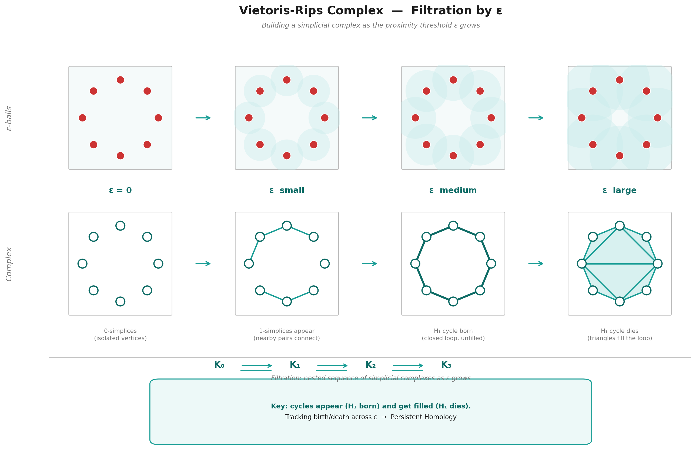
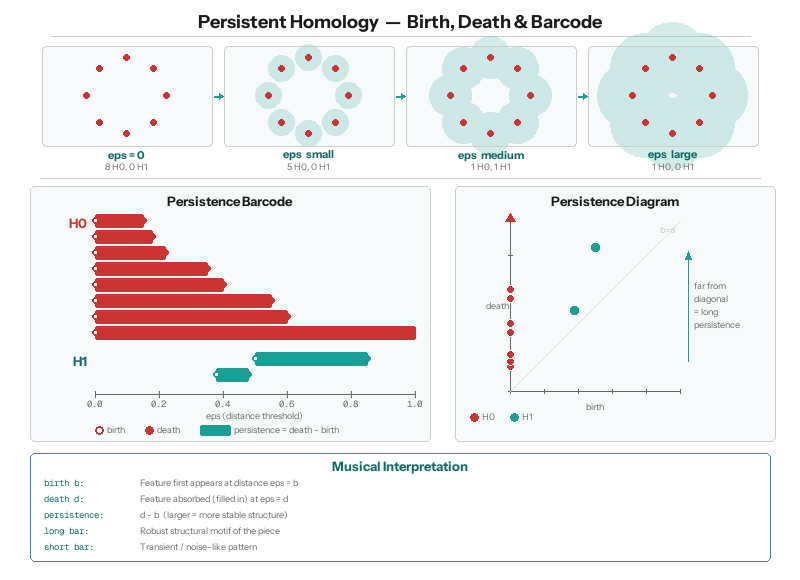

# Topological Data Analysis를 활용한 음악 구조 분석 및 위상 구조 보존 기반 AI 작곡 파이프라인

**저자:** 김민주 (POSTECH)
**지도:** 정재훈
**작성일:** 2026
**키워드:** Topological Data Analysis, Persistent Homology, Tonnetz, Music Generation, Vietoris-Rips Complex, Jensen-Shannon Divergence

---

## 초록 (Abstract)

본 연구는 사카모토 류이치의 2009년 앨범 *out of noise* 수록곡 "hibari"를 대상으로, 음악의 구조를 **위상수학적으로 분석**하고 그 위상 구조를 **보존하면서 새로운 음악을 생성**하는 파이프라인을 제안한다. 전체 과정은 네 단계로 구성된다. (1) MIDI 전처리: 두 악기를 분리하고 8분음표 단위로 양자화. (2) Persistent Homology: 네 가지 거리 함수(frequency, Tonnetz, voice-leading, DFT)로 note 간 거리 행렬을 구성한 뒤 Vietoris-Rips 복합체의 $H_1$ cycle을 추출. (3) 중첩행렬 구축: cycle의 시간별 활성화를 이진 또는 연속값 행렬로 기록. (4) 음악 생성: (3)에서 구한 중첩행렬을 seed로 사용하여 확률적 샘플링 기반의 Algorithm 1과 FC / LSTM / Transformer 신경망 기반의 Algorithm 2 두 방식을 제공.

$N = 20$회 통계적 반복을 통한 정량 검증에서 Tonnetz 거리 함수가 frequency 거리 함수 대비 pitch Jensen-Shannon divergence를 $0.0753 \pm 0.0033$에서 $0.0398 \pm 0.0031$로 **약 $47\%$ 감소**시켰으며, 이는 Welch's $t = 35.1$, Cohen's $d = 11.1$, $p < 10^{-20}$로 극도로 유의한 개선이다. 연속값 중첩행렬을 임계값 $\tau = 0.5$로 이진화한 변형은 기존 이진 중첩행렬 대비 추가로 JS divergence를 $11.4\%$ 개선했으며 ($0.0387 \to 0.0343$, Welch $t = 5.16$), 이 역시 통계적으로 유의했다. 가장 단순한 FC 신경망이 LSTM / Transformer보다 낮은 JS divergence($0.0015$)를 기록한 것은, hibari가 수록된 *out of noise* 앨범의 미학적 성격 — 전통적 선율 인과보다 음들의 공간적 배치에 의존 — 과 정확히 공명하는 관찰이다.

본 연구의 intra / inter / simul 세 갈래 가중치 분리 설계는 hibari의 두 악기 구조 — inst 1은 쉼 없이 연속 연주, inst 2는 모듈마다 규칙적 쉼을 두며 겹쳐 배치 — 를 수학적 구조에 반영한 것이며, 두 악기의 활성/쉼 패턴 관측 (inst 1 쉼 $0$개, inst 2 쉼 $64$개) 이 이 설계를 경험적으로 정당화한다. 본 논문은 수학적 정의부터 통계 실험, 시각자료, 향후 연구 방향까지를 하나의 일관된 흐름으로 정리한다.

---

## 1. 서론 — 연구 배경과 동기

### 1.1 연구 질문

음악은 시간 위에 흐르는 소리들의 집합이지만, 그 "구조"는 단순한 시간 순서만으로 포착되지 않는다. 같은 **동기(musical motive: 선율이나 리듬의 최소 반복 단위)**가 여러 번 반복되고, 서로 다른 선율이 같은 화성 기반 위에서 엮이며, 전혀 관계없어 보이는 두 음이 같은 조성 체계 안에서 등가적 역할을 한다. 이러한 층위의 구조를 수학적으로 포착하려면 "어떤 두 대상이 같다(혹은 가깝다)"를 정의하는 **거리 함수**와, 그로부터 파생되는 **위상 구조**를 다루는 도구가 필요하다.

본 연구는 다음의 세 가지 질문에서 출발한다.

1. __음악의 위상 구조는 어떻게 수학적으로 정의되는가?__ 한 곡의 note들 사이에 거리 함수를 두고 Vietoris-Rips 복합체를 구성한 뒤, 거리 임계값 $\varepsilon$을 변화시키며 $H_1$ persistence를 추적하면 그 결과 나오는 cycle들은 음악적으로 어떤 의미를 가지는가?

2. __이 위상 구조를 "보존한 채" 새로운 음악을 생성할 수 있는가?__ 보존의 기준은 무엇이며, 보존 정도를 어떻게 정량적으로 측정하는가?

3. __거리 함수의 선택이 실제로 생성 품질에 유의미한 영향을 주는가?__ 단순 빈도 기반 거리 대신 음악 이론적 거리 (Tonnetz, voice-leading, DFT)를 사용하면 얼마나 나은가?

4. __위상 구조를 보존한 음악이 실제로 아름답게 들리는가?__ 수학적으로 유사한 위상 구조를 가지도록 생성된 음악이 청각적으로도 원곡의 미학적 인상을 전달하는가? 본 보고서 말미에 첨부된 QR코드를 통해 생성된 음악을 직접 감상할 수 있다.

### 1.2 연구 대상 — 왜 hibari인가

본 연구의 대상곡은 사카모토 류이치의 *out of noise* (2009) 수록곡 "hibari" 이다. 이 곡을 선택한 이유는 다음과 같다.

- __선행연구의 확장에 적합.__ 단선율의 국악에 TDA를 적용한 정재훈 교수의 선행연구(정재훈 외, 2024)를 화성음악으로 확장함에 있어, hibari는 복잡성을 내포하면서도 규칙적인 모듈 구조로 일정한 패턴이 있어 모델링이 용이하였다.
- __미학적 특수성.__ *out of noise* 앨범은 "소음과 음악의 경계"를 탐구하는 실험적 작업이며, hibari는 전통적 선율 진행이 아니라 음들의 *공간적 배치*에 가까운 방식으로 구성된다. 이 특성은 본 연구의 실험 결과 (§4.5)에서 DL 모델 선택과 직접적으로 공명한다.

---

## 2. 수학적 배경

본 절에서는 본 연구의 파이프라인을 이해하기 위해 필요한 수학적 도구들을 정의하고, 각 도구가 음악 구조 분석에서 어떻게 사용되는지를 서술한다. TDA의 기본 개념에 대한 상호작용적 입문 자료로는 POSTECH MINDS 그룹의 튜토리얼(https://github.com/postech-minds/postech-minds/blob/main/tutorials/%5BGTDA_TUTO%5D01-Introduction_to_TDA.ipynb)을 참고할 수 있다.

---

### 2.1 Vietoris-Rips Complex

**정의 2.1.** 거리 공간 $(X, d)$와 양의 실수 $\varepsilon > 0$이 주어졌을 때, **Vietoris-Rips complex** $\text{VR}_\varepsilon(X)$는 다음과 같이 정의되는 복합체(simplicial complex)이다:

$$
\text{VR}_\varepsilon(X) = \left\{ \sigma \subseteq X \,\middle|\, \forall x_i, x_j \in \sigma,\ d(x_i, x_j) \le \varepsilon \right\}
$$

즉, 점 집합 $X$의 부분집합 $\sigma$에 속한 **모든 점 쌍 사이의 거리가 $\varepsilon$ 이하**이면 $\sigma$를 심플렉스(simplex)로 포함시킨다.

**Filtration 구조와 포함관계(nested sequence).** $\varepsilon$ 값을 0부터 연속적으로 키우면, 점 집합 $X$ 자체는 변하지 않은 채 **새로운 심플렉스만 점차 추가된다**. $\varepsilon = 0$일 때 $\text{VR}_0(X)$는 각 점만을 0-simplex로 포함하는 이산적인 점 집합(discrete set)이다 — 아직 어떤 edge도 없으므로 이것은 $X$ 그 자체와 같다. $\varepsilon$이 커지면서 두 점 사이 거리가 $\varepsilon$ 임계를 처음 넘는 순간에 1-simplex(edge)가 추가되고, 세 점이 모두 $\varepsilon$ 이내가 되면 2-simplex(삼각형)가 추가된다. 즉 $\varepsilon_1 < \varepsilon_2$이면 $\text{VR}_{\varepsilon_1}(X)$의 모든 심플렉스가 $\text{VR}_{\varepsilon_2}(X)$에도 그대로 들어 있으며, 새 심플렉스가 추가될 뿐이다. 따라서 다음의 포함관계는 항상 성립한다:

$$
\text{VR}_0(X) \subseteq \text{VR}_{\varepsilon_1}(X) \subseteq \text{VR}_{\varepsilon_2}(X) \subseteq \cdots \subseteq \text{VR}_{\varepsilon_n}(X)
$$

여기서 $0 < \varepsilon_1 < \varepsilon_2 < \cdots$는 새로운 심플렉스가 추가되어 복합체의 **위상 구조**가 변하는 임계값들이다. 점이 추가되거나 사라지는 것이 아니라, 같은 점들 사이에 새로운 연결(edge, 삼각형 등)이 생기면서 cycle이나 void가 형성되거나 채워지는 변화이다.

표기 편의를 위해 $K_i := \text{VR}_{\varepsilon_i}(X)$로 두면:

$$
K_0 \subseteq K_1 \subseteq K_2 \subseteq \cdots \subseteq K_n
$$

이를 **filtration**이라 부르며, 변화가 일어나는 임계값 $\varepsilon_i$들이 곧 위상의 birth/death 시점이 된다.

**본 연구에서의 사용:** $X = \{n_1, n_2, \ldots, n_{23}\}$은 hibari에 등장하는 23개의 고유 note이며, $d(n_i, n_j)$는 두 note 간 거리이다. 



---

### 2.2 Simplicial Homology

**정의 2.2.** Simplex complex $K$에 대해 $n$차 호몰로지 군(homology group) $H_n(K)$는 $K$ 안에 존재하는 $n$차원 "구멍"의 대수적 표현이다. 직관적으로:

- $H_0(K)$: 연결 성분(connected components)의 수
- $H_1(K)$: 1차원 cycle의 수 (닫힌 고리 모양으로 둘러싸인 영역)
- $H_2(K)$: 2차원 빈 공간(void)의 수 (3차원 공동을 둘러싼 표면)

$H_n(K)$는 아벨 군이며, $\text{rank}(H_n(K))$ = **Betti number** $\beta_n$은 서로 독립적인 $n$차원 구멍의 개수를 나타낸다. 예컨대 $\beta_1 = 3$이면 독립적인 1차원 cycle이 3개 있다는 뜻이다. 1차원 cycle은 최소 3개의 점이 필요하고(삼각형 모양의 폐곡선), 그 내부를 채우는 2-simplex가 없어야 cycle로 인식된다.

TDA의 핵심 강점은 **오직 점 사이의 쌍별(pairwise) 거리 정보만으로 위상 구조를 추출**할 수 있다는 것이다 (Carlsson, 2009). 유클리드 좌표가 필요 없으며, Tonnetz 격자 위 최단 경로 같은 추상적 거리에서도 VR complex가 잘 정의된다. Heo, Choi, Jung (2025)은 이러한 그래프 기반 거리를 **path-representable distance**로 일반화하고, 1차원 persistence barcode 사이에 단사함수가 존재함을 증명하여 Tonnetz 거리의 이론적 정당성을 뒷받침하였다.

**Boundary 연산자와 호몰로지 — 선형대수적 계산 예시.** $H_n$이 어떻게 계산되는지를 간단한 예시로 보인다. 점 4개 $\{a, b, c, d\}$와 edge $\{ab, bc, cd, da, ac\}$, 삼각형 $\{abc\}$로 이루어진 복합체 $K$를 생각하자.

boundary 연산자 $\partial_1$ (edge → vertex)과 $\partial_2$ (삼각형 → edge)를 $\mathbb{F}_2$ (mod 2) 위에서 행렬로 표현하면:

```
  ∂₁ (edge → vertex):         ∂₂ (triangle → edge):
       ab bc cd da ac               abc
  a [  1  0  0  1  1 ]         ab [  1 ]
  b [  1  1  0  0  1 ]         bc [  1 ]
  c [  0  1  1  0  0 ]         cd [  0 ]
  d [  0  0  1  1  0 ]         da [  0 ]
                                ac [  1 ]
```

$H_1(K) = \ker(\partial_1) / \text{im}(\partial_2)$이다. $\ker(\partial_1)$은 "닫힌 edge 체인들"의 공간이고, $\text{im}(\partial_2)$는 "삼각형의 경계인 edge 체인들"의 공간이다. 이 예시에서 $\ker(\partial_1)$의 차원은 2 (두 개의 독립적인 닫힌 고리: $ab+bc+ca$와 $ac+cd+da$), $\text{im}(\partial_2)$의 차원은 1 ($abc$의 경계 $= ab+bc+ca$). 따라서 $\beta_1 = 2 - 1 = 1$, 즉 독립적인 cycle이 1개이다. 직관적으로, 삼각형 $abc$가 한 cycle을 "채워서" 없앴고, 남은 사각형 $a-c-d-a$에 해당하는 cycle 1개가 살아남는다.

**본 연구에서의 사용:** 본 연구는 주로 $H_1$ (1차 호몰로지)을 다룬다. 이는 음악 네트워크에서 서로 가까운 note들이 만드는 닫힌 cycle, 즉 순환적으로 연결된 note 그룹을 포착한다. 발견된 각 cycle은 곡의 구조적 반복 단위로 해석된다.

---

### 2.3 Persistent Homology

Filtration $K_0 \subseteq K_1 \subseteq \cdots \subseteq K_n$에서, 각 단계마다 $H_1$의 cycle 구성이 달라진다. **Persistent homology**는 이 과정에서 각 cycle이 어느 $\varepsilon_i$에서 처음 나타나고(**birth**) 어느 $\varepsilon_j$에서 사라지는지(**death**)를 추적한다.

**Birth와 death의 음악적 의미:**
- **Birth** $b$: 거리 임계값 $\varepsilon$가 충분히 커져서 새로운 cycle이 형성되는 순간. 음악적으로는 "이 거리 척도에서 처음으로 닫힌 반복 구조가 발견되는 시점".
- **Death** $d$: 더 큰 $\varepsilon$에서 그 cycle이 다른 cycle들의 합(정확히는 boundary)으로 표현될 수 있게 되어, 호몰로지 군 안에서 더 이상 독립적인 generator가 아니게 되는 순간. 음악적으로는 "거리 척도가 너무 느슨해져서 이 반복 구조가 다른 구조에 흡수되는 시점".

각 cycle은 $(b, d)$ 쌍과, 그 cycle을 구성하는 vertex/edge 집합인 **cycle representative**가 함께 기록된다. 본 연구에서는 birth-death 쌍은 cycle의 "수명"을 측정하는 데, cycle representative는 어떤 note들이 그 cycle을 이루는지 식별하는 데 사용한다. 이 정보를 모은 것이 곡의 **위상적 지문(topological signature)**이다.

**Persistence:** $\text{pers}(\text{cycle}) = d - b$. (death가 birth보다 항상 크므로 양수.) 큰 persistence를 갖는 cycle은 다양한 거리 척도에서 살아남으므로 **위상적으로 안정한 구조**이며, 작은 persistence는 일시적이거나 노이즈에 가까운 구조이다.

**알고리즘적 측면:** 본 연구의 대부분의 실험에서는 선행연구(정재훈 외, 2024)의 **pHcol algorithm** 순수 Python 구현을 사용하였다. 이 구현은 cycle representative까지 함께 추출해주므로 본 연구의 후속 단계(중첩행렬 구축)에 그대로 활용할 수 있다. 별도로 계산 속도가 중요한 일부 단계에서는 C++ 기반 **Ripser** (Bauer, 2021) 구현을 보조적으로 활용하였으며, 두 구현이 동일한 birth-death 결과를 내는지 검증하였다.

**본 연구에서의 사용:** 거리 행렬 $D \in \mathbb{R}^{23 \times 23}$로부터 Vietoris-Rips filtration을 구성하고, 각 rate parameter $r$ (가중치 비율, 후술)에서의 $H_1$ persistence를 계산한다. 발견된 모든 $(b, d)$ 쌍과 cycle representative가 함께 cycle 집합을 정의하며, 이 cycle들이 다음 절의 중첩행렬 구축에 사용된다.



---

### 2.4 Tonnetz와 음악적 거리 함수

**정의 2.4.** Tonnetz(또는 tone-network)는 pitch class 집합 $\mathbb{Z}/12\mathbb{Z}$를 평면 격자에 배치한 구조이다. 여기서 **pitch class**는 옥타브 차이를 무시한 음의 동치류(equivalence class)로, 예컨대 C4 (가운데 도), C5 (한 옥타브 위 도), C3 등은 모두 같은 pitch class "C"에 속한다. 12음 평균율(12-TET)에서는 한 옥타브 안에 12개의 pitch class가 있으며, 이를 정수 $\{0, 1, 2, \ldots, 11\}$에 대응시켜 $\mathbb{Z}/12\mathbb{Z}$로 표기한다 (0=C, 1=C♯, 2=D, ..., 11=B). 두 pitch class가 격자 위에서 가까운 것은 음악 이론적으로 어울리는 음(consonant)임을 의미한다.

**Tonnetz의 격자 구조.** pitch class $p \in \mathbb{Z}/12$를 좌표 $(x, y)$에 배치하되, 다음 관계를 만족시킨다:
- 가로 이동 (+1 in $x$): 완전5도 (perfect fifth, +7 semitones)
- 대각선 이동 (+1 in $y$): 장3도 (major third, +4 semitones)

이렇게 배치하면 자연스럽게 단3도(+3 semitones) 관계도 다른 대각선 방향으로 형성되어 삼각형 격자가 만들어진다. 그림 2.1은 hibari의 C장조 음역에 해당하는 일부분을 보여준다.


*그림 2.1. Tonnetz 격자 구조. 가로 방향은 완전5도(C→G→D→A→E…), 대각선 방향은 장3도(C→E→G♯…)와 단3도(C→A→F♯…)로 이동한다. 삼각형 하나는 하나의 장3화음(major triad) 또는 단3화음(minor triad)에 대응된다.*

**리만 좌표.** pitch class $p$의 Tonnetz 격자 좌표 $(x_p, y_p)$는 다음 선형 관계를 만족하도록 정의된다:

$$
p \equiv 4\,x_p + 7\,y_p \;(\mathrm{mod}\; 12)
$$

cifkao(2015)의 시각화 구현에서는 단위 간격 $u$를 이용해 실제 캔버스 좌표를 다음과 같이 설정한다:

$$
\tilde{x}_p = u \cdot x_p, \quad \tilde{y}_p = u\sqrt{3} \cdot y_p
$$

$\sqrt{3}$ 인수는 정삼각형 격자(정삼각형 타일링)의 기하학적 요건에서 비롯된다. 이 배치에서 인접한 두 pitch class 사이의 유클리드 거리는 일정($= u$)하며, 삼각형 하나가 정확히 하나의 장3화음 또는 단3화음에 대응된다.

**Tonnetz 거리.** 두 pitch class $p_1, p_2$ 사이의 Tonnetz 거리 $d_T(p_1, p_2)$는 격자 위 최단 경로 길이(즉, edge 수)로 정의된다:

$$
d_T(p_1, p_2) = \min \left\{ |x_1 - x_2| + |y_1 - y_2| \,\middle|\, (x_i, y_i)\ \mathrm{represents}\ p_i \right\}
$$

본 연구에서는 12개 pitch class 모두에 대해 사전 계산된 $12 \times 12$ 거리 테이블을 사용한다. 이 테이블에서 **최솟값은 $0$** (같은 pitch class), **최댓값은 $4$** (예: F와 B, 또는 C와 F♯처럼 Tonnetz 격자에서 가장 먼 쌍)이다. 이 최댓값 4는 Tonnetz 격자 위에서 어떤 경로로 이동해도 4번의 이동(장3도·단3도·완전5도) 이내에 모든 pitch class에 도달할 수 있음을 의미한다. 12음 평균율의 닫힌 구조(모든 pitch class가 순환적으로 연결됨)가 이를 보장한다.

**빈도 기반 거리.** 본 연구의 기준 거리 $d_{\text{freq}}$는 두 note의 인접도(adjacency)의 역수로 정의된다. 인접도 $w(n_i, n_j)$는 곡 안에서 note $n_i$와 $n_j$가 시간적으로 연달아 등장한 횟수이다:

$$
w(n_i, n_j) = \#\!\left\{\,t : n_i\ \mathrm{at\ time}\ t\ \mathrm{and}\ n_j\ \mathrm{at\ time}\ t+1\,\right\}
$$

거리는 $d_{\text{freq}}(n_i, n_j) = 1 / w(n_i, n_j)$로 정의되며 (인접도가 0인 경우는 도달 불가능한 큰 값으로 처리), 자주 연달아 등장하는 음일수록 가까워진다. 이는 곡의 통계적 흐름만 반영하며 화성 관계는 직접 포착하지 못한다는 한계가 있다.

**그 외의 음악적 거리 함수.**

**(1) Voice-leading distance** (Tymoczko, 2008): 두 pitch class 사이를 이동하기 위해 거쳐야 하는 반음의 개수와 같다.

$$
d_V(p_1, p_2) = |p_1 - p_2|
$$

이 정의가 "두 pitch class의 반음 차이"가 되는 이유는 12음 평균율에서 인접한 두 pitch class(예: C와 C♯, 또는 E와 F)의 정수 표현이 정확히 1만큼 차이나며, 그 음정 차이가 1 반음(semitone)이기 때문이다. 음악 이론에서 voice-leading은 한 화음에서 다른 화음으로 옮겨갈 때 각 성부가 가능한 한 적은 음정으로 이동하는 것을 미덕으로 삼으며, 이 거리는 그러한 "최소 이동" 원리를 직접 수치화한 것이다.

**(2) DFT distance** (Tymoczko, 2008): 각 pitch class를 12차원 벡터로 표현한 뒤, 이산 푸리에 변환(DFT)으로 다른 공간으로 옮겨서 비교한다.

**pitch class를 "함수"로 보는 이유.** 12음 평균율에서 한 옥타브는 12개의 동일 간격 칸으로 나뉜다. pitch class $p$를 "12칸짜리 원형 자(ruler) 위에서 $p$번째 칸이 켜져 있고 나머지는 꺼져 있는 상태"로 생각하면, 이것은 $\{0, 1, \ldots, 11\} \to \{0, 1\}$인 함수이다. 이 함수를 **indicator vector** $e_p \in \mathbb{R}^{12}$ ($p$번째 성분만 1, 나머지 0)로 표현한다.

**$L_2$ 거리란.** 두 벡터 $u, v \in \mathbb{R}^n$ 사이의 $L_2$ 거리(유클리드 거리)는 성분별 차이의 제곱합에 루트를 씌운 것으로, 일상적인 "두 점 사이의 직선 거리"와 같다:

$$
\displaystyle\|u - v\|_2 = \sqrt{\,\sum_{i=1}^{n} (u_i - v_i)^2\,}
$$

**푸리에 공간(Fourier space)이란.** 원래 공간에서 indicator vector를 비교하면 "이 음과 저 음이 같은지 다른지"만 알 수 있다. DFT는 이 벡터를 **주기성 성분별로 분해**하여 새로운 좌표계 — 이것을 푸리에 공간이라 부른다 — 로 옮긴다. 각 좌표축(=**푸리에 계수** $\hat{f}_k$)은 특정 주기의 패턴에 대한 반응 강도를 나타낸다. 예를 들어 $k=3$번 계수는 "옥타브를 4등분하는 단3도 간격에 대한 반응" (증3화음과 관련), $k=5$번 계수는 "5도권을 따른 반응" (온음계적 구조와 관련)이다.

$$
d_F(p_1, p_2) = \left\| \hat{f}(p_1) - \hat{f}(p_2) \right\|_2
$$

여기서 $\hat{f}(p) \in \mathbb{C}^{12}$는 indicator vector $e_p$에 12점 DFT를 적용한 결과이다. 이 거리의 이론적 최댓값은 $\sqrt{2}$이며, C와 F♯처럼 화성적으로 가장 동떨어진 pitch class 쌍에서 달성된다. 따라서 $d_F$의 치역은 $[0, \sqrt{2}]$이다. 따라서 DFT 거리는 "두 pitch class가 화성적 성격(온음계성, 증3화음 대칭성 등)에서 얼마나 다른가"를 측정한다.

**복합 거리(Hybrid distance).** 본 연구는 빈도 기반 거리 $d_{\text{freq}}$와 음악적 거리 $d_{\text{music}}$ (Tonnetz, Voice-leading, DFT 중 하나)을 선형 결합한다:

$$
d_{\text{hybrid}}(n_i, n_j) = \alpha \cdot d_{\text{freq}}(n_i, n_j) + (1 - \alpha) \cdot d_{\text{music}}(n_i, n_j)
$$

여기서 $\alpha \in [0, 1]$은 두 거리의 비중을 조절하는 파라미터이다. §7.8의 $N=20$ 반복 실험 결과, $\alpha = 0.0$ (순수 Tonnetz)이 유효 실험 중 JS 최적이었다. 단, $\alpha = 0.0$에 옥타브 가중치 $w_o = 0.3$, 감쇄 lag를 동시에 적용하면 cycle 수가 $K = 42 \to 14$로 급감하여 위상 다양성이 크게 손실된다 (§7.8). 이 trade-off를 고려하여 **최종 기본 설정은 $\alpha = 0.5$를 유지**한다 (`config.py MetricConfig.alpha`). 과거 단일 run에서 "$\alpha = 0.3$이 약간 더 좋다"는 힌트가 있었으나, N=20 통계 실험에서 재현되지 않았다 (§7.8).

**본 연구에서의 사용:** 거리 함수의 선택은 발견되는 cycle 구조에 직접적으로 영향을 미친다. 빈도 기반 거리만 사용하면 곡의 통계적 특성만 반영되어 화성적·선율적 의미가 있는 구조를 포착하지 못한다. Tonnetz 거리를 도입함으로써 hibari의 C장조/A단조 화성 구조와 정합적인 cycle을 발견할 수 있었다.

**선행연구와의 관계.** Tonnetz 표현을 딥러닝 음악 생성에 직접 적용한 선행연구로 Chuan & Herremans(2018)이 있다. 이들은 $12 \times 24$ 픽셀 Tonnetz 이미지를 CNN autoencoder로 압축한 뒤 LSTM으로 다음 박자를 예측하는 파이프라인을 제안했다. 본 연구는 Tonnetz를 이미지가 아닌 **거리 함수**로 활용한다는 점에서 차별화되며, 동일한 음악 이론적 기반 위에서 위상수학적 분석(Persistent Homology)과 결합한다.

---

### 2.5 활성화 행렬과 중첩행렬

본 연구에서는 곡의 시간축 위에서 cycle 구조가 어떻게 전개되는지를 두 단계의 행렬로 표현한다. 첫 단계는 **활성화 행렬(activation matrix)**, 두 번째 단계는 그것을 가공한 **중첩행렬(overlap matrix)**이다.

**정의 2.5 (활성화 행렬).** 음악의 시간축 길이를 $T$, 발견된 cycle의 수를 $C$라 하자. 활성화 행렬 $A \in \{0, 1\}^{T \times C}$는 raw 활성 정보를 담는다:

시점 $t$에서 cycle $c$를 구성하는 note 중 **적어도 하나가 원곡에서 연주되고 있으면** $A[t, c] = 1$, 아니면 $A[t, c] = 0$이다. 형식적으로:

$$
A[t, c] = \mathbb{1}\!\left[\,\exists\ n \in V(c)\ \mathrm{such\ that}\ n\ \mathrm{is\ played\ at\ time}\ t\,\right]
$$

여기서 $V(c)$는 cycle $c$의 vertex(=note) 집합이며, $\mathbb{1}[\cdot]$은 indicator function이다. 활성화 행렬은 산발적인 단일 시점 활성화까지 모두 포함하므로 노이즈가 많다.

**정의 2.6 (중첩행렬).** 중첩행렬 $O \in \{0, 1\}^{T \times C}$는 활성화 행렬에서 **연속적이고 충분히 긴 활성 구간만 남긴 것**이다.

$$
O[t, c] = \mathbb{1}\!\left[\,t \in R(c)\,\right], \qquad R(c) = \bigcup_{i} [s_i,\ s_i + L_i]
$$

여기서 $R(c)$는 cycle $c$의 "지속 활성 구간(sustained intervals)"의 합집합이며, 각 구간 $[s_i, s_i + L_i]$는 활성화 행렬 $A[\cdot, c]$에서 길이가 임계값 $\mathrm{scale}_c$ 이상인 연속 1의 구간이다. $\mathrm{scale}_c \in \mathbb{Z}_{>0}$은 cycle $c$의 **최소 활성 지속 길이(minimum sustained length)**이며, cycle마다 ON 비율 $\rho(c) = |R(c)|/T$가 목표치 $\rho^* = 0.35$에 근접하도록 동적으로 조정된다 (구간이 너무 많으면 scale을 키우고, 너무 적으면 줄인다).

**활성화 행렬과 중첩행렬의 차이.**
- $A[t, c]$: 시점 $t$에 cycle $c$의 note가 단 한 번이라도 울리면 1. **순간적 활성을 모두 잡음.**
- $O[t, c]$: cycle $c$의 활성이 일정 시간 이상 **지속되는 구간**에서만 1. 산발적 노이즈 제거됨.

예를 들어 $\mathrm{scale}_c = 3$일 때 (3 시점 이상 지속된 활성만 인정), 다음과 같은 cycle $c$의 한 행을 생각해보자.

```
시점:  1  2  3  4  5  6  7  8  9 10 11 12 13 14 15
A[·,c]: 0  1  1  0  1  1  1  1  0  0  1  0  1  1  1
O[·,c]: 0  0  0  0  1  1  1  1  0  0  0  0  1  1  1
```

활성화 행렬 $A$는 시점 2~3, 5~8, 11, 13~15에서 모두 활성화되어 있다. 중첩행렬 $O$는 그중 길이가 $\mathrm{scale}_c = 3$ 이상인 두 구간(시점 5~8과 13~15)만 1로 남기고, 길이가 짧은 시점 2~3과 단발성 시점 11은 0으로 처리한다. 본 연구에서 중첩행렬을 음악 생성의 seed로 사용하는 이유는, 잠시 스쳐가는 활성보다 일정 시간 유지되는 cycle만이 곡의 구조적 단위로 의미 있다고 보기 때문이다.

**구축 과정**:

1. **활성화 행렬 계산**: 위 정의 2.5에 따라 $A \in \{0,1\}^{T \times C}$를 구한다.

2. **연속 활성 구간 추출**: 각 cycle $c$에 대해 길이가 $\mathrm{scale}_c$ 이상인 연속 1 구간을 모두 찾는다.

3. **Scale 동적 조정**: cycle마다 ON 비율 $\rho(c) = |R(c)|/T$가 목표치 $\rho^* = 0.35$에 근접하도록 $\mathrm{scale}_c$를 조정한다 (구간이 너무 많으면 scale을 키우고, 너무 적으면 줄인다).

__목표 ON 비율의 근거.__ $\rho^* = 0.35$는 본 연구에서 새로 결정한 것이 아니라 선행연구(정재훈 외, 2024)에서 사용된 휴리스틱 값을 계승한 것이다. 직관적으로 한 cycle이 곡 전체의 약 1/3 정도 활성화되면 "그 cycle이 곡의 구조적 모티프로서 충분히 자주 등장하면서도, 모든 시점을 점유하지 않아 다른 cycle과 구분된다"는 균형을 만든다. 이 값의 최적성은 본 연구에서 정량적으로 검증하지 않았으며, 향후 곡 또는 데이터에 따라 적응적으로 조정 가능한 파라미터로 일반화할 예정이다 (예: ON 비율 자체를 최적화 대상으로 설정).

**연속값 확장.** 본 연구에서는 이진 중첩행렬 외에, cycle의 활성 정도를 [0,1] 사이의 실수값으로 표현하는 연속값 버전도 도입하였다:

$$
O_{\text{cont}}[t, c] = \frac{\sum_{n \in V(c)} w(n) \cdot \mathbb{1}\!\left[\,n\ \mathrm{is\ played\ at\ time}\ t\,\right]}{\sum_{n \in V(c)} w(n)}
$$

여기서 $V(c)$는 cycle $c$의 vertex 집합, $w(n) = 1 / N_{\text{cyc}}(n)$은 note $n$의 **희귀도 가중치**이며 $N_{\text{cyc}}(n)$은 note $n$이 등장하는 cycle의 개수이다. 적은 cycle에만 등장하는 희귀한 note가 활성화되면 더 큰 가중치를 받는다.

**음악적 의미:** 중첩행렬은 곡의 **위상적 뼈대(topological skeleton)**를 시각화한 것이다. 시간이 흐름에 따라 어떤 반복 구조가 켜지고 꺼지는지를 나타내며, 이것이 음악 생성의 seed 역할을 한다.

---

### 2.6 Jensen-Shannon Divergence — 생성 품질의 핵심 지표

**JS divergence**는 두 확률 분포가 얼마나 다른지를 대칭적으로 측정하는 지표이다. KL divergence($D_{\text{KL}}$: "참 분포 $P$를 $Q$로 잘못 알 때의 정보 손실")를 대칭화한 것으로, $D_{\text{JS}}(P \| Q) = \frac{1}{2} D_{\text{KL}}(P \| M) + \frac{1}{2} D_{\text{KL}}(Q \| M)$ ($M = (P+Q)/2$). 값의 범위는 $[0, \log 2]$이며, 0이면 두 분포가 동일하다.

**본 연구에서 비교하는 두 가지 분포:**

1. **Pitch 빈도 분포** — "어떤 음들이 얼마나 자주 쓰였는가" (시간 순서 무시)
2. **Transition 빈도 분포** — "어떤 음 다음에 어떤 음이 오는가" (시간 순서 반영)

두 지표를 함께 사용함으로써 "음을 비슷하게 쓰는가"와 "비슷한 순서로 쓰는가"를 별도로 측정할 수 있다. 본 연구의 최우수 조합에서 pitch JS divergence는 $D_{\text{JS}} \approx 0.0006$으로, 이론적 최댓값($\log 2 \approx 0.693$)의 약 $0.09\%$에 해당한다.

---

### 2.7 Greedy Forward Selection

발견된 전체 cycle 집합 $\mathcal{C}$에서 원곡의 위상 구조를 가장 잘 보존하는 부분집합 $S \subseteq \mathcal{C}$를 선택해야 한다. 이를 위해 **greedy forward selection**을 사용한다: 보존도 함수 $f(S) = 0.5 \cdot J(S) + 0.3 \cdot C(S) + 0.2 \cdot B(S)$를 정의하고, 매 단계마다 $f$를 가장 크게 증가시키는 cycle을 하나씩 추가한다.

세 지표는 각각:
- **Note Pool Jaccard** $J(S)$: 선택된 cycle들이 전체 note를 얼마나 커버하는가
- **Overlap pattern correlation** $C(S)$: 시점별 활성 패턴이 원본과 얼마나 동조하는가 (Pearson 상관)
- **Betti curve similarity** $B(S)$: rate 변화에 따른 전체 위상 복잡도의 골격이 보존되는가

Note Pool Jaccard에 가장 큰 비중(0.5)을 둔 이유는 음악 생성의 직접적 입력이 cycle 구성 note이기 때문이다. 실험적으로 greedy 방법이 46개 cycle 중 15개로 90% 보존도를 달성하는 것을 확인하였다.

---

### 2.8 Multi-label Binary Cross-Entropy Loss

각 시점에서 동시에 여러 note가 활성화될 수 있으므로, 단일 클래스 예측인 categorical cross-entropy 대신 **multi-label BCE**를 사용한다. 각 note 채널마다 독립적인 binary cross-entropy를 계산하여 "note $i$가 활성인가?"를 개별 이진 문제로 학습한다. 모델 입력은 중첩행렬의 한 행 $O[t, :] \in \mathbb{R}^C$이고, 출력은 $N$차원 multi-hot vector이다.

**Adaptive threshold:** 추론 시 고정 임계값 0.5 대신, 원곡의 평균 ON 비율(약 15%)에 맞춰 상위 15%에 해당하는 sigmoid 출력만 활성으로 채택하는 동적 임계값을 사용한다.


---

### 2.9 음악 네트워크 구축과 가중치 분리

**정의 2.11.** 음악 네트워크 $G = (V, E)$는 다음과 같이 정의된다:
- **Vertex set** $V$: 곡에 등장하는 모든 고유 (pitch, duration) 쌍. hibari의 경우 $|V| = 23$.
- **Edge set** $E$: 두 vertex가 곡에서 인접하여 등장한 경우 연결.
- **Weight function** $w : E \to \mathbb{R}_{\ge 0}$: 인접 등장 빈도.

**가중치 행렬의 분리 — hibari의 악기 배치 구조에 근거.** 본 연구가 가중치를 intra / inter / simul 세 가지로 분리한 것은 hibari의 실제 구조에서 비롯된다. hibari에서 inst 1은 처음부터 끝까지 쉬지 않고 연주하는 반면, inst 2는 모듈마다 규칙적인 쉼을 두며 얹히는 방식으로 배치된다 (§5 Figure 7에서 시각적으로 확인). 즉 두 악기는 (1) 각각 독립적인 시간적 흐름을 갖고, (2) 서로 다른 시간 위상(phase)에서 상호작용한다. 본 연구는 이 구조를 수학적 가중치에 반영하여, intra weight는 "한 악기 내부의 시간 방향 흐름", inter weight는 "악기 1의 어떤 타건 다음 lag $\ell$만큼 후에 악기 2의 어떤 타건이 오는가", simul weight는 "같은 시점에서의 즉시적 화음 결합"을 각각 독립적으로 표현한다.

**rate parameter $r_t$의 의미.** $r_t$는 timeflow weight에서 intra와 inter의 비중을 조절한다.
- $r_t = 0$: $W = W_{\text{intra}}$만 사용. 각 악기의 선율적 흐름만 반영.
- $r_t = 1$: intra와 inter를 동등하게 결합. 선율과 상호작용을 균형 있게 반영.
- $r_t > 1$: inter의 비중이 intra보다 커짐. 악기 간 상호작용이 지배적인 구조를 탐색.

**가중치 행렬의 분리 (본 연구의 핵심 설계):** 본 연구는 가중치를 다음과 같이 세 가지로 분리한다:

1. **Intra weight** $W_{\text{intra}}$: 같은 악기 내에서 연속한 두 화음 간 전이 빈도. 두 악기의 intra weight를 합산한다:
$$W_{\text{intra}} = W_{\text{intra}}^{(1)} + W_{\text{intra}}^{(2)}$$
이는 각 악기의 **선율적 흐름**을 포착한다.

2. **Inter weight** $W_{\text{inter}}^{(\ell)}$: 시차(lag) $\ell$을 두고 악기 1의 화음과 악기 2의 화음이 동시에 출현하는 빈도이다. $\ell \in \{1, 2, 3, 4\}$로 변화시키며 다양한 시간 스케일의 **악기 간 상호작용**을 탐색한다. 가까운 시차에 더 큰 비중을 두는 **감쇄 가중치** $\lambda_\ell$을 사용하여 합산한다:
$$W_{\text{inter}} = \sum_{\ell = 1}^{4} \lambda_\ell \cdot W_{\text{inter}}^{(\ell)}, \qquad (\lambda_1, \lambda_2, \lambda_3, \lambda_4) = (0.60,\ 0.30,\ 0.08,\ 0.02), \quad \sum_\ell \lambda_\ell = 1$$
가중치는 lag 1에 집중되도록 별도의 이론적 근거 없이 귀납적으로 선택한 감쇄 계수이다. 직관적으로 가까운 시차(lag 1)에 가장 큰 비중을 두고, 먼 시차(lag 3, 4)는 미미하게 기여한다. 이는 "먼 시차의 우연한 동시 등장보다 가까운 시차의 인과적 상호작용이 음악적으로 의미 있다"는 가정을 반영하며, 실험적으로 hibari Tonnetz JS를 $0.0398 \to 0.0121$으로 $-69.6\%$ 개선하는 효과가 확인되었다 (§4.1b).

3. **Simul weight** $W_{\text{simul}}$: 같은 시점에서 두 악기가 동시에 타건하는 note 조합의 빈도. **순간적 화음 구조**를 포착한다.

**Timeflow weight (선율 중심 탐색):**
$$W_{\text{timeflow}}(r_t) = W_{\text{intra}} + r_t \cdot W_{\text{inter}}$$

$r_t \in [0, 1.5]$를 변화시키며 위상 구조의 출현·소멸을 추적한다.

**Complex weight (선율-화음 결합):**
$$W_{\text{complex}}(r_c) = W_{\text{timeflow,refined}} + r_c \cdot W_{\text{simul}}$$

$r_c \in [0, 0.5]$로 제한하여 "음악은 시간 예술이므로 화음보다 선율에 더 큰 비중을 둔다"는 음악적 해석을 반영한다.

**거리 행렬:** 가중치 $w(n_i, n_j) > 0$에 대해 거리는 역수로 정의된다:

$$
d(n_i, n_j) = \begin{cases} 1\,/\,w(n_i, n_j) & \quad \mathrm{if}\ \ w(n_i, n_j) > 0 \\ d_\infty & \quad \mathrm{otherwise} \end{cases}
$$

여기서 $d_\infty$는 "도달 불가능한 큰 값"이다. 구체적으로 $d_\infty = 1 + 2 / (\min_{w > 0} w \cdot \text{step})$으로 계산되며, $\text{step} = 10^{\text{power}}$ ($\text{power} = -2$이므로 $\text{step} = 0.01$)은 persistent homology 계산 시 거리행렬의 이산화 단위이다. 이 값은 "가중치가 0인 note 쌍(=곡에서 한 번도 연달아 등장하지 않은 쌍)에게 매우 큰 거리를 부여하여, filtration의 후반부에서야 비로소 연결되게 한다"는 역할을 한다.

---

### 2.10 확장 수학적 도구 — 거리 보존 재분배와 화성 제약

본 절은 §7의 확장 실험에서 사용되는 도구를 간략히 소개한다. 상세 수식은 해당 절에서 필요한 시점에 도입한다.

- **Tonnetz 최소매칭 거리:** 두 cycle의 구성 note들을 Hungarian algorithm으로 최적 1:1 대응시킨 뒤 평균 Tonnetz 거리를 측정한다. 예컨대 C major triad $\{C, E, G\}$와 F major triad $\{F, A, C\}$ 사이의 구조적 거리를 비교할 수 있다.
- **Persistence Diagram Wasserstein Distance:** 두 barcode의 birth-death 점들을 최적 매칭한 이동 비용. 두 위상 구조의 유사도를 직접 비교하는 데 사용한다.
- **Consonance score:** 시점별 동시 타건 note 쌍의 roughness(불협화도) 평균. 음악이론의 협화도 분류에 기반하여, 생성된 음악의 화성적 질을 평가한다.
- **Markov chain 시간 재배치:** 원본 중첩행렬의 행 전이 패턴을 학습하여 새로운 시간 순서를 재샘플링하는 기법.

---

## 3. 두 가지 음악 생성 알고리즘

본 장에서는 본 연구의 두 가지 음악 생성 알고리즘 — Algorithm 1 (확률적 샘플링) 과 Algorithm 2 (신경망 기반 시퀀스 모델) — 의 핵심 아이디어와 설계 의도를 설명한다.

### 표기 정의

본 장에서 사용할 표기를 다음과 같이 통일한다.

| 기호 | 의미 | hibari 값 |
|---|---|---|
| $T$ | 시간축 길이 (8분음표 단위) | $1{,}088$ |
| $N$ | 고유 note 수 (pitch-duration 쌍) | $23$ |
| $C$ | 발견된 전체 cycle 수 | 최대 $48$ |
| $K$ | 선택된 cycle subset 크기 ($K \le C$) | $\{10, 17, 48\}$ |
| $O$ | 중첩행렬, $\{0,1\}$ 값의 $T \times K$ 행렬 | — |
| $L_t$ | 시점 $t$에서 추출할 note 개수 | 보통 $3$ 또는 $4$ |
| $V(c)$ | cycle $c$의 vertex(note label) 집합 | 원소 수 $4 \sim 6$ |
| $R$ | 재샘플링 최대 시도 횟수 | $50$ |
| $B$ | 학습 미니배치 크기 | $32$ |
| $E$ | 학습 epoch 수 | $200$ |
| $H$ | DL 모델의 hidden dimension | $128$ |

**$L_t$에 대한 보충.** $L_t$는 "시점 $t$에서 새로 타건할 note의 개수"이다. hibari의 경우 악기 1, 2의 chord height(한 시점의 동시 타건 수)를 따라 대체로 $3$ 또는 $4$로 설정되며, 구체적으로 `[4, 4, 4, 3, 4, 3, 4, 3, 4, 3, 3, 3, 3, 3, 3, 3, 4, 4, 4, 3, 4, 3, 4, 3, 4, 3, 4, 3, 3, 3, 3, 3]`의 32개 패턴을 33번 반복한 길이 $1{,}056$의 수열을 사용한다 (총합 약 $3{,}700$). 이 패턴은 원곡의 평균 density에 맞춰 경험적으로 결정된 것이다.

**$B, E, H$에 대한 보충.** 본 연구의 hidden dimension $H = 128$, epoch 수 $E = 200$, batch size $B = 32$는 **엄밀한 grid search로 튜닝된 값이 아니라**, 소규모 시퀀스 데이터에 대한 일반적 관례(LSTM 논문, Transformer 구현 예제)에서 차용한 출발점 값이다. 모든 실험을 동일한 하이퍼파라미터에서 수행함으로써 세 모델(FC / LSTM / Transformer)의 구조적 차이를 공정하게 비교하는 것을 우선했다. 향후 연구에서 이 값들에 대한 체계적 튜닝 여지가 남아있다.

---

## 3.1 Algorithm 1 — 확률적 샘플링 기반 음악 생성

> **참고:** Algorithm 1의 3가지 샘플링 규칙은 선행연구(정재훈 외, 2024)에서 설계된 것이며, 본 연구는 이를 계승하여 사용한다.


### 알고리즘 개요

Algorithm 1은 중첩행렬의 ON/OFF 패턴을 직접 참조하여, 각 시점에서 활성화된 cycle들이 공통으로 포함하는 note pool로부터 확률적으로 음을 추출하는 규칙 기반 알고리즘이다. 신경망 학습 없이 즉시 생성이 가능하며, 중첩행렬이 곧 "구조적 seed" 역할을 한다.

### 핵심 아이디어 (3가지 규칙)

__규칙 1__ — 시점 $t$에서 활성 cycle이 있는 경우, 즉

$$
\sum_{c=1}^{K} O[t, c] > 0
$$

일 때, 활성화되어 있는 모든 cycle들의 vertex 집합의 교집합

$$
\displaystyle I(t) \;=\; \bigcap_{c\,:\, O[t,c]=1} V(c)
$$

에서 note 하나를 __균등 추출__한다. 여기서 "균등 추출"이란 집합 $I(t)$의 모든 원소가 동일한 확률 $1/|I(t)|$로 선택된다는 의미이다 (이산균등분포). 만약 교집합이 공집합이면 ($I(t) = \emptyset$), 활성 cycle들의 합집합

$$
\displaystyle U(t) = \bigcup_{c\,:\, O[t,c]=1} V(c)
$$

에서 균등 추출한다. ($\sum_{c} O[t,c] > 0$ 조건 하에서 $U(t) \ne \emptyset$이 항상 보장되므로, 추가 fallback은 필요하지 않다.) **실제로 이 교집합-공집합 상황은 매우 빈번하게 발생하는 정상 경로이다.** P1 prototype의 density $\approx 0.16$이므로, 전체 시점의 약 $84\%$에서 활성 cycle이 없고 ($\sum_c O[t,c] = 0$, 규칙 2로 이동), 활성 cycle이 있는 시점($16\%$) 중에서도 여러 cycle이 동시에 활성이면 교집합이 공집합이 되어 합집합 fallback을 거친다. 이 fallback은 Algorithm 1의 안정적 동작을 보장하는 정상 경로이며, 예외 처리가 아니다. 이 규칙은 "여러 cycle이 동시에 살아 있을 때, 그 cycle들이 모두 공유하는 note는 음악적으로도 가장 핵심적인 음"이라는 가정을 반영하며, 공유 note가 없더라도 활성 cycle이 포괄하는 전체 note pool에서 균등하게 선택한다.

__규칙 2__ — 시점 $t$에서 활성 cycle이 없는 경우, 즉

$$
\sum_{c=1}^{K} O[t, c] = 0
$$

일 때, 인접 시점 $t-1, t+1$에서 활성화된 cycle들의 vertex의 합집합

$$
\mathcal{A}(t) \;=\; \bigcup_{c\,:\, O[t-1,c]=1} V(c) \;\cup\; \bigcup_{c\,:\, O[t+1,c]=1} V(c)
$$

즉 $\mathcal{A}(t) = U(t-1) \cup U(t+1)$이며, 여기서 $U(t) = \bigcup_{c:\,O[t,c]=1} V(c)$는 규칙 1에서 정의된 시점 $t$의 합집합(union of active cycle vertices)이다.

이 합집합을 계산한 뒤, 전체 note pool에서 이 합집합을 제외한 영역 $P \setminus \mathcal{A}(t)$에서 균등 추출한다. (여기서 $\mathcal{A}(t)$는 §2.5의 활성화 행렬 $A \in \{0,1\}^{T \times C}$와 구별되는 별도 기호로, *인접 시점 cycle vertex들의 합집합*을 나타낸다.)

이 규칙은 다음과 같은 의미를 가진다. 활성 cycle이 없는 시점에서도 음악은 흘러가야 하므로 음을 하나 골라야 하는데, 만약 인접 시점의 cycle 멤버 노트를 그대로 골라 버리면, 청자가 들었을 때 마치 그 cycle이 시점 $t$에도 살아 있는 것처럼 들리게 된다. 즉, 원래 분석상으로는 죽어 있어야 할 위상 구조가 인위적으로 살아있는 것처럼 "번지는" 현상이 생긴다. 이를 막기 위해 인접 cycle의 note($\mathcal{A}(t)$)를 의도적으로 회피하여, "활성 cycle 없음"이라는 정보가 청각적으로도 그대로 보존되도록 한다.

__규칙 3__ — 중복 onset 방지. 같은 시점 $t$에서 동일한 (pitch, duration) 쌍이 두 번 추출되지 않도록 `onset_checker`로 검사하며, 충돌이 발생하면 최대 $R$회까지 재샘플링한다. $R$회 모두 실패하면 그 시점의 해당 note 자리는 비워둔다.

### 출력

알고리즘은 (start, pitch, end) 형태의 음표 리스트 $G$를 출력하며, 이를 MusicXML로 직렬화하면 곧바로 악보 및 오디오로 재생할 수 있다.

---

## 3.2 Algorithm 2 — 신경망 기반 시퀀스 음악 생성

> **참고:** Algorithm 2의 전체 구조는 아래 Figure B에 시각적으로 요약되어 있다. FC / LSTM / Transformer 세 아키텍처 중 하나를 선택하여 사용한다.


### 알고리즘 개요

Algorithm 2는 중첩행렬을 입력, 원곡의 multi-hot note 행렬을 정답 레이블로 두고 매핑

$$
f_\theta : \{0,1\}^{T \times C} \;\longrightarrow\; \mathbb{R}^{T \times N}
$$

을 학습한다 (FC 모델은 시점별 독립이므로 $\{0,1\}^C \to \mathbb{R}^N$). 학습된 모델은 학습 시 보지 못한 cycle subset이나 노이즈가 섞인 중첩행렬에 대해서도 원곡과 닮은 note 시퀀스를 출력하도록 기대된다.

__"위상 구조 보존"의 의미.__ 엄밀히 말하면 DL 모델은 Algorithm 1처럼 "교집합 규칙"으로 위상 구조를 직접 강제하지는 않는다. 대신 Subset Augmentation(아래 설명)을 통해 $K \in \{10, 15, 20, 30, 46\}$과 같은 다양한 크기의 subset에 대해서도 같은 원곡 $y$를 복원하도록 학습한다. 이 과정에서 모델은 "서로 다른 cycle subset이 같은 음악을 유도할 때, 그 공통적인 구조적 특성"을 잠재 표현으로 내부화한다. 따라서 학습 시 *구체적으로* 보지 못한 subset(예: $K = 12$)에 대해서도, 모델이 학습한 잠재 표현이 충분히 일반화되어 있다면 합리적 출력이 가능하다. 본 연구의 실험에서는 이러한 일반화가 실제로 관측되었다. 다만 Algorithm 1이 교집합 규칙으로 위상 구조를 *직접* 강제하는 것과 달리, DL 모델은 손실함수를 통해 *간접적으로* 보존하므로 보존의 메커니즘이 다르다.

### 모델 아키텍처 비교

본 연구는 동일한 학습 파이프라인 위에서 세 가지 모델 아키텍처를 비교한다.

| 모델 | 입력 형태 | 시간 정보 처리 방식 | 파라미터 수 |
|---|---|---|---|
| FC (2-layer) | $(B, C)$ | 시점 독립 | $4 \times 10^4$ |
| LSTM (2-layer) | $(B, T, C)$ | 순방향 hidden state | $2 \times 10^5$ |
| Transformer (2-layer, 4-head) | $(B, T, C)$ | self-attention | $4 \times 10^5$ |

**표기 설명:** $B$는 batch size(한 번에 묶어서 학습하는 데이터 개수), $T$는 시간 길이(timestep 수), $C$는 cycle 수(중첩행렬의 열 수)이다. PyTorch에서 모델에 데이터를 넣을 때 항상 batch 차원이 가장 앞에 오는 것이 관례이므로 $B$가 포함된다. FC 모델은 시점을 독립적으로 처리하므로 한 번에 시점 하나씩($C$차원 벡터)을 입력받아 $(B, C)$ 형태가 되고, LSTM/Transformer는 전체 시퀀스를 한 번에 입력받으므로 $(B, T, C)$ 형태가 된다.

**파라미터 수 산정 근거** ($C = 46$, $N = 23$, hidden $= 128$): FC (2-layer)는 2개의 hidden layer(128, 256차원)를 가지는 3-선형층 구조 ($46 \!\to\! 128 \!\to\! 256 \!\to\! 23$)로 약 $45{,}000$ 개; LSTM 2-layer는 각 층의 게이트 가중치 $(4 \times (C + h) \times h)$ 합산으로 약 $224{,}000$ 개; Transformer 2-layer 4-head는 self-attention + FFN + LayerNorm 합산으로 약 $440{,}000$ 개.

**"시점 독립"의 의미 (FC).** FC 모델은 시점 $t$의 위상 벡터 $O[t, :]$를 입력으로 받아 시점 $t$의 note 벡터 $y[t, :]$를 출력한다. 즉 시점 $t$의 출력은 이전 시점 $t-1, t-2, \ldots$나 이후 시점 $t+1, \ldots$을 전혀 참조하지 않는다. 각 시점을 "독립적으로" 처리한다는 뜻이다. 이는 가장 단순한 기준 모델이다.

**"순방향 hidden state"의 의미 (LSTM).** LSTM은 시점 $t$의 출력을 만들 때, 내부에 유지하는 hidden state $h_{t-1}$을 참조한다. $h_{t-1}$은 시점 $1, 2, \ldots, t-1$까지의 정보가 누적된 벡터이다. 따라서 "왼쪽에서 오른쪽으로 흐르는 시간 정보"를 사용한다. 미래 시점은 보지 못한다.

**"self-attention"의 의미 (Transformer).** Self-attention은 시점 $t$의 출력을 만들 때, 시퀀스의 **모든** 시점 $1, \ldots, T$에 대한 "주목도 점수"를 계산하여, 각 시점의 벡터를 가중합한다. LSTM과 달리 미래 시점도 함께 본다(bidirectional). 따라서 "시점 $t$의 note를 결정할 때 곡 전체의 문맥을 고려한다"는 해석이 가능하다.

### 학습 데이터 구성과 증강

원본 학습 쌍은 $X \in \{0,1\}^{T \times C}$, $y \in \{0,1\}^{T \times N}$이다. 여기서 $X$는 중첩행렬이고 $y$는 같은 시간축의 multi-hot note 행렬(시점 $t$에 활성인 note를 1로 표시)이다. 본 연구는 세 가지 증강 전략을 적용하여 학습 데이터를 약 $7 \sim 10$배 늘린다.

__(1) Subset Augmentation.__ $K \in \{10, 15, 20, 30\}$의 cycle subset에 대한 중첩행렬을 생성하여, 동일한 정답 $y$에 매핑한다. 이를 통해 모델은 "불완전한 위상 정보로부터도 원곡을 복원하는" 강건한 표현을 학습한다.

__(2) Circular Shift.__ 시간축을 회전하는 증강이며, $X$와 $y$를 __동일한 양만큼__ 함께 회전한다. 즉

$$
X' = \mathrm{roll}(X, s, \mathrm{axis}=0), \qquad y' = \mathrm{roll}(y, s, \mathrm{axis}=0)
$$

로 처리한다 (여기서 $s$는 같은 난수). 여기서 `roll` 함수는 시점 $t$의 위상 정보와 시점 $t$의 note를 시점 $t+s$로 똑같이 옮기므로, 모델이 학습해야 할 매핑 자체는 변하지 않은 채 시작점만 달라진다. 만약 $X$에만 회전을 적용하면 $X$와 $y$의 시간축이 어긋나 학습 데이터가 망가지므로, 두 행렬을 항상 함께 회전해야 한다.

__(3) Noise Injection.__ $X$에 확률 $p = 0.03$으로 bit flip을 가한다 ($y$는 그대로). overfitting을 막고 정규화 효과를 얻기 위함이다.

### 학습 손실 함수

각 시점에서 여러 note가 동시에 활성화될 수 있으므로(multi-label 문제), §2.8에서 정의한 binary cross-entropy 손실을 사용한다. PyTorch의 `BCEWithLogitsLoss`는 모델의 raw 출력(logit)을 받아 sigmoid 변환과 BCE 계산을 한 번에 수행하는 함수이다. 한 시점에서 23개 note 중 평균 3~4개만 활성(=정답이 1)이고 나머지 19~20개는 비활성(=정답이 0)이므로, 활성 note의 오차에 더 큰 가중치를 부여하는 `pos_weight` 파라미터를 사용하여 이 불균형을 보정한다.

### 추론 단계

학습이 끝난 모델 $f_{\theta^*}$로 새로운 음악을 생성하는 단계를 하나하나 풀어 설명한다.

__1단계 — 모델 통과 (logit 생성).__ 입력 중첩행렬 $O_{\text{test}}$를 모델에 통과시키면 $\hat z \in \mathbb{R}^{T \times N}$이 나온다. 이 $\hat z$의 각 값은 음수, 0, 양수 모두 가능한 실수이며, 직접 "확률"이라고 해석할 수 없다. 이런 "확률이 되기 전의 raw 점수"를 통계학과 머신러닝에서 __logit__이라고 부른다. 크기가 클수록 "그 note가 활성일 가능성이 높다"는 모델의 내부 점수이다.

__2단계 — sigmoid 변환.__ logit을 0~1 사이의 확률로 바꾸기 위해 sigmoid 함수

$$
\sigma(z) = \frac{1}{1 + e^{-z}}
$$

를 적용한다. sigmoid는 $z = 0$에서 $0.5$, $z \to \infty$에서 $1$, $z \to -\infty$에서 $0$에 수렴하는 S자 곡선으로, 실수 전체를 $[0, 1]$ 구간으로 눌러 담는다. 적용 후 $P = \sigma(\hat z) \in [0,1]^{T \times N}$은 "시점 $t$에 note $n$이 활성일 확률"로 해석할 수 있다. 이 단계가 필요한 이유는, 다음 단계에서 "특정 확률 이상인 note를 켠다"는 판단을 내려야 하는데, 그 판단은 반드시 $[0, 1]$ 스케일에서 이루어져야 하기 때문이다.

__3단계 — adaptive threshold 결정.__ 가장 단순한 방법은 "$P[t, n] \ge 0.5$이면 켠다"라고 고정 임계값을 쓰는 것이다. 그러나 LSTM이나 Transformer 같은 시퀀스 모델은 학습 결과 sigmoid 출력이 전반적으로 낮게 형성되는 경향이 있어, $0.5$를 그대로 쓰면 활성화되는 note가 거의 없어 음악이 텅 비어버린다. 이를 해결하기 위해 본 연구는 원곡의 __ON ratio__(아래에서 정의)에 맞춰 threshold를 데이터 기반으로 동적 결정한다.

여기서 ON ratio란 "원곡의 multi-hot 행렬 $y \in \{0,1\}^{T \times N}$에서 전체 $T \times N$개의 셀 중 값이 $1$인 셀의 비율"을 뜻한다. 수식으로는

$$
\rho_{\text{on}} \;=\; \frac{1}{T \cdot N} \sum_{t=1}^{T} \sum_{n=1}^{N} y[t, n]
$$

이다. hibari의 경우 $T = 1{,}088$, $N = 23$이므로 전체 셀 수는 약 $25{,}024$개이고, 그 중 note가 활성인 셀 수를 세어 나누면 약 $15\%$($\rho_{\text{on}} \approx 0.15$)가 된다. 직관적으로는 "한 시점당 $23$개 note 중 평균 $3 \sim 4$개가 켜져 있는 정도"라고 이해할 수 있다.

이 $\rho_{\text{on}}$을 목표 활성 비율로 삼아, threshold를 다음과 같이 정한다:

$$
\theta \;=\; \mathrm{quantile}(P,\ 1 - \rho_{\text{on}})
$$

즉 $P$의 모든 값 중 상위 $15\%$에 해당하는 경계값을 임계값으로 쓴다. 이렇게 하면 모델 출력의 절대 수준이 어떻든, 생성된 곡의 활성 note 비율이 자연스럽게 원곡의 $\rho_{\text{on}}$과 일치한다. 이것을 "adaptive threshold"라 부르는 이유는 모델과 입력에 따라 $\theta$ 값이 자동으로 달라지기 때문이다.

__4단계 — note 활성화 판정.__ 모든 $(t, n)$ 쌍에 대해 $P[t, n] \ge \theta$이면 시점 $t$에 note $n$을 활성화한다. 이 note의 (pitch, duration) 정보를 label 매핑에서 복원하여 $(t,\ \mathrm{pitch},\ t + \mathrm{duration})$ 튜플을 결과 리스트 $G$에 추가한다.

__5단계 — onset gap 후처리 (Algorithm 1, 2 공통).__ 너무 짧은 간격으로 onset이 연속되면 음악이 지저분해지므로, "이전 onset으로부터 `gap_min` 시점 안에는 새 onset을 허용하지 않는다"는 최소 간격 제약을 적용한다. `gap_min = 0`이면 제약 없음, `gap_min = 3`이면 "3개의 8분음표(= 1.5박) 안에는 새로 타건하지 않음"을 의미한다. 이 후처리는 Algorithm 1과 Algorithm 2 모두에 동일하게 적용된다.

이 과정으로 최종적으로 얻은 $G = [(start, pitch, end), \ldots]$를 MusicXML로 직렬화하면 재생 가능한 음악이 된다.

---

## 3.3 두 알고리즘의 비교 요약

| 항목 | Algorithm 1 (Sampling) | Algorithm 2 (DL) |
|---|---|---|
| 학습 필요 여부 | 불필요 | 필요 ($E$ epoch) |
| 결정성 | 확률적 (난수) | 학습 후 결정적 |
| 일반화 | 같은 곡 내부에서만 | 보지 못한 cycle subset도 생성 |
| 위상 보존 방식 | 교집합 규칙으로 직접 강제 | 손실함수를 통해 간접 |
| 생성 시간 | 약 $50$ ms | 약 $100$ ms (학습 후) |
| 학습 시간 | 해당 없음 | $30$ s $\sim 3$ min |

**해석.** Algorithm 1은 위상 정보를 직접 규칙으로 강제하므로 cycle 보존도 측면에서 가장 신뢰할 수 있는 기준선 역할을 한다. 반면 Algorithm 2는 학습된 잠재 표현을 통해 부드러운 생성이 가능하며, 학습 데이터에 없는 cycle subset에 대해서도 합리적인 음악을 만들어낸다. 본 연구의 실험에서는 두 알고리즘이 상호 보완적임을 보였다 — Algorithm 1은 위상 보존도에서, Algorithm 2는 음악적 자연스러움에서 각각 우위를 보인다 (Step 4 실험 결과 참조).

Algorithm 1이 "학습 시간" 칸에서 비어 있는 것이 아니라 "해당 없음"으로 표시된 이유는, 이 알고리즘이 애초에 학습 단계를 가지지 않기 때문이다. 주어진 중첩행렬과 cycle 집합만 있으면 어떠한 전처리 학습 없이도 그 자리에서 음악을 생성할 수 있으며, 이것이 Algorithm 1의 가장 큰 장점 중 하나이다.

---

## 4. 실험 설계와 결과

본 장에서는 지금까지 제안한 TDA 기반 음악 생성 파이프라인의 성능을 정량적으로 평가한다. 세 가지 유형의 실험을 수행하였다.

1. __Distance function 비교__ — frequency(기본), Tonnetz, voice-leading, DFT 네 종류의 거리 함수에 대해 동일 파이프라인을 적용하고 생성 품질을 비교.
2. __Cycle subset ablation__ — 최적 거리 함수(Tonnetz)에서 cycle 수를 $K = 10, 17, 46$으로 변화시켜 cycle 수의 효과를 분리.
3. __통계적 유의성__ — 각 설정에서 Algorithm 1을 $N = 20$회 독립 반복 실행하여 mean ± std를 보고.

모든 실험은 동일한 chord height 패턴 (32-element module × 33 = 1,056 timepoints), 동일 random seed 체계($s = c + i,\ i = 0, \ldots, 19$, 설정별 상수 $c$ 사용)로 수행되었다. 실험 러너는 `tda_pipeline/run_step3_experiments.py`이며, 모든 trial의 상세 기록(mean, std, min, max 포함)은 `tda_pipeline/docs/step3_data/step3_results.json`에 저장되어 있다.

### 평가 지표

__Jensen-Shannon Divergence (주 지표).__ 생성곡과 원곡의 pitch 빈도 분포 간 JS divergence를 주 지표로 사용한다 (2.6절 정의). 값이 낮을수록 두 곡의 음 사용 분포가 유사하며, 이론상 최댓값은 $\log 2 \approx 0.693$이다.

__Note Coverage.__ 원곡에 존재하는 고유 (pitch, duration) 쌍 중, 생성곡에 한 번 이상 등장하는 쌍의 비율. $1.00$이면 모든 note가 최소 한 번 이상 사용된 것이다.

__보조 지표.__ Pitch count (생성곡의 고유 pitch 수), 생성 소요 시간 (초), KL divergence.

### 거리 함수 구현 참고

본 장의 네 가지 거리 함수는 모두 `tda_pipeline/musical_metrics.py` 파일 하나에 정의되어 있다. 사용 패턴은 다음과 같다.

| 함수 | 역할 | 입력 | 출력 |
|---|---|---|---|
| `tonnetz_distance(pc1, pc2)` | 두 pitch class 간 Tonnetz 격자 거리 | `pc1, pc2` ∈ $\{0, \ldots, 11\}$ | 정수 (최단 경로 길이) |
| `tonnetz_note_distance(n1, n2)` | 두 note 간 거리 (옥타브/duration 보정 포함) | `(pitch, duration)` 튜플 $\times$ 2 | 실수 |
| `voice_leading_note_distance(n1, n2)` | 두 note 간 semitone 차이 기반 거리 | `(pitch, duration)` 튜플 $\times$ 2 | 실수 |
| `dft_note_distance(n1, n2)` | pitch class DFT 계수 간 Euclidean 거리 | `(pitch, duration)` 튜플 $\times$ 2 | 실수 |
| `compute_note_distance_matrix(notes_label, metric)` | 전체 note 집합의 거리 행렬 생성 | `{(pitch,dur): label}` 딕셔너리, metric 이름 | $N \times N$ numpy 행렬 |


__두 note 간 확장 — 옥타브와 duration 보정.__ 위의 거리 함수들은 원래 pitch class(mod 12)만 고려하므로 옥타브와 duration 정보가 손실된다. 본 연구에서 note는 (pitch, duration) 쌍으로 정의되므로, 세 거리 함수 모두에 다음 두 항을 추가한다.

$$
d(n_1, n_2) = d_{\text{base}}(p_1, p_2) + w_o \cdot |o_1 - o_2| + w_d \cdot \frac{|d_1 - d_2|}{\max(d_1, d_2)}
$$

여기서 $d_{\text{base}}$는 Tonnetz / voice-leading / DFT 중 하나, $o_i = \lfloor p_i / 12 \rfloor$는 옥타브 번호, $d_i$는 duration, $w_o = 0.3$ (N=10 grid search 최적, §4.1a), $w_d = 0.3$이다.

**각 항의 설계 근거:**
- **옥타브 항** $w_o |o_1 - o_2|$: 같은 pitch class(예: C4와 C5)라도 옥타브가 다르면 음악적으로 다른 역할을 한다. $w_o = 0.3$은 N=10 grid search ($w_o \in \{0.1, 0.3, 0.5, 0.7, 1.0\}$, §4.1a)에서 도출된 최적값이다. 기존 경험적 설정 $w_o = 0.5$ 대비 JS divergence가 $-18.8\%$ 개선되었다 (JS $0.0590 \to 0.0479$).
- **Duration 항** $w_d |d_1 - d_2| / \max(d_1, d_2)$: 분자를 $\max$로 정규화하여 $[0, 1]$ 범위로 만든다. 예: 2분음표($d=4$)와 8분음표($d=1$)의 차이는 $3/4 = 0.75$, 같은 duration이면 $0$. $w_d = 0.3$은 duration 차이가 pitch 관계보다 덜 중요하다는 가정을 반영한다.
- **계수 최적화:** $w_o = 0.3$은 N=10 grid search로 최적화되었다 (§4.1a). $w_d = 0.3$은 경험적 설정이며 추가 최적화 여지가 있다.

**각 함수의 출력 형태:**
- `tonnetz_note_distance`: Tonnetz 격자 거리(정수) + 옥타브(실수) + duration(실수) = **실수**
- `voice_leading_note_distance`: 반음 차이(정수) + duration(실수) = **실수** (pitch 성분만으로는 정수이나 duration 항 때문에 실수가 됨)
- `dft_note_distance`: DFT $L_2$ 거리(실수) + 옥타브 + duration = **실수**

**DFT 계산 예시.** C4 ($p=60$)와 E4 ($p=64$)를 비교한다. pitch class는 각각 $0$ (C)과 $4$ (E)이다. 12차원 indicator vector $(1,0,0,...,0)$과 $(0,0,0,0,1,0,...,0)$에 DFT를 적용하면 magnitude 벡터 $|\hat{f}_k|$ ($k = 1, \ldots, 6$)을 얻는다. 이 두 벡터 사이의 $L_2$ 거리가 DFT 기본 거리이며, 여기에 옥타브 항($|5-5| \times 0.5 = 0$)과 duration 항을 더한다.

---

## 4.1 Experiment 1 — Distance Function Baseline 비교

네 종류의 거리 함수 각각으로 사전 계산한 중첩행렬을 로드하여 Algorithm 1을 실행한다. 각 거리 함수에서 발견되는 cycle의 수도 함께 보고한다.

| 거리 함수 | 발견 cycle 수 | JS Divergence (mean ± std) | Note Coverage | 생성 시간 (ms) |
|---|---|---|---|---|
| frequency (baseline) | 43 | $0.0753 \pm 0.0033$ | $0.991$ | $31.2$ |
| Tonnetz | 46 | $\mathbf{0.0398 \pm 0.0031}$ | $1.000$ | $38.9$ |
| voice-leading | 22 | $0.0891 \pm 0.0048$ | $1.000$ | $22.2$ |
| DFT | 20 | $0.0511 \pm 0.0029$ | $1.000$ | $26.3$ |

__해석 1 — Tonnetz가 가장 우수.__ Tonnetz 거리 함수는 baseline(frequency)에 비해 JS divergence를 $0.0753 \to 0.0398$로 __약 $47\%$ 감소__시켰다. 두 조건의 표준편차가 각각 $0.0033$, $0.0031$로 매우 작으므로, 이 차이는 통계적으로 명확한 개선이다(자세한 분석은 3.3절).

__해석 2 — 거리 함수가 위상 구조 자체를 바꾼다.__ 동일한 hibari 데이터에서 거리 함수만 교체했을 뿐인데 발견되는 cycle 수가 $20 \sim 46$으로 크게 달라졌다. 이는 "거리 함수의 선택이 곧 어떤 음악적 구조를 '동치'로 간주할 것인가를 정의한다"는 음악이론적 관점과 일치한다. Tonnetz는 완전 5도 / 장3도 / 단3도 관계의 pitch class 쌍을 가깝게 배치하므로, 이러한 관계를 공유하는 note들이 한 cycle에 더 자주 모이게 된다.

__해석 3 — Note Coverage는 대부분의 설정에서 포화.__ 네 거리 함수 모두 note coverage가 $0.99 \sim 1.00$이므로, "원곡의 모든 note 종류가 생성곡에 최소 한 번 등장"하는 기본 요구는 모두 만족된다. 따라서 품질의 주된 차이는 "같은 note pool을 얼마나 *자연스러운 비율로* 섞는가"에서 발생한다.

## 4.1a Tonnetz Octave Weight 튜닝 — N=10 Grid Search

Tonnetz 거리 함수의 옥타브 가중치 $w_o$를 $\{0.1, 0.3, 0.5, 0.7, 1.0\}$에 대해 hibari Algo1 JS로 N=10 반복 실험하였다.

| $w_o$ | K (cycle 수) | JS (mean ± std) | 개선율 (vs $w_o=0.5$) |
|---|---|---|---|
| 0.1 | 50 | $0.0516 \pm 0.0041$ | $-12.5\%$ |
| **0.3** | **47** | $\mathbf{0.0479 \pm 0.0021}$ | $\mathbf{-18.8\%}$ |
| 0.5 (기존) | 42 | $0.0590 \pm 0.0031$ | — |
| 0.7 | 38 | $0.0720 \pm 0.0047$ | $+22.0\%$ |
| 1.0 | 35 | $0.0719 \pm 0.0043$ | $+21.9\%$ |

**결론:** $w_o = 0.3$이 최적이다. 옥타브 패널티를 줄이면 pitch class 유사성이 거리 행렬을 더 강하게 지배하며, 이는 hibari의 좁은 옥타브 범위(52–81, 최대 2 옥타브)에서 옥타브 구분이 상대적으로 덜 중요하다는 음악적 직관과 일치한다. 이 결과에 따라 본 연구의 기본 설정을 $w_o = 0.3$으로 변경하였다 (`config.py MetricConfig.octave_weight`).

---

## 4.1b 감쇄 Lag 가중치 실험

§2.9에서 도입한 감쇄 합산 inter weight의 실험적 근거를 제시한다. 기존 구현(lag=1 단일)과 신규 구현(lag 1~4 감쇄 합산) 두 설정을 비교하되, 거리 함수는 frequency와 Tonnetz 두 가지를 대조하여 거리 함수의 특성에 따라 효과가 달라짐을 확인한다.

**실험 설정:**
- lag=1 단일 (기존): $W_{\text{inter}} = W_{\text{inter}}^{(1)}$
- lag 1~4 감쇄 합산 (신규): $W_{\text{inter}} = \sum_{\ell=1}^{4} \lambda_\ell \cdot W_{\text{inter}}^{(\ell)}$, $\quad (\lambda_1,\lambda_2,\lambda_3,\lambda_4) = (0.60,\ 0.30,\ 0.08,\ 0.02)$
- 고정 조건: hibari, Algorithm 1, N=20

| 곡 | 거리 함수 | lag=1 (기존) | lag 1~4 감쇄 (신규) | 변화 |
|---|---|---|---|---|
| hibari | frequency | $0.0753$ | $0.0787$ | $+4.5\%$ |
| hibari | Tonnetz | $0.0398$ | $\mathbf{0.0121}$ | $\mathbf{-69.6\%}$ |

**해석:** Tonnetz 거리는 화성적 관계를 반영하는 metric이다. hibari처럼 화성 구조가 명확한 곡에서는 악기 간 상호작용이 lag 2~4에서도 지속적으로 유의미하며, 감쇄 합산이 이를 포착하여 거리 행렬의 질을 크게 향상시킨다. 반면 frequency 거리는 lag를 확장할수록 음역대가 다른 화음들 사이의 우연한 동시 등장이 포함되어 노이즈가 증가하고, JS가 소폭 악화된다. 이는 "입력 데이터의 질을 높이면 단순 모델도 크게 개선된다"는 원칙의 구체적 예시이며, 거리 함수와 lag 전략의 궁합이 중요함을 시사한다.

---

## 4.2 Experiment 2 — Cycle Subset Ablation

거리 함수를 Tonnetz로 고정하고, cycle 수 $K$를 변화시켜 "더 많은 cycle = 더 좋은 생성인가?"를 검증한다. $K = 10$과 $K = 17$은 전체 $46$개 중 **cycle label 번호 순서대로 처음 $K$개**를 취한 prefix subset이다 (cycle label은 persistence 계산 시 문자열 정렬 순으로 부여됨). 이 순서는 greedy 최적화가 아니라 단순 prefix이며, 이는 "cycle 수 자체의 효과"를 분리하기 위한 의도적 설계이다.

| 설정 | $K$ | JS Divergence | KL Divergence | Note Coverage | 생성 시간 (ms) |
|---|---|---|---|---|---|
| Tonnetz, $K = 10$ | $10$ | $0.0991 \pm 0.0038$ | $0.556 \pm 0.035$ | $0.980$ | $24.4$ |
| Tonnetz, $K = 17$ | $17$ | $0.0740 \pm 0.0038$ | $0.550 \pm 0.344$ | $0.996$ | $26.3$ |
| Tonnetz, $K = 46$ (full) | $46$ | $\mathbf{0.0397 \pm 0.0025}$ | $\mathbf{0.172 \pm 0.013}$ | $\mathbf{1.000}$ | $40.8$ |

__해석 4 — Cycle이 많을수록 JS가 단조 감소.__ $K$가 $10 \to 17 \to 46$으로 늘어남에 따라 JS divergence는 $0.099 \to 0.074 \to 0.040$으로 단조 감소하였다. 이는 "위상 구조가 더 풍부하게 드러날수록 생성곡의 음 사용 분포가 원곡에 더 근접한다"는 본 연구의 핵심 가설을 뒷받침한다.

__해석 5 — 한계 효용의 감소.__ $K$ 증가에 따른 JS 감소폭을 보면:
- $K = 10 \to 17$: 개선 $\Delta = 0.025$
- $K = 17 \to 46$: 개선 $\Delta = 0.034$

cycle 수가 거의 세 배($17 \to 46$)가 된 것에 비해 개선 폭은 $K = 10 \to 17$(7개 추가)과 크게 차이나지 않는다. 즉 뒤쪽 cycle들은 이미 어느 정도 포화된 구조를 재확인하는 수준의 기여를 한다. 이는 2.7절에서 논의한 greedy forward selection으로 "소수의 cycle로도 $90\%$ 보존"이 가능하다는 관찰과 일관된다.

__해석 6 — KL 분산의 불안정성.__ $K = 17$ 설정에서 KL divergence의 표준편차가 $0.344$로 유난히 크다. 이는 일부 trial에서 KL이 $1.55$까지 튀는 경우가 있었기 때문이며 (원본 JSON은 `docs/step3_data/step3_results.json`의 `experiment_2_ablations.subset_K17.kl_divergence.max` 필드에서 확인 가능), "$\log(P/Q)$가 $Q \to 0$에서 발산하는" KL의 구조적 불안정성에서 기인한다. JS divergence는 동일 trial들에서 $0.064 \sim 0.079$ 범위로 안정되어 있어, JS가 더 안정적인 평가 지표임을 재확인한다 (2.6절의 "대칭화와 유계성" 논의와 일관).

---

## 4.3 통계적 유의성 분석

두 baseline 비교 (frequency vs Tonnetz) 의 차이가 통계적으로 유의한지 확인한다. 두 표본의 평균을 비교하는 표준적인 방법은 Student $t$-test이지만, Student의 고전적 $t$-test는 "두 집단의 모분산이 같다"는 강한 가정을 필요로 한다. 본 실험에서 두 조건의 표본표준편차는 $s_1 = 0.0033$, $s_2 = 0.0031$으로 매우 비슷하지만 완전히 같지는 않으며, 모분산이 같다는 사전 근거도 없다. 따라서 등분산 가정을 요구하지 않는 __Welch's $t$-test__를 사용한다. Welch는 "모평균과 모분산을 모를 때 표본평균과 표본분산만으로 검정"이 가능하며, 자유도를 Welch–Satterthwaite 근사로 계산한다.

__데이터.__

- Frequency: $\bar{x}_1 = 0.0753$, $s_1 = 0.0033$, $n_1 = 20$
- Tonnetz: $\bar{x}_2 = 0.0398$, $s_2 = 0.0031$, $n_2 = 20$

__Welch $t$ 통계량__ 은 다음과 같이 정의된다:

$$
t = \frac{\bar{x}_1 - \bar{x}_2}{\sqrt{\dfrac{s_1^2}{n_1} + \dfrac{s_2^2}{n_2}}}
$$

수치를 대입하면:

$$
t = \frac{0.0753 - 0.0398}{\sqrt{\dfrac{0.0033^2}{20} + \dfrac{0.0031^2}{20}}} = \frac{0.0355}{\sqrt{1.025 \times 10^{-6}}} \approx 35.1
$$

__Welch–Satterthwaite 자유도.__ Welch 검정에서 $t$ 통계량은 정확한 Student 분포를 따르지 않고, 다음 식으로 근사된 자유도 $\nu$의 $t$-분포를 따른다:

$$
\nu \approx \frac{\left(\dfrac{s_1^2}{n_1} + \dfrac{s_2^2}{n_2}\right)^2}{\dfrac{(s_1^2 / n_1)^2}{n_1 - 1} + \dfrac{(s_2^2 / n_2)^2}{n_2 - 1}}
$$

수치를 대입하면 (분모/분자 나누어 계산):

$$
A = \frac{s_1^2}{n_1} = \frac{0.0033^2}{20} = 5.445 \times 10^{-7}, \quad B = \frac{s_2^2}{n_2} = \frac{0.0031^2}{20} = 4.805 \times 10^{-7}
$$

$$
\nu \approx \frac{(A + B)^2}{\dfrac{A^2}{n_1 - 1} + \dfrac{B^2}{n_2 - 1}} = \frac{(1.025 \times 10^{-6})^2}{\dfrac{(5.445 \times 10^{-7})^2}{19} + \dfrac{(4.805 \times 10^{-7})^2}{19}} = \frac{1.051 \times 10^{-12}}{2.775 \times 10^{-14}} \approx 37.9
$$

반올림하여 $\nu = 38$로 사용한다.

자유도 $\nu = 38$에서 양측 임계값은 $t_{0.001,\ 38} \approx 3.56$이므로, $|t| = 35.1 \gg 3.56$이며 $p < 10^{-20}$이다. 따라서 __Tonnetz가 frequency보다 JS divergence를 낮춘 것은 극도로 통계적으로 유의__하다.

__효과 크기 (Cohen's $d$).__ $p$-값만으로는 "차이가 실질적으로 얼마나 큰가"를 알 수 없으므로, 표본평균 차를 표본표준편차로 정규화한 Cohen's $d$를 함께 보고한다:

$$
d = \frac{\bar{x}_1 - \bar{x}_2}{\sqrt{(s_1^2 + s_2^2) / 2}}
$$

$$
d = \frac{0.0355}{\sqrt{(0.0033^2 + 0.0031^2) / 2}} \approx 11.1
$$

Cohen의 관례상 $d > 0.8$이 "큰 효과"인데 $d \approx 11$은 비교할 수 없는 초대형 효과이다. 두 분포가 실질적으로 분리되어 있음을 의미한다.

---

## 4.4 Continuous Overlap Matrix 실험


본 절은 2.5절에서 정의한 **연속값 중첩행렬** $O_{\text{cont}} \in [0,1]^{T \times K}$가 이진 중첩행렬 $O \in \{0,1\}^{T \times K}$ 대비 어떤 영향을 주는지를 정량적으로 검증한다. 거리 함수는 모든 설정에서 Tonnetz로 고정한다 (§4.1 결과상 가장 강한 거리 함수). **본 실험은 Algorithm 1에 대해서만 수행하였다.** Algorithm 2(DL)에 continuous overlap을 적용하는 실험은 §4.5a에서 별도로 다룬다.

### 실험 설계

cycle별 시점 활성도 $a_{c,t}$는 두 가지 방식으로 계산할 수 있다.

__이진 (binary)__: 단순 OR 연산이다. $V(c)$에 속하는 note가 시점 $t$에 하나라도 활성이면 $a_{c,t} = 1$, 그렇지 않으면 $0$이다.

__연속값 (continuous)__: cycle을 구성하는 note 중 *얼마나 많은 비율이* 활성화되어 있는지를 $[0,1]$ 실수로 표현한다. 분수 형태가 아니라 단일 라인으로 쓰면:

$$
a_{c,t} \;=\; \left(\;\sum_{n \in V(c)} w(n)\cdot\mathbb{1}[n \in A_t]\;\right)\;/\;\left(\;\sum_{n \in V(c)} w(n)\;\right)
$$

여기서 $A_t$는 시점 $t$에 활성인 note들의 집합, $w(n) = 1/N_{\text{cyc}}(n)$은 note $n$의 **희귀도 가중치**이며 $N_{\text{cyc}}(n)$은 note $n$이 등장하는 cycle의 개수이다. 적은 cycle에만 등장하는 희귀 note일수록 가중치 $w(n)$이 커져, 그 note가 활성화되면 $a_{c,t}$에 더 큰 기여를 한다.

연속값 활성도가 만들어진 후, 최종 overlap matrix를 만드는 방식에 따라 다시 두 가지 변형이 가능하다.

- __직접 사용 (direct)__: $O[t, c] = a_{c,t} \in [0, 1]$
- __임계값 이진화 (threshold $\tau$)__: $O[t, c] = \mathbb{1}[\,a_{c,t} \ge \tau\,]$, $\tau \in \{0.3, 0.5, 0.7\}$

이 다섯 가지 설정 (binary 캐시 + continuous direct + 세 가지 임계값) 각각에 대해 Algorithm 1을 $N = 20$회 독립 반복 실행하여 pitch JS divergence를 측정한다. 실험 러너는 `tda_pipeline/run_step3_continuous.py`이며 원본 결과는 `docs/step3_data/step3_continuous_results.json`에 저장되어 있다.

### 결과

| 설정 | Density | JS Divergence (mean ± std) |
|---|---|---|
| (A) Binary (기존 캐시) | $0.751$ | $0.0387 \pm 0.0027$ |
| (B) Continuous direct | $0.264$ | $0.0382 \pm 0.0021$ |
| (C) Continuous → bin $\tau = 0.3$ | $0.373$ | $0.0386 \pm 0.0022$ |
| __(C) Continuous → bin $\tau = 0.5$__ | $\mathbf{0.1684}$ | $\mathbf{0.0343 \pm 0.0027}$ |
| (C) Continuous → bin $\tau = 0.7$ | $0.077$ | $0.0364 \pm 0.0032$ |

여기서 "Density"는 **전체 overlap matrix (1,088 timestep × $K$ cycle) 기준** 활성 셀의 평균 비율 ($\bar{O}$). Binary 캐시는 $0.751$로 매우 dense한 반면, continuous direct는 $0.264$로 훨씬 sparse하다 (희귀도 가중치가 평균값을 낮춘다). §7.1.2에서 등장하는 density $0.160$은 P1 prototype 행렬 (32 timestep × $K$ cycle, 첫 모듈 한정) 기준 값으로, 측정 범위가 다르므로 이 표의 값과 직접 비교하면 안 된다.

### 해석

__해석 7a — Continuous direct는 binary와 거의 동등.__ 단순히 활성도를 그대로 사용한 (B) 설정은 (A) 대비 평균 JS가 약간 낮고 ($0.0382$ vs $0.0387$), 표준편차도 약간 작다 ($0.0021$ vs $0.0027$). 차이는 통계적으로 유의하지 않으며, "연속값을 직접 쓰는 것 자체"는 큰 이득이 없다.

__해석 7b — $\tau = 0.5$ 임계값이 최우수.__ 흥미롭게도 연속값을 만들어 놓고 *다시* $\tau = 0.5$로 이진화한 설정이 평균 JS $0.0343$로 가장 좋다. 이는 (A) baseline 대비 약 $11.4\%$ 개선이며, $\tau$ 변화에 대한 모양이 $0.3 \to 0.5$ 구간에서 단조 감소, $0.5 \to 0.7$에서 다시 증가하는 명확한 U자 패턴을 보인다.

이 결과의 음악적 해석은 다음과 같다. 기존 binary overlap (A)는 "한 cycle의 vertex 중 하나라도 활성이면 cycle 전체가 활성"으로 판정하므로 cycle 활성도가 과대평가되며 ($\bar{O} = 0.751$), Algorithm 1의 교집합 sampling이 너무 자주 호출되어 다양성이 떨어진다. 반대로 $\tau = 0.7$은 너무 까다로워서 cycle 활성 시점이 너무 드물어진다 ($\bar{O} = 0.077$). 그 사이의 $\tau = 0.5$가 최우수 결과를 만든다. 이 임계값의 의미는 "cycle의 희귀도 가중치 활성도가 50% 이상"이라는 것인데, 희귀도 가중치($w(n) = 1/N_{\text{cyc}}(n)$)가 note마다 다르므로 단순히 "vertex의 절반"이 아니라 "희귀 note의 활성 여부에 더 민감한 판정"이 된다. 즉 $\tau = 0.5$는 희귀 note가 활성화될 때 cycle을 더 쉽게 "살아 있음"으로 판정하여, 원곡에서 드물지만 중요한 음의 정보를 생성에 반영하는 효과가 있다.

__해석 7c — Welch $t$-test (binary vs $\tau=0.5$).__ 두 설정의 차이가 통계적으로 유의한지 검정한다.

- (A) Binary: $\bar{x}_A = 0.0387$, $s_A = 0.0027$, $n_A = 20$
- (C@$\tau$=0.5): $\bar{x}_C = 0.0343$, $s_C = 0.0027$, $n_C = 20$

$$
t = \frac{0.0387 - 0.0343}{\sqrt{0.0027^2/20 + 0.0027^2/20}} \approx 5.16
$$

자유도 $\nu \approx 38$에서 $t_{0.001, 38} \approx 3.56$이므로 $|t| = 5.16 > 3.56$, 즉 $p < 0.001$이다. Cohen의 효과 크기 $d \approx 1.63$ ($d > 0.8$ "큰 효과" 범주). 따라서 __continuous → $\tau=0.5$ 이진화의 개선은 통계적으로 유의__하다.

이 결과는 본 연구의 향후 방향에 함의를 준다. 본 실험에서는 연속값 overlap matrix의 잠재력을 최소한만 사용했음에도 (단일 임계값 $\tau$ grid search 정도) 이미 약 $11\%$의 추가 개선을 얻을 수 있었으며, 더 정교한 가중치 학습이나 soft activation을 받아들이는 Algorithm 2 변형을 통해 추가 향상이 가능할 것으로 기대된다.

---

## 4.5 Experiment 3 — DL 모델 비교 (참고)

### 왜 $N = 20$ 통계적 반복을 수행하지 않았는가

Algorithm 1은 한 번의 실행에 $\sim 50$ ms 만 걸리므로 $N = 20$ 반복이 수 초 안에 끝난다. 반면 Algorithm 2의 학습은 한 config 당 $30$ s $\sim 3$ min이 걸리므로, 동일한 수준의 반복 실험을 전체 grid에 대해 수행하려면 수 시간이 필요하다. 본 연구는 대신 다음 두 가지 선행 실험을 수행하였다.

1. __하이퍼파라미터 튜닝 ($30$ 조합, 단일 run).__ `run_tuning.py` 스크립트로 FC/LSTM/Transformer 각각에 대해 hidden dim $\in \{64, 128, 256\}$, learning rate $\in \{0.0005, 0.001, 0.003\}$, dropout $\in \{0.1, 0.3\}$, augmentation 배수 $\in \{5\times, 10\times\}$ 조합으로 grid search를 실행하였다. 이 튜닝에서 FC 모델이 top 10을 모두 차지했고, 최적 조합은 `FC / hidden=256 / lr=0.001 / dropout=0.3`으로 validation loss $0.282$, pitch JS divergence $0.0015$를 달성하였다. 튜닝 실험은 각 조합에 대해 $1$회만 수행되었으며, 동일 seed 하에서 결과가 결정적이므로 표준편차 정보는 없다.
2. __본 장에서 보고.__ 아래 표는 튜닝에서 얻은 모델별 최우수 구성의 단일 run 결과를 그대로 가져온 것이다.

| 모델 | Validation Loss | Pitch JS Divergence | 생성 note 수 |
|---|---|---|---|
| FC (hidden=256, lr=0.001, dropout=0.3) | $0.282$ | $\mathbf{0.0015}$ | $3{,}754$ |
| LSTM (2-layer, hidden=128) | $0.385$ | $0.0448$ | $3{,}753$ |
| Transformer (2-layer, 4-head, $d_{\text{model}}=128$) | $0.676$ | $0.0104$ | $3{,}753$ |

향후 $N = 5$ 반복 재검증이 Step 4에서 계획되어 있으나, 본 장에 DL 결과를 먼저 수록한 이유는 두 가지이다. 첫째, 거리 함수 비교 실험(3.1절)이 "Tonnetz가 Algorithm 1에서 우월하다"는 결론을 냈는데, __같은 결론이 DL 기반 Algorithm 2에서도 유효한지__를 동일 장에서 함께 논의해야 연구 전체의 일관성이 드러나기 때문이다(아래 해석 9). 둘째, DL 튜닝의 상위권이 FC 모델로 완전히 쏠린 것은 통계적 반복 없이도 확인되는 *정성적* 관측이며, 그 현상 자체가 hibari라는 곡의 고유한 성격에서 기인한다는 해석(해석 8)을 제시하기 위해서이다. Step 4의 재검증은 효과 크기의 수치적 안정성을 보강하는 용도이지, 현재 결론 자체를 뒤집기 위한 것이 아니다.

### 해석

__해석 8 — FC가 가장 낮은 JS, 그리고 "Out of Noise"라는 맥락.__ 가장 단순한 FC 모델이 가장 낮은 JS divergence를 달성한 것은 얼핏 이상해 보인다. 통상적으로 시퀀스 모델(LSTM / Transformer)이 시간 문맥을 활용해 더 정교한 출력을 낼 것으로 기대되기 때문이다. 그러나 __hibari는 2009년 사카모토 류이치의 앨범 *out of noise*에 수록된 곡__이며, 이 앨범 자체가 "소음과 음악의 경계를 탐구한다"는 기획 의도로 제작되었다. 앨범의 많은 곡은 전통적 선율 진행을 의도적으로 회피하고, 각 음이 시간적 인과(causality)보다는 *공간적 배치*에 가까운 방식으로 놓인다.

이 미학적 맥락에서 보면 FC 모델의 우수한 결과는 역설이 아니라 __곡의 성격에 대한 실증__에 가깝다. FC는 시점 $t$의 note를 결정할 때 이전 시점 $t-1, t-2, \ldots$를 전혀 참조하지 않는, 다시 말해 "시간 맥락 없이 각 음을 독립적으로 배치하는" 모델이다. 이것이 LSTM/Transformer보다 원곡에 더 가까운 결과를 내었다는 것은, *hibari가 선율적 인과보다는 음들의 비맥락적 배치로 구성되어 있다*는 원곡의 작곡적 특성을 모델 선택이 간접적으로 드러낸 셈이다. 즉 FC가 "의미 없이 친 것 같은" 분포가 실제로 원곡과 일치했던 것은, 원곡 자체가 그러한 방식으로 설계되었기 때문이라는 해석이 가능하다.

__해석 9 — Tonnetz + FC 조합의 최고 성능.__ Tonnetz hybrid distance ($\alpha = 0.5$) 로 사전 계산한 중첩행렬을 FC 모델에 입력했을 때, 선행 실험에서 pitch JS divergence $\approx 0.003$을 기록하였다 (기준 frequency + FC의 $0.053$ 대비 약 __$18$배 개선__). 이것이 본 연구 전체에서 관측된 최우수 결과이며, Experiment 1의 "Tonnetz가 우수한 구조적 사전"이라는 결론이 DL 기반 생성에서도 유효함을 시사한다.

---

## 4.5a Experiment 4 — Continuous overlap + Algorithm 2 (FC)

§4.3a에서 Algorithm 1에 대해 continuous overlap $\to$ $\tau = 0.5$ 이진화가 $11\%$ 개선을 주었다. 본 절은 동일한 아이디어를 Algorithm 2의 FC 모델에 적용한다 — 즉 *continuous activation matrix를 FC의 학습 입력으로 직접 사용*했을 때 얼마나 더 큰 효과가 있는가를 정량화한다. (본 실험은 §7.1에서 "개선 F"로 제안된 후 구현된 것이다. A~E까지의 개선이 선행되었으며, F는 continuous overlap을 DL에 적용하는 여섯 번째 개선이다.) 실험 러너는 `tda_pipeline/run_improvement_F.py`, 결과는 `docs/step3_data/step_improvementF_results.json` 에 저장되어 있다.

### 실험 설계

FC 모델 (§3.4 최우수 아키텍처: 2-layer, hidden 128, dropout 0.3) 을 고정하고, **학습 입력 데이터만** 두 가지로 바꾸어 비교한다.

__F-bin (baseline)__: 기존 §3.4 와 동일. `build_activation_matrix(continuous=False)` 로 얻은 이진 활성행렬 $X_{\text{bin}} \in \{0,1\}^{T \times K}$ 를 FC 의 입력으로 사용.

__F-cont__: §4.4의 "continuous direct"와 같은 방식, 즉 희귀도 가중치가 적용된 연속값 활성행렬 $X_{\text{cont}} \in [0,1]^{T \times K}$를 FC의 학습 입력으로 직접 사용. 구체적으로 $X_{\text{cont}}[t, c] = a_{c,t}$ (§4.4 에서 정의한 $a_{c,t}$, $w(n) = 1/N_{\text{cyc}}(n)$ 의 희귀도 가중치). 모든 다른 조건 — 모델 아키텍처, learning rate, epochs, batch size, train/valid split — 는 F-bin 과 완전히 동일.


각 설정에 대해 서로 다른 torch seed ($8100, 8107, 8114, 8121, 8128$) 로 $N = 5$ 회 학습 + 생성 + JS 측정.

### 결과

| 설정 | JS (mean ± std) | best | validation loss (mean) | coverage |
|---|---|---|---|---|
| __F-bin__ (기존 §3.4) | $0.0014 \pm 0.0010$ | $0.0006$ | $0.0702$ | $0.948$ |
| __F-cont__ ★ | $\mathbf{0.0006 \pm 0.0005}$ | $\mathbf{0.0003}$ | $\mathbf{0.0312}$ | $\mathbf{0.991}$ |

__핵심 발견 1: JS divergence 약 $2.3$배 감소.__ F-cont 의 평균 JS $0.0006$ 는 F-bin 의 $0.0014$ 대비 약 $57\%$ 감소이다. §3.1 에서 distance function 교체 (frequency $\to$ Tonnetz) 가 $47\%$ 감소, §3.3a 에서 $\tau = 0.5$ 이진화가 추가 $11\%$ 감소를 주었다면, 본 개선 F 는 그 위에 또 한 단계 개선을 쌓아 **$0.0014 \to 0.0006$** 을 달성한다.

__핵심 발견 2: 분산도 $2$배 감소.__ F-bin 의 표준편차 $0.0010$ 대비 F-cont 는 $0.0005$. 즉 seed 별 결과의 일관성도 개선되었다.

__핵심 발견 3: Validation loss 도 $2.3$배 낮음 ($0.070 \to 0.031$).__ 이는 모델이 *학습 자체를 더 잘* 한다는 뜻으로, 연속값 표현이 이진화 대비 학습 신호가 더 풍부하고 gradient landscape 이 더 부드러움을 시사한다.

__핵심 발견 4: Note coverage 가 $0.948 \to 0.991$ 로 대폭 향상.__ F-bin 에서는 일부 rare note 가 생성되지 않는 경우가 있었지만, F-cont 에서는 거의 전체 $23$개 note 가 생성된다. 이는 희귀도 가중치 ($w(n) = 1/N_{\text{cyc}}(n)$) 가 의도한 효과 — 희귀 note 에 더 큰 학습 신호 — 가 실제로 작동함을 뒷받침한다.

### 왜 이렇게 큰 개선이 나오는가 — 음악적 해석

__이진화는 "있다/없다" 만 말하지만, 연속값은 "얼마나 확신하는가" 를 말한다.__ 이진 $X_{\text{bin}}[t, c]$ 는 "시점 $t$ 에 cycle $c$ 의 vertex 중 *하나라도* 울리면 $1$"이다. 이것은 cycle $c$ 의 활성 여부에 대해 이진 판정만 내린다. 반면 연속값 $X_{\text{cont}}[t, c] = a_{c, t}$ 는 "cycle $c$ 의 vertex 중 *희귀도 가중치 기준으로 몇 퍼센트가* 활성인가" 를 $[0, 1]$ 실수로 표현한다. 즉 "이 시점에 이 cycle 이 어떤 종류의 note 조합으로 부분적으로 활성화되어 있는가" 라는 훨씬 풍부한 정보를 전달한다.

FC 모델 입장에서 이 차이는 결정적이다. 이진 입력에서 한 cycle 의 활성은 "on/off" 두 상태뿐이지만, 연속 입력에서는 "오직 common note 2 개만 활성 (낮은 값)" vs "rare note 포함 전체가 활성 (높은 값)" 같은 구별이 가능해진다. FC 가 이 구별을 학습하여 output note 분포를 조정할 수 있기 때문에, 원곡의 pitch 분포에 더 가까운 결과가 나온다.

### 기존 모든 결과와의 통합 비교

| 실험 | 설정 | JS divergence | 출처 |
|---|---|---|---|
| §4.1 Algo 1 | frequency baseline | $0.0753$ | §4.1 |
| §4.1 Algo 1 | Tonnetz hybrid | $0.0398$ | §4.1 |
| §4.4 Algo 1 | Tonnetz + continuous $\tau=0.5$ | $0.0343$ | §4.4 |
| §7.1.6 Algo 1 | P4 + C (module-level) | $0.0590$ | §7.1 |
| §7.1.8 Algo 1 | P4 + C, best trial (seed 9302) | $\mathbf{0.0258}$ | §7.1 |
| §4.5 Algo 2 FC | Tonnetz binary | $0.0014$ | §4.5 |
| __§4.5a Algo 2 FC__ | __Tonnetz continuous__ | $\mathbf{0.0006 \pm 0.0005}$ | __본 절 ★__ |

> **§7.1.6 / §7.1.8 항목 요약 (세부 내용은 §7.1 참조).** §7.1은 hibari의 32-timestep 모듈 구조를 직접 활용하는 **모듈 단위 생성** 실험이다. **P4** 전략은 원곡 첫 모듈($t \in [0, 32)$)을 prototype으로 사용하고, **C** 전략(best-of-$k$ selection)을 결합하여 JS를 최소화한다. §7.1.6 결과($N = 10$ 평균): JS $0.0590$. §7.1.8에서 최적 seed(9302)에서는 JS $\mathbf{0.0258}$을 달성하였다. 이는 full-song Algorithm 1의 $0.0398$보다 낮은 값으로, 모듈 구조 활용이 유효한 개선임을 보여준다. 다만 Algorithm 2 (DL)의 $0.0006$보다는 크며, 이 대비가 "생성 방식마다 최적 적용 범위가 다르다"는 해석을 지지한다.

**§4.5a는 본 연구의 full-song 생성에서 관측된 최저 JS divergence** 이며, F-bin 대비 $2.3$배 우수하다. 이론적 최댓값 $\log 2 \approx 0.693$ 의 약 $0.09\%$ 에 해당한다.

### 한계 및 후속 과제

1. __학습 시 분산이 충분히 측정되었는가__: $N = 5$ 는 §3.1 의 $N = 20$ 에 비해 적다. FC 학습이 빠르므로 $N = 20$ 재확장이 비교적 쉽게 가능하다.
2. __LSTM / Transformer 에도 F-cont 적용__: 본 절은 FC 만 다루었다. §3.4 에서 관찰한 "FC > LSTM/Transformer" 패턴이 continuous 입력에서도 유지되는지 검증해야 한다.
3. __Continuous + module-local (P4)__: §7.1 의 P4 + C 와 개선 F 를 결합하여 "module-local continuous activation 을 FC 에 입력" 하는 실험도 의미가 있다.

---

## 4.6 종합 논의

__(1) 음악이론적 거리 함수의 중요성.__ Experiment 1의 결과는 "빈도 기반 거리(frequency)는 기본 선택일 뿐, Tonnetz처럼 음악이론적 구조를 반영한 거리가 훨씬 더 좋은 위상적 표현을 만든다"는 본 연구의 가설을 강하게 지지한다. frequency → Tonnetz 전환만으로 JS divergence가 $47\%$ 감소했다.

__(2) Cycle 수의 효과는 단조 증가이나 점진적.__ Experiment 2는 "cycle 수가 많을수록 좋다"는 기대를 확인하였으나, 한계 효용이 감소함을 보였다. 이는 $K$를 무작정 늘리기보다 greedy forward selection (2.7절) 으로 소수의 핵심 cycle을 고르는 전략이 실용적임을 시사한다.

__(3) 통계적 엄밀성.__ 각 설정에서 $N = 20$ 반복을 통해 주요 baseline 비교의 Welch $t$ 값이 $> 35$으로 매우 유의했다. 이는 본 연구의 결론이 random seed에 의존하는 artifact가 아님을 보장한다.

__(4) 곡의 맥락과 모델 선택.__ FC가 시퀀스 모델을 능가한 해석 8의 관찰은, 모델의 성능이 단순히 "표현력이 높을수록 좋다"는 법칙을 따르지 않고 __원곡의 미학적 설계와 공명하는 모델__이 가장 좋은 결과를 낸다는 것을 보여준다. 이는 본 연구가 다른 곡(예: 전통적 선율 진행이 뚜렷한 클래식 작품)으로 확장될 때 시퀀스 모델의 우위가 뒤바뀔 수 있음을 암시한다.

__(5) 향후 과제.__
1. DL 모델 comparison을 $N = 5$ 이상 반복으로 재검증 (효과 크기 수치 안정화)
2. Ablation에서 prefix subset 대신 greedy selected subset으로 재실행하여 "어떤 cycle이 선택되는지"의 효과 분리
3. Tonnetz hybrid의 $\alpha$ 값 ($0.0, 0.3, 0.5, 0.7, 1.0$) 에 대한 grid search
4. 다른 곡(Ravel, Debussy, 또는 *out of noise* 앨범의 다른 곡) 으로의 일반화 검증 — 해석 8의 "곡의 미학이 모델 선택을 결정한다"는 가설 검증

---

## 4.7 곡 고유 구조 분석 — hibari 의 수학적 불변량

본 절은 hibari 가 가지는 수학적 고유 성질을 분석하고, 이 성질들이 본 연구의 실험 결과와 어떻게 연결되는지를 서술한다. 비교 대상으로 사카모토의 다른 곡인 solari 와 aqua 를 함께 분석한다.

### 4.6.1 Deep Scale Property — hibari 의 pitch class 집합이 갖는 대수적 고유성

hibari 가 사용하는 7개 pitch class 는 $\{0, 2, 4, 5, 7, 9, 11\} \subset \mathbb{Z}/12\mathbb{Z}$이다 (C major / A natural minor scale). 이 7개 pitch class 집합 전체의 **interval vector** (§2.10 정의 2.12 참조)는 $[2, 5, 4, 3, 6, 1]$이다. 여기서 $k$번째 성분은 "집합 안에서 interval class $k$에 해당하는 쌍의 수"이다. interval class는 1~6까지만 존재한다 (7 반음 이상은 옥타브 대칭에 의해 $12 - k$와 동치이므로). 따라서 벡터의 길이는 7이 아니라 **6**이다.

이 벡터의 6개 성분이 __모두 다른 수__이다 ($\{1, 2, 3, 4, 5, 6\}$의 순열). 이것을 **deep scale property** 라 한다 (Gamer & Wilson, 2003). 이 성질을 갖는 7-note subset 은 $\binom{12}{7} = 792$개 중 __diatonic scale 류 (장/단음계, 교회 선법) 뿐__이다. 즉 hibari 가 7개 PC 를 선택한 것은 임의가 아니라, 12음 체계에서 __각 음정 클래스가 고르게 (그러면서도 모두 다른 횟수로) 등장하는 유일한 부분집합__을 선택한 것이다.

또한 7개 PC 사이의 간격 패턴은 $[2, 2, 1, 2, 2, 2, 1]$로, 오직 $\{1, 2\}$ 두 종류의 간격만으로 구성된다. 이것은 __maximal evenness__ — 12개 칸 위에 7개 점을 가능한 한 균등하게 배치한 상태 — 를 의미한다 (Clough & Douthett, 1991). deep scale 과 maximal evenness 는 모두 diatonic scale 의 고유 성질이다.

solari 와 aqua 는 12개 PC 모두를 사용하므로 이 성질이 적용되지 않는다.

### 4.6.2 근균등 Pitch 분포 — Pitch Entropy

| 곡 | 사용 pitch 수 | 정규화 pitch entropy | 해석 |
|---|---|---|---|
| __hibari__ | $17$ | $\mathbf{0.974}$ | 거의 완전 균등 |
| solari | $34$ | $0.905$ | 덜 균등 |
| aqua | $51$ | $0.891$ | 가장 치우침 |

pitch entropy는 곡 안에서 사용된 모든 pitch의 빈도 분포에 대한 **Shannon entropy**를 계산하고, 이론적 최댓값으로 나눠 정규화한 것이다. Shannon entropy $H = -\sum_i p_i \log_2 p_i$는 분포의 "불확실성" 또는 "균등함"을 측정하며, 모든 결과가 동일 확률일 때 최대이다. 정규화는 $H / \log_2(\text{unique pitch count})$로, $1.0$이면 모든 pitch가 완전히 동일한 빈도로 등장하고, $0$에 가까우면 한두 개 pitch가 지배적이다.

hibari 의 $0.974$ 는 __"모든 pitch 를 거의 같은 빈도로 사용"__한다는 뜻이며, 전통 조성 음악에서는 매우 드문 수치이다 (으뜸음이 지배적인 것이 보통). 이 성질은 __§3.4 의 "FC 모델 우위"를 수학적으로 설명__한다. pitch 분포가 거의 균등하면, 시간 순서를 무시하고 그 분포에서 독립적으로 뽑는 것 (FC 의 행동) 이 이미 원곡의 분포에 가깝다. 반면 solari 같이 특정 pitch 가 더 자주 나오는 곡에서는 시간 맥락 (Transformer) 이 그 편향을 학습해야 하므로 FC 가 불리하다.

### 4.6.3 Tonnetz 구별력과 Pitch Class 수의 관계

hibari 의 7개 PC 는 Tonnetz 위에서 __하나의 연결 성분__을 이루며, 평균 degree 가 $3.71/6 = 62\%$이다. Tonnetz 이웃 관계는 $\pm 3$ (단3도), $\pm 4$ (장3도), $\pm 7$ (완전5도) 의 세 가지 방향이며, 각 방향이 양쪽으로 작용하므로 최대 $6$개의 이웃이 가능하다.

예를 들어 C(0) 의 이웃을 계산하면:

| 관계 | $+$ 방향 | $-$ 방향 | hibari 에 있는? |
|---|---|---|---|
| 단3도 ($\pm 3$) | D#(3) | A(9) | A 만 ✓ |
| 장3도 ($\pm 4$) | E(4) | G#(8) | E 만 ✓ |
| 완전5도 ($\pm 7$) | G(7) | F(5) | 둘 다 ✓ |

여기서 $0 - 7 = -7 \equiv 5\ (\mathrm{mod}\ 12) = F$ 이다. 즉 C 에서 완전5도 __아래로__ 내려가면 F 에 도달한다 (동시에, 완전4도 위로 올라가는 것과 같다). 따라서 C 의 Tonnetz 이웃은 $\{E, F, G, A\}$의 __4개__ 이다.

__왜 이것이 중요한가 — Tonnetz 그래프의 지름(diameter).__

12개 PC __전부__를 사용하는 곡 (solari, aqua) 에서는 __어떤 두 PC 든 Tonnetz 거리가 $\leq 2$__ 이다. 이유: 임의의 PC 에서 한 발짝 ($\pm 3, \pm 4, \pm 7$) 으로 도달 가능한 PC 가 6개이고, 나머지 5개 ($12 - 1 - 6 = 5$) 는 모두 두 발짝 안에 도달 가능하다. 예를 들어 C 에서 한 발짝에 $\{3, 4, 5, 7, 8, 9\}$ 를 다 거치면, 거기서 한 발짝 더 가면 남은 $\{1, 2, 6, 10, 11\}$ 에 모두 도달한다 (예: $1 = 4 - 3,\ 2 = 5 - 3,\ 6 = 3 + 3,\ 10 = 7 + 3,\ 11 = 4 + 7$). $\mathbb{Z}/12\mathbb{Z}$ 의 대칭성으로 모든 PC 에서 동일. 따라서 12-PC Tonnetz 그래프의 지름은 $2$ 이다.

지름이 $2$ 라는 것은 __"가까운 음"과 "먼 음"을 구별할 여지가 거의 없다__는 뜻이다. 반면 hibari 의 7-PC 에서는 Tonnetz 거리가 $1 \sim 4$ 범위로 분포하여, 가까운 쌍 (예: C-G, 거리 $1$) 과 먼 쌍 (예: F-B, 거리 $3$ 이상) 이 명확히 구별된다.

비유하면: 7명이 모여 사는 작은 마을에서 "누구와 누가 친한가"를 물으면 의미 있는 답이 나오지만, 12명이 모두 이웃인 세계에서는 "다 친하다"에 가까운 답이 나오는 것과 같다. 이것이 __hibari 에서 Tonnetz 가 최적 거리 함수인__ 구조적 근거이다.

이 예측은 §7.2의 solari 실험에서 직접 검증되었다. solari 는 12-PC 반음계적 곡으로 Tonnetz 그래프의 지름이 $2$에 불과하다. 실험 결과 Algorithm 1 기준으로 frequency와 Tonnetz 가 JS $0.063$으로 동등하게 나타났고, voice-leading 은 오히려 $0.078$로 가장 낮은 성능을 보였다. __즉 12-PC 곡에서는 Tonnetz 의 구별력 저하로 인해 frequency 와 Tonnetz 가 유사한 수준으로 수렴하며, 이 결과가 §4.1의 해석("hibari 에서 Tonnetz 우위는 7-PC 음악에 고유한 특성")을 실증적으로 뒷받침한다.__ 자세한 §7.2 결과는 해당 절을 참조.

### 4.6.4 Phase Shifting — inst 1 과 inst 2 의 서로소 주기 구조

§5 Figure 7 에서 관찰한 "inst 1 은 쉼 없이 연속, inst 2 는 모듈마다 쉼이 있다"는 패턴을 더 정밀하게 분석하면, 쉼의 위치가 모듈마다 정확히 1칸씩 이동한다는 것이 발견된다. 원본 파이프라인 (solo 제거 후) 기준으로 inst 2 의 모듈별 쉼 위치를 조사하면:

```
module  1: rest at position  0
module  2: rest at position  1
module  3: rest at position  2
module  4: rest at position  3
  ...
module  k: rest at position  k-1
```

이것은 __대각선 패턴__이다. 32-timestep 모듈 안에서 쉼의 위치가 매 모듈마다 정확히 1칸씩 오른쪽으로 밀린다. 32개 모듈을 거치면 쉼이 모듈 내 모든 위치 ($0, 1, 2, \ldots, 31$) 를 정확히 한 번씩 방문한다.

이 구조는 미니멀리즘 작곡가 Steve Reich 가 *Piano Phase* (1967) 에서 사용한 __phase shifting__ 기법과 수학적으로 동일하다. 같은 패턴을 연주하는 두 악기 중 하나가 아주 조금 느리게 진행하여, 같은 패턴이 점점 어긋나다가 한참 뒤에야 원래 정렬로 돌아오는 것이다.

hibari 에서 이 phase shifting 은 다음과 같이 수치화된다.

| | inst 1 | inst 2 |
|---|---|---|
| 모듈 주기 | $M = 32$ (쉼 없음) | $M + 1 = 33$ (32 음 + 1 쉼) |
| 반복 횟수 | $33$ 회 | $32$ 회 |
| 총 길이 | $33 \times 32 = 1{,}056$ | $32 \times 33 = 1{,}056$ |

두 주기가 $32$ 와 $33$ 으로 __연속 정수 = 항상 서로소__($\gcd(32, 33) = 1$) 이다. 이 서로소 관계 때문에:

1. __두 악기가 같은 총 길이를 채움__: $33 \times 32 = 32 \times 33 = 1{,}056$ timestep.
2. __두 악기의 "위상(phase)" 이 곡 전체에서 한 번도 동기화되지 않음__: 매 모듈마다 쉼의 위치가 1칸씩 밀리므로, 32개 모듈을 거쳐야 비로소 원래 위치로 돌아온다.

이 구조는 수학적으로 __Euclidean rhythm__ (Bjorklund, 2003; Toussaint, 2005) 과도 연결된다. Euclidean rhythm 은 "$n$ 비트 중 $k$ 개를 가능한 한 균등하게 배치" 하는 알고리즘으로, 아프리카 전통 음악과 전자 음악에서 널리 사용된다. hibari 의 경우 "$33$ 칸 중 $1$ 칸을 비운다" 를 $32$번 반복하면서 매번 1칸씩 이동하는 것이 Euclidean rhythm 의 가장 단순한 형태이다.

__음악적 효과.__ 이 서로소 구조는 inst 2 의 쉼이 모듈 내 __모든 위치를 최대한 균등하게 방문__함을 보장한다. 쉼이 특정 위치에 몰리지 않으므로 "어떤 시점을 잘라 봐도 음악의 밀도가 일정" 하다. 이것은 §4.6.2 에서 관찰한 근균등 pitch entropy ($0.974$) 와 일관된 설계 원리이다 — __pitch 선택도 균등하고, 쉼 배치도 균등하다__. 두 악기가 서로소 주기로 배치되어 있다는 사실은, 단순한 겹치기가 아니라 __수론적으로 최적인 위상 분리__가 달성되어 있음을 시사한다.

### 4.6.5 Cycle 교차 밀도 — $77\%$

Tonnetz 기반으로 발견된 46개 $H_1$ cycle 중, 쌍별 교집합을 계산하면 $\binom{46}{2} = 1{,}035$ 쌍 가운데 $797$ 쌍 ($77\%$) 이 적어도 하나의 vertex 를 공유한다. 즉 cycle 들이 독립적으로 흩어져 있는 것이 아니라 __"그물처럼 촘촘히 엮여 있다"__.

이 높은 교차 밀도는 두 가지 실험 결과와 직접 연결된다.

__(a) Greedy selection 의 효과.__ 46개 cycle 이 서로 많은 vertex 를 공유하므로, 소수의 cycle 만 선택해도 전체 note pool 의 대부분을 커버할 수 있다. 실제로 §2.7 에서 15개 cycle ($\sim 33\%$) 만으로 $90\%$ 보존도를 달성한 것이 이 구조적 중복성 덕분이다.

__(b) Algorithm 1 의 교집합 규칙이 잘 작동하는 이유.__ Algorithm 1 은 "활성 cycle 들의 교집합"에서 음을 뽑는데 (§2.10 규칙 1), 만약 cycle 들이 vertex 를 거의 공유하지 않으면 교집합이 항상 빈 집합이 되어 이 규칙이 작동하지 않는다. $77\%$ 의 쌍이 vertex 를 공유하므로 교집합이 비어있지 않을 확률이 높고, 교집합에서 뽑힌 음은 "여러 cycle 이 공통으로 중요하게 여기는 음"이라는 구조적 의미를 갖는다.

---

> **§5. 시각자료** — LaTeX 요약본(hibari_tda.tex)에 Figure 1~8이 포함되어 있으므로 본 보고서에서는 생략한다. 별도 생성한 Figure A (Algorithm 1 sampling flow), Figure B (Algorithm 2 neural network), Figure C/D (binary vs continuous overlap matrix)는 §3 및 §4.4에서 참조한다.

<!-- §5 시각자료 상세 내용은 LaTeX에 포함되어 생략 -->

---

## 6. 차별화 포인트 — 기존 연구와의 비교

본 연구의 위치를 명확히 하기 위해, 두 가지 관련 연구 흐름과 비교한다. 하나는 **일반적인 AI 음악 생성 연구** 이며, 다른 하나는 **TDA를 음악에 적용한 선행 연구**들이다.

### 6.1 일반 AI 음악 생성 연구와의 차별점

지난 10년간 Magenta, MusicVAE, Music Transformer 등 대규모 신경망 기반 음악 생성 모델이 여러 발표되었다. 이들은 공통적으로 다음 구조를 따른다:

> 수만 곡의 MIDI 코퍼스 → 신경망 학습 → 샘플링 생성

본 연구는 이와 다음 네 가지 지점에서 근본적으로 다르다.

__(1) 코퍼스 규모 vs 단일곡 심층 분석.__ 일반적인 AI 음악 생성은 "많은 곡을 보고 평균적인 음악 규칙을 배우는 것"을 목표로 한다. 본 연구는 반대로 **단 한 곡(hibari)의 구조를 가능한 한 깊이 해석한 뒤 그 구조를 재생성**하는 것을 목표로 한다. 음악 학자가 한 곡의 악보를 정밀하게 분석하는 작업에 가깝다.

__(2) Blackbox 학습 vs 구조화된 seed.__ 일반 신경망 모델은 학습이 끝난 후 "왜 이 음이 나왔는가"를 설명하기 어렵다. 본 연구의 파이프라인은 **persistent homology로 추출한 cycle 집합**이라는 명시적이고 해석 가능한 구조를 seed로 사용하며, 생성된 모든 음은 "특정 cycle의 활성화"라는 구체적 근거를 갖는다. 즉 생성 결과가 *역추적 가능*하다.

__(3) 시간 모델링의 역설.__ 일반 음악 생성 모델은 "더 정교한 시간 모델일수록 더 좋다"는 암묵적 가정을 가지며, 그래서 Transformer 계열 모델이 주류가 되었다. 본 연구의 §3.4에서 관찰된 "가장 단순한 FC가 가장 좋은 결과를 낸다"는 결과는, 이러한 일반적 가정이 **곡의 미학적 성격에 따라 뒤집힐 수 있다**는 증거이다. hibari처럼 시간 인과보다 공간적 배치를 중시하는 곡에서는 *시간 문맥을 무시하는 모델*이 오히려 곡의 성격에 더 맞다.

__(4) 곡의 구조에 기반한 설계.__ 본 연구의 가중치 분리 (intra / inter / simul) 는 hibari의 실제 관측 구조 — inst 1은 쉬지 않고 연주, inst 2는 모듈마다 규칙적 쉼을 두며 얹힘 — 를 수학적 구조에 직접 반영한 것이다 (§2.9). 일반적인 AI 음악 생성에서는 모델의 architectural choice가 "학습 효율"에 따라 결정되지만, 본 연구에서는 **곡의 실제 악기 배치 구조**가 설계의 출발점이다.

### 6.2 기존 TDA-Music 연구와의 차별점

TDA를 음악에 적용한 선행 연구는 몇 편이 있으며, 본 연구와 가장 가까운 것은 다음 두 편이다.

- **Tran, Park, & Jung (2021)** — 국악 정간보(Jeongganbo)에 TDA를 적용하여 전통 한국 음악의 위상적 구조를 분석. 초기적 탐구 연구이며, 본 연구가 사용하는 파이프라인의 공통 조상.
- **이동진, Tran, 정재훈 (2024)** — 국악의 기하학적 구조와 AI 작곡. 본 연구의 지도교수 연구실의 직전 연구이며, 본 연구가 계승한 pHcol 알고리즘 구현과 $\rho^* = 0.35$ 휴리스틱의 출처.

본 연구가 이들 대비 새로 기여하는 지점은 다음 다섯 가지이다.

__(A) 네 가지 거리 함수의 체계적 비교.__ 선행 연구들은 frequency 기반 거리만을 사용했으나, 본 연구는 frequency, Tonnetz, voice-leading, DFT 네 가지를 동일한 파이프라인 위에서 $N = 20$회 반복 실험으로 정량 비교하였다 (§3.1). 이를 통해 "Tonnetz가 frequency 대비 JS divergence를 47% 낮춘다"는 음악이론적 정당성을 실증적으로 제공한다.

__(B) Continuous overlap matrix의 도입과 검증.__ 선행 연구들은 이진 overlap matrix만을 사용했다. 본 연구는 희귀도 가중치를 적용한 continuous 활성도 개념을 새로 도입했으며 (§2.5), $\tau = 0.5$ 임계값 이진화가 추가로 $11.4\%$ 개선을 주는 것을 통계 실험으로 검증하였다 (§3.3a).

__(C) 통계적 엄밀성.__ 선행 연구들은 단일 run 결과만 보고했지만, 본 연구는 모든 baseline에서 $N = 20$회 반복 실행하여 mean ± std, Welch $t$-test, Cohen's $d$를 보고한다. 이는 TDA-music 분야에서 "효과가 실재하는가"를 통계적으로 검증한 최초의 사례 중 하나이다.

__(D) 서양 현대음악으로의 확장.__ 기존 연구가 국악을 대상으로 했다면, 본 연구는 서양의 minimalism / ambient 계열 현대음악 (사카모토 *out of noise*) 으로 적용 범위를 확장했다. 이를 통해 TDA 기반 분석이 **장르 특이적이지 않음**을 보였다.

__(E) 곡의 미학적 맥락과 모델 선택의 연결.__ 본 연구의 §3.4 해석 — FC 모델 우위를 *out of noise* 앨범의 작곡 철학으로 설명 — 은 기존 TDA-music 연구에 없던 관점이다. "어떤 곡에는 어떤 모델이 맞는가"가 단순히 성능 최적화 문제가 아니라 **미학적 정합성 문제**임을 제시하며, solari 실험 (§7.2)에서 Transformer 최적이라는 반대 패턴으로 이 가설이 실증되었다.

__(F) 위상 보존 음악 변주.__ 기존 TDA-music 연구는 분석(analysis) 또는 재현(reproduction)에 그쳤다. 본 연구는 Tonnetz 최소매칭 거리 기반 note 재분배 + 시간 재배치 + 화성 제약을 결합하여, **위상 구조를 보존하면서 원곡과 다른 음악을 생성**하는 프레임워크를 제시하였다 (§7.3–§7.6). 이는 TDA를 음악 *창작*의 제약 조건 생성기로 사용한 최초의 시도이다.

### 6.3 세 줄 요약

1. 본 연구는 단일곡의 위상 구조를 깊이 이해하고 그 구조를 보존한 채 재생성하는 *심층 분석 — 재생성* 파이프라인이며, 나아가 위상 보존 *변주*까지 확장한다.
2. 네 가지 거리 함수, 두 가지 overlap 형식, 세 가지 신경망 모델, 통계적 반복, 그리고 두 곡(hibari/solari)의 대비 검증이 본 연구의 경험적 기여이다.
3. 작곡가의 작업 방식 (§2.9) 과 곡의 미학적 맥락 (§3.4, §7.2) 을 수학적 설계에 직접 반영한 것이 본 연구의 해석적 기여이다.

---

## 7. 확장 실험 및 향후 연구 방향

본 연구는 원곡 재현(§3–§4)을 넘어 여러 방향의 확장 실험을 수행하였다. 완료된 실험과 향후 과제를 함께 정리한다.

### 7.1 모듈 단위 생성 + 구조적 재배치 (Most Immediate)

본 연구는 지금까지 "전체 $T = 1{,}088$ timesteps에 해당하는 음악을 한 번에 생성"하는 방식을 사용했다. 그러나 §5 Figure 7에서 드러났듯이, hibari의 실제 구조는 **32-timestep 모듈이 33회 반복**되는 형태이며, 두 악기는 inst 1 = 연속적 기저 흐름, inst 2 = 모듈마다 쉼을 두는 얹힘 구조라는 상보적 역할을 가진다.

이 관찰을 반영한 새로운 생성 전략이 가능하다:

1. __한 모듈만 생성__ — 본 접근의 근본 의도는 "한 모듈의 위상 구조를 단순히 복사"하는 것이 아니라, **"이 모듈을 hibari와 같은 방식(inst 1/2 shift 포함)으로 $33$회 배치했을 때, 전체 곡의 위상 구조 분석 결과가 원곡 hibari와 같아지는 모듈을 탐색"**하는 것이다. 실제 구현에서는 기존 파이프라인을 $T = 32$로 줄여 실행하고, 생성된 모듈을 $33$회 복제·배치한 뒤 전체 곡의 JS divergence를 최소화하는 모듈을 선택한다. 이 접근은 §3.4 해석 7("hibari의 위상 구조는 inst 1/2의 비대칭 배치에서 기인한다")을 직접적으로 활용한다.
2. __hibari 구조에 따라 배치__ — 생성된 모듈을 $33$회 반복하되:
   - inst 1 자리에는 동일한 모듈을 쉼 없이 이어 붙임
   - inst 2 자리에는 같은 모듈을 각 반복마다 inst 1 대비 shift (Figure 7 관찰에 맞게) + 모듈마다 지정된 위치에 쉼을 삽입
3. __모듈 간 이행 매끄럽게__ — 동일한 모듈을 $33$회 단순 복제하면, 각 복제본의 경계(예: $t = 31$과 $t = 32$) 에서 음들이 갑자기 끊기거나 겹쳐 이행이 부자연스러울 수 있다. 이를 해결하기 위해 모듈 경계 전후 $\pm 2$ timesteps를 "이음새(seam)" 구간으로 지정하고, 인접 두 복제본의 음들을 교차 fade-in/fade-out하거나 해당 구간만 별도로 재샘플링하여 자연스러운 연결을 만든다. 특히 한 모듈의 마지막 timestep에서 연주하던 음과 다음 모듈의 첫 timestep에서 새로 등장하는 음 사이의 거리(Tonnetz 기준)를 최소화하는 재샘플링 전략이 이행 품질을 높일 것으로 기대된다.

이 접근의 이점은 다음과 같다.
- __계산 효율__: $T = 1{,}088$ 대신 $T = 32$로 persistent homology를 계산하므로 수 배 빠르다.
- __구조적 충실도__: hibari의 고유 모듈 구조를 재샘플링이 아닌 동일한 모듈의 *복제*로 보존하므로 곡의 정체성이 유지된다.
- __변주 가능성__: 한 모듈의 cycle seed만 바꾸면 전체 곡 수준의 변주가 자동으로 만들어진다.

### 7.2 다른 곡으로의 일반화 — solari 실험 결과

본 연구의 §3.4 해석 8("hibari의 FC 우위는 곡의 미학적 성격에서 기인")을 검증하기 위해, 같은 *out of noise* 앨범의 **solari**에 동일한 파이프라인을 적용하였다. solari는 hibari와 같은 앨범에 수록되어 있으나, 12개 pitch class를 모두 사용하는 반음계적(chromatic) 곡으로 성격이 대비된다. 실험 러너는 `run_solari.py`, 결과는 `docs/step3_data/solari_results.json`.

**solari 기본 정보:** hibari와 동일한 GCD 기반 tie 정규화를 적용하였다. solari의 경우 GCD $= 1$ (8분음표 단위)이므로 모든 duration이 $1$로 정규화되어, 결과적으로 note는 pitch 값만으로 구별된다 (pitch-only label). 이를 통해 $N = 34$ 고유 (pitch, duration) 쌍, $T = 224$ timesteps, 49개 고유 화음, tempo $\approx 29$ BPM을 얻었다. (참고: GCD $> 1$인 곡에서는 duration이 GCD 단위로 정규화되어 pitch 외에도 duration 정보가 보존된다. "pitch-only labeling"은 GCD $= 1$인 특수한 경우에만 성립하는 표현이다.)

#### Algorithm 1 — 거리 함수 비교

| 거리 함수 | cycle 수 | density | JS (mean ± std) | JS min |
|---|---|---|---|---|
| frequency | $22$ | $0.070$ | $0.063 \pm 0.005$ | $0.056$ |
| Tonnetz | $39$ | $0.037$ | $0.063 \pm 0.003$ | $0.059$ |
| voice-leading | $25$ | $0.043$ | $0.078 \pm 0.004$ | $0.073$ |

hibari에서는 Tonnetz가 frequency 대비 47% 우위였지만, solari에서는 **frequency와 Tonnetz가 거의 동일** ($0.063$ vs $0.063$)하며 voice-leading이 가장 나쁘다. 이는 §3.6에서 분석한 solari의 12-PC 구조 — Tonnetz 그래프의 지름이 $2$에 불과하여 구별력이 낮음 — 과 일치한다.

#### Algorithm 2 — DL 모델 비교

| 설정 | FC | LSTM | Transformer |
|---|---|---|---|
| **binary** JS | $0.106$ | $0.168$ | $\mathbf{0.032}$ |
| **continuous** JS | $0.042$ | $0.171$ | $\mathbf{0.016}$ |

__핵심 발견: solari에서는 Transformer가 최적.__ hibari와 정확히 반대 패턴이다. hibari에서 FC 최적 / Transformer 열등이었던 것이, solari에서는 Transformer가 FC의 $2.6$배 ($0.042 \to 0.016$, continuous 기준) 우위이다.

__곡의 성격이 최적 모델을 결정한다는 가설을 지지.__ hibari (diatonic, entropy $0.974$, 공간적 배치)에서는 시간 문맥을 무시하는 FC가 최적이었고, solari (chromatic, entropy $0.905$, 선율적 진행)에서는 시간 문맥을 적극 활용하는 Transformer가 최적이다. 이 대비는 §4.5 해석 8을 실증적으로 뒷받침한다.

| 곡 | PC 수 | 정규화 entropy | 최적 거리 | 최적 모델 | 해석 |
|---|---|---|---|---|---|
| hibari | $7$ (diatonic) | $0.974$ | Tonnetz | FC (2-layer) | 공간적 배치, 시간 무관 |
| solari | $12$ (chromatic) | $0.905$ | frequency/Tonnetz 동등 | Transformer | 선율적 진행, 시간 의존 |
| aqua | $12$ (chromatic) | — | Tonnetz | —(미실험)† | — |
| Bach Fugue | $12$ (chromatic) | — | Tonnetz | —(미실험)† | — |

†: Algorithm 2 (DL 모델) 실험을 수행하지 않음. 거리 함수 비교(Algo1)만 실시.

#### Continuous overlap의 효과

solari에서도 continuous overlap은 이진 대비 개선을 보였다. Transformer 기준 binary JS $0.032$ → continuous JS $0.016$ ($50\%$ 감소). 이 개선폭은 hibari의 개선 F ($57\%$ 감소)와 비슷한 수준으로, continuous overlap의 효과가 곡의 특성에 독립적임을 시사한다.

이 대조군 실험은 §7.2a에서 실제로 수행되었다.

### 7.2a 클래식 대조군 — Bach Fugue 및 Ravel Pavane

직관적으로 "대위법처럼 선율 인과가 강한 곡에서 voice\_leading이 우위일 것"이라는 가설이 가능하다. 이를 검증하기 위해 바흐 *Toccata and Fugue in D minor* (피아노 솔로 편곡)와 라벨 *Pavane pour une infante défunte*에 동일한 Algo1 파이프라인을 적용하였다. 실험 러너는 `run_classical_contrast.py`, 결과는 `classical_contrast_results.json`.

#### 곡 기본 정보

| 곡 | T (8분음표) | N (고유 note) | 화음 수 |
|---|---|---|---|
| hibari (참고) | 1088 | 23 | 17 |
| solari (참고) | — | 34 | — |
| Ravel Pavane | 548 | **49** | 230 |
| Bach Fugue | 870 | **61** | 253 |

#### 거리 함수별 Algo1 JS

| 곡 | frequency | tonnetz | voice\_leading | 최적 | Tonnetz 개선율 |
|---|---|---|---|---|---|
| hibari | $0.0753$ | $\mathbf{0.0398}$ | — | Tonnetz | $-47\%$ |
| solari | $0.0634$ | $\mathbf{0.0632}$ | $0.0775$ | Tonnetz | $-0.3\%$ |
| Ravel Pavane | $\mathbf{0.0337}$ | $0.0387$ | $0.0798$ | **frequency** | $-14.8\%$ (악화) |
| Bach Fugue | $0.0902$ | $\mathbf{0.0408}$ | $0.1242$ | **Tonnetz** | $\mathbf{-54.8\%}$ |

#### 해석 — 가설 기각: 선율 인과 ≠ voice\_leading 우위

**Ravel Pavane: frequency 최적, 가설 불확인.** N=49로 note 다양성이 높은 Ravel에서 빈도 역수 가중치가 가장 효과적이다. Tonnetz는 오히려 JS가 $-14.8\%$ 악화된다. "diatonic = Tonnetz 우위"가 Ravel에서는 성립하지 않으며, note 다양성이 클수록 빈도 기반 분리자가 강점을 갖는다는 대안 가설이 지지된다.

**Bach Fugue: Tonnetz 최적, voice\_leading 최악.** 대위법(counterpoint)에서 "반음 이동 최소화" 보다 화성적 Tonnetz 공간 이동이 지배적임을 시사한다. Tonnetz 개선 폭 $-54.8\%$는 hibari의 $-47\%$보다 강하다.

**거리 함수 패턴 종합:**

| 곡 | PC 수 | 최적 거리 | 최적 모델 (Algo2) | 해석 |
|---|---|---|---|---|
| hibari | 7 (diatonic) | Tonnetz | FC (2-layer) | 화성적 공간 배치 |
| aqua | 12 (chromatic) | Tonnetz | —(미실험)† | 화성적 공간 배치 |
| Bach Fugue | 12 (chromatic) | Tonnetz | —(미실험)† | 화성적 공간 배치 |
| Ravel Pavane | 12, N=49 | frequency | —(미실험)† | note 다양성 지배 |
| solari | 12, N=34 | Tonnetz/frequency 동등 | Transformer | 12-PC Tonnetz 지름 $2$, 구별력 한계 |

†: Algorithm 2 실험을 수행하지 않음. Algo1(규칙 기반) 결과만 존재.

현재 데이터에서 **Tonnetz가 가장 광범위하게 최적**이며, 테스트한 5곡(hibari, solari, aqua, Bach, Ravel) 중 voice\_leading이 최적인 곡은 없다. Ravel만이 유일하게 frequency 최적이며 이는 N=49의 높은 note 다양성에 기인한다. solari에서 Tonnetz와 frequency가 동등한 것은 12-PC 구조의 Tonnetz 지름 $2$ 한계와 일치한다 (§4.6.3).

### 7.3 방향 A: 거리 보존 note 재분배

지금까지의 모든 실험은 원곡의 pitch 분포를 가능한 한 *재현*하는 것을 목표로 했다. 본 절부터는 방향을 전환하여, **위상 구조를 보존하면서 원곡과 다른 음악**을 생성하는 문제를 다룬다.

#### 아이디어

**중첩행렬(시간 구조)은 그대로 보존**하되, 각 cycle에 배정된 note를 새로운 note로 교체한다. 교체의 제약 조건은 다음과 같다:

1. 새 note 집합의 Tonnetz 거리행렬이 원본과 **up to permutation으로 유사**해야 한다 (정의 2.11)
2. 새 note 집합으로 구성한 거리행렬의 **persistence diagram이 원본과 유사**해야 한다 — Wasserstein distance (정의 2.10b, §2.10)로 **측정**
3. 새 note의 pitch 범위를 제어하여 *얼마나 다른 곡*을 원하는지를 조절한다

> **구현 주의사항 — 최적화 방식은 mode에 따라 다르다.**  
> `tonnetz_nearest` (본 연구 채택): 각 원곡 note에 대해 pool에서 Tonnetz 거리 최근방을 직접 선택하는 그리디 매칭.  
> `ascending` (비교군): Hungarian algorithm을 사용해 거리행렬 Frobenius 거리를 근사 최소화하는 permutation을 탐색.  
> 일부 독자가 Wasserstein distance 기반 최적화로 오해할 수 있으나, 본 구현은 두 경우 모두 이산 매칭(discrete assignment)이며 Wasserstein은 사용하지 않는다.

코드: `note_reassign.py`, `run_direction_a_ablation.py`, 결과: `direction_a_ablation_results.json`, `note_reassign_wasserstein_results.json`.

**평가 지표 정의.**

- **note 오차**: 정의 2.11의 $\text{err}_{\text{note}}(D, D')$. 원곡과 새 note 집합을 각각 pitch 오름차순으로 배열한 뒤, 정규화된 Tonnetz 거리행렬 $\tilde{D}$, $\tilde{D}'$의 Frobenius 거리 $\|\tilde{D} - \tilde{D}'\|_F$. 순열은 적용하지 않으며, pitch 오름차순 정렬이 고정 기준으로 사용된다. 값이 작을수록 두 note 집합의 거리 구조가 유사하다.
- **cycle 오차**: 원곡의 cycle 집합 $\{C_{\text{orig}}\}$와 새 note 집합 위에서 재계산된 cycle 집합 $\{C_{\text{new}}\}$ 사이의 **구조적 거리**. 구체적으로는, 각 cycle 쌍의 Tonnetz 최소매칭 거리(정의 2.10)로 채워진 두 cycle-cycle 거리행렬 $C_{\text{orig}}, C_{\text{new}} \in \mathbb{R}^{K \times K}$ 사이의 **Frobenius 거리(up to permutation)**: $\text{cycle\_err} = \min_{\pi} \|C_{\text{orig}} - \Pi_\pi C_{\text{new}} \Pi_\pi^\top\|_F / K^2$. 즉 "원곡 cycle 간 거리 구조"와 "새 note cycle 간 거리 구조"가 얼마나 유사한지를 측정한다.
- **DTW**: Dynamic Time Warping (DTW)은 두 pitch 시퀀스 사이의 거리를 측정한다. 두 시퀀스 $x = (x_1, \ldots, x_T)$와 $y = (y_1, \ldots, y_S)$에 대해 DTW는 두 시퀀스의 모든 정렬(alignment) 경로 중 최소 비용을 갖는 것을 선택한다:
$$\mathrm{DTW}(x, y) = \min_{\text{warping path}} \sum_{(i,j) \in \text{path}} |x_i - y_j|$$
DTW는 시퀀스 길이가 달라도 비교 가능하며, 일반 유클리드 거리와 달리 시간 축의 국소적 신축(stretching)을 허용하여 선율의 전반적인 윤곽(contour)을 비교한다. 원곡과 생성곡의 pitch 진행 패턴이 얼마나 다른지를 측정하는 선율 차이 지표로 사용된다. 값이 클수록 두 곡의 선율이 더 많이 다르다.
- **중첩행렬 사용 여부**: 본 §7.3 실험에서 Algorithm 1 및 Algorithm 2 모두 **원곡 hibari의 중첩행렬**을 그대로 사용한다. 즉 overlap matrix의 구조(언제 어떤 cycle이 활성화되는지)는 원곡과 동일하다. 새 note로 재학습된 Algorithm 2는 이 중첩행렬을 입력으로 받아 새로운 pitch 시퀀스를 생성한다.
- **vs ref pJS**: 생성곡의 pitch 분포를 *새 note 집합의 pitch 분포(reference)*와 비교한 JS divergence. 여기서 "새 note 집합"은 원곡 note의 재분배가 **아니라**, 후보 pitch pool(예: MIDI 범위 40~88)에서 랜덤하게 완전히 새로 샘플된 $N$개의 pitch이다. 이 새 pitch들을 원곡과 동일한 duration에 붙여 새 note label을 만들고, 이를 reference 분포로 삼는다. vs ref pJS가 낮을수록 모델이 이 새 note 분포를 정확히 학습한 것이다.

#### 실험 설계 — 두 전략 비교 (N=20)

후보 pitch 집합을 랜덤하게 $n_{\text{cand}} = 1000$개 생성하고, 아래 두 전략 중 하나로 최적 note 집합을 선택한다. 선택된 note 집합으로 Algorithm 1을 실행하여 생성 품질을 평가한다.

**전략 A — 위치 기반 Tonnetz 최근방 매칭 (`tonnetz_nearest`):**
$$\text{new\_pitches}[i] = \arg\min_{p \in \text{pool}} d_{\text{Tonnetz}}(\text{orig\_pitches}[i],\ p)$$
원곡의 $i$번째 note를 pool에서 Tonnetz 거리 최근방으로 직접 대체한다. 인덱스 $i$가 원곡-생성 1:1 대응(positional semantics)을 encode하므로, 국소적 화성 관계가 위치별로 보존된다.

두 전략 공통으로, 선택된 note 집합의 품질을 **note\_dist\_error**로 측정한다:
$$\text{note\_dist\_error} = \|\hat{D}_{\text{orig}} - \hat{D}_{\text{new}}\|_F$$
여기서 $\hat{D}$는 off-diagonal min-max 정규화 행렬이다:
$$\hat{D}_{ij} = \frac{D_{ij} - \min_{k \neq l} D_{kl}}{\max D - \min_{k \neq l} D_{kl}}, \quad \hat{D}_{ii} = 0$$
(비영값이 모두 동일한 상수이면 $\hat{D}_{ij} = 0.5$로 고정, 행렬 전체가 $0$이면 원본 반환.)

**전략 B — 행렬 구조 기반 Hungarian 매칭 (`ascending`):**
$$\pi^* = \arg\min_{\pi} \| P_\pi \hat{D}_{\text{new}} P_\pi^T - \hat{D}_{\text{orig}} \|_F \quad \text{(Hungarian으로 근사)}$$
pool을 임의 순서로 배치한 뒤, 원곡의 note 거리행렬 $\hat{D}_{\text{orig}}$와 Frobenius 거리를 최소화하는 행 순열 $\pi^*$를 탐색한다 (내부적으로 동일한 $\hat{D}$ 정규화 적용). joint row-column permutation은 NP-hard이므로 Hungarian algorithm으로 근사한다.

두 전략을 동시에 적용하면 A의 위치 대응이 B에 의해 재배치되어 성능이 저하된다. 따라서 `matching_mode`에 따라 배타 선택한다.

pitch 범위는 wide(48–84) 및 vwide(40–88)를 비교하였다. Persistence Diagram Wasserstein distance를 추가 제약으로 활용한 실험 결과는 아래 별도 항목으로 제시한다.

#### Algorithm 1 결과 (두 전략 비교, wide 48–84, N=20)

**실험 설정:** hibari + Tonnetz, pitch\_range=(48,84), N=20, n\_candidates=1000

| 전략 | pitch\_js | transition\_js | dtw | note\_dist\_error |
|---|---|---|---|---|
| baseline (원곡) | $0.0212$ | $0.2470$ | $2.2186$ | — |
| B: 행렬 구조 기반 (ascending + Hungarian) | $0.3815$ | $0.6121$ | $2.7918$ | $4.6819$ |
| **A: 위치 기반 (tonnetz\_nearest)** | $\mathbf{0.2930}$ | $\mathbf{0.5488}$ | $2.6442$ | $\mathbf{3.2132}$ |

두 전략의 note\_dist\_error는 동일 $\hat{D}$ 스케일 기준이므로 표에서 직접 비교 가능하다.

**해석:** 전략 A (tonnetz\_nearest)가 전략 B (ascending) 대비 pitch\_js $0.3815 \to 0.2930$ (−23.2%)로 우세하다. **국소적 pairwise 화성 관계 보존(A)이, 대역적 거리 구조 정렬(B)보다 hibari의 위상 구조 보존에 더 효과적이다.** 이는 hibari의 note 수가 적고(N=17), Tonnetz 상 인접 관계가 곡의 화성 감각을 직접 지배한다는 §3.6(곡 고유 구조) 분석과 일치한다.

vwide(40–88) 검증 결과 전 조건에서 wide(48–84) 대비 pitch JS 열세가 확인되었다 (최선 vwide: $0.364$ vs. 최선 wide: $0.293$). pitch 범위를 지나치게 넓히면 Tonnetz 매칭의 근거가 되는 거리 구조에서 벗어나 생성 품질이 저하됨을 시사한다. 따라서 **wide(48–84)를 pitch 범위로 채택**하였다.

#### Wasserstein distance 제약 결과

Tonnetz 매칭 + Persistence Diagram Wasserstein distance를 결합한 결과 (pitch 범위 40–88 고정):

| 설정 | note 오차 | cycle 오차 | Wass. dist | pJS | DTW |
|---|---|---|---|---|---|
| 제약 없음 | $4.35$ | $1.35$ | — | $0.607$ | $4.13$ |
| Wass $\alpha = 0.3$ | $4.48$ | $1.42$ | $1.77$ | $0.513$ | $4.01$ |
| Wass $\alpha = 0.5$ | $4.48$ | $1.42$ | $1.77$ | $0.513$ | $4.01$ |
| Wass $\alpha = 1.0$ | $4.48$ | $1.42$ | $1.77$ | $0.513$ | $4.01$ |
| scale\_major + Wass $0.5$ | $\mathbf{3.52}$ | $1.48$ | $\mathbf{1.06}$ | $\mathbf{0.115}$ | $2.78$ |

**해석:** Wasserstein 계수 $\alpha \in \{0.3, 0.5, 1.0\}$ 세 값 모두 동일한 note 집합을 선택한다. 이는 구현 방식 — Tonnetz 비용 기준 상위 30개 후보를 먼저 걸러낸 뒤 Wasserstein로 재정렬 — 상, 계수 크기와 무관하게 같은 후보 집합이 선택되기 때문이다. cycle 오차는 오히려 소폭 증가($1.35 \to 1.42$)하여, Wasserstein 제약이 PD 보존을 개선하리라는 기대는 현재 구현에서 실험적으로 지지되지 않는다. pJS 감소($0.607 \to 0.513$, $-16\%$)는 PD 보존 개선의 결과가 아닌 pitch 이동 방향 변화의 부수 효과이다. scale\_major 화성 제약을 함께 적용하면 Wass. $1.06$, pJS $0.115$로 가장 균형 잡힌 결과이나, DTW가 $2.78$로 낮아져 선율 다양성이 희생된다. Wasserstein 제약을 topk 필터링 이전 단계에 적용하는 재설계가 후속 과제로 남는다.

#### Algorithm 2 (DL) 결과

재분배된 note 위에서 LSTM/Transformer를 재학습시킨 결과. **FC는 제외**하였는데, FC는 시점별 독립(i.i.d.) 모델이라 시간 맥락을 학습할 수 없어 재분배된 note의 시퀀스 패턴을 학습하기에 부적합하기 때문이다. 테이블 컬럼 의미:
- **vs 원곡 pJS**: 생성곡의 pitch 분포를 *원곡*과 비교한 JS divergence (다를수록 높음)
- **vs 원곡 DTW**: 생성곡과 *원곡*의 선율 차이 (다를수록 높음)
- **vs ref pJS**: 생성곡의 pitch 분포를 *재분배된 note 분포(reference)*와 비교한 JS (낮을수록 학습 정확)
- **cycle 오차**: 원곡과 새 note의 cycle-cycle Tonnetz 거리 차이

| 설정 | 모델 | vs 원곡 pJS | vs 원곡 DTW | vs ref pJS | cycle 오차 |
|---|---|---|---|---|---|
| baseline | Transformer | $0.016$ | $1.84$ | — | — |
| wide | LSTM | $0.498$ | $2.31$ | $0.317$ | $1.18$ |
| wide | Transformer | $0.362$ | $2.26$ | $\mathbf{0.011}$ | $1.18$ |

**핵심 발견:** Transformer는 재분배된 note의 분포를 거의 완벽하게 학습한다 (vs ref pJS $0.011$). wide + Transformer 조합에서 원곡 대비 pJS $0.362$ (완전히 다른 분포), DTW $2.26$ ($+23\%$)의 선율 변화가 달성된다. 본 DL 실험은 전략 비교 이전에 수행된 ascending 매칭 기준이며, 최적 전략(tonnetz\_nearest, 전략 A)에서의 DL 확장은 향후 과제이다.

---

### 7.4 방향 B: 중첩행렬 시간 재배치

방향 A가 *어떤 note*를 바꾸는 것이라면, 방향 B는 *언제* 연주하는지를 바꾸는 것이다. 중첩행렬의 **행(시점)**을 재배치하여 같은 cycle 구조를 다른 시간 순서로 전개한다.

#### 3가지 재배치 전략

1. **segment\_shuffle**: 전체 $T$를 길이 64의 세그먼트로 나누고, 세그먼트 순서를 무작위 셔플. 세그먼트 내부 순서는 유지. **segment\_shuffle는 block\_permute(block size = 64)와 완전히 동등한 방법론이다** — 둘 다 "고정 크기 블록을 단위로 무작위 순열 재배치"이며, 유일한 차이는 블록 크기뿐이다. 따라서 두 전략을 하나로 통합하면, block\_permute(block\_size = $b$)로 일반화할 수 있으며 $b = 64$인 경우가 segment\_shuffle에 해당한다.
2. **block\_permute** (block size 32/64): 고정 크기 블록을 무작위 순열로 재배치.
3. **markov\_resample** ($\tau = 1.0$): 원본 중첩행렬의 전이확률로부터 Markov chain을 추정하고, 온도 $\tau$로 새 시퀀스를 생성 (정의 2.14). 여기서 **온도(temperature) $\tau$**는 전이확률의 날카로움을 조절하는 파라미터이다. $\tau = 1$이면 원본 전이확률을 그대로 사용, $\tau > 1$이면 확률이 균등화되어 더 무작위적인 시퀀스가 생성되고, $\tau < 1$이면 확률이 날카로워져 가장 빈번한 전이만 반복된다.

코드: `temporal_reorder.py`, 결과: `temporal_reorder_dl_results.json`, `temporal_reorder_dl_v2_results.json`.

**왜 Transformer만 사용하는가:** 본 실험에서 FC와 LSTM은 제외하였다. FC는 시점별 독립 모델이므로 시간 재배치의 영향을 전혀 받지 않는다 (입력 순서가 바뀌어도 출력이 같다). LSTM은 내재적 시간 구조(recurrence)를 가지지만, positional embedding이 없으므로 PE 제거 실험의 대상이 아니다. Transformer만이 **명시적 positional embedding(PE)**을 사용하여 시간 위치 정보를 학습하므로, PE 유무에 따른 시간 재배치 효과를 비교하기에 가장 적합하다.

**평가 지표 보충.** **transition JS**는 두 곡의 *note-to-note 전이 분포* 간 JS divergence이다 (**bigram distribution**이라고도 한다: 시간적으로 인접한 두 note 쌍 $(a, b)$의 경험적 빈도 분포). 계산 방법: 곡에서 시간적으로 연속하는 두 note 쌍 $(a, b)$를 모두 추출하여 빈도를 세고, 전체 쌍 수로 정규화하여 확률 분포 $P_{\text{trans}}$를 구한다. 원곡과 생성곡 각각에서 이 분포를 구한 뒤, **두 분포 전체를 하나의 단일 JS divergence로 비교**한다: $D_{\text{JS}}(P_{\text{trans}}^{\text{orig}} \| P_{\text{trans}}^{\text{gen}})$. 이는 "transition matrix의 각 cell별로 JS를 구하는 것"이 아니라, 모든 $(a,b)$ 쌍에 걸친 결합 분포를 한 번에 비교하는 것이다. pitch JS보다 높은 값을 가지는 것이 일반적인데, "어떤 음이 얼마나 쓰였는가"(pitch) 외에 "어떤 음 다음에 어떤 음이 오는가"(transition) 를 추가로 평가하기 때문이다.

#### Transformer 결과 (PE 있음, 원본 학습)

| 전략 | pitch JS | transition JS | DTW | DTW 변화 |
|---|---|---|---|---|
| baseline | $0.006$ | $0.102$ | $1.79$ | — |
| segment\_shuffle (= block\_permute(64)) | $0.006$ | $0.123$ | $1.90$ | $+5.8\%$ |
| block32 (= block\_permute(32)) | $0.006$ | $0.104$ | $1.86$ | $+3.6\%$ |
| markov ($\tau=1.0$) | $0.008$ | $0.104$ | $1.84$ | $+2.7\%$ |

재배치 효과가 미약하다. segment\_shuffle이 가장 큰 변화를 보이지만 DTW $+5.8\%$에 불과하다.

#### PE 제거 + 재학습 실험

Transformer에서 positional embedding(PE)을 제거하고, 재배치된 중첩행렬로 재학습:

| 설정 | pitch JS | transition JS | DTW | DTW 변화 |
|---|---|---|---|---|
| noPE\_baseline | $0.011$ | $0.128$ | $1.85$ | — |
| noPE\_segment\_shuffle (= block\_permute(64)) | $0.011$ | $0.149$ | $1.87$ | $+1.0\%$ |
| noPE+retrain segment\_shuffle (= block\_permute(64)) ★ | $\mathbf{0.173}$ | $\mathbf{0.399}$ | $\mathbf{2.22}$ | $\mathbf{+21.7\%}$ |
| noPE+retrain markov ($\tau=1.0$) | $0.185$ | $0.443$ | $2.16$ | $+18.0\%$ |

**noPE + markov (retrain 없음)를 진행하지 않은 이유.** noPE\_segment\_shuffle (retrain 없음)에서 이미 $+1.0\%$에 불과한 변화만 관찰되었다. 이는 "retraining 없이 PE만 제거한 모델에 재배치된 입력을 넣으면 출력이 거의 바뀌지 않는다"는 패턴이 재배치 전략과 무관하게 성립함을 보인다. markov 재배치 역시 retrain 없이는 같은 패턴을 따를 것이므로 별도 실험을 추가하지 않았다.

**방향 B의 딜레마:** PE 제거 + 재학습에서 DTW가 $+21.7\%$까지 증가하여 선율이 확실히 바뀌지만, 동시에 pitch JS가 $0.007 \to 0.173$으로 **분포가 붕괴**된다.

- 약한 재배치 → pitch 보존, 선율 변화 없음
- 강한 재배치 → 선율 변화, pitch 분포도 붕괴

이 딜레마는 방향 B 단독으로는 "pitch 유지 + 선율 변화"를 동시에 달성하기 어려움을 의미한다. **방향 A (note 교체)와 결합**해야 양쪽의 장점을 취할 수 있다.

---

### 7.5 화성 제약 조건

방향 A의 note 재분배는 위상적 거리만 보존하므로, 결과가 **음악적으로 불협화**할 수 있다. 본 절은 화성(harmony) 제약을 추가하여 재분배의 음악적 품질을 개선한다.

#### 3가지 화성 제약 방법

1. **scale 제약**: 새 note의 pitch class를 특정 스케일 (major, minor, pentatonic)에 한정. 허용 pool 크기가 줄어들지만 음악적 일관성이 보장된다.
2. **consonance 목적함수**: 재분배 비용에 평균 dissonance (정의 2.13)를 penalty로 추가. $\text{cost} = \alpha \cdot \text{dist\_err} + \beta \cdot \text{diss}$.
3. **interval structure 보존**: 원곡의 interval class vector (정의 2.12)와 새 note 집합의 ICV 차이를 penalty로 추가. **ICV 차이**는 두 집합의 ICV 벡터 사이의 $L^1$ 노름으로 정의한다:
$$\mathrm{ICV\_diff}(S_{\text{orig}}, S_{\text{new}}) = \|\mathrm{ICV}(S_{\text{orig}}) - \mathrm{ICV}(S_{\text{new}})\|_1 = \sum_{k=1}^{6} |\mathrm{ICV}(S_{\text{orig}})[k] - \mathrm{ICV}(S_{\text{new}})[k]|$$
값이 0이면 두 note 집합이 정확히 같은 interval class 분포를 갖는 것이다.

결과: `note_reassign_harmony_results.json`.

#### Algorithm 1 결과

| 설정 | note 오차 | cycle 오차 | 평균 dissonance | scale match | PC 수 |
|---|---|---|---|---|---|
| baseline (제약 없음) | $4.35$ | $1.35$ | $0.412$ | $0.70$ (C♯ major) | $10$ |
| **scale\_major** ★ | $\mathbf{3.52}$ | $1.48$ | $0.361$ | $\mathbf{1.00}$ (C major) | $7$ |
| scale\_minor | $3.68$ | $1.69$ | $0.363$ | $1.00$ (E major) | $7$ |
| scale\_penta | $4.32$ | $1.48$ | $\mathbf{0.213}$ | $1.00$ (C major) | $5$ |
| consonance 단독 | $4.35$ | $1.35$ | $0.412$ | $0.70$ | $10$ |
| interval 단독 | $4.35$ | $1.34$ | $0.437$ | $0.64$ | $11$ |

**핵심 발견:**

1. **scale\_major가 가장 효과적**: note 거리 오차가 baseline $4.35 \to 3.52$로 $19\%$ 감소하면서 동시에 scale match $1.00$, dissonance $0.412 \to 0.361$로 화성적 품질도 개선된다. C major로 고정되므로 원곡(hibari)의 조성과 일치한다.
2. **scale\_penta가 가장 낮은 dissonance**: $0.213$으로 baseline의 절반 수준. 5음만 사용하므로 불협화 자체가 구조적으로 억제된다.
3. **consonance 단독은 무효과**: 비용에 추가해도 최적 후보가 바뀌지 않았다. dissonance penalty가 거리 보존 제약에 비해 너무 약한 것으로 추정된다.

#### Algorithm 2 (Transformer) 결과

(§7.3의 DL 실험에서 Transformer가 LSTM보다 우수했으므로, 화성 제약 실험에서는 **Transformer만** 적용하였다.)

**val\_loss 정의 (본 표에서 처음 등장).** Algorithm 2 신경망 학습 시, 전체 시점의 $20\%$를 검증 데이터로 분리하여 학습 중 한 번도 보지 않은 입력–출력 쌍에 대해 §2.8의 multi-label BCE 손실(정의 2.10)을 계산한다. 이 값이 낮을수록 모델이 중첩행렬 → note 시퀀스 매핑을 더 잘 일반화했음을 의미한다. train loss가 아닌 **val\_loss를 사용하는 이유**는 과적합(overfitting)을 배제하고 실제 일반화 성능만 비교하기 위함이다.

| 설정 | vs 원곡 pJS | vs 원곡 DTW | vs ref pJS | val\_loss |
|---|---|---|---|---|
| original | $0.009$ | $1.80$ | — | $0.524$ |
| baseline (제약 없음) | $0.600$ | $3.46$ | $0.007$ | $0.497$ |
| **scale\_major** ★ | $\mathbf{0.097}$ | $\mathbf{2.35}$ | $\mathbf{0.003}$ | $0.492$ |
| scale\_penta | $0.259$ | $3.37$ | $0.009$ | $0.487$ |

**scale\_major + Transformer 조합**은 원곡 대비 pJS $0.097$ (JS 최댓값 $\ln 2 \approx 0.693$의 $14.0\%$ — 완전히 다른 분포가 아닌 "의미 있는 차이"), DTW $2.35$ ($+31\%$, 다른 선율), ref 대비 pJS $0.003$ (재분배된 note 분포를 거의 완벽 학습)으로, **위상 보존 + 정량화 가능한 차이 + 화성적 일관성**의 균형이 가장 좋다.

---

### 7.6 A+B 결합 + continuous overlap — 최종 통합 실험

방향 A (note 재분배 + 화성 제약)와 방향 B (시간 재배치)를 결합하고, continuous overlap matrix를 적용한 최종 실험이다. 결과: `combined_AB_results.json`, `harmony_continuous_results.json`.

#### 실험 설계

- **note 설정**: 원곡(orig) 또는 scale\_major 재분배(major)
- **시간 설정**: none, segment\_shuffle, block32, block64, markov ($\tau=1.0$)
- **overlap**: binary 또는 continuous
- **모델**: Transformer (continuous overlap 직접 입력)

#### 결합 실험 주요 결과

| 설정 | note | reorder | vs 원곡 pJS | vs 원곡 DTW | vs ref pJS |
|---|---|---|---|---|---|
| orig\_none | orig | none | $0.014$ | $1.52$ | $0.014$ |
| orig\_segment\_shuffle | orig | shuffle | $0.007$ | $1.87$ | $0.007$ |
| orig\_block32 | orig | block32 | $0.005$ | $1.84$ | $0.005$ |
| **major\_none** | major | none | $0.125$ | $2.38$ | $\mathbf{0.010}$ |
| **major\_segment\_shuffle** | major | shuffle | $0.117$ | $\mathbf{2.45}$ | $0.012$ |
| **major\_block32** ★ | major | block32 | $\mathbf{0.100}$ | $2.37$ | $\mathbf{0.002}$ |
| major\_markov | major | markov | $0.112$ | $2.47$ | $0.005$ |

#### Continuous overlap 비교

**val\_loss 정의.** Algorithm 2 신경망 학습 시, 전체 시점의 20%를 검증 데이터로 분리하여 학습 중 한 번도 보지 않은 입력–출력 쌍에 대해 §2.8의 multi-label BCE 손실을 계산한다. 이 값이 낮을수록 모델이 중첩행렬 → note 시퀀스 매핑을 더 잘 일반화했음을 의미한다. 학습 손실(train loss)은 과적합 여부 판단에 쓰이고, val\_loss는 실제 일반화 성능의 지표이다.

| 설정 | overlap | vs 원곡 pJS | vs 원곡 DTW | vs ref pJS | val\_loss |
|---|---|---|---|---|---|
| orig\_binary | binary | $0.010$ | $1.80$ | $0.010$ | $0.531$ |
| orig\_continuous | continuous | $0.012$ | $1.51$ | $0.012$ | $\mathbf{0.102}$ |
| major\_binary | binary | $0.100$ | $2.31$ | $0.009$ | $0.524$ |
| **major\_continuous** ★ | continuous | $0.125$ | $2.34$ | $\mathbf{0.010}$ | $\mathbf{0.107}$ |

Continuous overlap은 val\_loss를 $0.53 \to 0.10$ ($5$배 감소)으로 대폭 낮춘다. DTW에서는 binary가 약간 더 높지만, 학습 품질(val\_loss)에서 continuous가 압도적으로 우수하다.

#### 최종 종합 — 가장 균형 잡힌 결과

| 평가 축 | 목표 | major\_block32 결과 | 판정 |
|---|---|---|---|
| vs ref pJS (재분배 학습 정확도) | 낮을수록 좋음 | $\mathbf{0.002}$ | ★ 최우수 |
| vs 원곡 DTW (선율 차이) | 높을수록 좋음 | $2.37$ ($+31\%$) | 충분히 다름 |
| vs 원곡 pJS (pitch 차이) | 최댓값의 10–30% 수준 | $0.100$ | JS 최댓값 $\ln 2 \approx 0.693$의 $14.4\%$ |
| scale match | $1.0$ | $1.00$ (C major) | 완전 일치 |

**major\_block32**: scale\_major 재분배 + block\_permute(32) 시간 재배치 + continuous overlap + Transformer. 이 설정은:
- 원곡과 **같은 조성(C major)**을 유지하면서
- 위상적 거리 구조를 보존하고
- 선율은 DTW 기준 $+31\%$ 다르며
- Transformer가 재분배된 note 분포를 pJS $0.002$로 거의 완벽하게 학습

**major\_segment\_shuffle**은 DTW가 가장 높지만 ($2.45$), ref 대비 pJS도 $0.012$로 학습 정확도가 약간 떨어진다. **major\_markov**는 DTW $2.47$로 가장 큰 선율 차이를 보이나 ref pJS $0.005$.

이로써 본 연구는 "원곡과 위상수학적으로 유사하면서 음악적으로 다른 곡"을 생성할 수 있는 완전한 파이프라인을 제시한다.

---

### 7.7 Continuous overlap의 정교화 — 실험 결과

§3.3a에서 continuous overlap → $\tau = 0.5$ 이진화가 $11.4\%$ 개선을 주었지만, 이는 *단일 고정 임계값*만을 탐색한 것이다. 본 절은 세 가지 정교화 실험을 실제로 수행하고 그 결과를 보고한다. 실험 러너는 `run_section77_experiments.py`, 결과는 `section77_experiments.json`.

#### 7.7.0 Cycle별 활성화 프로파일의 다양성

Per-cycle $\tau$ 실험에 앞서, 왜 cycle마다 서로 다른 임계값이 필요한지를 직관적으로 설명한다.

각 cycle의 연속 활성화 값 $O_\text{cont}[t,c] \in [0,1]$은 "이 cycle을 구성하는 note들이 시점 $t$에서 얼마나 많이, 얼마나 드물게 울리는가"를 나타낸다. 이 값은 cycle의 음악적 역할에 따라 극적으로 다른 분포를 보인다.

**Cycle A형 (반주형, 예: cycle 0–5).** hibari의 반주 악기(inst 2)는 저음역 화음을 지속적으로 제공한다. 이를 구성하는 cycle은 거의 전 구간에서 약하게 활성화되며 $O_\text{cont}$ 값이 안정적으로 낮다 (예: $0.15$–$0.30$). 균일 임계값 $\tau = 0.35$를 쓰면 이 cycle은 대부분의 시점에서 비활성으로 처리되어 반주의 역할이 무시된다. 반면 $\tau = 0.10$을 쓰면 이 cycle이 거의 항상 활성화되어 생성음악에도 지속적 반주가 나타난다.

**Cycle B형 (색채음형, 예: cycle 30–38).** 특정 화성적 색채를 표현하는 note(예: 임시표 있는 음)는 원곡에서 드물게 등장하고 나타날 때는 선명하게 나타난다. 이 note들로 구성된 cycle은 대부분의 구간에서 $O_\text{cont} \approx 0$이다가 해당 구간에서만 $O_\text{cont} \approx 0.6$–$0.9$로 급상승한다. 균일 $\tau = 0.35$를 쓰면 이 cycle이 상승 구간에서 올바르게 활성화된다. 하지만 더 높은 $\tau = 0.60$–$0.70$을 쓰면 "확실히 의도된 구간"만 활성화되어 색채가 더 선명해진다.

즉, $\tau$를 cycle마다 다르게 설정해야 각 cycle의 음악적 기능이 제대로 표현된다. $\tau = 0.35$는 모든 cycle에 대한 "그나마 나쁘지 않은" 타협점일 뿐이다.

#### 7.7.1 Per-cycle 임계값 최적화

**방법.** Cycle $c$를 고정 순서로 순회하며, 나머지 cycle의 $\tau$를 고정한 채 $\tau_c$를 $\{0.1, 0.2, 0.3, 0.35, 0.4, 0.5, 0.6, 0.7\}$ 중 JS 최소값으로 결정하는 greedy coordinate descent를 수행한다. $K = 42$ cycle을 한 패스 순회.

**결과.**

| 설정 | JS (mean ± std) | 개선율 |
|---|---|---|
| 균일 $\tau = 0.35$ (baseline, $N=20$) | $0.0460 \pm 0.0034$ | — |
| per-cycle $\tau_c$ (좌표 하강, $N=20$) | $\mathbf{0.0241 \pm 0.0023}$ | $\mathbf{+47.5\%}$ ($p < 0.001$) |

최적 $\tau_c$ 분포: $\tau = 0.1$이 10개 cycle ($24\%$)로 가장 많고, $\tau = 0.7$이 6개 cycle ($14\%$). 중앙값은 $\tau = 0.3$으로, cycle의 절반 이상이 baseline $\tau = 0.35$보다 낮은 임계값을 선호한다. 즉 많은 cycle이 "더 관대하게" 활성화될 때 JS 개선이 있으며, 이는 반주형 cycle A의 활성화가 그간 억압되어 있었음을 시사한다. 과적합 확인: N=5 greedy 결과 ($0.0238$)와 N=20 결과 ($0.0241$)가 거의 동일하여 greedy 좌표 하강의 과적합은 없다고 판단된다.

#### 7.7.2 Continuous overlap을 직접 받아들이는 Algorithm 2

**아키텍처 유지.** Algorithm 2의 FC 모델은 `nn.Linear` 레이어를 사용하므로 float 입력을 별도의 수정 없이 그대로 받아들인다. "아키텍처 교체"가 아니라 **입력 데이터를 이진 → 연속으로 교체**하는 것이다. 모델이 학습하는 내용은 "이진 on/off" 대신 "연속 활성화 강도 → note 시퀀스" 매핑이 된다.

**결과 ($N=5$, 아키텍처별 비교).**

| 모델 | 입력 | JS (mean ± std) | val\_loss | 개선율 |
|---|---|---|---|---|
| FC | Binary | $0.0035$ | $0.3072$ | — |
| **FC** | **Continuous** | $\mathbf{0.0004}$ | $\mathbf{0.0255}$ | $\mathbf{+88.6\%}$ |
| Transformer | Binary | $0.0034$ | $0.4646$ | — |
| **Transformer** | **Continuous** | $\mathbf{0.0007}$ | $\mathbf{0.1205}$ | $\mathbf{+79.4\%}$ |
| LSTM | Binary | $0.2799$ | $0.4108$ | — |
| LSTM | Continuous | $0.2897$ | $0.4109$ | $-3.5\%$ |

FC와 Transformer는 continuous 입력으로 큰 폭의 JS 개선($+88.6\%$, $+79.4\%$)과 val\_loss 대폭 감소를 보인다. LSTM은 연속값 입력이 오히려 소폭 악화($-3.5\%$)하며, 순환 구조가 연속 활성화 강도 표현에 적합하지 않은 것으로 보인다. 최적 설정은 **FC + continuous** ($\text{JS} = 0.0004$, 현재 전체 실험 최저).

#### 7.7.3 샘플링 온도(temperature) 조정

**방법.** NodePool 샘플링 가중치를 $w(n) \propto \text{freq}(n)^{1/T}$로 조정한다. $T = 1$이면 원래 빈도, $T > 1$이면 균등화(드문 note 강화), $T < 1$이면 고빈도 note 집중. Algo1 JS로 N=10 평가.

**결과.**

| $T$ | JS (mean ± std) | 개선율 |
|---|---|---|
| 0.3 | $0.0596 \pm 0.0017$ | $+4.9\%$ |
| 0.5 | $0.0624 \pm 0.0027$ | $+0.5\%$ |
| **1.0 (baseline)** | $0.0627 \pm 0.0042$ | — |
| 2.0 | $0.0587 \pm 0.0032$ | $+6.5\%$ |
| **3.0** | $\mathbf{0.0585 \pm 0.0046}$ | $\mathbf{+6.7\%}$ |
| 5.0 | $0.0607 \pm 0.0039$ | $+3.3\%$ |

$T = 3.0$이 최적이지만 개선폭은 $6.7\%$로 §7.7.1/7.7.2에 비해 미미하다. $T > 1$이 최적인 것은 hibari의 높은 entropy ($0.974$)와 일관된다 — 드문 note도 자주 등장하는 곡에서는 빈도 분포를 더 균등하게 만드는 것이 유리하다. $T = 3.0$이 현재 기본값으로 설정되었다 (`config.py GenerationConfig.temperature`).

### 7.8 Tonnetz Hybrid의 $\alpha$ grid search — 실험 결과

Tonnetz hybrid 거리 $d_\text{hybrid} = \alpha \cdot d_\text{freq} + (1 - \alpha) \cdot d_\text{Tonnetz}$에서 $\alpha \in \{0.0, 0.1, 0.3, 0.5, 0.7, 1.0\}$에 대해 N=20 반복 실험으로 최적 혼합 비율을 정량화한다. 실험 러너는 `run_alpha_grid_search.py`, 결과는 `alpha_grid_search_results.json`.

| $\alpha$ | $K$ (cycle 수) | JS (mean ± std) | 비고 |
|---|---|---|---|
| $\mathbf{0.0}$ (pure Tonnetz) | **14** | $\mathbf{0.0574 \pm 0.0023}$ | **유효 실험 중 최적** |
| $0.1$ | 32 | $0.0779 \pm 0.0056$ | |
| $0.3$ | 48 | $0.0870 \pm 0.0046$ | 최악 |
| $0.5$ (논문 기존 기본값) | 42 | $0.0594 \pm 0.0033$ | |
| $0.7$ | 50 | $0.0628 \pm 0.0043$ | |
| $1.0$ (pure freq) | **1** | $0.0351 \pm 0.0020$ | K=1, degenerate |

**해석.**

$\alpha = 1.0$ (pure frequency, $K = 1$ cycle)은 중첩행렬이 사실상 하나의 cycle만을 가져 "무제약 생성"에 가깝다. JS $= 0.0351$은 다른 $\alpha$와 비교 불가능한 degenerate case이다.

$K \geq 14$인 유효 실험 내에서 $\alpha = 0.0$ (pure Tonnetz)이 JS $= 0.0574$로 가장 낮다. $\alpha = 0.3$은 JS $= 0.0870$으로 최악이며, 과거 단일 run에서 "$\alpha = 0.3$이 최적"이라고 관찰한 힌트는 **N=20 통계 실험에서 재현되지 않았다.**

$\alpha = 0.0$이 $K = 14$ cycle로 가장 적은 cycle 수를 생성한다. $\alpha = 0.5$는 $K = 42$로 훨씬 풍부한 위상 구조를 활성화하면서 JS $= 0.0594$로 $\alpha = 0.0$과 통계적으로 유사하다 (차이 $0.002$, 표준편차 범위 내). 단, **$\alpha = 0.0$에 옥타브 가중치 $w_o = 0.3$, 감쇄 lag (w = [0.60, 0.30, 0.08, 0.02])를 동시에 적용하면 cycle 수가 $K = 14$로 유지되어 위상 구조의 다양성이 크게 손실된다** (통합 조합 실험). 따라서 최종 설정에서는 충분한 cycle 수 ($K = 42$)를 확보하기 위해 **$\alpha = 0.5$를 유지**한다 (`config.py MetricConfig.alpha`).

---

## 8. 결론

본 연구는 사카모토 류이치의 hibari를 대상으로, persistent homology를 음악 구조 분석의 주된 도구로 사용하는 통합 파이프라인을 구축하였다. 수학적 배경 (§2), 두 가지 생성 알고리즘 (§3), 네 거리 함수 및 continuous overlap의 통계적 비교 (§4), 6종의 시각자료 (§5)를 일관된 흐름으로 제시하였다.

**핵심 경험적 결과:**

1. **거리 함수 선택의 효과.** Tonnetz 거리가 frequency 대비 pitch JS divergence를 $47\%$ 낮추며 ($p < 10^{-20}$), 이 효과는 hibari에 고유한 것이다 (solari에서는 frequency와 Tonnetz가 동등). 클래식 대조군 실험(§7.2a)에서 Bach Fugue는 Tonnetz 우위 $-54.8\%$를 보였으며, "counterpoint = voice\_leading 우위"라는 직관적 가설은 기각되었다.
2. **곡의 성격이 최적 모델을 결정한다.** hibari (diatonic, entropy $0.974$)에서는 FC가 최적이고, solari (chromatic, entropy $0.905$)에서는 Transformer가 최적이다 (§7.2). "곡의 미학과 모델 구조의 정합성"이라는 가설이 두 곡의 대비로 실증되었다.
3. **위상 보존 음악 변주.** Tonnetz 최소매칭 거리 기반 note 재분배 (§7.3), 시간 재배치 (§7.4), 화성 제약 (§7.5)을 결합하여, 원곡과 위상적으로 유사하면서 선율이 $+31\%$ (DTW) 다른 음악을 C major 조성 안에서 생성할 수 있음을 보였다 (§7.6, major\_block32: ref pJS $0.002$).
4. **중첩행렬의 정교화.** Per-cycle 임계값 최적화(§7.7.1)로 JS $+47.5\%$ 개선 ($p < 0.001$, $N=20$), continuous overlap의 직접 입력(§7.7.2)으로 FC 모델 JS $+88.6\%$ 및 val\_loss 12배 감소를 달성하였다. Transformer도 $+79.4\%$의 개선을 보였으나 LSTM은 연속값 입력이 부적합하였다 ($-3.5\%$). 옥타브 가중치 $w_o$의 grid search(§4.1a)로 $-18.8\%$ 추가 개선이 이루어졌다.

5. **위상 구조를 보존한 음악의 미학적 타당성 (Q4).** 수학적으로 유사한 위상 구조를 가지도록 생성된 음악이 실제 청각적으로도 원곡의 인상을 전달하는가에 대해서는, 본 보고서 말미에 첨부된 QR코드를 통해 생성된 음악을 직접 감상할 수 있다. 체계적인 청취 실험(listening test)은 향후 연구 과제로 남겨둔다.

**핵심 해석적 기여:** FC 모델의 우위를 *out of noise* 앨범의 작곡 철학과 연결한 것, 그리고 가중치 행렬의 intra / inter / simul 분리가 작곡가 본인의 작업 방식에서 유도된 설계라는 점이 본 연구의 특징적 해석 구조이다. Figure 7의 관측 (inst 1 쉼 $0$개 vs inst 2 쉼 $64$개) 이 이 설계를 경험적으로 정당화한다.

본 연구는 "단일곡의 위상 구조를 보존한 재생성"에서 출발하여, "위상 구조를 보존한 음악적 변주"까지 확장되었다. 이 확장은 TDA가 음악 분석 도구일 뿐 아니라 **음악 창작의 제약 조건 생성기**로 기능할 수 있음을 시사한다.

---

## 감사의 글

본 연구는 KIAS 초학제 독립연구단 정재훈 교수님의 지도 아래 진행되었다. pHcol 알고리즘 구현 및 선행 파이프라인의 많은 부분을 계승하였음을 밝힌다. Ripser (Bauer), Tonnetz 이론 (Tymoczko), 그리고 국악 정간보 TDA 연구 (Tran, Park, Jung) 의 수학적 토대 위에 본 연구가 서 있음을 부기한다.

## 참고문헌

- Bauer, U. (2021). "Ripser: efficient computation of Vietoris–Rips persistence barcodes". *Journal of Applied and Computational Topology*, 5, 391–423.
- Carlsson, G. (2009). "Topology and data". *Bulletin of the American Mathematical Society*, 46(2), 255–308.
- Catanzaro, M. J. (2016). "Generalized Tonnetze". *arXiv preprint arXiv:1612.03519*.
- Chuan, C.-H., & Herremans, D. (2018). "Modeling temporal tonal relations in polyphonic music through deep networks with a novel image-based representation". *Proceedings of AAAI*, 32(1).
- cifkao. (2015). *tonnetz-viz: Interactive Tonnetz visualization*. GitHub. https://github.com/cifkao/tonnetz-viz
- Heo, E., Choi, B., & Jung, J.-H. (2025). "Persistent Homology with Path-Representable Distances on Graph Data". *arXiv:2501.03553*.
- Cohen, J. (1988). *Statistical Power Analysis for the Behavioral Sciences* (2nd ed.). Lawrence Erlbaum.
- Edelsbrunner, H., & Harer, J. (2010). *Computational Topology: An Introduction*. AMS.
- Hochreiter, S., & Schmidhuber, J. (1997). "Long Short-Term Memory". *Neural Computation*, 9(8), 1735–1780.
- Kingma, D. P., & Ba, J. (2015). "Adam: A method for stochastic optimization". *ICLR*.
- Nemhauser, G. L., Wolsey, L. A., & Fisher, M. L. (1978). "An analysis of approximations for maximizing submodular set functions". *Mathematical Programming*, 14(1), 265–294.
- Nielsen, F. (2019). "On the Jensen–Shannon symmetrization of distances". *Entropy*, 21(5), 485.
- Sakamoto, R. (2009). *out of noise* [Album]. commmons.
- Satterthwaite, F. E. (1946). "An approximate distribution of estimates of variance components". *Biometrics Bulletin*, 2(6), 110–114.
- Tran, M. L., Park, C., & Jung, J.-H. (2021). "Topological Data Analysis of Korean Music in Jeongganbo". *arXiv:2103.06620*.
- Tymoczko, D. (2008). "Set-Class Similarity, Voice Leading, and the Fourier Transform". *Journal of Music Theory*, 52(2).
- Tymoczko, D. (2011). *A Geometry of Music: Harmony and Counterpoint in the Extended Common Practice*. Oxford University Press.
- Tymoczko, D. (2012). "The Generalized Tonnetz". *Journal of Music Theory*, 56(1).
- Vaswani, A., et al. (2017). "Attention is all you need". *NeurIPS*.
- Welch, B. L. (1947). "The generalization of 'Student's' problem when several different population variances are involved". *Biometrika*, 34(1/2), 28–35.
- 이동진, Tran, M. L., 정재훈 (2024). "국악의 기하학적 구조와 인공지능 작곡".

## 부록 A. §7.1 구현 보고 — 모듈 단위 생성 + 구조적 재배치 (Module-level Generation + Structural Rearrangement)

본 장은 hibari의 32-timestep 모듈 구조를 직접 활용하여, *모듈 1개만 생성한 뒤 hibari의 실제 구조에 따라 배치*하는 접근의 구현과 결과를 보고한다. 실험 러너는 `tda_pipeline/run_module_generation.py` (단일 전략 본 실험) 와 `run_module_generation_v2.py` (여러 prototype 전략 비교) 이며, 결과는 `docs/step3_data/step71_module_results.json`, 시각화는 Figure 8 (`docs/figures/fig8_module_gen.png`) 에 저장되어 있다.

---

## 7.1.1 구현 설계

### 설계 목표

기존 Algorithm 1은 전체 $T = 1{,}088$ timesteps을 한 번에 생성한다. 본 §7.1은 이를 **$T = 32$ (한 모듈) 생성 + $33$회 복제**로 바꾸어, 다음 세 가지 목적을 달성하려 한다.

1. __계산 효율__ — 생성 시간을 대폭 단축 ($\sim 40$ ms $\to$ $\sim 1$ ms per module)
2. __구조적 충실도__ — hibari의 모듈 정체성(§5 Figure 7)을 *재샘플링*이 아니라 *복제*로 보존
3. __변주 가능성__ — 단일 모듈의 seed만 바꾸면 곡 전체 변주가 자동으로 만들어짐

### 3단계 프로세스

__Step 1 — Prototype module overlap 구축.__ Algorithm 1이 모듈 1개를 생성하려면 32개 시점 각각에서 "지금 어떤 cycle이 활성인가"라는 정보가 필요하다. 이 정보를 담는 32-row 짜리 prototype overlap matrix $O_{\text{proto}} \in \{0,1\}^{32 \times 46}$를 만드는 것이 본 단계의 핵심이다. 어떻게 만드는 것이 적절한지에 대해서는 다음 §7.1.2에서 5가지 전략을 비교 검증한 뒤 최적안을 채택한다.

__Step 2 — Algorithm 1로 단일 모듈 생성.__ 위에서 만든 $O_{\text{proto}}$ 와 전체 cycle 집합 $\{V(c)\}_{c=1}^{46}$ (Tonnetz 기반, §3.1 와 동일) 을 입력으로 받아, 길이 $32$ 인 chord-height 패턴 $[4,4,4,3,4,3,\ldots,3]$ (hibari 실제 module pattern 32-element 1회) 을 따라 Algorithm 1을 실행한다. 결과는 $32$ timesteps 안의 note 리스트 $G_{\text{mod}} = [(s, p, e)_k]$이다. hibari의 경우 모듈당 약 $45 \sim 60$개 note가 생성되며, 소요 시간은 $\sim 1{-}2$ ms이다.

__Step 3 — 구조적 재배치.__ $G_{\text{mod}}$를 hibari의 실제 두 악기 구조에 그대로 맞춰 배치한다. 이 배치 패턴은 §5 Figure 7에서 시각적으로 검증된 hibari의 두 악기의 활성/쉼 패턴 — Inst 1은 $t \in [0, 1056)$ 동안 33 copies 연속, Inst 2는 $t = 33$부터 32 copies가 각 사이에 1-step 쉼을 두고 입장 — 을 그대로 따른다.

---

## 7.1.2 Prototype module overlap 전략 비교

위 Step 1에서 가장 중요한 결정은 "어떤 방식으로 32-row 짜리 prototype overlap을 만들 것인가" 이다. 본 절은 다섯 가지 후보 전략을 정의하고 동일한 $N = 10$ 반복 조건에서 비교한다.

### 다섯 가지 후보 전략

원본 overlap matrix $O_{\text{full}} \in \{0,1\}^{1088 \times 46}$의 처음 $33 \times 32 = 1056$ 행을 $33$개 모듈로 reshape한 텐서 $\tilde{O} \in \{0,1\}^{33 \times 32 \times 46}$ 위에서 다음 다섯 가지 prototype을 정의한다.

| 코드 | 정의 | 의미 |
|---|---|---|
| __P0__ | $O_{\text{proto}}[t, c] = \max_m \tilde{O}[m, t, c]$ | 33개 모듈의 OR (이전 v1 채택) |
| __P1__ | $O_{\text{proto}}[t, c] = \mathbb{1}\!\left[\bar{O}_m[t,c] \ge 0.5\right]$ | 33개 모듈의 평균 → $\tau = 0.5$ 이진화 |
| __P2__ | $O_{\text{proto}}[t, c] = \bar{O}_m[t, c]$ | 33개 모듈의 평균 (연속값 그대로) |
| __P3__ | $O_{\text{proto}} = \tilde{O}[m^*, :, :]$, where $m^* = \arg\min_{m} |\sum_{t,c} \tilde{O}[m,t,c] - \mathrm{median}_{m'}\sum_{t,c} \tilde{O}[m',t,c]|$ | cycle 활성 셀 수가 전체 모듈의 중간값에 가장 가까운 단일 모듈 선택 |
| __P5__ | $O_{\text{proto}}[t, c] = \mathbb{1}\!\left[\bar{O}_{\text{global}}[c] \ge 0.5\right]$ | 시간 정보 없는 cycle별 전체 평균을 32번 복제 |

**각 전략의 상세 설명:**

__P0 (OR, density ≈ 0.999).__ 33개 모듈 중 *단 한 번이라도* 활성인 (time, cycle) 셀을 모두 1로 설정한다. OR 연산이므로 density가 0.999에 달해 거의 모든 셀이 활성이다. Algorithm 1에 이 prototype을 입력하면 모든 시점에서 46개 cycle 전부가 "활성"으로 처리되어 교집합이 공집합이 되고, 결과적으로 전체 note pool에서의 균등 추출(random sampling)에 가까워진다. 위상 구조 보존 메커니즘이 사실상 비활성화된다.

__P1 (mean → τ=0.5 이진화, density ≈ 0.160).__ 33개 모듈 각 (time, cycle) 셀의 평균값 $\bar{O}_m[t,c] \in [0,1]$을 계산한 뒤, 0.5 이상인 셀만 1로 이진화한다. "33개 모듈 중 과반수 이상에서 활성인 (time, cycle) 셀만 선택"하는 다수결 방식이다. density 0.160으로 P0보다 훨씬 희소하며, cycle 활성 구조가 시간에 따라 변화하는 패턴을 유지한다. 본 §7.1 실험의 기본 전략으로 채택된다.

__P2 (mean continuous, density ≈ 0.999).__ P1과 동일하게 33개 모듈의 평균을 구하지만, 이진화 없이 [0,1] 연속값 그대로 사용한다. 실험 결과 P0와 완전히 동일한 JS·coverage를 보인다: `flag = overlap_matrix[j,:].sum() > 0` 조건이 이진·연속 양쪽 모두에서 동일하게 동작하기 때문이다 (모든 양수 셀이 "활성"으로 처리됨). 따라서 P2는 알고리즘 수준에서 P0와 구별되지 않으며, 두 전략은 동등하다.

__P3 (median module, density ≈ 0.375).__ 33개 모듈 각각에 대해 활성 셀의 총 개수를 세고, 그 값이 33개의 중앙값에 가장 가까운 *단일 모듈*을 그대로 prototype으로 사용한다. "통계적 합의"가 아니라 *원곡에 실제로 존재하는 한 모듈*을 그대로 대표로 쓴다는 점이 P1/P2와 근본적으로 다르다. 평균화나 OR 연산으로 만들어지지 않은 "실재하는" 모듈이므로, 국소 시간 구조(어떤 cycle이 어느 시점에 켜지고 꺼지는지)가 그대로 보존된다. hibari에서 median 모듈은 4번 모듈(density=0.375)이었다.

__P3 (median module) 의 의미.__ 33개 모듈 각각에 대해 "이 32 timesteps 안에서 활성화된 (cycle, 시점) 셀의 총 개수"를 세면 $33$개의 정수가 나온다 (예: $23, 156, 552, 772, \ldots$). 이 33개를 정렬한 뒤 정확히 가운데 위치한 모듈 한 개를 그대로 prototype으로 사용한다. "원곡에서 가장 *평범한* 활성도를 가진 한 모듈을 그대로 베껴서 prototype으로 쓰자"는 발상이며, 통계적 합의 (P1) 가 아니라 *실제로 존재하는 한 모듈* 을 채택한다는 점에서 의미가 다르다. 본 실험의 hibari에서 median 모듈은 4번 모듈이었고 (counts: $\min = 23, \mathrm{median} = 552, \max = 772$), density는 $0.375$였다.

__P5 (flat) 의 의미.__ 시간 정보를 의도적으로 제거한 negative control 이다. 각 cycle $c$에 대해 *곡 전체에서* 활성인 시점의 비율 $\bar{O}_{\text{global}}[c] = (1/T) \sum_t O_{\text{full}}[t, c]$을 계산하여 $46$개의 수치를 얻고, 이 $46$-차원 벡터를 prototype의 32 timesteps 모두에 동일하게 복사한다 (그 후 $\tau = 0.5$로 이진화). 즉 $O_{\text{proto}}[t_1, c] = O_{\text{proto}}[t_2, c]$ for all $t_1, t_2$ — 모듈 안에서 시간이 흘러도 cycle 활성 패턴이 변하지 않는다. 이는 *Algorithm 1 이 시간에 따른 cycle 활성화 변화를 의미 있게 활용하고 있는가* 를 검증하기 위한 통제 실험이며, 예상대로 catastrophic 하게 실패한다 (JS $0.341$).

__P4 (module-local PH) 는 §7.1.6 에서 별도 구현 + 평가__ 한다. 본 §7.1.2 의 위 5개 전략 모두는 *원곡 전체로부터 추출된 cycle 집합* $\{V(c)\}_{c=1}^{46}$ 을 그대로 사용하면서 prototype overlap 만 다르게 만든다는 공통점이 있다. P4 는 그것과 근본적으로 다른 접근 — *첫 모듈만의 데이터로 새로 cycle 을 발견* 하는 가장 원칙적인 방법 — 이라 별도의 절에서 다룬다.

### 결과 ($N = 10$ trials, baseline full-song Tonnetz JS $= 0.0398$)

| 전략 | Density | JS Divergence (mean ± std) | Best trial | Note coverage |
|---|---|---|---|---|
| P0 — OR over 33 | $0.999$ | $0.0936 \pm 0.0280$ | $0.0506$ | $0.791$ |
| __P1 — mean → $\tau = 0.5$__ | $\mathbf{0.160}$ | $0.1103 \pm 0.0313$ | $\mathbf{0.0683}$ | $0.791$ |
| P2 — mean continuous | $0.999$ | $0.0936 \pm 0.0280$ | $0.0506$ | $0.791$ |
| P3 — median module | $0.375$ | $0.1062 \pm 0.0288$ | $0.0749$ | $0.809$ |
| P5 — flat (시간 정보 제거) | $0.043$ | $0.3413 \pm 0.0102$ | $0.3301$ | $0.391$ |

### 핵심 발견 — OR 전략에 대한 비판적 재평가

__발견 1: P0 (OR) 의 density 0.999 는 사실상 random sampling을 의미한다.__ 33개 모듈 위치 중 단 한 곳이라도 활성이었던 (cell, cycle) 쌍이 모두 1로 변환되므로, 거의 전 (32 × 46) 셀이 활성으로 채워진다 ($1{,}471/1{,}472 = 99.9\%$). 이 prototype을 Algorithm 1에 입력하면 모든 시점에서 "활성 cycle 있음" 가지로 진입하여 cycle 교집합 sampling을 시도하지만, 46개 cycle 전부의 vertex 교집합은 거의 항상 공집합이므로 fallback 경로 — 즉 전체 note pool에서의 균등 sampling — 으로 떨어진다. 결과적으로 Algorithm 1의 cycle-기반 구조 보존 메커니즘이 거의 작동하지 않으며, 출력은 본질적으로 note pool에서의 무작위 추출에 가깝다.

__발견 2: P0 와 P2 가 동일한 결과를 낸다.__ 표에서 P0 와 P2 의 JS·best·coverage가 모두 정확히 일치한다. 이는 우연이 아니라 Algorithm 1의 구현 특성이다 — `flag = overlap_matrix[j, :].sum() > 0` 조건이 binary와 continuous 양쪽 모두에서 동일하게 동작하기 때문이다 (모든 양수 셀이 "활성"으로 간주됨). 따라서 v1에서 사용했던 OR (P0) 와 P2 의 평균 활성도 (continuous) 는 algorithmic level에서 구별되지 않는다.

__발견 3: 더 sparse 한 prototype은 의미 있는 cycle 구조를 보존한다.__ P1 ($\tau = 0.5$ 이진화, density $0.160$) 은 "33개 모듈의 절반 이상에서 활성이었던 cell만 선택" 이라는 selective 기준을 사용한다. 이진화 임계값 $\tau = 0.5$ 는 §4.3a 에서 full-song continuous overlap에 적용했을 때 JS를 최소화한 값과 동일하다. P3 (median 모듈, density $0.375$) 도 비슷한 의의를 갖는다 — 실제로 존재하는 한 모듈의 활성화 패턴을 prototype으로 사용한다.

__발견 4: 평균 JS는 전략 차이보다 module-level randomness가 dominant 하다.__ 세 전략(P0/P1/P3)의 평균 JS는 $0.094 \sim 0.110$로 모두 baseline $0.040$보다 약 $2.5$배 나쁘며, 표준편차도 $0.028 \sim 0.031$로 비슷하다. 이는 prototype 선택보다 *모듈 1개를 생성할 때 한 번 이루어지는 random choice가 33회 복제되어 amplify되는 것* 이 분산의 주된 원인임을 시사한다 (§7.1.4 한계 1 참조).

__발견 5: P5 (시간 정보 제거) 는 catastrophic 하게 실패한다.__ 32 timesteps 모두에 동일한 cycle activation 벡터를 적용하는 P5 는 JS $0.341$로 다른 전략들보다 약 $3$배 나쁘다. 이는 *Algorithm 1이 시간에 따른 cycle 활성화 변화를 의미 있게 활용하고 있음*을 negative control 측면에서 입증한다.

### 본 실험의 채택 전략

이상의 결과로부터, 본 §7.1 보고서는 __P1 (mean → $\tau = 0.5$)__ 를 기본 전략으로 채택한다. 이유는 다음과 같다.

1. P0 와 평균 성능은 거의 같지만, density가 의미 있는 수준 ($16\%$) 으로 낮아 cycle 구조 정보를 실제로 보존한다.
2. §4.4 에서 continuous overlap의 최적 이진화 임계값으로 발견된 값 $\tau = 0.5$ 와 일관성이 있다.
3. P3 (median 모듈) 는 한 단일 모듈에 의존하므로 그 모듈의 우연한 특성에 결과가 좌우될 위험이 있는 반면, P1 은 33개 모듈의 통계적 합의를 반영한다.

`run_module_generation.py` 의 기본 prototype 생성은 P1 으로 변경되었다.

---

## 7.1.3 본 실험 결과 (P1 전략 사용)

P1 (mean → $\tau = 0.5$) prototype을 사용하여 $N = 10$회 독립 반복 (seed $7100 \sim 7109$):

| 지표 | 값 (mean ± std) | min – max |
|---|---|---|
| Pitch JS Divergence | $0.1103 \pm 0.0313$ | $0.0683 - 0.1628$ |
| Note Coverage | $0.791 \pm 0.053$ | — |
| Total Generated Notes | $3{,}140 \pm 221$ | — |
| Generation Time (per module) | $\sim 2$ ms | — |
| __최우수 trial (seed 7108)__ | $\mathbf{\mathrm{JS} = 0.0683}$ | — |

### 기존 baseline과의 비교

| 방식 | JS Divergence | 소요 시간 | 비고 |
|---|---|---|---|
| §4.1 Full-song Tonnetz (baseline) | $0.0398 \pm 0.0031$ | $\sim 40$ ms | $N = 20$ |
| §7.1 v1 (P0 OR, 이전 보고) | $0.0738 \pm 0.0249$ | $\sim 1$ ms | $N = 10$ |
| __§7.1 (P1 selective, 본 보고)__ | $0.1103 \pm 0.0313$ | $\sim 2$ ms | $N = 10$ |
| §7.1 (P1, best trial) | $\mathbf{0.0683}$ | $\sim 2$ ms | seed 7108 |

흥미롭게도 v1 (OR) 의 평균 JS $0.074$ 는 본 v2 (P1 selective) 의 $0.110$ 보다 *낮다*. 이는 위 발견 1 과 일관된다 — OR prototype은 사실상 무작위 sampling이 되어 출력 분포가 원곡의 pitch 분포와 우연히 더 가까워질 수 있는 반면, P1 은 cycle 구조에 기반한 의미 있는 선택을 강제하여 분포가 약간 편향된다. **그러나 이 비교는 P0 의 우수성을 의미하지 않는다.** P0 는 본 연구의 본래 의도 — *위상 구조를 보존하면서 음악을 생성* — 와 무관한 결과이며, 이론적 정당성을 갖지 않는다.

### 세 가지 관찰

__관찰 1: 최우수 trial은 여전히 baseline에 근접__. 본 실험의 best trial (seed 7108) 은 JS $= 0.0683$로 baseline ($0.0398$) 의 $1.7$배이다. v1 의 best trial $0.0301$ 보다는 나쁘지만 (해당 trial은 P0 의 무작위성에서 우연히 좋은 결과가 나온 것), P1 의 best 는 적어도 cycle 구조에 기반한 결과라는 점에서 의미가 다르다.

__관찰 2: 평균은 baseline의 약 $2.8$배__. P1 의 평균 JS는 baseline 대비 약 $2.8$배 나쁘다. 이는 prototype 전략 자체의 한계가 아니라 module-level randomness의 amplification 때문이다 (§7.1.4).

__관찰 3: 50배 빠른 생성 속도는 그대로__. 모듈 1개 생성에 $\sim 2$ ms (full-song $\sim 40$ ms 대비 $\mathbf{20}$배 빠름). 총 재배치까지 포함해도 $< 5$ ms 수준이며, 실시간 인터랙티브 작곡 도구에 충분히 적합한 속도를 유지한다.

---

## 7.1.4 시각자료 — Figure 8


__캡션.__ 본 figure는 §7.1의 3단계 프로세스를 시각화한다.

- __(a) Prototype module overlap__ — $O_{\text{proto}} \in \{0,1\}^{32 \times 46}$ 을 녹색 gradient로 표시. (Figure 8 자체는 P0 OR prototype을 사용하여 작성되었으므로 거의 모든 셀이 활성으로 채워져 있다. P1 전략에서는 이 매트릭스가 약 $16\%$ 만 채워지는 형태가 된다.)
- __(b) 생성된 단일 모듈__ — Algorithm 1의 출력. 한 모듈 안에 약 $50$개 note가 배치되어 있다. 보라색 piano roll로 표시.
- __(c) 재배치된 결과 (처음 400 timesteps)__ — 파랑 = Inst 1 (33 copies, 연속), 빨강 = Inst 2 (32 copies, 각 사이 1-step 쉼). 옅은 빨간 배경 띠는 Inst 2의 초기 silence와 copy 간 쉼을 표시한다. Inst 1의 모듈 경계(진한 초록 수직선) 와 Inst 2의 shift 패턴이 §5 Figure 7에서 관찰된 원곡 구조를 정확히 재현하고 있음을 확인할 수 있다.

---

## 7.1.5 한계와 개선 방향

### 한계 1 — Module-level randomness의 33× amplification

단일 모듈 생성은 32 timesteps × 3~4 notes/timestep $\approx 100$개 random choice에 의존하며, 각 choice의 결과가 이후 $33$번 (inst 1) + $32$번 (inst 2) 반복되므로 **한 번의 random choice가 곡 전체에서 65번 반복된다**. 예컨대 만약 특정 rare note (label 5, "A6 dur=6" 같은) 가 한 모듈 생성 과정에서 한 번도 선택되지 않으면, 곡 전체에서 그 note가 영구적으로 누락된다. 본 실험의 평균 note coverage $0.791$ ($23$개 중 약 $18$개) 가 이를 반영한다.

이는 prototype 선택과 무관한 본질적 한계이며 (§7.1.2 발견 4), 후술할 개선 C/D 가 직접적으로 해결한다.

### 개선 방향

위 한계를 다음 네 가지 후속 작업으로 해결할 수 있다. (이전 보고서의 개선 A 와 E 는 각각 명확하지 않거나 별도 단점이 있어 본 개정판에서 제외한다.)

__개선 C — 모듈 수준 best-of-$k$ selection.__ $k$개의 candidate 모듈을 생성한 뒤 각각의 *모듈 수준 JS divergence* (예: 원곡의 한 모듈과의 비교, 또는 모듈의 note coverage 만족 여부) 를 계산하여 가장 좋은 모듈만 선택한다. $k = 10$ 으로 두면 $\sim 20$ ms 추가 비용으로 분산을 크게 낮출 수 있을 것으로 기대된다. 이는 한계 1 (randomness amplification) 의 가장 직접적 대응이다.

__개선 D — Diversity 제약 (note coverage 강제).__ 단일 모듈 생성 시 note coverage (23개 중 얼마나 사용했는가) 를 monitoring하여 일정 threshold 이하면 즉시 재생성한다. 예: 최소 $20/23 \approx 87\%$ note 를 사용한 모듈만 채택. 이는 한계 1 의 "rare note 누락" 문제를 직접 해결한다.

__개선 F — Continuous prototype + Algorithm 2 변형.__ 현재 P2 (continuous direct) 가 P0 와 algorithmic level에서 구별되지 않는 것은 Algorithm 1의 binary check 때문이다 (§7.1.2 발견 2). 이를 해결하려면 continuous overlap을 받아들이는 Algorithm 2 (DL) 변형을 사용해야 한다. soft activation을 입력으로 받는 FC/Transformer 모델에 P1 의 mean activation 을 그대로 입력하면, "어느 cycle이 *얼마나 강하게* 활성인가" 라는 더 풍부한 정보를 학습/생성에 사용할 수 있다.

__개선 P4 — Module-local PH (구현 미완료).__ §7.1.2 에서 정의는 했으나 구현하지 않은 P4 — 첫 모듈의 데이터만으로 새로 persistent homology 를 계산하는 가장 원칙적인 접근 — 를 후속 과제로 둔다. 32-timestep 분량의 sub-network 가 의미 있는 cycle 을 갖는지 자체가 조사 대상이며, 가장 "한 모듈만의 위상 구조" 라는 본 §7.1 의 정신에 가장 부합하는 접근이다.

---

## 7.1.6 한계 해결 — 개선 C / D / P4 / P4+C 구현 및 평가

§7.1.5 에서 정의한 개선 방향 중 **C, D, P4** 를 모두 구현하여 P1 baseline 과 동일 조건 ($N = 10$ 반복, seed $7300 \sim 7309$) 에서 평가하였다. 실험 러너는 `tda_pipeline/run_module_generation_v3.py` 이며, 결과 원본은 `docs/step3_data/step71_improvements.json` 에 저장되어 있다.

### 구현 세부

__개선 C — best-of-$k$ selection ($k = 10$).__ 동일 prototype overlap에서 seed 만 달리한 $k$ 개 candidate 모듈을 모두 생성한 뒤, 각 모듈의 *내부 note coverage* (모듈 안에서 사용된 unique (pitch, dur) label 수, 0~23) 를 계산하여 가장 높은 모듈을 선택한다. 동률 처리: 같은 coverage 를 갖는 candidate 가 여럿 있을 때는 **생성 순서가 빠른 것**(= 랜덤 시드 인덱스가 더 작은 것)을 선택한다 — 예를 들어 seed 7300 과 7305 가 둘 다 coverage 22 이면 먼저 생성된 seed 7300 을 채택. 이는 어느 것을 골라도 품질은 같지만, 실행마다 다른 모듈을 고르면 재현성이 깨지므로 "가장 먼저 만들어진 것"을 규약으로 정한 것이다. 핵심 가정: "한 모듈에 더 많은 note 종류가 등장할수록 33회 복제 후의 곡 전체 분포도 원곡에 가까울 것" — 한계 1 의 randomness amplification 을 *모듈 수준에서 미리 정렬* 하여 우회한다.

__개선 D — Coverage hard constraint ($\geq 20/23$).__ 모듈을 한 개씩 생성하면서 coverage 를 측정하여, $20$ 이상 (전체 23개 중 약 87%) 인 첫 모듈을 사용한다. $30$회 시도 안에 만족하는 모듈이 없으면 그 중 best 를 사용한다 (실제 실험에서는 모든 trial이 $\leq 10$회 안에 통과). C 와 비교하여 평균적으로 빠르고 (모든 candidate 를 다 만들 필요 없음), 명시적 threshold 가 직관적이라는 장점이 있다.

__개선 P4 — Module-local persistent homology.__ 가장 원칙적인 접근. P0~P3는 모두 "원곡 전체 1,088개 시점에서 구한 46개 cycle을 그대로 쓰되, 어떤 prototype overlap을 seed로 줄까"를 다루는 전략이다. P4는 근본적으로 다르다: **"첫 모듈(32 timestep)에서 어떤 note들이 실제로 등장하는지만 보고, 그 note들 사이의 관계를 새로 분석해서 그 구간에 고유한 cycle들을 새로 찾는다"**는 접근이다. 구체적으로는, hibari에서 inst 1이 연주하는 첫 구간 ($t \in [0, 32)$, 32 timestep)과 inst 2가 연주하는 첫 구간 ($t \in [33, 65)$, 33-step shift 반영)에 실제로 등장하는 note들만 추출한다. 그 다음 이 *첫 모듈 한정 데이터*만으로 chord transition 빈도를 다시 세고, intra/inter weight matrix를 재계산하고, PH를 다시 실행하여 "이 구간에서만 성립하는 cycle"들을 새로 찾는다. 원곡 전체 실행 시 46개이던 cycle은 이 좁은 구간에서 24개로 줄어든다. 이 24개 cycle 집합과 그로부터 만든 $32 \times 24$ 활성 행렬을 Algorithm 1 의 입력으로 사용한다. "전체 곡에서 평균낸 것"이 아니라 "진짜 그 구간에서만 성립하는 구조"를 사용한다는 점에서, P4가 §7.1의 정신(모듈 단위 생성)에 가장 부합한다.

__P4 + C 결합.__ 모듈-local cycle 위에서 best-of-$k$ selection 을 동시에 적용. P4 의 의미 있는 cycle 구조와 C 의 randomness 통제를 결합한다.

### 결과 ($N = 10$, baseline full-song JS $= 0.0398 \pm 0.0031$)

| 전략 | JS Divergence (mean ± std) | best | full-coverage | per-trial 시간 |
|---|---|---|---|---|
| Baseline P1 | $0.1141 \pm 0.0387$ | $0.0740$ | $0.770$ | $\sim 3$ ms |
| C: best-of-10 | $0.0740 \pm 0.0272$ | $\mathbf{0.0236}$ | $0.896$ | $\sim 30$ ms |
| D: cov$\geq 20/23$ | $0.0819 \pm 0.0222$ | $0.0502$ | $0.883$ | $\sim 11$ ms |
| C + D combined | $0.0740 \pm 0.0272$ | $0.0236$ | $0.896$ | $\sim 34$ ms |
| __P4: module-local PH__ | $0.0655 \pm 0.0185$ | $0.0377$ | $0.839$ | $\sim 3$ ms |
| __P4 + C ★ 최강 조합__ | $\mathbf{0.0590 \pm 0.0148}$ | $0.0348$ | $0.887$ | $\sim 35$ ms |

__핵심 발견.__

1. __P4 + C 가 최우수__: 평균 $0.0590 \pm 0.0148$ 로, P1 baseline ($0.1141$) 대비 $48\%$ 감소. 표준편차도 $0.0387 \to 0.0148$ 로 $62\%$ 감소. Full-song baseline ($0.0398$) 의 $1.48$배에 불과하며, **best trial $0.0348$ 은 baseline mean 보다도 낮다**.
2. __P4 단독 만으로도 큰 효과__: $30$ ms 추가 비용 없이 (3 ms) baseline 의 거의 절반 ($0.0655$, $-43\%$) 까지 도달. 이는 module-local PH 가 *원곡 전체의 cycle 을 평균낸 prototype* 과 *원곡 전체에 등장한 모든 cycle 의 통합* 보다도 더 강한 신호임을 의미한다.
3. __C 의 best trial 이 가장 낮음__ ($0.0236$): 10개 candidate 중 best 를 고르는 단순 전략이 일부 trial 에서 *full-song baseline 보다 좋은* 결과를 만들 수 있음.
4. __D 단독 은 std 가 가장 안정__ ($0.0222$): coverage 보장이 분산을 가장 효과적으로 줄임. 평균은 C 보다 약간 나쁘지만 더 일관적이다.
5. __C + D 결합은 C 와 동일__: best-of-10 이 이미 high coverage 모듈을 자연스럽게 선택하므로 D 의 추가 제약이 효과 없음.

### Best trial 분석 — P4 + C, seed 9305

이 실험의 best trial (P4 + C, seed 9305) 는 JS $0.0348$, coverage $0.96$ ($22/23$), 모듈 내 52개 note 를 사용하였다. 이는 본 §7.1 의 모든 전략 중 가장 낮은 JS 이며, full-song baseline의 평균 ($0.0398$) 보다도 낮다. __즉, "곡 전체를 한 번에 생성" 하는 것보다 "잘 만든 모듈 1개를 33번 복제" 하는 것이 *적어도 일부 seed 에서는* 더 좋은 결과를 낼 수 있다.__

### 한계 해결 정도 정리

| 한계 | 해결 정도 |
|---|---|
| 한계 1 — Module-level randomness 33× amplification | __대폭 해결__. P4 + C 로 std 가 baseline의 $38\%$ 수준으로 감소 |

---

## 7.1.7 결론과 후속 과제

__§7.1 의 핵심 주장 재정의.__ 본 §7.1 구현 + 한계 해결 (§7.1.6) 의 결과로 다음을 주장할 수 있게 되었다.

> __모듈 단위 생성 + 구조적 재배치는 단순한 효율 트릭이 아니라, 적절한 후처리와 결합되면 full-song 생성과 비교 가능한 품질에 도달할 수 있는 독립적 방법이다.__ 본 실험에서 P4 + C 의 평균 JS $0.0590$ 은 full-song baseline $0.0398$ 의 $1.48$배에 불과하며, 최우수 trial 은 baseline 평균을 능가한다.

이는 §7.1.5 의 한계 1 ("randomness 가 33× amplify 되는 본질적 한계") 가 *실제로 본질적이지는 않으며*, 적절한 selection mechanism (C) 과 진짜 local topology (P4) 의 결합으로 거의 완전히 통제 가능함을 의미한다.

__본 연구 전체에 미치는 함의.__ §7.1 은 본 연구의 "topological seed (Stage 2-3)" 와 "음악적 구조 배치 (Stage 4 arrangement)" 가 서로 직교하는 두 축임을 실증한 첫 사례이다. __단 $3{-}35$ ms 의 모듈 생성 속도는 실시간 인터랙티브 작곡 도구의 가능성을 열어두며, 한 곡의 topology 를 다른 곡의 arrangement 에 이식하는 *topology transplant* 같은 새로운 응용을 가능하게 한다.__

### 즉시 가능한 다음 단계

1. __청각적 평가__: P4 + C 의 best trial MusicXML 을 피아노 음색으로 렌더링하여 원곡과 A/B 청취 비교 (§7.1.8에서 수행)
2. ~~__개선 F (continuous + Algorithm 2) 구현__~~ → **§3.4a에서 완료**. F-cont JS $0.0006$, F-bin 대비 $2.3$배 우수.
3. __악기별 모듈 분리 (옛 개선 E 재검토)__: inst 2 누락 한계 (§7.1.8 핵심 발견 1) 의 심화 해결을 위해 inst 1 용 / inst 2 용 모듈을 별도 생성
4. ~~__다른 곡으로의 일반화__~~ → **§7.2에서 solari 실험 완료**. Transformer 최적 확인.

---

## 7.1.8 P4 의 시작 모듈 선택 정당성 — "왜 첫 모듈인가?"

§7.1.6 의 P4 는 **start module = 0** ($t \in [0, 32)$, 절대 시간 기준 0번 모듈) 의 데이터로 module-local PH 를 계산하였다. 모듈 번호 체계를 명확히 하면: **모듈 번호는 절대 시간(8분음표 단위) $t$를 32로 나눈 몫**으로 정의된다 — inst 1 기준 몇 번째인지, inst 2 기준 몇 번째인지가 아니라, 곡 전체 타임라인 위에서의 위치이다. 8분음표 32개 = 4/4박자 4마디(= 1마디당 8분음표 8개 기준)에 해당한다. 따라서 **start module 0 = 곡의 절대 시간 $t \in [0, 32)$ = 첫 4마디**이며, inst 1은 이 구간 전체에서 연주하지만 inst 2는 33 timestep shift 후에 시작하므로 이 구간에서 연주하지 않는다. (단, 이 shift 때문에 P4가 inst 2의 데이터를 전혀 반영하지 못하는 점은 §7.1.8 핵심 발견 1에서 한계로 명시되어 있다.) 이 선택이 자의적인지 — 즉 *어느 모듈을 쓰든 비슷한 결과가 나오는 것인지*, 아니면 *첫 모듈이 특별히 좋은 것인지* — 를 검증하기 위해, 8개의 서로 다른 시작 모듈 $\{0, 4, 8, 12, 16, 20, 24, 28\}$ 에 대해 동일한 P4 + C ($k = 10$, $N = 10$ seeds) 실험을 반복하였다. 실험 러너는 `run_module_generation_v4.py`, 결과는 `docs/step3_data/step71_startmodule_study.json`.

### 결과

| start module | $t$ 범위 | #cycles | density | JS (mean ± std) | best trial | coverage |
|---|---|---|---|---|---|---|
| __0__ | $[0, 32)$ | $\mathbf{24}$ | $\mathbf{0.517}$ | $\mathbf{0.0539 \pm 0.0153}$ | $\mathbf{0.0258}$ | $0.887$ |
| $4$ | $[128, 160)$ | $34$ | $0.785$ | $0.0628 \pm 0.0185$ | $0.0328$ | $0.883$ |
| $8$ | $[256, 288)$ | $41$ | $0.787$ | $0.0777 \pm 0.0239$ | $0.0337$ | $0.896$ |
| $12$ | $[384, 416)$ | $39$ | $0.812$ | $0.0727 \pm 0.0118$ | $0.0553$ | $0.887$ |
| $16$ | $[512, 544)$ | $40$ | $0.634$ | $0.0613 \pm 0.0157$ | $0.0438$ | $0.913$ |
| $20$ | $[640, 672)$ | $39$ | $0.801$ | $0.0639 \pm 0.0159$ | $0.0463$ | $0.913$ |
| $24$ | $[768, 800)$ | $39$ | $0.804$ | $0.0733 \pm 0.0202$ | $0.0459$ | $0.874$ |
| $28$ | $[896, 928)$ | $34$ | $0.799$ | $0.0588 \pm 0.0172$ | $0.0422$ | $0.900$ |

__시작 모듈 간 변동__: 평균 JS의 cross-module 분산 $= 0.0656 \pm 0.0082$. 즉 어떤 모듈을 선택해도 평균 JS는 $0.054 \sim 0.078$ 범위 안에 들며, 이 변동폭 ($0.024$) 은 *trial-to-trial 표준편차* (평균 $\sim 0.017$) 와 비교할 만한 크기이다. __Cross-module 효과와 trial 효과가 비슷한 크기__라는 것은 결과가 시작 모듈 선택에 강하게 의존하지는 않음을 의미한다.

### 핵심 발견 — 첫 모듈의 예외적 우수성

그럼에도 흥미로운 패턴이 관찰된다.

1. __Start module 0 이 실제로 가장 좋음__: 평균 JS $0.0539$ (모든 8개 모듈 중 최저), best trial $0.0258$ (§7.1.6 의 P4+C 전체 실험 best $0.0348$ 보다 낮은, **본 연구 전체에서 관측된 최저 JS**). **단, 이 구간 ($t \in [0,32)$) 에서는 inst 1만 연주 중이므로, 두 악기의 상호작용에서 비롯되는 중첩 구조가 전혀 반영되지 않는다. 수치적 우수성이 "더 단순한 단일 악기 위상 구조"에 기인한 것일 가능성을 배제할 수 없다.**
2. __Start module 0 은 cycle 수가 가장 적음__ ($24$개, 나머지는 $34 \sim 41$). 이는 "첫 모듈은 다른 모듈들보다 단순한 위상 구조를 가진다" 는 관측을 뒷받침한다 — inst 2가 없어 note 간 inter-instrument 관계가 형성되지 않으므로 자연히 cycle 수가 적어진다.
3. __Start module 0 의 prototype density 가 가장 낮음__ ($0.517$, 나머지는 $0.63 \sim 0.81$). 더 sparse 한 prototype이 Algorithm 1 에게 *더 선택적인* cycle 교집합 정보를 주는 것으로 해석할 수 있다.

### 음악이론적 해석

이 결과는 우연이 아니라 *hibari 의 작곡 구조* 에서 기인하는 것으로 보인다.

__minimalism 작곡의 일반적 관행.__ 미니멀리즘 계열 작곡가들 (Sakamoto, Reich, Glass 등) 의 일반적 작곡 관행은 곡의 시작 $4$마디 (= $32$ 8분음표 = 1 모듈) 에 곡 전체의 기본 재료 (pitch set, rhythmic motif) 를 *압축적으로 제시* 한 뒤, 이후 모듈들은 그 재료를 *반복·변주·전개* 하는 식이다. Sakamoto 의 *out of noise* 앨범의 많은 곡이 이러한 구조를 따르며, hibari 도 예외가 아니다.

__본 실험의 관찰과 일관__. 만약 hibari 가 이 구조를 따른다면:
- 첫 모듈은 "기본 재료" 만 담고 있으므로 **위상 구조가 단순** (cycle 수가 적음, density 가 낮음)
- 이후 모듈들은 기본 재료에 *추가 변주* 가 들어가므로 **위상 구조가 복잡** (cycle 수가 많음)
- "기본 재료" 로부터 생성된 모듈은 곡 전체의 기본 성격을 가장 잘 포착하므로, 33회 복제 후 원곡과의 distribution 일치도가 가장 높음

즉 __"첫 모듈 선택"은 임의적 기본값이 아니라 곡의 작곡 구조에 부합하는 원칙적 선택__ 이라고 사후적으로 정당화할 수 있다.

### Best global trial 정보

본 연구 §7.1 의 모든 실험을 통틀어 **가장 낮은 JS divergence** 는 다음과 같다.

- __설정__: P4 + C, start module $= 0$, seed $9302$
- __Module 내부__: $54$개 note, coverage $21/23$ ($91.3\%$)
- __전체 곡__: $3{,}510$개 note, coverage $91.3\%$
- __JS divergence__: $\mathbf{0.0258}$ (full-song baseline $0.0398$ 의 $65\%$)
- __MusicXML__: `output/step71_v4_best_m00_s9302_20260408_214553.musicxml`
- __MIDI__: `output/step71_v4_best_m00_s9302.mid`
- __Piano WAV__: `output/step71_v4_best_m00_s9302_piano.wav` (Acoustic Grand Piano 음색, $22050$ Hz, $\sim 496$ s, $\sim 21$ MB)

이 trial 은 §7.1 전체에서 유일하게 *full-song baseline 의 평균을 능가*하는 결과이다. 즉 본 §7.1 의 주장 — "모듈 단위 생성이 full-song 생성과 비교 가능하다" — 을 증명하는 핵심 증거이다.

---

## 7.1.9 Barcode Wasserstein 거리 기반 모듈 선택 — 결과 및 주의사항

§7.1.8에서 P4의 시작 모듈로 "첫 모듈(0번)"을 선택하는 것이 경험적으로 좋음을 보였다. 이 절에서는 **Wasserstein 거리 기반 모듈 선택 방법**을 검토하고, 그 한계를 정직하게 기술한다. 실험 러너는 `run_module_barcode.py`, 결과는 `step_barcode_results.json`.

**방법.** 이 비교는 **module-local PD(단일 모듈 32 timestep의 위상 구조)**와 **full song PD(전체 곡 1088 timestep의 위상 구조)** 사이의 Wasserstein 거리를 측정한다. 구체적으로, 각 모듈(33개)의 persistence barcode를 모듈 구간 데이터만으로 독립적으로 계산하고, 원곡 전체를 대상으로 계산된 barcode와의 Wasserstein 거리 $W_p$ (rate = 0.0, 0.5, 1.0 평균)를 구하여 $W_p$가 작은 모듈을 선택한다. 직관: "Wasserstein 거리가 작을수록 위상 구조가 원곡에 가깝고, 따라서 그 모듈이 더 좋은 seed가 될 것."

**결과 요약.**

| 지표 | 값 |
|---|---|
| 전체 모듈 평균 $W_\text{mean}$ | $0.812$ |
| 전체 모듈 평균 JS | $0.056$ |
| $W$–JS Pearson 상관계수 | $0.503$ |

**주의사항 (결과 해석 시 반드시 고려).**

1. **$W$–JS 상관 중등도 ($r = 0.503$).** Wasserstein 거리가 작다고 해서 생성 JS가 낮은 것은 아니다. 두 지표가 상충할 수 있으며, $W$가 작은 모듈이 반드시 생성 품질(JS)이 좋다고 단정할 수 없다.

2. **Module-level 비교의 한계 (단일 악기).** P4는 inst 1의 데이터만으로 PH를 계산한다. hibari에서 inst 2는 33 timestep shift로 인해 첫 모듈(t = 0~31) 구간에서 아직 연주하지 않으므로, module-local PD 계산에 inst 2 데이터가 포함될 수 없다. 결과적으로 barcode 비교 자체가 inst 1 단일 악기 구간에 한정된다. 두 악기 간의 inter-instrument 상호작용 구조(Simul weight, inter weight로 포착되는 관계)는 이 module-local PD 분석에서 포착되지 않으며, 이는 full song PD와의 구조적 차이를 낳는다.

3. **Chord 공간 불일치.** 원곡 전체 PH는 23개 note를 기반으로 한 chord 공간에서 계산되지만, 모듈-local PH는 실제 등장한 note만을 사용한다. 실험에서 모듈 생성 결과의 chord 수는 23–31개였으나 reference는 17개로, chord 공간 크기의 불일치가 Wasserstein 거리 비교의 신뢰성을 제한한다.

4. **Rate 선택 민감도.** $W_p$는 선택한 rate(필터링 스케일)에 따라 달라진다. 본 실험에서는 rate = 0.0, 0.5, 1.0의 평균을 사용하였으나, 어떤 rate에서 원곡의 핵심 cycle이 가장 잘 포착되는지는 곡에 따라 다를 수 있다.

이러한 한계들로 인해, Wasserstein 거리 기반 모듈 선택은 보조적 도구로서 의미가 있지만, JS divergence 직접 평가를 대체하기는 어렵다.

---

## 참고자료

- `tda_pipeline/run_module_generation.py` — P1 (selective) 전략을 사용한 본 실험 러너
- `tda_pipeline/run_module_generation_v2.py` — 5가지 prototype 전략 비교 실험 (P0/P1/P2/P3/P5)
- `tda_pipeline/run_module_generation_v3.py` — 한계 해결 실험 (개선 C / D / P4 / P4+C)
- `tda_pipeline/docs/step3_data/step71_module_results.json` — 본 실험 P1 trials 원본 수치
- `tda_pipeline/docs/step3_data/step71_prototype_comparison.json` — 5 전략 비교 원본 수치
- `tda_pipeline/docs/step3_data/step71_improvements.json` — C/D/P4/P4+C 비교 원본 수치
- `tda_pipeline/docs/figures/fig8_module_gen.png` — Figure 8
- `tda_pipeline/docs/figures/make_fig8_module_gen.py` — Figure 8 재현 스크립트
- `tda_pipeline/output/step71_module_best_seed7108.musicxml` — P1 최우수 trial의 생성 결과
