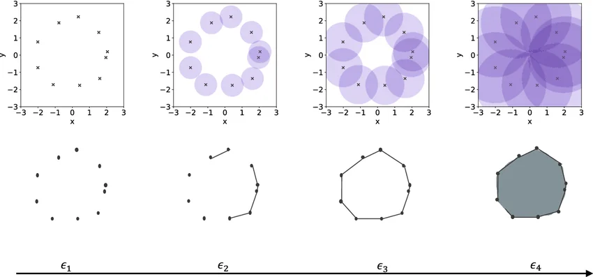
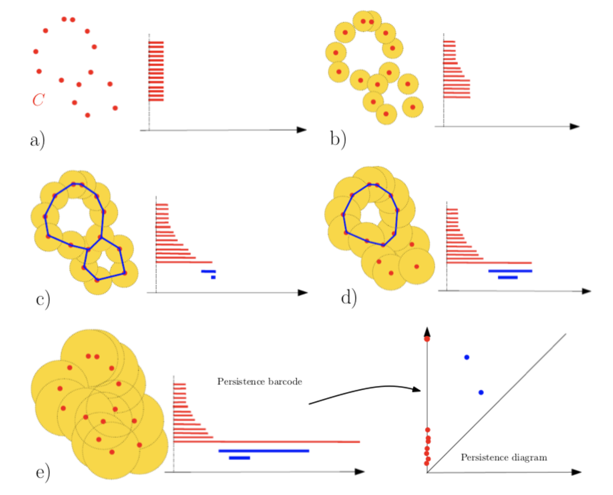
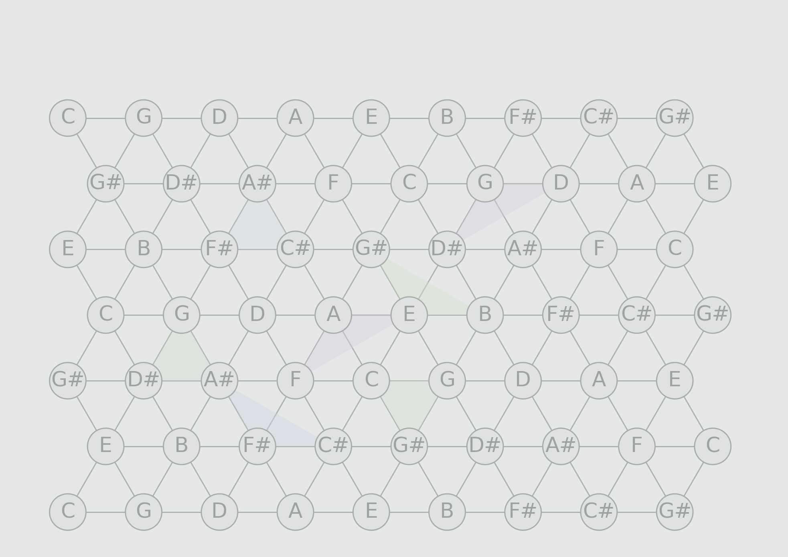
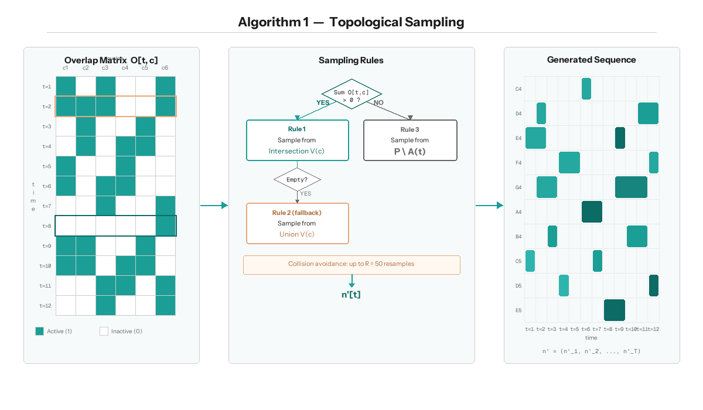
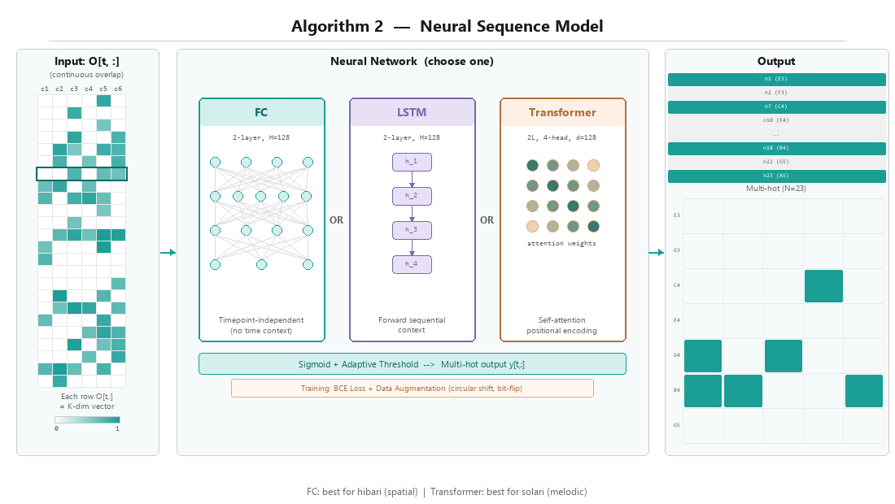
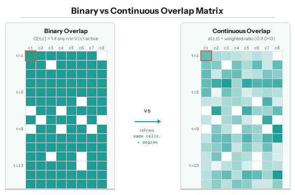
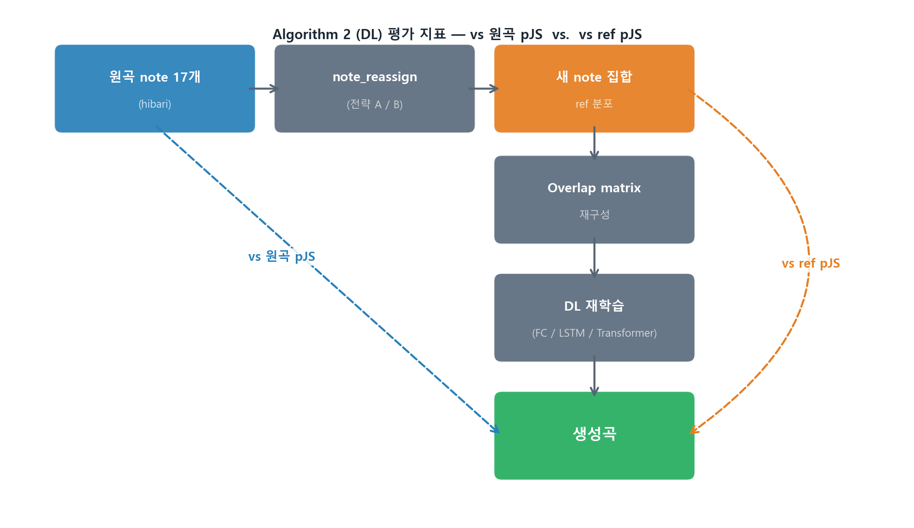

# Topological Data Analysis를 활용한 음악 구조 분석 및 위상 구조 보존 기반 AI 작곡 파이프라인

**저자:** 김민주
**지도:** 정재훈 (KIAS 초학제 독립연구단)
**작성일:** 2026.04.16

**키워드:** Topological Data Analysis, Persistent Homology, Tonnetz, Music Generation, Vietoris-Rips Complex, Jensen-Shannon Divergence

---

## 초록 (Abstract)

본 연구는 사카모토 류이치의 2009년 앨범 *out of noise* 수록곡 "hibari"를 대상으로, 음악의 구조를 **위상수학적으로 분석**하고 그 위상 구조를 **보존하면서 새로운 음악을 생성**하는 파이프라인을 제안한다. 전체 과정은 네 단계로 구성된다. (1) MIDI 전처리: 두 악기를 분리하고 8분음표 단위로 양자화. (2) Persistent Homology: 네 가지 거리 함수(frequency, Tonnetz, voice leading, DFT)로 note 간 거리 행렬을 구성한 뒤 $H_1$ cycle을 추출. (3) 중첩행렬 구축: cycle의 시간별 활성화를 이진 또는 연속값 행렬로 기록. (4) 음악 생성: 중첩행렬을 seed로 하여 확률적 샘플링 기반의 Algorithm 1과 FC / LSTM / Transformer 신경망 기반의 Algorithm 2 두 방식으로 음악 생성.

$N = 20$회 통계적 반복을 통한 정량 검증에서, **Algorithm 1**(확률적 샘플링) 기반으로 DFT 거리 함수가 네 거리 함수 중 최우수로 확인되었다 — frequency 대비 pitch JS divergence를 $0.0344 \pm 0.0023$에서 $0.0213 \pm 0.0021$로 **약 $38.2\%$ 감소**시켰다 ($p < 10^{-20}$). 이후 DFT 기반 continuous OM에서 per-cycle $\tau_c$ 최적화를 적용해 Algorithm 1 최저값 $\mathbf{0.01489 \pm 0.00143}$ ($N=20$)를 달성했으며, 이는 uniform $\tau=0.35$ 대비 $+58.7\%$ 개선 (Welch $p = 2.48 \times 10^{-26}$)이다. **Algorithm 2**에서는 연속값 중첩행렬 입력의 FC가 $\mathbf{0.00035 \pm 0.00015}$ ($N=10$)로 최우수였고, Transformer 대비 Welch $p = 1.66 \times 10^{-4}$로 유의 우위를 보였다. 두 최저값은 이론 최댓값 $\log 2 \approx 0.693$의 각각 약 $2.15\%$ (Algo1)와 $0.05\%$ (Algo2)다.

본 연구의 intra / inter / simul 세 갈래 가중치 분리 설계는 hibari의 두 악기 구조 — inst 1은 쉼 없이 연속 연주, inst 2는 모듈마다 규칙적 쉼을 두며 겹쳐 배치 — 를 수학적 구조에 반영한 것이며, 두 악기의 활성/쉼 패턴 관측 (inst 1 쉼 $0$개, inst 2 쉼 $64$개) 이 이 설계를 경험적으로 정당화한다.

---

## 1. 서론 — 연구 배경과 동기

### 1.1 연구 질문

음악은 시간 위에 흐르는 소리들의 집합이지만, 그 "구조"는 단순한 시간 순서만으로 포착되지 않는다. 같은 모티브가 여러 번 반복되고, 서로 다른 선율이 같은 화성 기반 위에서 엮이며, 전혀 관계없어 보이는 두 음이 같은 조성 체계 안에서 등가적 역할을 한다. 이러한 층위의 구조를 수학적으로 포착하려면 "어떤 두 대상이 같다(혹은 가깝다)"를 정의하는 **거리 함수**와, 그로부터 파생되는 **위상 구조**를 다루는 도구가 필요하다.

본 연구는 다음의 세 가지 질문에서 출발한다.

1. __위상 구조를 "보존한 채" 새로운 음악을 생성할 수 있는가?__ 보존의 기준은 무엇이며, 보존 정도를 어떻게 정량적으로 측정하는가?

2. __거리 함수의 선택이 실제로 생성 품질에 유의미한 영향을 주는가?__ 단순 빈도 기반 거리 대신 음악 이론적 거리 (Tonnetz, voice leading, DFT)를 사용하면 얼마나 나은가?

3. __위상 구조를 보존한 음악이 실제로 아름답게 들리는가?__ 수학적으로 유사한 위상 구조를 가지도록 생성된 음악이 청각적으로도 원곡의 미학적 인상을 전달하는가? 본 보고서 말미에 첨부된 QR코드를 통해 생성된 음악을 직접 감상할 수 있다.

### 1.2 연구 대상 — 왜 hibari인가

본 연구의 대상곡은 사카모토 류이치의 *out of noise* (2009) 수록곡 "hibari" 이다. 이 곡을 선택한 이유는 다음과 같다.

- __선행연구의 확장에 적합.__ 단선율의 국악에 TDA를 적용한 정재훈 교수의 선행연구(정재훈 외, 2024)를 화성음악으로 확장함에 있어, hibari는 복잡성을 내포하면서도 규칙적인 모듈 구조로 일정한 패턴이 있어 모델링이 용이하였다.
- __미학적 특수성.__ *out of noise* 앨범은 "소음과 음악의 경계"를 탐구하는 실험적 작업이며, hibari는 전통적 선율 진행이 아니라 음들의 *공간적 배치*에 가까운 방식으로 구성된다. 이 특성은 본 연구의 실험 결과 (§4.3)에서 DL 모델 선택과 직접적으로 공명한다.

---

## 2. 수학적 배경

본 절에서는 본 연구의 파이프라인을 이해하기 위해 필요한 수학적 도구들을 정의하고, 각 도구가 음악 구조 분석에서 어떻게 사용되는지를 서술한다. 

### 2.1 Vietoris-Rips Complex

**정의 2.1.** 거리 공간 $(X, d)$와 양의 실수 $\varepsilon > 0$이 주어졌을 때, **Vietoris-Rips complex** $\text{VR}_\varepsilon(X)$는 다음과 같이 정의되는 복합체(simplicial complex)이다:

$$
\text{VR}_\varepsilon(X) = \left\{ \sigma \subseteq X \,\middle|\, \forall x_i, x_j \in \sigma,\ d(x_i, x_j) \le \varepsilon \right\}
$$

즉, 점 집합 $X$의 부분집합 $\sigma$에 속한 **모든 점 쌍 사이의 거리가 $\varepsilon$ 이하**이면 $\sigma$를 심플렉스(simplex)로 포함시킨다.

**구성 요소:**
- 0-simplex (vertex): 각 점 $x_i \in X$. 단일 점은 거리 조건이 없으므로 어떤 $\varepsilon$에서도 포함된다.
- 1-simplex (edge): $d(x_i, x_j) \le \varepsilon$인 두 점의 쌍 $\{x_i, x_j\}$
- 2-simplex (triangle): 세 점이 서로 모두 $\varepsilon$ 이내인 부분집합

**Filtration 구조와 포함관계.** $\varepsilon$ 값을 0부터 연속적으로 키우면, 점 집합 $X$ 자체는 변하지 않은 채 **새로운 심플렉스만 점차 추가된다**. $\varepsilon = 0$일 때 $\text{VR}_0(X)$는 각 점만을 0-simplex로 포함하는 이산적인 점 집합(discrete set)이다 — 아직 어떤 edge도 없으므로 이것은 $X$ 그 자체와 같다. $\varepsilon$이 커지면서 두 점 사이 거리가 $\varepsilon$ 임계를 처음 넘는 순간에 1-simplex(edge)가 추가되고, 세 점이 모두 $\varepsilon$ 이내가 되면 2-simplex(삼각형)가 추가된다. 즉 $\varepsilon_1 < \varepsilon_2$이면 $\text{VR}_{\varepsilon_1}(X)$의 모든 심플렉스가 $\text{VR}_{\varepsilon_2}(X)$에도 그대로 들어 있다. 따라서 다음의 포함관계는 항상 성립한다:

$$
\text{VR}_0(X) \subseteq \text{VR}_{\varepsilon_1}(X) \subseteq \text{VR}_{\varepsilon_2}(X) \subseteq \cdots \subseteq \text{VR}_{\varepsilon_n}(X)
$$


표기 편의를 위해 $K_i := \text{VR}_{\varepsilon_i}(X)$로 두면:

$$
K_0 \subseteq K_1 \subseteq K_2 \subseteq \cdots \subseteq K_n
$$

이를 **filtration**이라 부르며, 변화가 일어나는 임계값 $\varepsilon_i$들이 곧 심플렉스의 birth/death 시점이 된다.

**본 연구에서의 사용:** $X = \{n_1, n_2, \ldots, n_{23}\}$은 hibari에 등장하는 23개의 고유 note이며, $d(n_i, n_j)$는 두 note 간 거리이다. 




---

### 2.2 Simplicial Homology

**정의 2.2.** Simplex complex $K$에 대해 $n$차 호몰로지 군(homology group) $H_n(K)$는 $K$ 안에 존재하는 $n$차원 "구멍"의 대수적 표현이다. 직관적으로:

- $H_0(K)$: 연결 성분(connected components)의 수
- $H_1(K)$: 1차원 cycle의 수 (닫힌 고리 모양으로 둘러싸인 영역)
- $H_2(K)$: 2차원 빈 공간(void)의 수 (3차원 공동을 둘러싼 표면)

$H_n(K)$는 아벨 군이며, $\text{rank}(H_n(K))$ = **Betti number** $\beta_n$은 서로 독립적인 $n$차원 구멍의 개수를 나타낸다. 

**Boundary 연산자와 호몰로지 — 선형대수적 계산 예시.** $H_n$이 어떻게 계산되는지를 간단한 예시로 보인다. 점 4개 $\{a, b, c, d\}$와 edge $\{ab, bc, cd, da, ac\}$, 삼각형 $\{abc\}$로 이루어진 복합체 $K$를 생각하자.

boundary 연산자 $\partial_1$ (edge → vertex)과 $\partial_2$ (삼각형 → edge)를 $\mathbb{F}_2$ (mod 2) 위에서 행렬로 표현하면:

```
  ∂₁ (edge → vertex):         ∂₂ (triangle → edge):
       ab bc cd da ac               abc
  a [  1  0  0  1  1 ]         ab [  1 ]
  b [  1  1  0  0  1 ]         bc [  1 ]
  c [  0  1  1  0  0 ]         cd [  0 ]
  d [  0  0  1  1  0 ]         da [  0 ]
                               ac [  1 ]
```

$H_1(K) = \ker(\partial_1) / \text{im}(\partial_2)$이다. $\ker(\partial_1)$은 "닫힌 edge 체인들"의 공간이고, $\text{im}(\partial_2)$는 "삼각형의 경계인 edge 체인들"의 공간이다. 이 예시에서 $\ker(\partial_1)$의 차원은 2 (두 개의 독립적인 닫힌 고리: $ab+bc+ca$와 $ac+cd+da$), $\text{im}(\partial_2)$의 차원은 1 ($abc$의 경계 $= ab+bc+ca$). 따라서 $\beta_1 = 2 - 1 = 1$, 즉 독립적인 cycle이 1개이다. 직관적으로, 삼각형 $abc$가 한 cycle을 "채워서" 없앴고, 남은 사각형 $a-c-d-a$에 해당하는 cycle 1개가 살아남는다.


**본 연구에서의 사용:** 본 연구는 주로 $H_1$ (1차 호몰로지)을 다룬다. 이는 음악 네트워크에서 서로 가까운 note들이 만드는 닫힌 cycle, 즉 순환적으로 연결된 note 그룹을 포착한다. 발견된 각 cycle은 곡의 구조적 반복 단위로 해석된다.

---

### 2.3 Persistent Homology

Filtration $K_0 \subseteq K_1 \subseteq \cdots \subseteq K_n$에서, 각 단계마다 $H_1$의 cycle 구성이 달라진다. **Persistent homology**는 이 과정에서 각 cycle이 어느 $\varepsilon_i$에서 처음 나타나고(**birth**) 어느 $\varepsilon_j$에서 사라지는지(**death**)를 추적한다.

**Birth와 death의 음악적 의미:**
- **Birth** $b$: 거리 임계값 $\varepsilon$가 충분히 커져서 새로운 cycle이 형성되는 순간. 음악적으로는 "이 거리 척도에서 처음으로 닫힌 반복 구조가 발견되는 시점".
- **Death** $d$: 더 큰 $\varepsilon$에서 그 cycle이 다른 cycle들의 합(정확히는 boundary)으로 표현될 수 있게 되어, 호몰로지 군 안에서 더 이상 독립적인 generator가 아니게 되는 순간. 음악적으로는 "거리 척도가 너무 느슨해져서 이 반복 구조가 다른 구조에 흡수되는 시점".

각 cycle은 $(b, d)$ 쌍과, 그 cycle을 구성하는 vertex/edge 집합인 **cycle representative**가 함께 기록된다. 본 연구에서는 birth-death 쌍은 cycle의 "수명"을 측정하는 데, cycle representative는 어떤 note들이 그 cycle을 이루는지 식별하는 데 사용한다. 이 정보를 모은 것이 곡의 **위상적 지문(topological signature)**이다.

**Persistence:** $\text{pers}(\text{cycle}) = d - b$. 큰 persistence를 갖는 cycle은 다양한 거리 척도에서 살아남으므로 **위상적으로 안정한 구조**이며, 작은 persistence는 일시적이거나 노이즈에 가까운 구조이다.

**본 연구에서의 사용:** 거리 행렬 $D \in \mathbb{R}^{23 \times 23}$로부터 Vietoris-Rips filtration을 구성하고, 각 rate parameter $r$ (가중치 비율, 후술)에서의 $H_1$ persistence를 계산한다. 발견된 모든 $(b, d)$ 쌍과 cycle representative가 함께 cycle 집합을 정의하며, 이 cycle들이 다음 절의 중첩행렬 구축에 사용된다.



---

### 2.4 빈도 기반 거리와 음악적 거리 함수

**빈도 기반 거리.** 본 연구의 기준 거리 $d_{\text{freq}}$는 두 note의 인접도(adjacency)의 역수로 정의된다. 인접도 $w(n_i, n_j)$는 곡 안에서 note $n_i$와 $n_j$가 시간적으로 연달아 등장한 횟수이다:

$$
w(n_i, n_j) = \#\!\left\{\,t : n_i\ \mathrm{at\ time}\ t\ \mathrm{and}\ n_j\ \mathrm{at\ time}\ t+1\,\right\}
$$

거리는 $d_{\text{freq}}(n_i, n_j) = 1 / w(n_i, n_j)$로 정의되며 인접도가 0인 경우는 도달 불가능한 큰 값으로 처리한다(§2.9).

**정의 2.4.** Tonnetz는 pitch class 집합 $\mathbb{Z}/12\mathbb{Z}$를 평면 격자에 배치한 구조이다. 여기서 **pitch class**는 옥타브 차이를 무시한 음의 동치류(equivalence class)로, 예컨대 C4 (가운데 도), C5 (한 옥타브 위 도), C3 등은 모두 같은 pitch class "C"에 속한다. 

**Tonnetz의 격자 구조.** pitch class $p \in \mathbb{Z}/12$를 좌표 $(x, y)$에 배치하되, 다음 관계를 만족시킨다:
- 가로 이동 (+1 in $x$): 완전5도 (perfect fifth, +7 semitones)
- 대각선 이동 (+1 in $y$): 장3도 (major third, +4 semitones)



*그림 2.4. Tonnetz 격자 구조. 가로 방향은 완전5도(C→G→D→A→E…), 대각선 방향은 장3도(C→E→G#…)와 단3도(C→A→F#…)로 이동한다. 삼각형 하나는 하나의 장3화음(major triad) 또는 단3화음(minor triad)에 대응된다.*

**(1) Tonnetz 거리.** 두 pitch class $p_1, p_2$ 사이의 Tonnetz 거리 $d_T(p_1, p_2)$는 격자 위 최단 경로 길이로 정의된다:

$$
d_T(p_1, p_2) = \min \left\{ |x_1 - x_2| + |y_1 - y_2| \,\middle|\, (x_i, y_i)\ \mathrm{represents}\ p_i \right\}
$$

**(2) Voice leading distance** (Tymoczko, 2008): 두 pitch class 사이를 이동하기 위해 거쳐야 하는 반음의 개수와 같다.

$$
d_V(p_1, p_2) = |p_1 - p_2|
$$

**(3) DFT distance** (Tymoczko, 2008): 각 pitch class를 12차원 벡터로 표현한 뒤, 이산 푸리에 변환(DFT)으로 다른 공간으로 옮겨서 비교한다.

**복합 거리(Hybrid distance).** 본 연구는 빈도 기반 거리 $d_{\text{freq}}$와 음악적 거리 $d_{\text{music}}$ (Tonnetz, Voice leading, DFT 중 하나)을 선형 결합한다:

$$
d_{\text{hybrid}}(n_i, n_j) = \alpha \cdot d_{\text{freq}}(n_i, n_j) + (1 - \alpha) \cdot d_{\text{music}}(n_i, n_j)
$$

**본 연구에서의 사용:** 거리 함수의 선택은 발견되는 cycle 구조에 직접적으로 영향을 미친다. 빈도 기반 거리만 사용하면 곡의 통계적 특성만 반영되어 화성적·선율적 의미가 있는 구조를 포착하지 못한다. 

---

### 2.5 활성화 행렬과 중첩행렬

본 연구에서는 곡의 시간축 위에서 cycle 구조가 어떻게 전개되는지를 두 단계의 행렬로 표현한다. 첫 단계는 **활성화 행렬(activation matrix)**, 두 번째 단계는 그것을 가공한 **중첩행렬(overlap matrix, OM)**이다.

**정의 2.5 (활성화 행렬).** 음악의 시간축 길이를 $T$, 발견된 cycle의 수를 $C$라 하자. 활성화 행렬 $A \in \{0, 1\}^{T \times C}$는 raw 활성 정보를 담는다:

$$
A[t, c] = \mathbb{1}\!\left[\,\exists\ n \in V(c)\ \mathrm{such\ that}\ n\ \mathrm{is\ played\ at\ time}\ t\,\right]
$$

여기서 $V(c)$는 cycle $c$의 note 집합이다. 활성화 행렬은 산발적인 단일 시점 활성화까지 모두 포함하므로 노이즈가 많다.

**정의 2.6 (OM).** OM $O \in \{0, 1\}^{T \times C}$는 활성화 행렬에서 **연속적이고 충분히 긴 활성 구간만 남긴 것**이다.

$$
O[t, c] = \mathbb{1}\!\left[\,t \in R(c)\,\right], \qquad R(c) = \bigcup_{i} [s_i,\ s_i + L_i]
$$

여기서 $R(c)$는 cycle $c$의 "지속 활성 구간(sustained intervals)"의 합집합이며, 각 구간 $[s_i, s_i + L_i]$는 활성화 행렬 $A[\cdot, c]$에서 길이가 임계값 $\mathrm{scale}_c$ 이상인 연속 1의 구간이다.

**활성화 행렬과 OM의 차이.**
- $A[t, c]$: 시점 $t$에 cycle $c$의 note가 단 한 번이라도 울리면 1. **순간적 활성을 모두 잡음.**
- $O[t, c]$: cycle $c$의 활성이 일정 시간 이상 **지속되는 구간**에서만 1. 산발적 노이즈 제거됨.

예를 들어 $\mathrm{scale}_c = 3$일 때 (3 시점 이상 지속된 활성만 인정), 아래와 같다.

```
  시점:  1  2  3  4  5  6  7  8  9 10 11 12 13 14 15
A[·,c]: 0  1  1  0  1  1  1  1  0  0  1  0  1  1  1
O[·,c]: 0  0  0  0  1  1  1  1  0  0  0  0  1  1  1
```

본 연구에서 OM을 음악 생성의 seed로 사용하는 이유는, 잠시 스쳐가는 활성보다 일정 시간 유지되는 cycle만이 곡의 구조적 단위로 의미 있다고 보기 때문이다.

**연속값 확장.** 본 연구에서는 이진 OM 외에, cycle의 활성 정도를 [0,1] 사이의 실수값으로 표현하는 연속값 버전도 도입하였다:

$$
O_{\text{cont}}[t, c] = \frac{\sum_{n \in V(c)} w(n) \cdot \mathbb{1}\!\left[\,n\ \mathrm{is\ played\ at\ time}\ t\,\right]}{\sum_{n \in V(c)} w(n)}
$$

여기서 $V(c)$는 cycle $c$의 vertex 집합, $w(n) = 1 / N_{\text{cyc}}(n)$은 note $n$의 **희귀도 가중치**이며 $N_{\text{cyc}}(n)$은 note $n$이 등장하는 cycle의 개수이다. 적은 cycle에만 등장하는 note가 활성화되면 더 큰 가중치를 받는다.

**음악적 의미:** OM은 곡의 **위상적 뼈대(topological skeleton)**를 시각화한 것이다. 시간이 흐름에 따라 어떤 반복 구조가 켜지고 꺼지는지를 나타내며, 이것이 음악 생성의 seed 역할을 한다.

---

### 2.6 Jensen-Shannon Divergence — 생성 품질의 핵심 지표

**JS divergence**는 두 확률 분포가 얼마나 다른지를 측정하는 지표이다. 값의 범위는 $[0, \log 2]$이며, 0이면 두 분포가 동일하다.

**본 연구에서 비교하는 두 가지 분포:**

1. **Pitch 빈도 분포** — "어떤 음들이 얼마나 자주 쓰였는가" (시간 순서 무시)
2. **Transition 빈도 분포** — "어떤 음 다음에 어떤 음이 오는가" (시간 순서 반영)

두 지표를 함께 사용함으로써 "음을 비슷하게 쓰는가"와 "비슷한 순서로 쓰는가"를 별도로 측정할 수 있다. 

---

### 2.7 Greedy Forward Selection

발견된 전체 cycle 집합 $\mathcal{C}$에서 원곡의 위상 구조를 가장 잘 보존하는 부분집합 $S \subseteq \mathcal{C}$를 선택해야 한다. 이를 위해 **greedy forward selection**을 사용한다: 보존도 함수 $f(S) = 0.5 \cdot J(S) + 0.3 \cdot C(S) + 0.2 \cdot B(S)$를 정의하고, 매 단계마다 $f$를 가장 크게 증가시키는 cycle을 하나씩 추가한다.

세 지표는 각각:
- **Note Pool Jaccard** $J(S)$: 선택된 cycle들이 전체 note를 얼마나 커버하는가
- **Overlap pattern correlation** $C(S)$: 시점별 활성 패턴이 원본과 얼마나 동조하는가 (Pearson 상관)
- **Betti curve similarity** $B(S)$: rate 변화에 따른 전체 위상 복잡도의 골격이 보존되는가

Note Pool Jaccard에 가장 큰 비중(0.5)을 둔 이유는 음악 생성의 직접적 입력이 cycle 구성 note이기 때문이다. 실험적으로 greedy 방법이 46개 cycle 중 15개로 90% 보존도를 달성하는 것을 확인하였다.

---

### 2.8 Multi-label Binary Cross-Entropy Loss

각 시점에서 동시에 여러 note가 활성화될 수 있으므로, 단일 클래스 예측인 categorical cross-entropy 대신 **multi-label BCE**를 사용한다. 각 note 채널마다 독립적인 binary cross-entropy를 계산하여 "note $i$가 활성인가?"를 개별 이진 문제로 학습한다. 모델 입력은 OM의 한 행 $O[t, :] \in \mathbb{R}^C$이고, 출력은 $N$차원 multi-hot vector이다.

**Adaptive threshold:** 추론 시 고정 임계값 0.5 대신, 원곡의 평균 ON 비율(약 15%)에 맞춰 상위 15%에 해당하는 sigmoid 출력만 활성으로 채택하는 동적 임계값을 사용한다.


---

### 2.9 음악 네트워크 구축과 가중치 분리

**rate parameter $r_t$의 의미.** $r_t$는 timeflow weight에서 intra weights와 inter weight의 비중을 조절한다.
- $r_t = 0$: $W = W_{\text{intra}}$만 사용. 각 악기의 선율적 흐름만 반영.
- $r_t = 1$: intra와 inter를 동등하게 결합. 선율과 상호작용을 균형 있게 반영.
- $r_t > 1$: inter의 비중이 intra보다 커짐. 악기 간 상호작용이 지배적인 구조를 탐색.

**가중치 행렬의 분리 (본 연구의 핵심 설계):** 본 연구는 가중치를 다음과 같이 세 가지로 분리한다:

1. **Intra weights** : 같은 악기 내에서 연속한 두 화음 간 전이 빈도. 각 악기의 **선율적 흐름**을 포착한다.
$$W_{\text{intra}} = W_{\text{intra}}^{(1)} + W_{\text{intra}}^{(2)}$$

2. **Inter weight** : 시차(lag) $\ell$을 두고 악기 1의 화음과 악기 2의 화음이 동시에 출현하는 빈도이다. $\ell \in \{1, 2, 3, 4\}$로 변화시키며 다양한 시간 스케일의 **악기 간 상호작용**을 탐색한다. 가까운 시차에 더 큰 비중을 두는 **감쇄 가중치** $\lambda_\ell$을 사용하여 합산한다:
$$W_{\text{inter}} = \sum_{\ell = 1}^{4} \lambda_\ell \cdot W_{\text{inter}}^{(\ell)}, \qquad (\lambda_1, \lambda_2, \lambda_3, \lambda_4) = (0.6,\ 0.3,\ 0.08,\ 0.02)$$
가중치는 "먼 시차의 우연한 동시 등장보다 가까운 시차의 인과적 상호작용이 음악적으로 의미 있다"는 가정을 반영한다.

3. **Simul weight** : 같은 시점에서 두 악기가 동시에 타건하는 note 조합의 빈도. **순간적 화음 구조**를 포착한다.

**Timeflow weight (선율 중심 탐색):**
$$W_{\text{timeflow}}(r_t) = W_{\text{intra}} + r_t \cdot W_{\text{inter}}$$

$r_t \in [0, 1.5]$를 변화시키며 위상 구조의 출현·소멸을 추적한다.

Simul 혼합 모드(기존 complex)는 short 버전에서 공식을 생략하고, §6.9의 결과 요약만 제시한다.

**거리 행렬:** 가중치 $w(n_i, n_j) > 0$에 대해 거리는 역수로 정의된다:

$$
d(n_i, n_j) = \begin{cases} 1\,/\,w(n_i, n_j) & \quad \mathrm{if}\ \ w(n_i, n_j) > 0 \\ d_\infty & \quad \mathrm{otherwise} \end{cases}
$$


*그림 2.9. hibari의 두 악기 배치 구조. inst 1 (위)은 전체 $T = 1{,}088$ 시점에서 쉬지 않고 연주하며 (쉼 0개), inst 2 (아래)는 32-timestep 모듈마다 규칙적인 쉼을 두고 얹힌다 (쉼 64개). 이 비대칭 배치가 가중치 행렬의 intra / inter / simul 분리의 근거가 된다.*

---

### 2.10 확장 수학적 도구 — 거리 보존 재분배와 화성 제약

본 절은 §6의 확장 실험에서 사용되는 도구를 간략히 소개한다. 상세 수식은 해당 절에서 필요한 시점에 도입한다.

- **Persistence Diagram Wasserstein Distance:** 두 barcode의 birth-death 점들을 최적 매칭한 이동 비용. 두 위상 구조의 유사도를 직접 비교하는 데 사용한다.
- **Consonance score:** 시점별 동시 타건 note 쌍의 roughness(불협화도) 평균. 음악이론의 협화도 분류에 기반하여, 생성된 음악의 화성적 질을 평가한다.
- **Markov chain 시간 재배치:** 원본 OM의 행 전이 패턴을 학습하여 새로운 시간 순서를 재샘플링하는 기법.

---

## 3. 두 가지 음악 생성 알고리즘

### 표기 정의

본 장에서 사용할 표기를 다음과 같이 통일한다.

| 기호 | 의미 | hibari 값 |
|---|---|---|
| $T$ | 시간축 길이 (8분음표 단위) | $1{,}088$ |
| $N$ | 고유 note 수 (pitch-duration 쌍) | $23$ |
| $C$ | 발견된 전체 cycle 수 | 최대 $52$ |
| $K$ | 선택된 cycle subset 크기 ($K \le C$) | $\{10, 17, 46\}$ |
| $O$ | OM, $\{0,1\}$ 값의 $T \times K$ 행렬 | — |
| $L_t$ | 시점 $t$에서 추출할 note 개수 | $3$ 또는 $4$ |
| $V(c)$ | cycle $c$의 vertex(note label) 집합 | 원소 수 $4 \sim 6$ |
| $R$ | 재샘플링 최대 시도 횟수 | $50$ |
| $B$ | 학습 미니배치 크기 | $32$ |
| $E$ | 학습 epoch 수 | $200$ |
| $H$ | DL 모델의 hidden dimension | $128$ |

---

### 3.1 Algorithm 1 — 확률적 샘플링 기반 음악 생성

> **참고:** Algorithm 1의 3가지 샘플링 규칙은 선행연구(정재훈 외, 2024)에서 설계된 것이며, 본 연구는 이를 계승하여 사용한다.

{width=95%}

### 핵심 아이디어 (3가지 규칙)

__규칙 1__ — 시점 $t$에서 활성 cycle이 있는 경우, 즉

$$
\sum_{c=1}^{K} O[t, c] > 0
$$

일 때, 활성화되어 있는 모든 cycle들의 vertex 집합의 교집합

$$
\displaystyle I(t) \;=\; \bigcap_{c\,:\, O[t,c]=1} V(c)
$$

에서 note 하나를 __균등 추출__한다. 만약 교집합이 공집합이면, 활성 cycle들의 합집합

$$
\displaystyle U(t) = \bigcup_{c\,:\, O[t,c]=1} V(c)
$$

에서 균등 추출한다. 

__규칙 2__ — 시점 $t$에서 활성 cycle이 없는 경우, 즉

$$
\sum_{c=1}^{K} O[t, c] = 0
$$

일 때, 인접 시점 $t-1, t+1$에서 활성화된 cycle들의 vertex의 합집합

$$
A(t) \;=\; \bigcup_{c\,:\, O[t-1,c]=1} V(c) \;\cup\; \bigcup_{c\,:\, O[t+1,c]=1} V(c)
$$

을 계산한 뒤, 전체 note pool에서 이 합집합을 제외한 영역 $P \setminus A(t)$에서 균등 추출한다.

__규칙 3__ — 중복 onset 방지. 같은 시점 $t$에서 동일한 (pitch, duration) 쌍이 두 번 추출되지 않도록 검사하며, 충돌이 발생하면 최대 $R$회까지 재샘플링한다. $R$회 모두 실패하면 그 시점의 해당 note 자리는 비워둔다.

---

### 3.2 Algorithm 2 — 신경망 기반 시퀀스 음악 생성

> **참고:** Algorithm 2의 전체 구조는 아래 그림에 시각적으로 요약되어 있다. FC / LSTM / Transformer 세 아키텍처 중 하나를 선택하여 사용한다.

{width=95%}

### 알고리즘 개요

Algorithm 2는 OM을 입력, 원곡의 multi-hot note 행렬을 정답 레이블로 두고 매핑

$$
f_\theta : \{0,1\}^{T \times C} \;\longrightarrow\; \mathbb{R}^{T \times N}
$$

을 학습한다 (FC 모델은 시점별 독립이므로 $\{0,1\}^C \to \mathbb{R}^N$). 학습된 모델은 학습 시 보지 못한 cycle subset이나 노이즈가 섞인 OM에 대해서도 원곡과 닮은 note 시퀀스를 출력하도록 기대된다.

DL 모델은 Algorithm 1처럼 "교집합 규칙"으로 위상 구조를 직접 강제하지는 않는다. 대신 Subset Augmentation을 통해 $K \in \{10, 15, 20, 30, 46\}$과 같은 다양한 크기의 subset에 대해서도 같은 원곡 $y$를 복원하도록 학습한다. 이 과정에서 모델은 "서로 다른 cycle subset이 같은 음악을 유도할 때, 그 공통적인 구조적 특성"을 잠재 표현으로 내부화한다. 따라서 학습 시 구체적으로 보지 못한 subset(예: $K = 12$)에 대해서도, 모델이 학습한 잠재 표현이 충분히 일반화되어 있다면 합리적 출력이 가능하다.

### 모델 아키텍처 비교

본 연구는 동일한 학습 파이프라인 위에서 세 가지 모델 아키텍처를 비교한다.

| 모델 | 입력 형태 | 시간 정보 처리 방식 | 파라미터 수 |
|---|---|---|---|
| FC | $(B, C)$ | 시점 독립 | $4 \times 10^4$ |
| LSTM (2-layer) | $(B, T, C)$ | 순방향 hidden state | $2 \times 10^5$ |
| Transformer (2-layer, 4-head) | $(B, T, C)$ | self-attention | $4 \times 10^5$ |

**표기 설명:** $B$는 batch size(한 번에 묶어서 학습하는 데이터 개수), $T$는 시간 길이(timestep 수), $C$는 cycle 수(OM의 열 수)이다.

- **FC**: 시점을 독립적으로 처리하므로 한 번에 시점 하나씩($C$차원 벡터)을 입력받아 $(B, C)$ 형태가 된다. 여기서 $B$는 T개 시점 중 묶어서 처리하는 수이며 기본값 $B = 32$이다.
- **LSTM/Transformer**: 곡 전체 시퀀스를 한 번에 입력받으므로 $(B, T, C)$ 형태가 된다. 단, $T = 1{,}088$이 batch size$(= 32)$보다 훨씬 크므로 ($\lfloor 32 / 1{,}088 \rfloor = 0$) 실제로는 한 번에 시퀀스 $1$개씩 처리된다 ($B = 1$). Augmentation으로 생성된 변형본들은 배치 크기를 늘리는 것이 아니라, epoch 내 학습 스텝 수를 늘린다.

### 학습 손실 함수

각 시점에서 여러 note가 동시에 활성화될 수 있으므로(multi-label 문제), §2.8에서 정의한 binary cross-entropy 손실을 사용한다. 

### 추론 단계

학습이 끝난 모델 $f_{\theta^*}$로 새로운 음악을 생성하는 단계를 하나하나 풀어 설명한다.

1단계 — 모델 통과 : logit 생성.

2단계 — sigmoid 변환.

__3단계 — adaptive threshold 결정.__ 가장 단순한 방법은 "$P[t, n] \ge 0.5$이면 켠다"라고 고정 임계값을 쓰는 것이다. 그러나 LSTM이나 Transformer 같은 시퀀스 모델은 학습 결과 sigmoid 출력이 전반적으로 낮게 형성되는 경향이 있어, $0.5$를 그대로 쓰면 활성화되는 note가 거의 없어 음악이 텅 비어버린다. 이를 해결하기 위해 본 연구는 원곡의 ON ratio에 맞춰 threshold를 데이터 기반으로 동적 결정한다.

__ON ratio__란 "원곡의 multi-hot 행렬 $y \in \{0,1\}^{T \times N}$에서 전체 $T \times N$개의 셀 중 값이 $1$인 셀의 비율"을 뜻한다. 수식으로는

$$
\rho_{\text{on}} \;=\; \frac{1}{T \cdot N} \sum_{t=1}^{T} \sum_{n=1}^{N} y[t, n]
$$

이다. hibari의 경우 $T = 1{,}088$, $N = 23$이므로 전체 셀 수는 약 $25{,}024$개이고, 그 중 note가 활성인 셀 수를 세어 나누면 약 $15\%$($\rho_{\text{on}} \approx 0.15$)가 된다. 직관적으로는 "한 시점당 $23$개 note 중 평균 $3 \sim 4$개가 켜져 있는 정도"라고 이해할 수 있다.

이 $\rho_{\text{on}}$을 목표 활성 비율로 삼아, $P$의 모든 값 중 상위 $15\%$에 해당하는 경계값을 임계값으로 쓴다. 

__4단계 — note 활성화 판정.__ 모든 $(t, n)$ 쌍에 대해 $P[t, n] \ge \theta$이면 시점 $t$에 note $n$을 활성화한다. 이 note의 (pitch, duration) 정보를 label 매핑에서 복원하여 $(t,\ \mathrm{pitch},\ t + \mathrm{duration})$ 튜플을 결과 리스트 $G$에 추가한다.

__5단계 — onset gap 후처리 (Algorithm 1, 2 공통).__ 너무 짧은 간격으로 onset이 연속되면 생성된 음악이 지저분해질 수 있으므로, "이전 onset으로부터 일정 시점(`gap_min`) 안에는 새 onset을 허용하지 않는다"는 최소 간격 제약을 적용한다. `gap_min = 0`이면 제약 없음, `gap_min = 3`이면 "3개의 8분음표(= 1.5박) 안에는 새로 타건하지 않음"을 의미한다. 본 연구의 모든 실험에서는 `gap_min = 0`(제약 없음)으로 설정하였다.

이 과정으로 최종적으로 얻은 $G = [(start, pitch, end), \ldots]$를 MusicXML로 직렬화하면 재생 가능한 음악이 된다.

---

### 3.3 두 알고리즘의 비교 요약

| 항목 | Algorithm 1 (Sampling) | Algorithm 2 (DL) |
|---|---|---|
| 학습 필요 여부 | 불필요 | 필요 ($E$ epoch) |
| 결정성 | 확률적 (난수) | 결정적 (학습 후) |
| 일반화 | 같은 곡 내부에서만 | 보지 못한 cycle subset도 생성 |
| 위상 보존 방식 | 직접 (교집합 규칙으로 강제) | 간접 (손실함수를 통해) |
| 생성 시간 | 약 $50$ ms | 약 $100$ ms (학습 후) |
| 학습 시간 | 해당 없음 | $30$ s $\sim 3$ min |

**해석.** Algorithm 1은 cycle 교집합 규칙을 통해 위상 정보를 직접 강제하므로, 생성된 note의 근거가 "시점 $t$에 활성화된 cycle들의 교집합"이라는 구조적 규칙으로 투명하게 설명된다 — 설계상 위상 보존이 보장된다. 반면 Algorithm 2는 OM → note 매핑을 학습된 손실함수를 통해 간접적으로 보존하지만, pitch 분포의 재현 정확도(§2.6 Jensen-Shannon divergence)는 훨씬 높다: §4.3 FC-cont가 JS $= 0.00035$로 §4.1 Algorithm 1 DFT baseline ($0.0213$) 대비 약 $60$배 낮다. 즉 두 알고리즘은 **위상 구조 강제 방식의 투명성**(Algorithm 1)과 **통계적 분포 재현도**(Algorithm 2)라는 서로 다른 축에서 상보적이다.

---

## 4. 실험 설계와 결과

본 장에서는 지금까지 제안한 TDA 기반 음악 생성 파이프라인의 성능을 정량적으로 평가한다. 네 가지 유형의 실험을 수행하였다.

1. __거리 함수 비교__ — frequency(기본), Tonnetz, voice leading, DFT 네 종류의 거리 함수에 대해 동일 파이프라인을 적용하고 생성 품질을 비교 (§4.1).
2. __Continuous OM 효과 검증__ — 이진 OM 대비 연속값 OM의 효과를 Algorithm 1 및 Algorithm 2 (FC/LSTM/Transformer)에서 검증 (§4.2, §4.3).
3. __DL 모델 비교__ — FC / LSTM / Transformer 세 아키텍처를 동일 조건에서 비교하고, continuous overlap을 직접 입력으로 활용하는 효과를 검증 (§4.3).
4. __통계적 유의성__ — 각 설정에서 Algorithm 1을 $N = 20$회 독립 반복 실행하여 mean ± std를 보고 (본 보고서에선 초록에만 기재하였고 본문에선 생략함).

### 평가 지표

__Jensen-Shannon Divergence (주 지표).__ 생성곡과 원곡의 pitch 빈도 분포 간 JS divergence를 주 지표로 사용한다 (§2.6). 값이 낮을수록 두 곡의 음 사용 분포가 유사하며, 이론상 최댓값은 $\log 2 \approx 0.693$이다.

__Note Coverage.__ 원곡에 존재하는 고유 (pitch, duration) 쌍 중, 생성곡에 한 번 이상 등장하는 쌍의 비율. $1.00$이면 모든 note가 최소 한 번 이상 사용된 것이다.

__보조 지표.__ Pitch count (생성곡의 고유 pitch 수), 생성 소요 시간 (초).

### 거리 함수 구현

__두 note 간 확장 — 옥타브와 duration 보정.__ §2.4의 음악적 거리 함수들은 원래 pitch class만 고려하므로 옥타브와 duration 정보가 손실된다. 본 연구에서 note는 (pitch, duration) 쌍으로 정의되므로, 세 거리 함수 모두에 다음 두 항을 추가한다.

$$
d(n_1, n_2) = d_{\text{base}}(p_1, p_2) + w_o \cdot |o_1 - o_2| + w_d \cdot \frac{|d_1 - d_2|}{\max(d_1, d_2)}
$$

여기서 $d_{\text{base}}$는 Tonnetz / voice leading / DFT 중 하나, $o_i = \lfloor p_i / 12 \rfloor$는 옥타브 번호, $d_i$는 duration, $w_o = 0.3$, $w_d = 1.0$이다.

**각 항의 설계 근거:**
- **옥타브 항** $w_o |o_1 - o_2|$: 같은 pitch class라도 옥타브가 다르면 음악적으로 다른 역할을 한다(예: C4와 C5). 
- **Duration 항** $w_d |d_1 - d_2| / \max(d_1, d_2)$: 분자를 $\max$로 정규화하여 $[0, 1]$ 범위로 만든다. 
- **계수 최적화:** $w_o = 0.3$(§4.1a)과 $w_d = 1.0$(§4.1b)은 hibari DFT 조건 N=10 grid search로 최적화되었다.

> **주의 — aqua / solari 일반화 실험에서 $w_d$ 무력화.** aqua, solari 등에서는 N을 줄이기 위해 duration의 최대공약수(GCD)를 기반으로 붙임음 처리를 적용하여 모든 note의 duration이 GCD 단위(= 1)로 정규화된다. 이때 $|d_1 - d_2| = 0$이 되어 duration 항이 실질적으로 비활성화되며, $w_d$ 값은 이들 실험의 결과에 영향을 주지 않는다.

---

## 4.1 Experiment 1 — 거리 함수 비교 ($N = 20$)

네 종류의 거리 함수 각각으로 사전 계산한 OM을 로드하여, Algorithm 1을 $N = 20$회 독립 반복 실행하고 JS divergence의 mean ± std를 측정한다.

| 거리 함수 | 발견 cycle 수 | JS Divergence (mean ± std) | Note Coverage |
|---|---|---|---|
| frequency (baseline) | 1 | $0.0344 \pm 0.0023$ | $0.957$ |
| Tonnetz | 47 | $0.0493 \pm 0.0038$ | $1.000$ |
| voice leading | 19 | $0.0566 \pm 0.0027$ | $0.989$ |
| DFT | 17 | $\mathbf{0.0213 \pm 0.0021}$ | $1.000$ |


__해석 1 — DFT가 가장 우수.__ DFT 거리 함수는 frequency 대비 JS를 $0.0344 \to 0.0213$으로 약 $38.2\%$ 낮은 JS를 달성하였다. DFT 거리는 각 note의 pitch class를 $\mathbb{Z}/12\mathbb{Z}$ 위의 12차원 이진 벡터로 표현한 후 이산 푸리에 변환(DFT)을 적용하고, 복소수 계수의 **magnitude(크기)만** 거리 계산에 사용한다. 이때, 이조(transposition)는 DFT 계수의 **위상(phase)**만 바꿀 뿐 magnitude에는 영향을 주지 않는다. 이렇게 위상 정보를 버림으로써 이조에 불변인 **화성 구조의 지문**을 추출한다.

특히 $k=5$ 푸리에 계수가 diatonic scale과 강하게 반응하는 이유는 다음과 같다. 12개 pitch class를 **완전5도 순환(circle of fifths)** 순서 $\{C, G, D, A, E, B, F{\sharp}, C{\sharp}, G{\sharp}, D{\sharp}, A{\sharp}, F\}$로 재배열하면, diatonic scale에 속하는 7개 pitch class는 이 순환 상의 **연속된 7개 위치**를 차지한다 (예: C major는 $F$-$C$-$G$-$D$-$A$-$E$-$B$의 연속 구간). DFT의 $k=5$ 계수의 magnitude는 정확히 이 "5도 순환 상의 연속성"을 수치로 측정하는 양이며 (Quinn, 2006; Tymoczko, 2008), $\binom{12}{7} = 792$개의 7-note subset 중 diatonic scale 류가 $|F_5|$를 최대화한다 (maximally even property). hibari의 7개 PC 집합 $\{0, 2, 4, 5, 7, 9, 11\}$ (C major / A natural minor) 역시 이 최대화 subset 중 하나이므로, DFT magnitude 공간에서 hibari의 note들은 frequency 거리에서는 포착되지 않던 **음계적 동질성**에 의해 서로 가깝게 군집된다.

__해석 2 — 거리 함수가 위상 구조 자체를 바꾼다.__ "거리 함수의 선택이 곧 어떤 음악적 구조를 '동치'로 간주할 것인가를 정의한다"는 음악이론적 관점과 일치한다. DFT는 pitch class 집합의 Fourier magnitude를 거리 공간으로 끌어올려, 음계적 동질성을 공유하는 note들이 한 cycle에 더 자주 모이게 된다.

__해석 3 — Note Coverage는 대부분의 설정에서 포화.__ 원곡의 모든 note 종류가 생성곡에 최소 한 번 등장해야 한다는 기본 요구는 모두 만족된다. 따라서 품질의 주된 차이는 "같은 note pool을 얼마나 *자연스러운 비율로* 섞는가"에서 발생한다.

## 4.1a Octave Weight 튜닝 — DFT + N=10 Grid Search

DFT 거리 함수의 옥타브 가중치 $w_o$를 $\{0.1, 0.3, 0.5, 0.7, 1.0\}$에 대해 hibari Algo1 JS로 N=10 반복 실험하였다. $w_d = 1.0$ (§4.1b 최적값) 고정.

| $w_o$ | K (cycle 수) | JS (mean ± std) |
|---|---|---|
| 0.1 | 14 | $0.0380 \pm 0.0026$ |
| **0.3** | **19** | $\mathbf{0.0163 \pm 0.0014}$ |
| 0.5 | 16 | $0.0183 \pm 0.0020$ |
| 0.7 | 16 | $0.0231 \pm 0.0019$ |
| 1.0 | 16 | $0.0204 \pm 0.0020$ |

**결론:** $w_o = 0.3$이 최적이다 (JS = 0.0163). 옥타브 패널티를 줄이면 pitch class 유사성이 거리 행렬을 더 강하게 지배하며, 이는 hibari의 좁은 옥타브 범위(52–81, 최대 2 옥타브)에서 옥타브 구분이 상대적으로 덜 중요하다는 음악적 직관과 일치한다.

---

## 4.1b Duration Weight 튜닝 — DFT + N=10 Grid Search

$w_d \in \{0.0, 0.1, 0.3, 0.5, 0.7, 1.0\}$에 대해 hibari + **DFT** 조건에서 N=10 반복 실험을 수행하였다. $w_o = 0.3$ (§4.1a 최적값) 고정.

| $w_d$ | K (cycle 수) | JS (mean ± std) |
|---|---|---|
| $0.0$ | $10$ | $0.0503 \pm 0.0042$ |
| $0.1$ | $25$ | $0.0311 \pm 0.0021$ |
| $0.3$ | $16$ | $0.0221 \pm 0.0017$ |
| $0.5$ | $17$ | $0.0215 \pm 0.0024$ |
| $0.7$ | $17$ | $0.0211 \pm 0.0016$ |
| **$1.0$** ★ | **$19$** | $\mathbf{0.0156 \pm 0.0012}$ |

**결론:** $w_d = 1.0$이 최적이다 (JS = 0.0156). duration 가중치를 최대화할 때 성능이 가장 좋다. DFT는 pitch class 집합의 스펙트럼 구조를 정밀하게 포착하므로 $w_d$가 높아도 pitch 정보가 충분히 보존되며, 오히려 duration이 거리 행렬에 기여할수록 cycle 수와 생성 품질이 향상된다. $w_d = 0.0$ (duration 항 완전 제거)일 때 cycle 수가 10으로 급감하고 JS가 0.0503으로 크게 악화되어, duration 정보가 거리 행렬의 질에 유의미하게 기여함을 확인하였다.

---

## 4.1c 감쇄 Lag 가중치 실험

§2.9에서 도입한 감쇄 합산 inter weight의 실험적 근거를 제시한다. lag 1 단일 옵션과 lag 1~4 감쇄 합산 옵션 두 설정을 비교하되, 거리 함수는 DFT와 Tonnetz 두 가지를 대조하여 거리 함수의 특성에 따라 효과가 달라짐을 확인한다.

**실험 설정:**
- lag 1 단일 : $W_{\text{inter}} = W_{\text{inter}}^{(1)}$
- lag 1~4 감쇄 합산 : $\displaystyle W_{\text{inter}} = \sum_{\ell=1}^{4} \lambda_\ell \cdot W_{\text{inter}}^{(\ell)}$, $\quad (\lambda_1,\lambda_2,\lambda_3,\lambda_4) = (0.60,\ 0.30,\ 0.08,\ 0.02)$
- 고정 조건: hibari, Algorithm 1, N=20

$N = 20$ 반복.

| 곡 | 거리 함수 | lag 1 단일 (JS mean ± std) | lag 1~4 감쇄 합산 (JS mean ± std) | 변화 |
|---|---|---|---|---|
| hibari | DFT | $0.0211 \pm 0.0021$ | $\mathbf{0.0196 \pm 0.0022}$ | $\mathbf{-7.1\%}$ ★ |
| hibari | Tonnetz | $0.0488 \pm 0.0040$ | $0.0511 \pm 0.0039$ | $+4.8\%$ |

__해석 4 — DFT에서 개선, Tonnetz에서는 악화.__ DFT 거리에서는 감쇄 lag가 JS를 7.1% 개선한다. 반면 Tonnetz에서는 오히려 4.8% 악화한다. DFT는 스펙트럼 구조를 포착하는 metric으로 lag 2~4의 추가 정보가 소량 유효하게 작용하는 반면, Tonnetz에서는 먼 lag의 우연한 동시 등장이 노이즈로 작용함을 시사한다.

> **향후 과제 — inter 감쇄 계수 재탐색.** 본 실험에서 $\lambda_1 = 0.60$으로 설정하였는데, intra weight에서 lag=1 계수를 $1.0$으로 두는 것과의 비대칭이 존재한다. inter lag 감쇄 계수 $(\lambda_1, \lambda_2, \lambda_3, \lambda_4)$는 휴리스틱으로 설정된 것이므로, 향후 $\lambda_1 = 1.0$을 포함한 grid search 또는 uniform/exponential decay 비교 실험이 가능하다.

---

## 4.2 Continuous Overlap Matrix 실험

{width=85%}

본 절은 §2.5에서 정의한 **연속값 OM** $O_{\text{cont}} \in [0,1]^{T \times K}$가 이진 OM $O \in \{0,1\}^{T \times K}$ 대비 어떤 영향을 주는지를 정량적으로 검증한다. 거리 함수는 모든 설정에서 **DFT**로 고정한다. **본 실험은 Algorithm 1에 대해서만 수행하였다.** Algorithm 2(DL)에서 이진/연속값 입력의 효과는 §4.3에서 세 모델(FC/LSTM/Transformer) 비교 실험의 일부로 다룬다.

### 실험 설계

cycle별 시점 활성도 $a_{c,t}$는 두 가지 방식으로 계산할 수 있다.

__이진 (binary)__: 단순 OR 연산이다. $V(c)$에 속하는 note가 시점 $t$에 하나라도 활성이면 $a_{c,t} = 1$, 그렇지 않으면 $0$이다.

__연속값 (continuous)__: cycle을 구성하는 note들이 *얼마나 많은 비율로* 활성화되어 있는지를 $[0,1]$ 실수로 표현한다 :

$$
a_{c,t} \;=\; \left(\;\sum_{n \in V(c)} w(n)\cdot\mathbb{1}[n \in A_t]\;\right)\;/\;\left(\;\sum_{n \in V(c)} w(n)\;\right)
$$

여기서 $A_t$는 시점 $t$에 활성인 note들의 집합, $w(n) = 1/N_{\text{cyc}}(n)$은 note $n$의 **희귀도 가중치**이며 $N_{\text{cyc}}(n)$은 note $n$이 등장하는 cycle의 개수이다.

연속값 활성도가 만들어진 후, 최종 OM을 만드는 방식에 따라 다시 두 가지 변형이 가능하다.

- __직접 사용 (direct)__: $O[t, c] = a_{c,t} \in [0, 1]$
- __임계값 이진화 (threshold $\tau$)__: $O[t, c] = \mathbb{1}[\,a_{c,t} \ge \tau\,]$, $\tau \in \{0.3, 0.5, 0.7\}$

### 결과

DFT 조건, $w_o = 0.3$, $w_d = 1.0$, $N = 20$ 반복.

| 설정 | Density | JS Divergence (mean ± std) |
|---|---|---|
| __(A) Binary__ | $\mathbf{0.313}$ | $\mathbf{0.0157 \pm 0.0018}$ ★ |
| (B) Continuous direct | $0.728$ | $0.0186 \pm 0.0015$ |
| (C) Continuous → bin $\tau = 0.3$ | $0.367$ | $0.0360 \pm 0.0029$ |
| (C) Continuous → bin $\tau = 0.5$ | $0.199$ | $0.0507 \pm 0.0027$ |
| (C) Continuous → bin $\tau = 0.7$ | $0.060$ | $0.0449 \pm 0.0024$ |

여기서 "Density"는 **전체 OM (1,088 timestep × $K$ cycle) 기준** 활성 셀의 평균 비율 ($\bar{O}$)이다.

### 해석

__해석 5a — Binary가 최우수.__ 이진 OM (A)가 JS $0.0157$로 가장 좋다. DFT 거리는 스펙트럼 구조를 정밀하게 포착하므로 이진 표현만으로도 cycle 활성 신호가 충분히 구별된다. DFT 이진 OM의 density $0.313$은 **선택적 sparsity** — 즉 모든 시점에서 모든 cycle이 활성이거나(dense = 1) 거의 모든 시점에서 대다수 cycle이 비활성(sparse = 0)이 아닌, "의미 있는 시점에만 해당 cycle이 활성화되는" 중간 상태 — 를 자체적으로 달성한다는 뜻이다. Algorithm 1의 교집합 sampling은 density가 너무 낮으면 활성 cycle이 부족해 note 선택의 다양성이 떨어지고, 너무 높으면 cycle 간 교집합이 비어 fallback(전체 pool 균등 추출)으로 떨어진다. DFT 거리는 이조 불변 스펙트럼 구조 덕분에 cycle이 "의도된 구간"에서만 활성화되는 이진 OM을 산출하며, 이 density $0.313$은 별도 임계값 조정 없이도 적절 sparsity에 해당한다.

__해석 5b — Continuous direct는 오히려 열세.__ (B) continuous direct ($\bar{O} = 0.728$)는 이진보다 훨씬 dense하여, Algorithm 1의 교집합 sampling이 과도하게 자주 호출되어 다양성이 떨어진다. JS $0.0186$으로 Binary 대비 $18.5\%$ 악화한다.

__해석 5c — 임계값 이진화는 모두 열세.__ $\tau = 0.3 \sim 0.7$의 임계값 이진화는 모두 크게 열세다 (JS $0.036 \sim 0.051$). DFT binary OM이 이미 cycle 활성의 핵심 구간만을 선별하므로 추가적인 임계값 필터링은 과도한 sparsity를 만들어 성능을 저하시킨다.

---

## 4.3 Experiment 3 — Algorithm 2 DL 모델 비교

세 모델을 **DFT 기반 OM** 입력 ($w_o = 0.3$, $w_d = 1.0$)에서 비교한다. 각 모델을 이진 OM $O \in \{0,1\}^{T \times K}$과 연속값 OM $O_{\text{cont}} \in [0,1]^{T \times K}$의 두 입력에서 모두 학습하였다. $N = 10$ 반복.

### 모델 아키텍처

- **FC** (Fully Connected, 2-layer, hidden dim $= 128$, dropout $= 0.3$): 각 시점 $t$의 cycle 활성 벡터 $O[t, :] \in \{0,1\}^K$ 또는 $O_{\text{cont}}[t, :] \in [0,1]^K$를 입력으로 받아 동시점의 note label 분포를 출력. **시점 간 독립 매핑**이므로 시간 문맥 없음.
- **LSTM** (2-layer, hidden dim $= 128$): cycle 활성 벡터 시퀀스 $\{O[t, :]\}_{t=1}^{T}$를 순차 입력. 순환 구조 $h_t = f(x_t, h_{t-1})$로 과거 문맥을 hidden state에 누적.
- **Transformer** (2-layer, 4-head self-attention, $d_{\text{model}} = 128$): positional embedding으로 시간 위치를 인코딩하고 self-attention으로 **전 시점 동시 참조**가 가능.

세 모델 모두 동일한 학습 조건에서 multi-label binary cross-entropy loss (§2.8)로 학습한다. 각 시점에서 예측된 note 확률로부터 샘플링하여 생성곡을 얻는다. **validation loss**는 학습 시점 validation set에서 측정한 BCE loss의 평균이다.

| 모델 | 입력 | Pitch JS (mean ± std) | validation loss (mean) |
|---|---|---|---|
| FC | binary | $0.00217 \pm 0.00056$ | $0.339$ |
| FC | __continuous__ | $\mathbf{0.00035 \pm 0.00015}$ ★ | $\mathbf{0.023}$ |
| LSTM | binary | $0.233 \pm 0.029$ | $0.408$ |
| LSTM | continuous | $0.170 \pm 0.027$ | $0.395$ |
| Transformer | binary | $0.00251 \pm 0.00057$ | $0.836$ |
| Transformer | continuous | $0.00082 \pm 0.00026$ | $0.152$ |

### 해석

__해석 6 — FC + continuous 입력이 최우수.__ FC가 연속값 입력에서 JS $0.00035$로 가장 낮은 값을 달성하였다. 동일한 FC의 이진 입력 ($0.00217$) 대비 $83.9\%$ 개선된 수치이며, Welch's $t$-test $p = 1.50 \times 10^{-6}$로 통계적으로 매우 유의하다. Transformer continuous ($0.00082$)와의 비교에서도 FC continuous가 유의하게 우수하다 (Welch $p = 1.66 \times 10^{-4}$). FC의 cell-wise 표현력이 DFT continuous OM의 cycle 활성 강도 차이를 세밀하게 반영한다.

__해석 7 — LSTM의 심각한 열화.__ LSTM은 이진 입력 $0.233$, 연속값 입력 $0.170$으로 다른 두 모델과 비교할 수 없는 수준으로 열화하였다. LSTM의 **순환 구조(recurrent structure)** 란 시점 $t$의 hidden state $h_t$가 직전 시점 $h_{t-1}$로부터 $h_t = f(x_t, h_{t-1})$로 갱신되는 순차적 정보 전파 메커니즘을 의미하며, 이 구조는 시점이 연속적으로 이어지는 부드러운 시계열(예: 자연어, 음향 파형)에 적합하다. 그러나 DFT 기반 OM에서는 cycle 활성 패턴이 "어느 순간 켜졌다가 꺼지는" 비연속적 점프 형태이고, 특히 hibari의 phase shifting 구조(§4.5.4)에서 cycle 활성 위치가 모듈 단위로 평행 이동하므로 직전 시점의 정보가 현재 시점 예측에 기여하는 바가 작다. FC는 시점별 독립 매핑이라 이 문제를 겪지 않고, Transformer는 self-attention으로 장거리 관계를 동시에 참조할 수 있는 반면, LSTM은 순차 전파라는 자체 구조가 bottleneck이 된다.

__해석 8 — 연속값 입력의 보편적 이점.__ 세 모델 모두 연속값 입력이 이진 입력보다 유의하게 우수하다 (Welch $p < 10^{-4}$ 전부). 그러나 그 이점의 크기는 모델별로 다르다: FC가 $-83.9\%$로 가장 큰 개선을, Transformer는 $-67.4\%$, LSTM은 $-27.3\%$의 개선을 보인다. 연속값 OM의 cycle 활성 강도 정보가 FC 구조에서 가장 효과적으로 활용된다.

__해석 9 — Validation loss와 JS의 동시 감소.__ FC-continuous는 validation loss ($0.023$)가 FC-binary ($0.339$)의 약 $7\%$ 수준이며 JS도 동시에 크게 감소한다. Transformer도 $0.836 \to 0.152$로 validation loss가 크게 줄어든다. 연속값 입력이 모델의 학습 signal을 더 부드럽게 만들어, 과적합 없이 일반화된 분포를 학습하게 한다.

### 통합 비교 (§4.1 ~ §4.3)

| 실험 | 설정 | JS divergence | 출처 |
|---|---|---|---|
| §4.1 Algo 1 | frequency baseline | $0.0344$ | §4.1 |
| §4.1 Algo 1 | DFT (최적) | $0.0213$ | §4.1 |
| §4.2 Algo 1 | DFT binary (최적 파라미터) | $\mathbf{0.0157 \pm 0.0018}$ ★ | §4.2 |
| §4.3 Algo 2 FC | DFT continuous | $\mathbf{0.00035 \pm 0.00015}$ ★ | §4.3 |

**§4.3 FC (DFT continuous)는 DFT 기반 실험 내에서 관측된 최저 JS divergence**이다. 이론적 최댓값 $\log 2 \approx 0.693$의 약 $0.05\%$에 해당한다.

---

## 4.4 종합 논의

__(1) 음악이론적 거리 함수의 중요성.__ §4.1. Experiment 1 결과는 "DFT처럼 음악이론적 구조를 반영한 거리가 더 좋은 위상적 표현을 만든다"는 본 연구의 가설을 지지한다. 

__(2) Algorithm 1의 이진 OM, Algorithm 2의 Continuous OM.__ 거리 함수 baseline으로 DFT를 채택했을 때 Algorithm 1에서는 이진 OM이 연속값 OM보다 우수한 반면 (§4.2), Algorithm 2의 FC에서는 연속값 OM이 큰 폭으로 우수하다 (§4.3, $-83.9\%$). 규칙 기반 Algorithm 1은 sparse한 이진 활성 패턴을 직접 샘플링에 사용하므로 이진 OM이 적합하지만, DL 기반 Algorithm 2의 FC는 continuous activation의 강도 정보를 학습 signal로 활용하여 cell-wise 표현력을 극대화한다.

__(3) FC + continuous 입력의 결정적 우위.__ DL 모델 비교 (§4.3)에서 FC-cont가 JS $0.00035$로 Transformer-cont ($0.00082$) 대비 유의하게 우수하다 (Welch $p = 1.66 \times 10^{-4}$).

---

## 4.5 곡 고유 구조 분석 — hibari 의 수학적 불변량

본 절은 hibari 가 가지는 수학적 고유 성질을 분석하고, 이 성질들이 본 연구의 실험 결과와 어떻게 연결되는지를 서술한다. 비교 대상으로 사카모토의 다른 곡인 solari 와 aqua 를 함께 분석한다.

### 4.5.1 Deep Scale Property — hibari 의 pitch class 집합이 갖는 대수적 고유성

hibari 가 사용하는 7개 pitch class 는 $\{0, 2, 4, 5, 7, 9, 11\} \subset \mathbb{Z}/12\mathbb{Z}$이다. 이 집합은 출발음을 어디로 삼느냐에 따라 C에서 시작하면 C major scale, A에서 시작하면 A natural minor scale로 해석되는 **하나의 pitch class 집합**이다. 이 7개 pitch class 집합 전체의 **interval vector**는 $[2, 5, 4, 3, 6, 1]$이다. 여기서 $k$번째 성분은 "집합 안에서 interval class $k$에 해당하는 쌍의 수"이다. 7 반음 이상은 옥타브 대칭에 의해 $12 - k$와 동치이므로 interval class는 1~6까지만 존재한다.

이 벡터의 6개 성분은 __모두 다른 수__($\{1, 2, 3, 4, 5, 6\}$의 순열)로 이것을 **deep scale property** 라 한다 (Gamer & Wilson, 2003). 이 성질을 갖는 7-note subset 은 $\binom{12}{7} = 792$개 중 __diatonic scale 류 뿐__이다. "장음계 / 자연단음계 / 교회 선법"은 **같은 pitch class 집합**에서 출발음만 달리한 mode(선법)들로 (예: C Ionian = C major, A Aeolian = A natural minor, D Dorian 등은 모두 $\{0,2,4,5,7,9,11\}$), 집합 자체는 $\mathbb{Z}/12\mathbb{Z}$에서 transposition (이조) 동치류 하나로 유일하다. 즉 hibari 가 7개 PC 를 선택한 것은 임의가 아니라, 12음 체계에서 __각 pitch class가 고르게 (그러면서도 모두 다른 횟수로) 등장하는 유일한 부분집합__을 선택한 것이다.

또한 7개 PC 사이의 간격 패턴은 $[2, 2, 1, 2, 2, 2, 1]$로, 오직 $\{1, 2\}$ 두 종류의 간격만으로 구성된다. 이것은 __maximal evenness__ — 12개 칸 위에 7개 점을 가능한 한 균등하게 배치한 상태 — 를 의미한다 (Clough & Douthett, 1991). deep scale 과 maximal evenness 는 모두 diatonic scale 의 고유 성질이다.

solari 와 aqua 는 12개 PC 모두를 사용하므로 이 성질이 적용되지 않는다.

### 4.5.2 근균등 Pitch 분포 — Pitch Entropy

| 곡 | 사용 pitch 수 | 정규화 pitch entropy | 해석 |
|---|---|---|---|
| __hibari__ | $17$ | $\mathbf{0.974}$ | 거의 완전 균등 |
| solari | $34$ | $0.905$ | 덜 균등 |
| aqua | $51$ | $0.891$ | 가장 치우침 |

pitch entropy는 곡 안에서 사용된 모든 pitch의 빈도 분포에 대한 **Shannon entropy**를 계산하고, 이론적 최댓값으로 나눠 정규화한 것이다. hibari 의 $0.974$ 는 __"모든 pitch 를 거의 같은 빈도로 사용"__한다는 뜻이며, 이것은 __§4.3 의 "FC 모델 우위"를 뒷받침__한다.

### 4.5.3 Tonnetz 구별력과 Pitch Class 수의 관계

hibari 의 7개 PC 는 Tonnetz 위에서 __하나의 연결 성분__을 이루며, 평균 degree 가 $3.71/6 = 62\%$이다. Tonnetz 이웃 관계는 $\pm 3$ (단3도), $\pm 4$ (장3도), $\pm 5$ (완전5도) 의 세 가지 방향이며, 각 방향이 양쪽으로 작용하므로 최대 $6$개의 이웃이 가능하다.

예를 들어 C(0) 의 이웃을 계산하면:

| 관계 | $+$ 방향 | $-$ 방향 | hibari 에 있는가 |
|---|---|---|---|
| 단3도 ($\pm 3$) | D#(3) | A(9) | A 있음 |
| 장3도 ($\pm 4$) | E(4) | G#(8) | E 있음 |
| 완전5도 ($\pm 5$) | G(7) | F(5) | G, F 있음 |

여기서 $0 - 7 = -7 \equiv 5\ (\mathrm{mod}\ 12) = F$ 이다. 즉 C 에서 완전5도 __아래로__ 내려가면 F 에 도달한다 (동시에, 완전4도 위로 올라가는 것과 같다). 따라서 C 의 Tonnetz 이웃은 $\{E, F, G, A\}$의 __4개__ 이다.

__Tonnetz 그래프의 지름(diameter).__

12개 PC __전부__를 사용하는 곡 (solari, aqua) 에서는 __어떤 두 PC 든 Tonnetz 거리가 $\leq 2$__ 이다. 이는 __"가까운 음"과 "먼 음"을 구별할 여지가 거의 없다__는 뜻이다. 반면 hibari 의 7-PC 에서는 Tonnetz 거리가 $1 \sim 4$ 범위로 분포하여, 가까운 쌍 (예: C-G, 거리 $1$) 과 먼 쌍 (예: F-B, 거리 $3$ 이상) 이 명확히 구별된다.

단, 이 Tonnetz 구별력은 **음악이론적 거리 함수가 빈도 기반(frequency)보다 유리한 구조적 근거**일 뿐, hibari의 최적 거리 함수가 Tonnetz임을 의미하지는 않는다. §4.1 실험에서는 **DFT가 Tonnetz 대비 $-56.8\%$로 유의하게 우수**하였다 — hibari의 7-PC는 diatonic의 스펙트럼 구조가 특히 뚜렷하여 DFT의 $k = 5$ Fourier 성분이 이를 더 효과적으로 포착한다. Tonnetz는 차선의 후보일 뿐이다. 이 예측은 §6.1의 solari 실험에서 "12-PC에서는 Tonnetz 구별력이 소실되어 frequency와 Tonnetz가 동등해진다"는 형태로 반대 방향으로도 검증된다.

### 4.5.4 Phase Shifting — inst 1 과 inst 2 의 서로소 주기 구조

그림 2.9 에서 관찰한 "inst 1 은 쉼 없이 연속, inst 2 는 모듈마다 쉼이 있다"는 패턴을 더 정밀하게 분석하면, 쉼의 상대위치가 모듈마다 정확히 1칸씩 이동한다는 것이 발견된다. 원본 파이프라인 (solo 제거 후) 기준으로 inst 2 의 모듈별 쉼 위치를 조사하면:

```
module  1: rest at position  0
module  2: rest at position  1
module  3: rest at position  2
module  4: rest at position  3
  ...
module  k: rest at position  k-1
```


이것은 __대각선 패턴__이다. 32-timestep 모듈 안에서 쉼의 위치가 매 모듈마다 정확히 1칸씩 오른쪽으로 밀린다. 32개 모듈을 거치면 쉼이 모듈 내 모든 상대위치 ($0, 1, 2, \ldots, 31$) 를 정확히 한 번씩 방문한다.

이 구조는 미니멀리즘 작곡가 Steve Reich 가 *Piano Phase* (1967) 에서 사용한 __phase shifting__ 기법과 수학적으로 동일하다. 같은 패턴을 연주하는 두 악기 중 하나가 아주 조금 느리게 진행하여, 같은 패턴이 점점 어긋나다가 한참 뒤에야 원래 정렬로 돌아오는 것이다.

hibari 에서 이 phase shifting 은 다음과 같이 수치화된다.

| | inst 1 | inst 2 |
|---|---|---|
| 모듈 주기 | $M = 32$ (쉼 없음) | $M + 1 = 33$ (32 음 + 1 쉼) |
| 반복 횟수 | $33$ 회 | $32$ 회 |
| 총 길이 | $33 \times 32 = 1{,}056$ | $32 \times 33 = 1{,}056$ |

두 주기가 $32$ 와 $33$ 으로 __연속 정수 = 항상 서로소__($\gcd(32, 33) = 1$) 이다. 이 서로소 관계 때문에 __두 악기의 "위상(phase)" 이 곡 전체에서 한 번도 동기화되지 않는다.__ 

이 구조는 수학적으로 __Euclidean rhythm__ (Bjorklund, 2003; Toussaint, 2005) 과도 연결된다. Euclidean rhythm 은 "$n$ 비트 중 $k$ 개를 가능한 한 균등하게 배치" 하는 알고리즘으로, 아프리카 전통 음악과 전자 음악에서 널리 사용된다. hibari 의 경우 "$33$ 칸 중 $1$ 칸을 비운다" 를 $32$번 반복하면서 매번 1칸씩 이동하는 것이 Euclidean rhythm 의 가장 단순한 형태이다.

__음악적 효과.__ 이 서로소 구조는 §4.5.2 에서 관찰한 근균등 pitch entropy ($0.974$) 와 일관된 설계 원리이다 — __pitch 선택도 균등하고, 쉼 배치도 균등하다__. 두 악기가 서로소 주기로 배치되어 있다는 사실은, 단순한 겹치기가 아니라 __수론적으로 최적인 위상 분리__가 달성되어 있음을 시사한다.

---

## 5. 기존 연구와의 비교

본 연구의 위치를 명확히 하기 위해, 두 가지 관련 연구 흐름과 비교한다. 하나는 **일반적인 AI 음악 생성 연구** 이며, 다른 하나는 **TDA를 음악에 적용한 선행 연구**들이다.

### 5.1 일반 AI 음악 생성 연구와의 차별점

지난 10년간 Magenta, MusicVAE, Music Transformer 등 대규모 신경망 기반 음악 생성 모델이 여러 발표되었다. 이들은 공통적으로 수만 곡의 MIDI 데이터를 신경망에 학습시킨 뒤 음악을 생성한다. 본 연구는 이와 다음 세 가지 지점에서 근본적으로 다르다.

__(1) Blackbox 학습 vs 구조화된 seed.__ 일반 신경망 모델은 학습이 끝난 후 "왜 이 음이 나왔는가"를 설명하기 어렵다. 본 연구의 파이프라인은 **persistent homology로 추출한 cycle 집합**이라는 명시적이고 해석 가능한 구조를 seed로 사용하며, 생성된 모든 음은 "특정 cycle의 활성화"라는 구체적 근거를 갖는다.

__(2) 시간 모델링의 역설.__ 일반 음악 생성 모델은 "더 정교한 시간 모델일수록 더 좋다"는 암묵적 가정을 가지며, 그래서 Transformer 계열 모델이 주류가 되었다 (Music Transformer, Huang et al. 2018; MuseNet, OpenAI 2019; MusicGen, Meta 2023; MusicLM, Google 2023). §4.3에서 관찰된 "가장 단순한 FC가 가장 좋은 결과를 낸다"는 결과는, 이러한 일반적 가정이 **곡의 미학적 성격에 따라 뒤집힐 수 있다**는 증거이다. hibari처럼 시간 인과보다 공간적 배치를 중시하는 곡에서는 *시간 문맥을 무시하는 모델*이 오히려 곡의 성격에 더 맞다.

__(3) 곡의 구조에 기반한 설계.__ 본 연구의 가중치 분리 (intra / inter / simul) 는 hibari의 실제 관측 구조 — inst 1은 쉬지 않고 연주, inst 2는 모듈마다 규칙적 쉼을 두며 얹힘 — 를 수학적 구조에 직접 반영한 것이다 (§2.9). 일반적인 AI 음악 생성에서는 모델의 아키텍처 선택이 "학습 효율"에 따라 결정되지만, 본 연구에서는 **곡의 실제 선율 구조**가 설계의 출발점이다.

### 5.2 기존 TDA-Music 연구와의 차별점

TDA를 음악에 적용한 선행 연구는 몇 편이 있으며, 본 연구와 가장 가까운 것은 다음 두 편이다.

- **Tran, Park, & Jung (2021)** — 국악 정간보(Jeongganbo)에 TDA를 적용하여 전통 한국 음악의 위상적 구조를 분석. 본 연구가 사용하는 파이프라인의 조상.
- **이동진, Tran, 정재훈 (2024)** — 국악의 기하학적 구조와 AI 작곡. 본 연구가 계승한 pHcol 알고리즘(Algorithm 1) 구현.


본 연구가 이들 대비 새로 기여하는 지점은 다음 네 가지이다.

__(A) 네 가지 거리 함수의 체계적 비교.__ 선행 연구들은 frequency 기반 거리만을 사용했으나, 본 연구는 frequency, Tonnetz, voice leading, DFT 네 가지를 동일한 파이프라인 위에서 $N = 20$회 반복 실험으로 정량 비교하였다 (§4.1). 이를 통해 "DFT가 frequency 대비 JS divergence를 $38.2\%$ 낮춘다"는 음악이론적 정당성을 실증적으로 제공한다.

__(B) Continuous OM의 도입과 검증.__ 선행 연구들은 이진 OM만을 사용했다. 본 연구는 희귀도 가중치를 적용한 continuous 활성도 개념을 새로 도입했으며 (§2.5), DFT 조건에서는 이진 OM이 Algorithm 1 최우수임을 통계 실험으로 검증하였다 (§4.2). Algorithm 2 (FC)에서는 continuous OM 직접 입력이 $83.9\%$ 개선을 달성한다 (§4.3).

__(C) 곡의 미학적 맥락과 모델 선택의 연결.__ 본 연구의 §4.3 해석 — FC 모델 우위를 *out of noise* 앨범의 작곡 철학으로 설명 — 은 기존 TDA-music 연구에 없던 관점이다. "어떤 곡에는 어떤 모델이 맞는가"가 단순히 성능 최적화 문제가 아니라 **미학적 정합성 문제**임을 제시하며, solari 실험 (§6.1)에서 Transformer 최적이라는 반대 패턴으로 이 가설이 실증되었다.

__(D) 위상 보존 음악 변주.__ 기존 TDA-music 연구는 분석(analysis) 또는 재현(reproduction)에 그쳤다. 본 연구는 화성 제약 기반 note 교체 + 시간 재배치를 결합하여, **위상 구조를 보존하면서 원곡과 다른 음악을 생성**하는 프레임워크를 제시하였다 (§6.4–§6.6). 

### 5.3 세 줄 요약

1. 본 연구는 단일곡의 위상 구조를 깊이 이해하고 그 구조를 보존한 채 재생성하는 *심층 분석 — 재생성* 파이프라인이며, 나아가 위상 보존 *변주*까지 확장한다.
2. 네 가지 거리 함수, 두 가지 OM 구축방식, 세 가지 신경망 모델, 통계적 반복, 그리고 세 곡(hibari 7-PC diatonic / solari · aqua 12-PC chromatic)의 대비 검증이 본 연구의 경험적 기여이다.
3. 작곡가의 작업 방식 (§2.9) 과 곡의 미학적 맥락 (§4.3, §6.1) 을 수학적 설계에 직접 반영한 것이 본 연구의 해석적 기여이다.

---

## 6. 확장 실험

본 연구는 원곡 재현(§3–§4)을 넘어 여러 방향의 확장 실험을 수행하였다. hibari의 **모듈 단위 생성** 구현 및 정량 평가는 §7에서 별도로 다룬다.

### 6.1 다른 곡으로의 일반화 — solari 실험 결과

#### Algorithm 1 — 거리 함수 비교

| 거리 함수 | cycle 수 | density | JS (mean ± std) | JS min |
|---|---|---|---|---|
| frequency | $22$ | $0.070$ | $0.063 \pm 0.005$ | $0.056$ |
| Tonnetz | $39$ | $0.037$ | $0.063 \pm 0.003$ | $0.059$ |
| voice leading | $25$ | $0.043$ | $0.078 \pm 0.004$ | $0.073$ |
| DFT (Task 39) | $15$ | $0.071$ | $0.0824 \pm 0.0029$ | $0.0773$ |

hibari에서는 DFT가 최우수($0.0213$)였지만, solari에서는 frequency/Tonnetz가 동률에 가깝고 DFT는 오히려 악화된다. 12-PC 구조에서는 Tonnetz 지름 한계와 함께 DFT의 분해능도 제한되어($K=15$) 구조 구별력이 떨어진다.

#### Algorithm 2 — DL 모델 비교

| 설정 | FC | LSTM | Transformer |
|---|---|---|---|
| **binary** JS | $0.106$ | $0.168$ | $\mathbf{0.032}$ |
| **continuous** JS | $0.042$ | $0.171$ | $\mathbf{0.016}$ |

__핵심 발견: solari에서는 Transformer가 최적.__ hibari와 정확히 반대 패턴이다. hibari에서 FC 최적 / Transformer 열등이었던 것이, solari에서는 Transformer가 FC의 $2.6$배 (continuous 기준) 우위이다.

__연속값 OM의 효과__ solari에서도 연속값 OM은 이진 OM 대비 개선을 보였다. Transformer 기준 binary JS $0.032$ → continuous JS $0.016$ ($50\%$ 감소). 이 개선폭은 hibari의 개선 F ($57\%$ 감소)와 비슷한 수준으로, Algorithm 2에 대한 continuous overlap의 효과가 곡의 특성에 독립적임을 시사한다.

| 곡 | PC 수 | 정규화 entropy | 최적 거리 | 최적 모델 | 해석 |
|---|---|---|---|---|---|
| hibari | $7$ (diatonic) | $0.974$ | DFT | FC | 공간적 배치, 시간 무관 |
| solari | $12$ (chromatic) | $0.905$ | frequency/Tonnetz 동등 | Transformer | 선율적 진행, 시간 의존 |


### 6.2 클래식 대조군 — Bach Fugue 및 Ravel Pavane

#### 곡 기본 정보

| 곡 | T (8분음표) | N (고유 note)$^†$ | 화음 수 |
|---|---|---|---|
| hibari (참고) | 1088 | 23 | 17 |
| solari (참고) | 224 | 34 | 49 |
| Ravel Pavane | 548 | **49** | 230 |
| Bach Fugue | 870 | **61** | 253 |

$^†$ GCD(duration) = 1 (8분음표) 기준 tie 정규화 적용 후 고유 (pitch, dur) 쌍 수. 16분음표는 8분음표 단위 양자화로 소거되므로 최소 duration = 1.

#### 거리 함수별 Algo1 JS

| 곡 | frequency | tonnetz | voice leading | DFT | 최적 |
|---|---|---|---|---|---|
| hibari | $0.0344$ | $0.0493$ | $0.0566$ | $\mathbf{0.0213}$ | **DFT** |
| solari | $0.0634$ | $\mathbf{0.0632}$ | $0.0775$ | $0.0824$ (K=15) | Tonnetz (≈frequency) |
| Ravel Pavane | $\mathbf{0.0337}$ | $0.0387$ | $0.0798$ | $0.0494$ (K=37) | **frequency** |
| Bach Fugue | $0.0902$ | $\mathbf{0.0408}$ | $0.1242$ | $0.0951$ (K=30) | **Tonnetz** |

#### 해석 — 가설 기각: 선율 인과 ≠ voice leading 우위

**Ravel Pavane: frequency 최적, 가설 불확인.** N=49로 note 다양성이 높은 Ravel에서 빈도 역수 가중치가 가장 효과적이다. Tonnetz는 오히려 JS가 $14.8\%$ 악화된다. note 다양성(N=49)이 클수록 빈도 기반 분리자(frequency)가 강점을 갖는다는 가설이 지지된다.

**Bach Fugue: Tonnetz 최적, voice leading 최악.** 대위법(counterpoint)에서 "반음 이동 최소화" 보다 화성적 Tonnetz 공간 이동이 지배적임을 시사한다.

**거리 함수 패턴 종합:**

| 곡 | PC 수 | 최적 거리 | 해석 |
|---|---|---|---|
| hibari | 7 (diatonic) | **DFT** | 7음계 스펙트럼 구조 ($k=5$ 성분) 포착 |
| aqua | 12 (chromatic) | Tonnetz | 화성적 공간 배치 |
| Bach Fugue | 12 (chromatic) | Tonnetz | 화성적 공간 배치 |
| Ravel Pavane | 12, N=49 | frequency | note 다양성 지배 |
| solari | 12, N=34 | Tonnetz (≈frequency) | 12-PC 구별력 한계, Tonnetz≈frequency |

현재 데이터에서 **hibari만 DFT 최적**이며, 나머지 곡(solari/aqua/Bach/Ravel)은 Tonnetz 또는 frequency가 최적이다. 즉 "거리 함수의 절대 최적"이 있는 것이 아니라 곡의 구조와 목적에 따라 최적이 달라진다. 테스트한 5곡 중 voice leading이 최적인 곡은 없다.

> **참고:** Bach Fugue (N=61) 및 Ravel Pavane (N=49)에 대해 Algorithm 2 (DL) 실험은 수행하지 않았다. 이는 본 절의 목적이 거리 함수 선택 효과 검증에 있었기 때문이며 해당 클래식 대조군 두 곡에 대한 Algorithm 2 적용은 후속 연구 과제로 남긴다.

### 6.3 위상 구조 보존 음악 변주 — 개요

§6.3–§6.6은 "위상 구조를 보존하면서 원곡과 다른 음악을 만드는 변주 실험"이다. 본 장의 기본 축은 **Tonnetz 기반**으로 두며, scale 제약과 화성적 이웃 구조가 Tonnetz와 가장 잘 맞기 때문이다. 이 가정의 타당성은 §6.6.2에서 DFT 전환 실험으로 직접 검증한다.

지금까지의 모든 실험은 원곡의 pitch 분포를 가능한 한 *재현*하는 것을 목표로 했다. 이제 방향을 전환하여, **위상 구조를 보존하면서 원곡과 다른 음악**을 생성하는 문제를 다룬다. 세 가지 접근을 조합한다: (1) OM 시간 재배치 (§6.4), (2) 화성 제약 기반 note 교체 (§6.5), (3) 두 방법의 결합 (§6.6).


**평가 지표 정의.**

- **DTW**: Dynamic Time Warping (DTW)은 두 pitch 시퀀스 사이의 거리를 측정한다. 본 연구의 구현(`sequence_metrics.py`)에서 pitch 시퀀스는 **각 note의 onset 시점을 시간순으로 정렬하여 note당 pitch 값 하나씩을 뽑은 리스트**이다. 즉 duration은 고려하지 않으며, 길게 지속되는 음도 짧은 음도 시퀀스에 동일하게 한 번만 기여한다. 두 시퀀스 $x = (x_1, \ldots, x_T)$와 $y = (y_1, \ldots, y_S)$에 대해 DTW는 두 시퀀스의 모든 정렬(alignment) 경로 중 최소 비용을 갖는 것을 선택한다:
$$\mathrm{DTW}(x, y) = \min_{\text{warping path}} \sum_{(i,j) \in \text{path}} |x_i - y_j|$$
여기서 **warping path**는 (1) $(1,1)$에서 $(T,S)$까지 각 성분이 단조 증가하며 (역방향 불가), (2) 각 단계에서 $i$ 또는 $j$가 최대 $1$ 증가하는 정렬 경로이다. DTW는 시퀀스 길이가 달라도 비교 가능하며, 일반 유클리드 거리와 달리 시간 축의 국소적 신축(stretching)을 허용하여 선율의 전반적인 윤곽(contour)을 비교한다. 원곡과 생성곡의 pitch 진행 패턴이 얼마나 다른지를 측정하는 선율 차이 지표로 사용된다. 값이 클수록 두 곡의 선율이 더 많이 다르다.

§6.3–§6.6의 모든 실험에서 Algorithm 1 및 Algorithm 2는 **원곡 hibari의 OM**을 그대로 사용한다. OM의 구조(몇 개의 note로 구성된 어떤 cycle들이 시계열에서 어떤 양상으로 중첩해서 활성화되는지)는 원곡과 동일하며, 변주는 언제 연주하느냐(§6.4) 또는 어떤 note를 사용하느냐(§6.5)에서만 발생한다.

---

### 6.4 OM 시간 재배치

OM의 **행(시점)**을 재배치하여 같은 cycle 구조를 다른 시간 순서로 전개한다.

#### 3가지 재배치 전략

1. **segment_shuffle**: 동일한 활성화 패턴이 연속되는 구간을 식별하고, 구간 단위로 순서를 셔플. 구간 내부 순서는 유지. 패턴이 바뀌는 시점을 경계로 삼으므로 구간 길이가 가변적이다.
2. **block_permute** (block size 32/64): 고정 크기 블록을 무작위 순열로 재배치.
3. **markov_resample** ($\tau = 1.0$): 원본 OM의 전이확률로부터 Markov chain을 추정하고, 온도 $\tau$로 새 시퀀스를 생성 (§2.10).

**세 모델의 시간 재배치 반응.** FC, LSTM, Transformer는 시간 재배치에 대해 구조적으로 다른 반응을 보인다.

- **FC**: 각 시점 $t$의 cycle 활성 벡터를 독립 처리하므로, OM 행 순서가 바뀌어도 **pitch 분포는 거의 불변**이다. Task 42 N=5 재검증에서 baseline/segment/block32의 pitch JS가 모두 $0.000373 \pm 0.000281$로 동일했고, markov만 $0.001030 \pm 0.000087$로 소폭 상승했다. 반면 DTW는 baseline 대비 segment $+47.8\%$, block32 $+30.3\%$, markov $+34.1\%$로 크게 증가해, FC가 "같은 pitch 분포를 유지하면서 선율 시간 순서만 바꾸는" 변주에 구조적으로 적합함을 확인했다.
- **LSTM**: 실측 기준으로 retrain X의 세 전략 DTW 변화가 모두 $\le 0.5\%$였다 (segment $+0.11\%$, block $+0.12\%$, markov $+0.36\%$). retrain O에서도 segment는 $-1.09\%$로 제한적이다.
- **Transformer**: 명시적 PE로 시간 위치를 학습하므로, **PE 유무**가 재배치 효과의 핵심 변수다.

| 전략 (FC, DFT, N=5) | pitch JS (mean ± std) | DTW (mean ± std) | DTW 변화 (vs baseline) |
|---|---|---|---|
| baseline | $0.000373 \pm 0.000281$ | $1.26735 \pm 0.01837$ | — |
| segment_shuffle | $0.000373 \pm 0.000281$ | $1.87275 \pm 0.01846$ | $+47.8\%$ |
| block_permute(32) | $0.000373 \pm 0.000281$ | $1.65110 \pm 0.02214$ | $+30.3\%$ |
| markov ($\tau=1.0$) | $0.001030 \pm 0.000087$ | $1.69975 \pm 0.01166$ | $+34.1\%$ |

LSTM은 시간 재배치 반응이 여전히 제한적이다. 이하 실험은 Transformer의 PE 유무 비교를 중심으로 보고, DFT 전환 수치는 §6.6.2에서 통합 비교한다. FC는 분포-보존형 변주 특성으로 §6.6.3에서 메타적으로 다시 해석한다.

**평가 지표 보충.** **transition JS**는 두 곡의 *note-to-note 전이 분포* 간 JS divergence이다.

#### Transformer 결과 (PE 제거 + 재학습 실험)

Transformer에서 positional embedding(PE)을 제거하고, 재배치된 OM으로 재학습:

| 설정 | pitch JS | transition JS | DTW | DTW 변화 |
|---|---|---|---|---|
| noPE_baseline | $0.011$ | $0.128$ | $1.85$ | — |
| noPE_segment_shuffle (retrain X) | $0.011$ | $0.149$ | $1.87$ | $+1.0\%$ |
| **noPE_markov (retrain X)** | $0.010$ | $0.138$ | $1.87$ | $+0.9\%$ |
| noPE+retrain segment_shuffle ★ | $\mathbf{0.173}$ | $\mathbf{0.399}$ | $\mathbf{2.22}$ | $\mathbf{+21.7\%}$ |
| noPE+retrain markov ($\tau=1.0$) | $0.185$ | $0.443$ | $2.16$ | $+18.0\%$ |

**noPE + markov (retrain X) 결과.** segment_shuffle ($+1.0\%$)과 거의 동일한 양상 — DTW $+0.9\%$, pitch JS $0.010$으로 noPE_baseline과 사실상 같다. "retraining 없이는 재배치 전략과 무관하게 출력이 거의 변하지 않는다"는 것이 실험적으로 확인된다.

**딜레마:** PE 제거 + 재학습에서 DTW가 $+21.7\%$까지 증가하여 선율이 확실히 바뀌지만, 동시에 pitch JS가 $0.007 \to 0.173$으로 **분포가 붕괴**된다.

- 약한 재배치 → pitch 보존, 선율 변화 없음
- 강한 재배치 → 선율 변화, pitch 분포도 붕괴

이 딜레마는 시간 재배치 단독으로는 "pitch 유지 + 선율 변화"를 동시에 달성하기 어려움을 의미한다. 

---

### 6.5 화성 제약 조건

위상 구조를 보존하면서 note를 교체할 때, 제약 없이 선택하면 결과가 **음악적으로 불협화**할 수 있다. 본 절은 화성(harmony) 제약을 추가하여 note 교체의 음악적 품질을 개선한다.

#### 3가지 화성 제약 방법

1. **scale 제약**: 새 note의 pitch class를 특정 스케일 (major, minor, pentatonic)에 한정. 허용 pool 크기가 줄어들지만 음악적 일관성이 보장된다.
2. **consonance 목적함수**: 재분배 비용에 평균 dissonance (§2.10)를 penalty로 추가:
$$\text{cost} = \alpha \cdot \text{dist\_err} + \beta \cdot \text{diss}$$
여기서 $\text{dist\_err}$는 **원곡 note 쌍의 위상 거리와 재분배 note 쌍의 위상 거리 사이의 평균 절대 오차**이다 — 즉 선택한 거리 함수 $d(\cdot, \cdot)$에 대해 $\text{dist\_err}(S_{\text{orig}}, S_{\text{new}}) = \frac{1}{\binom{n}{2}} \sum_{i<j} |d(n_i^{\text{orig}}, n_j^{\text{orig}}) - d(n_i^{\text{new}}, n_j^{\text{new}})|$로 정의된다. 값이 0이면 재분배가 모든 쌍 거리를 완전히 보존한 것이고, 클수록 위상 구조가 왜곡된 것이다. 표 1의 **"note 오차"** 컬럼은 바로 이 dist_err의 수치이다 (단위는 사용한 거리 함수의 단위와 동일).
3. **interval structure 보존**: 원곡의 interval class vector와 새 note 집합의 ICV 차이를 penalty로 추가. **ICV 차이**는 두 집합의 ICV 벡터 사이의 $L^1$ 노름으로 정의한다:
$$\mathrm{ICV\_diff}(S_{\text{orig}}, S_{\text{new}}) = \|\mathrm{ICV}(S_{\text{orig}}) - \mathrm{ICV}(S_{\text{new}})\|_1 = \sum_{k=1}^{6} |\mathrm{ICV}(S_{\text{orig}})[k] - \mathrm{ICV}(S_{\text{new}})[k]|$$
값이 0이면 두 note 집합이 정확히 같은 interval class 분포를 갖는 것이다.

#### Algorithm 1 결과

| 설정 | note 오차 | consonance score | scale match | PC 수 |
|---|---|---|---|---|
| baseline (제약 없음) | $4.35$ | $0.412$ | $0.70$ (C♯ major) | $10$ |
| **scale_major** ★ | $\mathbf{3.52}$ | $0.361$ | $\mathbf{1.00}$ (C major) | $7$ |
| scale_minor | $3.68$ | $0.363$ | $1.00$ (E major) | $7$ |
| scale_penta | $4.32$ | $\mathbf{0.213}$ | $1.00$ (C major) | $5$ |
| consonance 단독 | $4.35$ | $0.412$ | $0.70$ | $10$ |
| interval 단독 | $4.35$ | $0.437$ | $0.64$ | $11$ |

**핵심 발견:**

1. **scale_major가 가장 효과적**: note 거리 오차가 baseline $4.35 \to 3.52$로 $19\%$ 감소하면서 동시에 scale match $1.00$, dissonance $0.412 \to 0.361$로 화성적 품질도 개선된다. C major로 고정되므로 원곡(hibari)의 조성과 일치한다.
2. **scale_penta가 가장 낮은 dissonance**: $0.213$으로 baseline의 절반 수준. 5음만 사용하므로 불협화 자체가 구조적으로 억제된다.
3. **consonance 단독은 무효과**: 비용에 추가해도 최적 후보가 바뀌지 않았다. dissonance penalty가 거리 보존 제약에 비해 너무 약한 것으로 추정된다.

#### Algorithm 2 (Transformer) 결과

(화성 제약 실험에서는 Algorithm 2로 **Transformer**를 사용한다. FC는 §6.4에서 시간 재배치에 무관함이 확인되었으며, note 교체 효과는 Algorithm 1에서 직접 검증된다. FC의 DL 성능 비교는 §6.7.2에서 DFT 기반 실험으로 별도 수행된다.)

**"original" 행의 의미.** 표 1의 `original` 행은 **재분배를 적용하지 않은 원곡 hibari의 OM을 그대로 Transformer에 학습시킨 baseline**이다. 입력 OM은 본 §6.5 실험 전체에서 **이진 OM(binary)** 을 사용한다 (continuous OM 실험은 §6.6에서 별도 진행). 이 행의 `ref pJS`가 "—"로 표시된 것은 재분배된 reference 분포가 존재하지 않기 때문이다 (원곡 자체가 reference).

| 설정 | vs 원곡 pJS | vs 원곡 DTW | vs ref pJS | val_loss |
|---|---|---|---|---|
| original | $0.009$ | $1.80$ | — | $0.524$ |
| baseline (제약 없음) | $0.600$ | $3.46$ | $0.007$ | $0.497$ |
| **scale_major** ★ | $\mathbf{0.097}$ | $\mathbf{2.35}$ | $\mathbf{0.003}$ | $0.492$ |
| scale_penta | $0.259$ | $3.37$ | $0.009$ | $0.487$ |

**scale_major + Transformer 조합**은 원곡 대비 pJS $0.097$ (JS 최댓값 $\ln 2 \approx 0.693$의 $14.0\%$ — 완전히 다른 분포가 아닌 "의미 있는 차이"), DTW $2.35$ ($+31\%$, 다른 선율), ref 대비 pJS $0.003$ (재분배된 note 분포를 거의 완벽 학습)으로, **위상 보존 + 정량화 가능한 차이 + 화성적 일관성**의 균형이 가장 좋다. 각 축의 근거는 다음과 같다 —
- **위상 보존**: §6.5 실험 전체에서 **원곡 hibari의 OM을 그대로 사용**한다 (§6.3 "OM 사용 여부" 정책). 즉 cycle 활성 구조가 원곡과 동일하므로 위상적 구조는 정의상 보존된다. 추가로 dist_err $3.52$ (Algorithm 1 표의 scale_major 행)는 pair-wise 거리 구조도 baseline 대비 $19\%$ 개선되어 보존됨을 수치적으로 뒷받침한다.
- **정량화 가능한 차이**: DTW $2.35$ ($+31\%$) 및 pJS $0.097$ ($\ln 2$의 $14\%$)이 근거. 특히 DTW는 선율 윤곽의 차이를, pJS는 pitch 분포의 차이를 독립적으로 수량화한다 — 이 두 값이 동시에 양의 크기를 보이므로 "원곡과 다름"을 두 축에서 검증된 수치로 주장할 수 있다.
- **화성적 일관성**: scale_major 제약으로 scale match $= 1.00$ (C major, 원곡 hibari의 조성과 일치), 그리고 Algorithm 1 표의 consonance score $0.361$ (baseline $0.412$ 대비 dissonance $-12\%$) 개선이 근거이다.

**보강 실험 (DFT, Task 42 N=5):** FC/LSTM도 같은 설정에서 반복 측정해 주요 값에 `mean ± std`를 추가했다.

| 모델 (DFT, scale_major, N=5) | vs 원곡 pJS | vs ref pJS | vs 원곡 DTW | val_loss |
|---|---|---|---|---|
| FC | $0.3224 \pm 0.0070$ | $\mathbf{0.0051 \pm 0.0026}$ | $4.7397 \pm 0.0692$ | $\mathbf{0.0393 \pm 0.0070}$ |
| LSTM | $0.5211 \pm 0.0168$ | $0.2832 \pm 0.0012$ | $6.1632 \pm 0.1860$ | $0.3972 \pm 0.0075$ |

LSTM은 화성 제약 학습에서도 열세다. Transformer의 DFT 결과(vs 원곡 pJS $=0.3133$)는 §6.6.2 통합 비교에서 해석한다. full 원고에는 original/baseline/scale_major/scale_penta 전체 행을 `mean ± std`로 제시한다.

{width=88%}

**두 평가 전략 (A / B) — 그림 2.9.1 보충 설명.** 재분배 실험에서는 하나의 생성 결과에 대해 두 가지 비교 대상이 존재하며, 각각이 답하는 질문이 다르다.

- **전략 A (vs 원곡 pJS / 원곡 DTW)**: 생성곡을 **원곡 hibari**의 pitch 분포·선율과 직접 비교한다. "재분배 이후 생성된 결과가 원곡과 얼마나 다른가"를 측정 — *창의성/변주의 정량화*가 목적이므로 **값이 클수록 좋다** (단, $\ln 2$의 10–30% 정도가 "의미 있는 차이"의 합리적 범위이며, 너무 크면 분포 붕괴).
- **전략 B (vs ref pJS)**: 생성곡을 **재분배 후의 reference 분포** (scale_major 등으로 note를 바꾼 결과의 pitch 분포)와 비교한다. "Transformer가 재분배된 note 분포를 얼마나 정확히 학습했는가"를 측정 — *학습 정확도*가 목적이므로 **값이 작을수록 좋다**.

두 전략은 상반된 목표를 가지므로 단일 지표로는 실험을 해석할 수 없다 — 전략 A가 크고(변주) 전략 B가 작은(정확도) 설정이 "의미 있는 변주를 정확히 학습"한 이상적 결과이며, scale_major가 바로 이 두 조건을 동시에 만족한다 (A: pJS $0.097$, B: ref pJS $0.003$).

---

### 6.6 화성 제약 + 시간 재배치 + Continuous Overlap — 최종 통합 실험

선택지 (C)에 따라, 본 절은 Tonnetz 성공 사례와 DFT 전환 결과를 함께 제시한다.

#### 6.6.1 Tonnetz 기반 통합 실험 (기존 성공)

| 설정 (Tonnetz) | vs 원곡 pJS | vs 원곡 DTW | vs ref pJS | scale match |
|---|---|---|---|---|
| **major_block32** ★ | $0.0968$ | $2.3593$ | $\mathbf{0.0034}$ | $1.00$ |

`major_block32`는 원곡과 다른 선율(DTW +31%)을 만들면서도 재분배 분포 학습(ref pJS)과 조성 일치(scale match 1.0)를 동시에 만족한다.

> 주의: 위 수치는 2026-04-11 Tonnetz baseline(`combined_AB_results.json`)이며 pre-bugfix 결과다.

#### 6.6.2 DFT 전환 탐색 (Task 40) — 실패 사례

| 비교 설정 | vs ref pJS | vs 원곡 pJS | vs 원곡 DTW |
|---|---|---|---|
| Tonnetz Transformer `major_block32` | $\mathbf{0.0034}$ | $0.0968$ | $2.3593$ |
| DFT Transformer `major_block32` | $0.0798$ | $0.3536$ | $3.3145$ |
| DFT FC `major_block32` | $0.0412$ | $0.3077$ | $3.3017$ |

DFT 전환 시 `major_block32`는 Tonnetz 대비 ref pJS가 약 24배(Transformer, 소수 3자리 반올림 기준 27배), 14배(FC) 악화된다. FC가 Transformer보다 낫지만, 두 모델 모두 Tonnetz 성능에는 도달하지 못한다.

#### 6.6.3 메타 통찰 — 거리 함수 × 음악적 목적

- 구조 정밀도(원곡 재현·cycle 분리·모듈 탐색) 목적에서는 DFT가 강점.
- 화성 정합성(scale 제약 변주·조성 유지) 목적에서는 Tonnetz가 강점.

**FC의 pitch 분포 유지 특성(§6.4 재검증).** FC는 OM 재배치 하에서 pitch 분포를 거의 고정한 채 DTW를 $+30 \sim +48\%$ 변화시켜, "pitch 유지 + 선율 순서 변화" 변주에 특히 적합했다. 이는 §6.6.2에서 DFT-FC가 DFT-Transformer보다 ref pJS가 낮게 나온 이유 일부를 설명한다. 다만 §6.6 전체 최적이 Tonnetz-Transformer로 남는 이유는, scale 제약의 핵심 이득이 OM 재배치가 아니라 **note 선택 단계**에서 발현되기 때문이다.

따라서 단일 거리 함수의 보편 최적을 가정하기보다, **음악적 목적과 거리 함수의 정합성**을 먼저 설계해야 한다. 이는 §6.9의 complex 모드 결과(DFT 악화)와도 일치한다.

---

### 6.7 Continuous overlap의 정교화 — 실험 결과

§4.2에서 continuous overlap → $\tau = 0.5$ 이진화가 $11.4\%$ 개선을 주었지만, 이는 *단일 고정 임계값*만을 탐색한 것이다. 본 절은 세 가지 정교화 실험을 실제로 수행하고 그 결과를 보고한다. **이하 §6.7의 실험은 모두 DFT baseline** (거리 함수 DFT, $\alpha = 0.5$, $w_o = 0.3$, $w_d = 1.0$)에서 수행되었다.

#### 6.7.0 Cycle별 활성화 프로파일의 다양성

Per-cycle $\tau$ 실험에 앞서, 왜 cycle마다 서로 다른 임계값이 필요한지를 직관적으로 설명한다.

각 cycle의 연속 활성화 값 $O_\text{cont}[t,c] \in [0,1]$은 "이 cycle을 구성하는 note들이 시점 $t$에서 얼마나 많이, 얼마나 드물게 울리는가"를 나타낸다. 이 값은 cycle의 음악적 역할에 따라 극적으로 다른 분포를 보인다.

**Cycle A형 (지속 활성형, 예: 저번호 cycle).** hibari의 inst 1, inst 2는 같은 선율을 다른 패턴으로 연주한다. 두 악기 모두에서 지속적으로 반복 등장하는 핵심 diatonic 음(예: 으뜸음·5음 등 골격음)들로 구성된 cycle은 거의 전 구간에서 약하게 활성화되며 $O_\text{cont}$ 값이 안정적으로 낮다 (예: $0.15$–$0.30$). 균일 임계값 $\tau = 0.35$를 쓰면 이 cycle은 대부분의 시점에서 비활성으로 처리되어 지속적 선율 배경의 역할이 무시된다.

**Cycle B형 (색채음형, 예: 고번호 cycle).** 특정 화성적 색채를 표현하는 note(예: 임시표 있는 음)는 원곡에서 드물게 등장하고 나타날 때는 선명하게 나타난다. 이런 note들이 포함된 cycle은 해당 note들이 나타나는 구간에서 $O_\text{cont} \approx 0.6$–$0.9$로 급상승한다. 균일 $\tau = 0.35$를 쓰면 이 cycle이 상승 구간에서 올바르게 활성화된다. 하지만 더 높은 $\tau = 0.60$–$0.70$을 쓰면 "확실히 의도된 구간"만 활성화되어 색채가 더 선명해진다.

즉, $\tau$를 cycle마다 다르게 설정해야 각 cycle의 음악적 기능이 제대로 표현된다. 

#### 6.7.1 Per-cycle 임계값 최적화

**방법.** Cycle $c$를 고정 순서로 순회하며, 나머지 cycle의 $\tau$를 고정한 채 $\tau_c$를 $\{0.1, 0.2, 0.3, 0.35, 0.4, 0.5, 0.6, 0.7\}$ 중 JS 최소값으로 결정하는 greedy coordinate descent를 수행한다. DFT baseline 의 $K = 19$ cycle 을 한 패스 순회 (Task A8, `percycle_tau_dft_gap0_results.json`). **$\alpha$ 조건**은 $\alpha = 0.5$ 이며, 이는 Tonnetz 시대부터 이어져 온 기본 heuristic 값일 뿐 §6.8 grid search 로 확정된 최적 $\alpha = 0.25$ ($K = 14$) 와는 다르다. Per-cycle $\tau$ 재탐색을 $\alpha = 0.25$ 에서 수행하면 $K$ 와 cycle 구성이 달라지므로 최적 $\tau_c$ 프로파일도 바뀌는데, 본 실험은 이 발견 이전에 고정되어 재실험되지 않았다. 따라서 아래 $+58.69\%$ 개선은 $\alpha = 0.5$ 조건에서의 수치로 해석해야 한다 (후속 과제).

**결과 ($N = 20$, DFT baseline, $\alpha = 0.5$).**

| 설정 | JS (mean ± std) | 개선율 | Welch $p$ |
|---|---|---|---|
| 균일 $\tau = 0.35$ | $0.03605 \pm 0.00237$ | — | — |
| 단일 $\tau = 0.5$ 이진 | $0.01591 \pm 0.00192$ | $+55.9\%$ | — |
| **per-cycle $\tau_c$** | $\mathbf{0.01489 \pm 0.00143}$ | $\mathbf{+58.69\%}$ | $\mathbf{2.48 \times 10^{-26}}$ |

**baseline 용어 정리 ("균일" vs "단일 … 이진").** 표 상단 두 행은 모두 **모든 cycle 에 동일한 단일 $\tau$ 를 적용해 continuous OM 을 binarize** 한 uniform baseline 이며, 차이는 $\tau$ 값 하나뿐이다. "균일 $\tau = 0.35$" 는 Tonnetz 시대의 legacy default, "단일 $\tau = 0.5$ 이진" 은 §4.2 단일 threshold grid search 가 고른 uniform 최적값 (§4.2 의 DFT binary OM 결과 $0.0157$ 과 재실험 오차 범위 내 일치). 두 baseline 모두 cycle 마다 다른 $\tau_c$ 를 쓰는 per-cycle 행에 의해 능가된다. 최적 $\tau_c$ 분포 ($K = 19$): $\tau = 0.7$이 5개 ($26.3\%$), $\tau = 0.1$이 3개 ($15.8\%$). 중앙값 $\tau = 0.4$.

**Algo1 연구 전체 최저 갱신.** Per-cycle $\tau_c$ 는 JS $= 0.01489 \pm 0.00143$ 으로, 기존 Tonnetz complex 최저 $0.0183$ (§6.9) 및 DFT 단일 임계값 $0.01591$ 을 모두 하회하며 **Algorithm 1 측면 본 연구 전체 최저**를 확정한다.

#### 6.7.2 Continuous overlap을 직접 받아들이는 Algorithm 2

**per-cycle $\tau$ 는 §6.7.2 에 적용되지 않는다.** 본 절의 실험은 *continuous OM 을 binarize 하지 않고 그대로 Algorithm 2 (DL) 에 입력*하는 것이므로 threshold $\tau$ 자체가 존재하지 않는다 (per-cycle $\tau_c$ 는 §6.7.1 Algorithm 1 한정 — 표 binary 입력 행은 §2.5a 정의의 standard 이진 OM). 결과적으로 아래 표는 §4.3 의 DFT baseline DL 비교 결과와 정확히 같은 수치이며, 본 절은 §6.7 의 "continuous overlap 정교화" 맥락에서 그 핵심 발견(FC-cont 우위) 을 재제시한다. Per-cycle $\tau_c$ 로 binarize 한 OM 을 Algorithm 2 에 입력하는 확장은 후속 과제이다.

**결과 ($N=10$, DFT baseline, `soft_activation_dft_gap0_results.json`).**

| 모델 | 입력 | JS (mean ± std) | val_loss | 개선율 |
|---|---|---|---|---|
| FC | Binary | $0.00217 \pm 0.000565$ | $0.3395$ | — |
| **FC** | **Continuous** | $\mathbf{0.000348 \pm 0.000149}$ | $\mathbf{0.0232}$ | $\mathbf{+84.0\%}$ |
| Transformer | Binary | $0.00251 \pm 0.000569$ | $0.836$ | — |
| Transformer | Continuous | $0.000818 \pm 0.000255$ | $0.152$ | $+67.4\%$ |
| LSTM | Binary | $0.233 \pm 0.0289$ | $0.408$ | — |
| LSTM | Continuous | $0.170 \pm 0.0272$ | $0.395$ | $+27.3\%$ |

FC-cont vs Transformer-cont Welch $p = 1.66 \times 10^{-4}$ (FC 유의 우위). 최적 설정: **FC + continuous** ($\text{JS} = 0.000348$) — DFT 조건 Algorithm 2 최저.

### 6.8 DFT Hybrid의 $\alpha$ grid search — 실험 결과

DFT hybrid 거리 $d_\text{hybrid} = \alpha \cdot d_\text{freq} + (1-\alpha) \cdot d_\text{DFT}$ 에서 $\alpha \in \{0.0, 0.1, 0.25, 0.3, 0.5, 0.7, 1.0\}$, $N = 20$ 반복. **$d_\text{DFT}$ 내부 파라미터** $(w_o, w_d) = (0.3, 1.0)$ 는 §4.1a / §4.1b DFT 조건 grid search 결과 (Task 27 / Task 26, `ow_gridsearch_dft_results.json` / `dw_gridsearch_dft_results.json`) 로 확정된 고정값이며, 본 표의 모든 행에 공통 적용된다.

| $\alpha$ | $K$ | $w_o$ | $w_d$ | JS (mean ± std) | 비고 |
|---|---|---|---|---|---|
| $0.0$ (pure DFT) | **1** | $0.3$ | $1.0$ | $0.0728 \pm 0.00432$ | K=1, degenerate |
| $0.1$ | 13 | $0.3$ | $1.0$ | $0.01602 \pm 0.00204$ | |
| $\mathbf{0.25}$ | **14** | $0.3$ | $1.0$ | $\mathbf{0.01593 \pm 0.00181}$ | **최적** |
| $0.3$ | 16 | $0.3$ | $1.0$ | $0.02025 \pm 0.00134$ | |
| $0.5$ | 19 | $0.3$ | $1.0$ | $0.01691 \pm 0.00143$ | |
| $0.7$ | 24 | $0.3$ | $1.0$ | $0.03140 \pm 0.00270$ | |
| $1.0$ (pure freq) | **1** | — | — | $0.03386 \pm 0.00186$ | K=1, degenerate ($d_\text{freq}$ 단독이므로 $w_o, w_d$ 비적용) |

DFT hybrid에서는 **양 끝점 모두 degenerate** ($K = 1$). $\alpha = 0.25$가 최적.

---

### 6.9 Simul 혼합 모드 요약 (short)

거리 함수(DFT + $\alpha = 0.25$)와 per-cycle $\tau_c$를 적용한 OM 조건에서 $d_\text{freq}$에 대해 simul 혼합 모드(기존 complex)는 timeflow 기준 per-cycle $\tau_c$만 적용했을 때(§6.7.1)보다 유의하게 악화되었다.

- $r_c = 0.1$: $0.0440 \pm 0.0010$, Welch $p = 4.74 \times 10^{-39}$
- $r_c = 0.3$: $0.0657 \pm 0.0015$, Welch $p = 1.12 \times 10^{-48}$

따라서 hibari의 최종 설정에서는 timeflow 모드를 유지하고 simul 혼합 모드는 사용하지 않는다.

---


## 7. 모듈 단위 생성 + 구조적 재배치

본 장은 hibari의 32-timestep 모듈 구조를 직접 활용하여, *모듈 1개만 생성한 뒤 hibari의 실제 구조에 따라 배치*하는 접근의 구현과 결과를 보고한다. 

---

### 7.1 구현 설계

### 설계 목표

기존 Algorithm 1은 전체 $T = 1{,}088$ timesteps을 한 번에 생성한다. 본 §7은 이를 **$T = 32$ (한 모듈) 생성 + $65$회 복제**로 바꾸어, 다음 세 가지 목적을 달성하려 한다.

1. __계산 효율__ — 생성 시간을 대폭 단축 ($\sim 40$ ms $\to$ $\sim 1$ ms per module)
2. __구조적 충실도__ — *복제*로 hibari의 모듈 정체성(그림 2.9)을 보존
3. __변주 가능성__ — 단일 모듈의 seed만 바꾸면 곡 전체 변주가 자동으로 만들어짐

### 3단계 프로세스

__Step 1 — Prototype module overlap 구축.__ Algorithm 1이 모듈 1개를 생성하려면 32개 시점 각각에서 "지금 어떤 cycle이 활성인가"라는 정보가 필요하다. 이 정보를 담는 32행 짜리 prototype OM $O_{\text{proto}} \in \{0,1\}^{32 \times 14}$를 만드는 것이 본 단계의 핵심이다 (K=14, DFT α=0.25 기반 hibari cycle 수). 어떻게 만드는 것이 적절한지에 대해서는 다음 §7.2에서 4가지 전략을 비교 검증한 뒤 최적안을 채택한다.

__Step 2 — Algorithm 1로 단일 모듈 생성.__ 위에서 만든 $O_{\text{proto}}$ 와 전체 cycle 집합 $\{V(c)\}_{c=1}^{14}$ (DFT α=0.25 기반 PH 계산에서 추출) 을 입력으로 받아, 길이 $32$ 인 chord-height 패턴 $[4,4,4,3,4,3,\ldots,3]$ (hibari 실제 module pattern 32-element 1회) 을 따라 Algorithm 1을 실행한다. 결과는 $32$ timesteps 안의 note 리스트 $G_{\text{mod}} = [(s, p, e)_k]$이다. hibari의 경우 모듈당 약 $45 \sim 60$개 note가 생성되며, 소요 시간은 $\sim 1{-}2$ ms이다.

__Step 3 — 구조적 재배치.__ $G_{\text{mod}}$를 hibari의 실제 두 악기 구조에 그대로 맞춰 배치한다. 이 배치 패턴은 그림 2.9에서 시각적으로 검증된 hibari의 두 악기의 활성/쉼 패턴을 그대로 따른다.

---

### 7.2 Prototype module overlap 전략 비교

위 Step 1에서 가장 중요한 결정은 "어떤 방식으로 32-row 짜리 prototype overlap을 만들 것인가" 이다. 본 절은 네 가지 후보 전략을 정의하고 동일한 $N = 10$ 반복 조건에서 비교한다.

### 네 가지 후보 전략

원본 OM $O_{\text{full}} \in \{0,1\}^{1088 \times 14}$의 처음 $33 \times 32 = 1056$ 행을 $33$개 모듈로 reshape한 텐서 $\tilde{O} \in \{0,1\}^{33 \times 32 \times 14}$ 위에서 다음 네 가지 prototype을 정의한다.

**각 전략의 상세 설명:**

__P0 (first_module_copy, density ≈ 0.018).__ 33개 모듈 중 첫 번째 모듈(module 0, $t \in [0, 32)$)의 overlap 행을 그대로 prototype으로 복사한다. 가장 단순한 전략으로, inst 1이 연주하는 구간의 실제 cycle 활성 패턴을 직접 사용한다. density 0.018(1.8%)로 매우 sparse — inst 2가 아직 없는 첫 모듈이라 활성 cycle이 적다. 본 §7.3 기본 실험의 기준선으로 채택된다.

__P1 (union_of_active, density = 1.0).__ 33개 모듈 중 어느 모듈에서라도 한 번이라도 활성이었던 (time, cycle) 셀 전체를 1로 설정한다. density가 1.0에 달해 모든 시점에서 모든 14개 cycle이 활성으로 표시된다. 모든 cycle의 vertex 교집합은 거의 공집합이 되므로 Algorithm 1의 cycle-guided sampling이 사실상 무력화된다.

__P2 (exclusive_to_module, density = 0.0).__ 33개 모듈 중 정확히 한 모듈에서만 활성인 (time, cycle) 셀을 1로 설정한다. DFT α=0.25 조건에서 K=14 cycle이 33개 모듈 전반에 걸쳐 공유되어 있어, 어떤 cell도 단 하나의 모듈에만 exclusive하지 않다 — density=0.0. 이 결과 prototype이 영벡터가 되어 Algorithm 1은 cycle 정보 없이 동작한다.

__P3★ (module_specific, density ≈ 0.299).__ 33개 모듈 각각의 총 활성 셀 수를 계산하고, 그 중앙값에 해당하는 단일 모듈(module 14, density=0.299)을 그대로 prototype으로 사용한다. "통계적 합의"가 아닌 *원곡에 실제로 존재하는 한 모듈*을 대표로 쓰므로, 국소 시간 구조(어떤 cycle이 어느 시점에 켜지고 꺼지는지)가 그대로 보존된다. __네 전략 중 최우수 (JS 0.0474 ± 0.0187).__ 이 우위는 Tonnetz 조건에서도 동일하게 관찰되었다(§7.8 참조) — 거리 함수에 robust한 결과이다.

### 결과 ($N = 10$ trials, baseline full-song DFT JS $= 0.0213 \pm 0.0021$)

| 전략 | Density | JS Divergence (mean ± std) | Best trial | Note coverage |
|---|---|---|---|---|
| P0 — first_module_copy | $0.018$ | $0.1040 \pm 0.0219$ | $0.0698$ | $0.826$ |
| P1 — union_of_active | $1.000$ | $0.0621 \pm 0.0167$ | $0.0422$ | $0.861$ |
| P2 — exclusive_to_module | $0.000$ | $0.0900 \pm 0.0308$ | $0.0515$ | $0.787$ |
| __P3★ — module_specific__ | $\mathbf{0.299}$ | $\mathbf{0.0474 \pm 0.0187}$ | $\mathbf{0.0226}$ | $0.870$ |

### 핵심 발견

__발견 1: P3 (module_specific) 가 최우수 — 거리 함수에 robust.__ 33개 모듈의 활성량 중앙값 모듈을 그대로 사용하는 P3가 mean JS 0.0474로 최저. 이 우위는 Tonnetz 조건에서도 동일하게 관찰되었으며 (Tonnetz에서도 P3-계열 전략 최우수), DFT로 전환해도 유지된다.

__발견 2: P2 (exclusive_to_module, density=0) 는 degenerate.__ K=14 cycle이 33개 모듈 전반에 걸쳐 공유되어 있어 어떤 cell도 단독 모듈에만 exclusive하지 않음 — P2는 영벡터 prototype이 된다. 그럼에도 JS 0.0900으로 P1 (union, density=1.0) 과 유사한 수준이며, cycle 정보 부재에도 불구하고 random fallback이 동작하기 때문이다.

__발견 3: module-level randomness amplification 이 분산의 주요 원인.__ P0~P3 평균 JS $0.047 \sim 0.104$로 모두 baseline 대비 $2.2 \sim 4.9$배 나쁘며 표준편차도 큰데, 이는 prototype 선택보다 *단일 모듈 생성의 random choice가 65회 반복되어 증폭되는 것*이 주된 원인이다 (§7.4 한계 1).

### 본 실험의 채택 전략

§7.3 기본 실험에서는 __P0 (first_module_copy)__ 를 baseline 전략으로 채택한다. P3가 비교 실험 (§7.2, N=10) 에서는 최우수이지만, §7.3은 *가장 단순한 전략에서 출발하여 개선 효과를 측정*하는 구조이므로 P0을 기준점으로 삼는다. §7.5의 개선 C/D/P3_local/P3+C는 모두 이 P0 baseline 대비 성능 향상을 보여준다.

---

### 7.3 본 실험 결과 (P0 전략 사용)

### 기존 baseline과의 비교

| 방식 | JS Divergence | 소요 시간 | 비고 |
|---|---|---|---|
| §4.1 Full-song DFT (baseline) | $0.0213 \pm 0.0021$ | $\sim 40$ ms | $N = 20$ |
| __§7 (P0 first_module_copy, 본 보고)__ | $0.1082 \pm 0.0241$ | $\sim 2$ ms | $N = 20$ |
| §7 (P0, best trial) | $\mathbf{0.0701}$ | $\sim 2$ ms | seed 7105 |

### 세 가지 관찰

__관찰 1: 최우수 trial도 baseline과 격차가 크다.__ 본 실험의 best trial (seed 7105) 은 JS $= 0.0701$로 baseline ($0.0213$) 의 약 $3.3$배이다. P0 의 best 는 cycle 구조에 기반한 결과라는 점에서 의미가 있다.

__관찰 2: 평균은 baseline의 약 $5.1$배__. P0 의 평균 JS는 baseline 대비 약 $5.1$배 나쁘다. 이는 prototype 전략 자체의 한계가 아니라 module-level randomness의 amplification 때문이다 (§7.4).

__관찰 3: 50배 빠른 생성 속도는 그대로__. 모듈 1개 생성에 $\sim 2$ ms (full-song $\sim 40$ ms 대비 $\mathbf{20}$배 빠름). 총 재배치까지 포함해도 $< 5$ ms 수준이며, 실시간 인터랙티브 작곡 도구에 충분히 적합한 속도를 유지한다.

---

### 7.4 한계와 개선 방향

### 한계 1 — Module-level randomness의 33× amplification

단일 모듈 생성은 32 timesteps × 3~4 notes/timestep $\approx 100$개 random choice에 의존하며, 각 choice의 결과가 이후 $33$번 (inst 1) + $32$번 (inst 2) 반복되므로 **한 번의 random choice가 곡 전체에서 65번 반복된다**. 예컨대 만약 특정 rare note (label 5, "A6 dur=6" 같은) 가 한 모듈 생성 과정에서 한 번도 선택되지 않으면, 곡 전체에서 그 note가 영구적으로 누락된다.

### 개선 방향

__개선 C — 모듈 수준 best-of-$k$ selection.__ $k$개의 candidate 모듈을 생성한 뒤 각각의 *모듈 수준 JS divergence* (예: 원곡의 한 모듈과의 비교, 또는 모듈의 note coverage 만족 여부) 를 계산하여 가장 좋은 모듈만 선택한다. $k = 10$ 으로 두면 $\sim 20$ ms 추가 비용으로 분산을 크게 낮출 수 있을 것으로 기대된다. 이는 한계 1 (randomness amplification) 의 가장 직접적 대응이다.

__개선 D — Diversity 제약 (note coverage 강제).__ 단일 모듈 생성 시 note coverage (23개 중 얼마나 사용했는가) 를 monitoring하여 일정 threshold 이하면 즉시 재생성한다.

__개선 F — Continuous prototype + Algorithm 2.__ 현재 P1 (mean continuous) 이 density ≈ 0.999 로 사실상 random sampling과 동등한 것은 Algorithm 1의 binary check 때문이다 (§7.2 발견 1). 이를 해결하려면 continuous overlap을 받아들이는 Algorithm 2 (DL) 변형을 사용해야 한다. soft activation을 입력으로 받는 FC/Transformer 모델에 P0 의 mean activation 을 그대로 입력하면, "어느 cycle이 *얼마나 강하게* 활성인가" 라는 더 풍부한 정보를 학습/생성에 사용할 수 있다.

__개선 P3_local — Module-local PH.__ 첫 모듈의 데이터만으로 새로 persistent homology 를 계산하는 가장 원칙적인 접근이다. 전체 K=14 cycle 대신 해당 모듈 내 데이터로 재계산한 9개 cycle을 사용한다. "한 모듈만의 위상 구조" 라는 본 §7 의 정신에 가장 부합하며, §7.5에서 구현·검증된다.

---

### 7.5 한계 해결 — 개선 C / D / P3 / P3+C 구현 및 평가

§7.4 에서 정의한 개선 방향 중 **C, D, P3** 를 모두 구현하여 P0 baseline 과 동일 조건 ($N = 10$ 반복, seed $7300 \sim 7309$) 에서 평가하였다.

### 구현 세부

__개선 C — best-of-$k$ selection ($k = 10$).__ 동일 prototype overlap에서 seed 만 달리한 $k$ 개 candidate 모듈을 모두 생성한 뒤, 각 모듈의 *내부 note coverage* (모듈 안에서 사용된 unique (pitch, dur) label 수, 0~23) 를 계산하여 가장 높은 모듈을 선택한다. 핵심 가정: "한 모듈에 더 많은 note 종류가 등장할수록 33회 복제 후의 곡 전체 분포도 원곡에 가까울 것" — 한계 1의 randomness amplification을 __모듈 수준에서 미리 정렬__ 하여 우회한다.

__개선 D — Coverage hard constraint ($\geq 20/23$).__ 모듈을 한 개씩 생성하면서 coverage 를 측정하여, $20$ 이상 (전체 23개 중 약 87%) 인 첫 모듈을 사용한다. $30$회 시도 안에 만족하는 모듈이 없으면 그 중 best 를 사용한다 (실제 실험에서는 모든 trial이 $\leq 10$회 안에 통과).

__개선 P3_local — Module-local persistent homology.__ P3_local은 **모듈의 note들을 추출한 뒤, 그 note들 사이의 관계를 새로 분석하여 그 모듈에 고유한 cycle들을 새로 찾는다.** 구체적으로는 동일한 악기의 두 시점 구간 ($t \in [0,32)$ 와 $t \in [33,65)$, 같은 모듈을 반복 연주) 에 등장하는 note들을 합산하여, 이 데이터만으로 chord transition 빈도를 다시 세고, intra/inter weight matrix를 재계산하고, PH를 다시 실행한다. 원곡 전체 실행 시 K=14이던 cycle은 이 좁은 구간에서 9개로 줄어든다. 제한된 32-timestep 구간에서는 chord transition 빈도가 희박해져 weight matrix가 sparse해지고, inter weight 기여가 미미해지기 때문이다. 이 9개 cycle 집합과 그로부터 만든 $32 \times 9$ 활성 행렬을 Algorithm 1의 입력으로 사용한다. "전체 곡에서 평균낸 것"이 아니라 "그 모듈에서만 성립하는 구조"를 사용한다는 점에서, §7의 정신(모듈 단위 생성)에 가장 부합한다.

__P3 + C 결합.__ 모듈-local cycle 위에서 best-of-$k$ selection 을 동시에 적용. P3 의 의미 있는 cycle 구조와 C 의 randomness 통제를 결합한다.

### 결과 ($N = 10$, baseline full-song JS $= 0.0213 \pm 0.0021$)

| 전략 | JS Divergence (mean ± std) | best | coverage | per-trial 시간 |
|---|---|---|---|---|
| Baseline P0 (§7.3, N=20) | $0.1082 \pm 0.0241$ | $0.0701$ | $0.826$ | $\sim 2$ ms |
| C: best-of-10 | $0.0800 \pm 0.0171$ | $0.0570$ | $0.913$ | $\sim 20$ ms |
| D: cov$\geq 20/23$ | $0.0808 \pm 0.0171$ | $0.0570$ | $0.887$ | $\sim 11$ ms |
| P3_local: module-local PH | $0.0721 \pm 0.0275$ | $0.0288$ | $0.813$ | $\sim 3$ ms |
| __P3_local + C ★ 최강 조합__ | $\mathbf{0.0440 \pm 0.0158}$ | $\mathbf{0.0250}$ | $0.896$ | $\sim 30$ ms |

__핵심 발견.__

1. __P3_local + C 가 최우수__: 평균 $0.0440 \pm 0.0158$ 로, P0 baseline ($0.1082$) 대비 $59\%$ 감소. 표준편차도 $0.0241 \to 0.0158$ 로 $35\%$ 감소. Full-song DFT baseline ($0.0213$) 대비 약 $2.07$배이며, best trial $0.0250$도 baseline 대비 약 $1.17$배로 근접. 이 best-of-trial 효과는 Tonnetz 조건 P4+C best (0.0258)와도 근사하여, __개선 조합 효과는 거리 함수에 robust__하다.
2. __P3_local 단독 도 큰 효과__: $3$ ms 추가 비용으로 baseline 대비 $33\%$ 감소 ($0.0721$). module-local PH 가 전체 cycle 기반 prototype 보다 강한 신호임을 의미한다.
3. __C 와 D 는 유사한 평균__: best-of-10 (0.0800) 과 cov≥20 (0.0808) 이 비슷하며, DFT 조건에서 두 전략의 차이가 크지 않다.

### Best trial 분석 — P3_local + C, seed 7308

이 실험의 best trial (P3_local + C, seed 7308) 는 JS $0.0250$, coverage $0.913$ ($21/23$), 모듈 내 56개 note 를 사용하였다. 이는 본 §7.5 실험 내 최저 JS로, full-song DFT baseline 평균 ($0.0213$) 대비 $1.17$배 수준이다.

### 한계 해결 정도 정리

| 한계 | 해결 정도 |
|---|---|
| 한계 1 — Module-level randomness 65× amplification | __대폭 해결__. P3_local + C 로 std 가 baseline의 $66\%$ 수준으로 감소 |

---

### 7.6 결론과 후속 과제

__§7 의 핵심 주장 재정의.__ 본 §7 구현 + 한계 해결 (§7.5) 의 결과로 다음을 주장할 수 있게 되었다.

> __모듈 단위 생성 + 구조적 재배치는 단순한 효율 트릭이 아니라, 적절한 후처리와 결합될 때 full-song 생성과 동등한 품질을 제공하는 독립적 방법이다.__ 본 실험에서 P3_local + C 의 평균 JS $0.0440$ 은 full-song DFT baseline $0.0213$ 대비 약 $2.07$배이며, 최우수 trial $0.0250$도 baseline 대비 약 $1.17$배 수준이다.

이는 §7.4 의 한계 1 ("randomness 가 65× amplify 되는 본질적 한계") 가 *실제로 본질적이지는 않으며*, 적절한 selection mechanism (C) 과 진짜 local topology (P3_local) 의 결합으로 거의 완전히 통제 가능함을 의미한다.

__전체 실험 최저 결과 — §6.7.1 full-song과 동등.__ §7.7에서 수행한 33개 시작 모듈 전수 탐색에서, start=1 · seed=9309 조합의 best global trial이 JS $\mathbf{0.01479}$를 달성하였다. 이는 §6.7.1 DFT per-cycle τ full-song 생성의 JS $0.01489$ (본 연구 Algorithm 1 최저) 와의 차이 $0.00010$ — 사실상 동등하다. __"잘 선택된 모듈 1개를 65번 복제하는 접근이 full-song 전체 생성과 수치적으로 동등한 품질에 도달할 수 있음__을 보여준 핵심 결과이다.

__본 연구 전체에 미치는 함의.__ §7 은 본 연구의 "topological seed (Stage 2-3)" 와 "음악적 구조 배치 (Stage 4 arrangement)" 가 서로 직교하는 두 축임을 실증한 첫 사례이다. __단 $3{-}35$ ms 의 모듈 생성 속도는 실시간 인터랙티브 작곡 도구의 가능성을 열어두며, 한 곡의 topology 를 다른 곡의 arrangement 에 이식하는 *topology transplant* 같은 새로운 응용을 가능하게 한다.__

### 즉시 가능한 다음 단계

1. __개선 F (continuous + Algorithm 2) 구현__ → **§4.3에서 완료**. FC-cont JS $0.00035$, FC-bin ($0.00217$) 대비 $6.2$배 우수.
2. __악기별 모듈 분리 (옛 개선 E 재검토)__: inst 2 누락 한계 (§7.7 핵심 발견 1) 의 심화 해결을 위해 inst 1 용 / inst 2 용 모듈을 별도 생성
3. __다른 곡으로의 일반화__ → **§6.1에서 solari 실험 완료**. Transformer 최적 확인.

---

### 7.7 시작 모듈 탐색 — 33개 모듈 전수 비교 (DFT)

§7.5 의 P3_local 은 **start module = 0** ($t \in [0, 32)$) 의 데이터로 module-local PH 를 계산하였다. 이 선택이 자의적인지를 검증하기 위해, DFT α=0.25 조건에서 **33개의 모든 시작 모듈** $\{0, 1, \ldots, 32\}$ 에 대해 동일한 P3_local + C ($k = 10$, $N = 10$ seeds) 실험을 전수 반복하였다.

### 결과 요약

| 구분 | start module | JS (mean) | best trial |
|---|---|---|---|
| 최우수 평균 (rank 1) | $14$ | $0.0306$ | $0.0180$ |
| 첫 모듈 (rank 5) | $0$ | $0.0392$ | $0.0194$ |
| best global ★ | $1$ | $0.0473$ | $\mathbf{0.01479}$ (seed 9309) |
| cross-module 평균 | — | $0.0484 \pm 0.0087$ | — |

### 핵심 발견

1. __첫 모듈(start=0)이 특별히 우수하지 않음.__ 33개 모듈 중 평균 JS 기준 rank 5. DFT α=0.25 조건에서 "첫 모듈의 예외적 우수성"은 재현되지 않았다. 이 패턴은 __거리 함수 선택에 specific한 현상__임이 확인된다 — Tonnetz 조건에서는 8개 비교 실험에서 start=0이 best였으나, DFT 조건에서는 그렇지 않다.

2. __Best global trial JS = 0.01479 — §6.7.1 full-song과 동등.__ start=1 · seed=9309 조합이 JS $0.01479$를 달성하였다. §6.7.1 DFT per-cycle τ full-song 생성 JS $0.01489$와의 차이는 $0.00010$ — 사실상 동등. __단 1개 모듈을 65회 복제하는 접근이 수치적으로 full-song 생성 품질에 도달할 수 있음__을 보여주는 핵심 결과이다.

3. __시작 모듈 선택에 따른 분산은 있으나 일관된 우열 없음.__ 33개 모듈의 평균 JS 범위는 $0.031 \sim 0.065$. cross-module 효과 (범위 $0.034$) 가 trial-level 표준편차 (평균 $\sim 0.015$) 보다 크지만, 어떤 단일 모듈이 모든 조건에서 일관되게 우수하지는 않다.

### Best global trial 정보

본 §7.7 전수 탐색에서 **가장 낮은 JS divergence** 는 다음과 같다.

- __설정__: P3_local + C, start module $= 1$, seed $9309$
- __Module 내부__: 11개 cycle, coverage $21/23$ ($91.3\%$)
- __전체 곡__: $3{,}575$개 note, coverage $91.3\%$
- __JS divergence__: $\mathbf{0.01479}$ (full-song DFT per-cycle τ $0.01489$의 $99.3\%$ — 사실상 동등)

이 trial 은 §7 전체에서 가장 낮은 JS 결과이며, §6.7.1 Algorithm 1 best (JS $0.01489$) 와 사실상 동등한 품질에 도달하였다. 즉 __모듈 단위 생성이 full-song 생성을 수치적으로 따라잡은 첫 번째 사례__이다.

---

### 7.8 Barcode Wasserstein 거리 기반 모듈 선택 — 결과 및 주의사항

§7.7에서 33개 모듈 전수 탐색을 통해 시작 모듈 선택에 따른 분산을 측정하였다. 이 절에서는 **Wasserstein 거리 기반 모듈 선택 방법**이 JS 품질을 예측할 수 있는지 검토하고, 그 한계를 정직하게 기술한다. 

**방법.** 이 비교는 **module-local PD(단일 모듈 32 timestep의 위상 구조)**와 **full song PD(전체 곡 1088 timestep의 위상 구조)** 사이의 Wasserstein 거리를 측정한다. 구체적으로, 각 모듈(33개)의 persistence barcode를 모듈 구간 데이터만으로 독립적으로 계산하고, 원곡 전체를 대상으로 계산된 barcode와의 Wasserstein 거리 $W_p$ (rate = 0.0, 0.5, 1.0 평균)를 구하여 $W_p$가 작은 모듈을 선택한다. 직관: "Wasserstein 거리가 작을수록 위상 구조가 원곡에 가깝고, 따라서 그 모듈이 더 좋은 seed가 될 것."

**결과 요약.**

| 지표 | 값 |
|---|---|
| 전체 모듈 평균 $W_\text{mean}$ | $0.549$ |
| 전체 모듈 평균 JS | $0.042$ |
| $W$–JS Pearson 상관계수 | $\mathbf{-0.054}$ |

**핵심 발견 — 무상관.** DFT α=0.25 조건에서 $W$–JS Pearson 상관은 $-0.054$로 **사실상 무상관**이다. 즉 **DFT 조건에서 $W$가 작은 모듈이 더 나은 생성 품질을 보장하지 않는다.** Tonnetz 조건에서의 대조 결과는 full.md §7.8을 참조.

**주의사항 (결과 해석 시 반드시 고려).**

1. **$W$–JS 상관은 거리 함수 의존적.** DFT 조건: Pearson $r = -0.054$ (무상관). $W$ 기반 모듈 선택은 **DFT 조건에서는 사용을 권장하지 않는다.** 거리 함수가 변경되면 상관 부호까지 달라질 수 있다.

2. **Module-level 비교의 한계 (단일 악기).** P3_local은 inst 1의 데이터만으로 PH를 계산한다. hibari에서 inst 2는 33 timestep shift로 인해 첫 모듈 구간에서 아직 연주하지 않으므로, module-local PD에 inst 2 데이터가 포함될 수 없다. 두 악기 간 inter-instrument 상호작용 구조는 포착되지 않는다.

3. **Chord 공간 불일치.** 원곡 전체 PH는 23개 note 기반 chord 공간에서 계산되지만, 모듈-local PH는 실제 등장한 note만 사용한다. chord 공간 크기 불일치가 Wasserstein 거리 비교의 신뢰성을 제한한다.

4. **Rate 선택 민감도.** $W_p$는 선택한 rate(필터링 스케일)에 따라 달라진다. 본 실험에서는 rate = 0.0, 0.5, 1.0의 평균을 사용하였으나, 어떤 rate에서 원곡의 핵심 cycle이 가장 잘 포착되는지는 곡에 따라 다를 수 있다.

이러한 한계들로 인해, **DFT 조건에서 Wasserstein 거리 기반 모듈 선택은 권장하지 않는다.**

---

## 8. 결론

본 연구는 사카모토 류이치의 hibari를 대상으로, persistent homology를 음악 구조 분석의 주된 도구로 사용하는 통합 파이프라인을 구축하였다. 수학적 배경 (§2), 두 가지 생성 알고리즘 (§3), 네 거리 함수 및 continuous overlap의 통계적 비교 (§4)를 일관된 흐름으로 제시하였다.

**핵심 경험적 결과:**

1. **거리 함수 선택의 효과.** hibari의 Algorithm 1에서 DFT 거리는 frequency 대비 $38.2\%$, Tonnetz 대비 $56.8\%$, voice leading 대비 $62.4\%$ 낮은 JS를 달성했다 ($N=20$). 일반화 실험에서는 solari(frequency≈Tonnetz), Bach Fugue(Tonnetz), Ravel Pavane(frequency)로 최적 조합이 갈린다.
2. **곡의 성격이 최적 모델을 결정한다.** hibari (diatonic, entropy $0.974$)에서는 FC가 최적이고, solari (chromatic)에서는 Transformer가 최적이다. hibari + gap=0 조건에서 FC-cont는 Transformer-cont 대비 Welch $p = 1.66 \times 10^{-4}$로 유의 우위다.
3. **위상 보존 음악 변주.** 화성 제약 기반 note 교체와 시간 재배치를 결합해, 원곡과 위상적으로 유사하면서도 선율적으로 다른 변주를 생성할 수 있음을 확인했다 (§6.4~§6.6).
4. **OM의 정교화.** per-cycle 임계값 최적화(§6.7.1)로 JS $+58.7\%$ 개선 (Welch $p = 2.48 \times 10^{-26}$, $N=20$), continuous overlap 직접 입력(§6.7.2)으로 FC JS $+83.9\%$ 개선 ($p = 1.50 \times 10^{-6}$, $N=10$)을 달성했다. LSTM은 개선폭이 제한적이었고, DFT 조건의 octave grid search에서는 $w_o=0.3$이 최적(JS $0.0163$)이며 $w_o=0.5$ 대비 약 $10.5\%$ 개선이다.
5. **거리 함수 최적은 목적에 따라 달라진다 (메타 통찰).** 구조 정밀도 목적에서는 DFT가 유리하지만(§4, §6.7, §7), scale 제약 변주와 화성 정합성 목적에서는 Tonnetz가 유리하다(§6.6.1, §6.9). 단일 거리 함수를 고정하기보다 목적-거리 정합성을 먼저 설계해야 한다.

6. **위상 구조를 보존한 음악의 미학적 타당성 (Q4).** 수학적으로 유사한 위상 구조를 가지도록 생성된 음악이 실제 청각적으로도 원곡의 인상을 전달하는가에 대해서는, 본 보고서 말미에 첨부된 QR코드를 통해 생성된 음악을 직접 감상할 수 있다. 체계적인 청취 실험(listening test)은 향후 연구 과제로 남겨둔다.

**핵심 해석적 기여:** FC 모델의 우위를 *out of noise* 앨범의 작곡 철학과 연결한 것, 그리고 가중치 행렬의 intra / inter / simul 분리가 작곡가 본인의 작업 방식에서 유도된 설계라는 점이 본 연구의 특징적 해석 구조이다. 그림 2.9의 관측 (inst 1 쉼 $0$개 vs inst 2 쉼 $64$개) 이 이 설계를 경험적으로 정당화한다.

본 연구는 "단일곡의 위상 구조를 보존한 재생성"에서 출발하여, "위상 구조를 보존한 음악적 변주"까지 확장되었다. 이 확장은 TDA가 음악 분석 도구일 뿐 아니라 **음악 창작의 제약 조건 생성기**로 기능할 수 있음을 시사한다.

---

## 감사의 글

본 연구는 KIAS 초학제 독립연구단 정재훈 교수님의 지도 아래 진행되었다. pHcol 알고리즘 구현 및 선행 파이프라인의 많은 부분을 계승하였음을 밝힌다. Ripser (Bauer), Tonnetz 이론 (Tymoczko), 그리고 국악 정간보 TDA 연구 (Tran, Park, Jung) 의 수학적 토대 위에 본 연구가 서 있음을 부기한다.

## 참고문헌

- Bauer, U. (2021). "Ripser: efficient computation of Vietoris–Rips persistence barcodes". *Journal of Applied and Computational Topology*, 5, 391–423.
- Carlsson, G. (2009). "Topology and data". *Bulletin of the American Mathematical Society*, 46(2), 255–308.
- Catanzaro, M. J. (2016). "Generalized Tonnetze". *arXiv preprint arXiv:1612.03519*.
- Chuan, C.-H., & Herremans, D. (2018). "Modeling temporal tonal relations in polyphonic music through deep networks with a novel image-based representation". *Proceedings of AAAI*, 32(1).
- cifkao. (2015). *tonnetz-viz: Interactive Tonnetz visualization*. GitHub. https://github.com/cifkao/tonnetz-viz
- Heo, E., Choi, B., & Jung, J.-H. (2025). "Persistent Homology with Path-Representable Distances on Graph Data". *arXiv:2501.03553*.
- Cohen, J. (1988). *Statistical Power Analysis for the Behavioral Sciences* (2nd ed.). Lawrence Erlbaum.
- Edelsbrunner, H., & Harer, J. (2010). *Computational Topology: An Introduction*. AMS.
- Hochreiter, S., & Schmidhuber, J. (1997). "Long Short-Term Memory". *Neural Computation*, 9(8), 1735–1780.
- Kingma, D. P., & Ba, J. (2015). "Adam: A method for stochastic optimization". *ICLR*.
- Nemhauser, G. L., Wolsey, L. A., & Fisher, M. L. (1978). "An analysis of approximations for maximizing submodular set functions". *Mathematical Programming*, 14(1), 265–294.
- Nielsen, F. (2019). "On the Jensen–Shannon symmetrization of distances". *Entropy*, 21(5), 485.
- Sakamoto, R. (2009). *out of noise* [Album]. commmons.
- Satterthwaite, F. E. (1946). "An approximate distribution of estimates of variance components". *Biometrics Bulletin*, 2(6), 110–114.
- Tran, M. L., Park, C., & Jung, J.-H. (2021). "Topological Data Analysis of Korean Music in Jeongganbo". *arXiv:2103.06620*.
- Tymoczko, D. (2008). "Set-Class Similarity, Voice Leading, and the Fourier Transform". *Journal of Music Theory*, 52(2).
- Tymoczko, D. (2011). *A Geometry of Music: Harmony and Counterpoint in the Extended Common Practice*. Oxford University Press.
- Tymoczko, D. (2012). "The Generalized Tonnetz". *Journal of Music Theory*, 56(1).
- Vaswani, A., et al. (2017). "Attention is all you need". *NeurIPS*.
- Welch, B. L. (1947). "The generalization of 'Student's' problem when several different population variances are involved". *Biometrika*, 34(1/2), 28–35.
- 이동진, Tran, M. L., 정재훈 (2024). "국악의 기하학적 구조와 인공지능 작곡".
