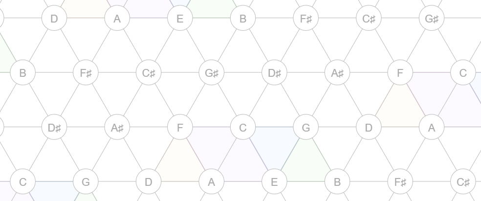

## 2. 수학적 배경

본 절에서는 본 연구의 파이프라인을 이해하기 위해 필요한 수학적 도구들을 정의하고, 각 도구가 음악 구조 분석에서 어떻게 사용되는지를 서술한다. 

### 2.1 Vietoris-Rips Complex

**정의 2.1.** 거리 공간 $(X, d)$와 양의 실수 $\varepsilon > 0$이 주어졌을 때, **Vietoris-Rips complex** $\text{VR}_\varepsilon(X)$는 다음과 같이 정의되는 복합체(simplicial complex)이다:

$$
\text{VR}_\varepsilon(X) = \left\{ \sigma \subseteq X \,\middle|\, \forall x_i, x_j \in \sigma,\ d(x_i, x_j) \le \varepsilon \right\}
$$

즉, 점 집합 $X$의 부분집합 $\sigma$에 속한 **모든 점 쌍 사이의 거리가 $\varepsilon$ 이하**이면 $\sigma$를 심플렉스(simplex)로 포함시킨다.

**구성 요소:**
- 0-simplex (vertex): 각 점 $x_i \in X$. 단일 점은 거리 조건이 없으므로 어떤 $\varepsilon$에서도 포함된다.
- 1-simplex (edge): $d(x_i, x_j) \le \varepsilon$인 두 점의 쌍 $\{x_i, x_j\}$
- 2-simplex (triangle): 세 점이 서로 모두 $\varepsilon$ 이내인 부분집합

**Filtration 구조와 포함관계.** $\varepsilon$ 값을 0부터 연속적으로 키우면, 점 집합 $X$ 자체는 변하지 않은 채 **새로운 심플렉스만 점차 추가된다**. $\varepsilon = 0$일 때 $\text{VR}_0(X)$는 각 점만을 0-simplex로 포함하는 이산적인 점 집합(discrete set)이다 — 아직 어떤 edge도 없으므로 이것은 $X$ 그 자체와 같다. $\varepsilon$이 커지면서 두 점 사이 거리가 $\varepsilon$ 임계를 처음 넘는 순간에 1-simplex(edge)가 추가되고, 세 점이 모두 $\varepsilon$ 이내가 되면 2-simplex(삼각형)가 추가된다. 즉 $\varepsilon_1 < \varepsilon_2$이면 $\text{VR}_{\varepsilon_1}(X)$의 모든 심플렉스가 $\text{VR}_{\varepsilon_2}(X)$에도 그대로 들어 있다. 따라서 다음의 포함관계는 항상 성립한다:

$$
\text{VR}_0(X) \subseteq \text{VR}_{\varepsilon_1}(X) \subseteq \text{VR}_{\varepsilon_2}(X) \subseteq \cdots \subseteq \text{VR}_{\varepsilon_n}(X)
$$


표기 편의를 위해 $K_i := \text{VR}_{\varepsilon_i}(X)$로 두면:

$$
K_0 \subseteq K_1 \subseteq K_2 \subseteq \cdots \subseteq K_n
$$

이를 **filtration**이라 부르며, 변화가 일어나는 임계값 $\varepsilon_i$들이 곧 심플렉스의 birth/death 시점이 된다.

**본 연구에서의 사용:** $X = \{n_1, n_2, \ldots, n_{23}\}$은 hibari에 등장하는 23개의 고유 note이며, $d(n_i, n_j)$는 두 note 간 거리이다. 


---

### 2.2 Simplicial Homology

**정의 2.2.** Simplex complex $K$에 대해 $n$차 호몰로지 군(homology group) $H_n(K)$는 $K$ 안에 존재하는 $n$차원 "구멍"의 대수적 표현이다. 직관적으로:

- $H_0(K)$: 연결 성분(connected components)의 수
- $H_1(K)$: 1차원 cycle의 수 (닫힌 고리 모양으로 둘러싸인 영역)
- $H_2(K)$: 2차원 void의 수 (3차원 공동을 둘러싼 표면)

$\text{rank}(H_n(K))$ = **Betti number** $\beta_n$은 서로 독립적인 $n$차원 구멍의 개수를 나타낸다. 

**Boundary 연산자와 호몰로지 — 선형대수학 계산 예시.** $H_n$이 어떻게 계산되는지를 간단한 예시로 보인다. 점 4개 $\{a, b, c, d\}$와 edge $\{ab, bc, cd, da, ac\}$, 삼각형 $\{abc\}$로 이루어진 복합체 $K$를 생각하자.

boundary 연산자 $\partial_1$ (edge → vertex)과 $\partial_2$ (삼각형 → edge)를 $\mathbb{F}_2$ (mod 2) 위에서 행렬로 표현하면:

```
  ∂₁ (edge → vertex):         ∂₂ (triangle → edge):
       ab bc cd da ac               abc
  a [  1  0  0  1  1 ]         ab [  1 ]
  b [  1  1  0  0  1 ]         bc [  1 ]
  c [  0  1  1  0  0 ]         cd [  0 ]
  d [  0  0  1  1  0 ]         da [  0 ]
                               ac [  1 ]
```

$H_1(K) = \ker(\partial_1) / \text{im}(\partial_2)$이다. $\ker(\partial_1)$은 "닫힌 edge 체인들"의 공간이고, $\text{im}(\partial_2)$는 "삼각형의 경계인 edge 체인들"의 공간이다. 이 예시에서 $\ker(\partial_1)$의 차원은 2 (두 개의 독립적인 닫힌 고리: $ab+bc+ca$와 $ac+cd+da$), $\text{im}(\partial_2)$의 차원은 1 ($abc$의 경계 $= ab+bc+ca$). 따라서 $\beta_1 = 2 - 1 = 1$, 즉 독립적인 cycle이 1개이다. 직관적으로, 삼각형 $abc$가 한 cycle을 "채워서" 없앴고, 남은 사각형 $a-c-d-a$에 해당하는 cycle 1개가 살아남는다.


**본 연구에서의 사용:** 본 연구는 주로 $H_1$ (1차 호몰로지)을 다룬다. 이는 음악 네트워크에서 서로 가까운 note들이 만드는 닫힌 cycle, 즉 순환적으로 연결된 note 그룹을 포착한다. 발견된 각 cycle은 곡의 구조적 반복 단위로 해석된다.

---

### 2.3 Persistent Homology

Filtration $K_0 \subseteq K_1 \subseteq \cdots \subseteq K_n$에서, 각 단계마다 $H_1$의 cycle 구성이 달라진다. **Persistent homology**는 이 과정에서 각 cycle이 어느 $\varepsilon_i$에서 처음 나타나고(**birth**) 어느 $\varepsilon_j$에서 사라지는지(**death**)를 추적한다.

**Birth와 death의 음악적 의미:**
- **Birth** $b$: 거리 임계값 $\varepsilon$가 충분히 커져서 새로운 cycle이 형성되는 순간. 음악적으로는 "이 거리 척도에서 처음으로 닫힌 반복 구조가 발견되는 시점".
- **Death** $d$: 더 큰 $\varepsilon$에서 그 cycle이 다른 cycle들의 합(정확히는 boundary)으로 표현될 수 있게 되어, 호몰로지 군 안에서 더 이상 독립적인 generator가 아니게 되는 순간. 음악적으로는 "거리 척도가 너무 느슨해져서 이 반복 구조가 다른 구조에 흡수되는 시점".

각 cycle은 $(b, d)$ 쌍과, 그 cycle을 구성하는 vertex/edge 집합인 **cycle representative**가 함께 기록된다. 본 연구에서는 birth-death 쌍은 cycle의 "수명"을 측정하는 데, cycle representative는 어떤 note들이 그 cycle을 이루는지 식별하는 데 사용한다. 이 정보를 모은 것이 곡의 **위상적 지문(topological signature)**이다.

**Persistence:** $\text{pers}(\text{cycle}) = d - b$. 큰 persistence를 갖는 cycle은 다양한 거리 척도에서 살아남으므로 **위상적으로 안정한 구조**이며, 작은 persistence는 일시적이거나 노이즈에 가까운 구조이다.

**본 연구에서의 사용:** 거리 행렬 $D \in \mathbb{R}^{23 \times 23}$로부터 Vietoris-Rips filtration을 구성하고, 각 rate parameter $r$ (가중치 비율, 후술)에서의 $H_1$ persistence를 계산한다. 발견된 모든 $(b, d)$ 쌍과 cycle representative가 함께 cycle 집합을 정의하며, 이 cycle들이 다음 절의 중첩행렬 구축에 사용된다.


*그림 2.3. (a)~(e)의 Persistence Barcode에서는 filtration value($\varepsilon$)에 따라 발견되는 simplex를 막대 그래프를 통해 표시한다. 빨간색은 0-simplex(연결성분), 파란색은 1-simplex(cycle)를 표시한다. 마지막 그림에서 Barcode가 Persistence Diagram(x축 : birth, y축 : death)으로 변환된다.*

---

### 2.4 빈도 기반 거리와 음악적 거리 함수

**빈도 기반 거리.** 본 연구의 기준 거리 $d_{\text{freq}}$는 두 note의 인접도(adjacency)의 역수로 정의된다. 인접도 $w(n_i, n_j)$는 곡 안에서 note $n_i$와 $n_j$가 시간적으로 연달아 등장한 횟수이다:

$$
w(n_i, n_j) = \#\!\left\{\,t : n_i\ \mathrm{at\ time}\ t\ \mathrm{and}\ n_j\ \mathrm{at\ time}\ t+1\,\right\}
$$

거리는 $d_{\text{freq}}(n_i, n_j) = 1 / w(n_i, n_j)$로 정의되며 인접도가 0인 경우는 도달 불가능한 큰 값으로 처리한다.

**정의 2.4.** Tonnetz는 pitch class 집합 $\mathbb{Z}/12\mathbb{Z}$를 평면 격자에 배치한 구조이다. 여기서 **pitch class**는 옥타브 차이를 무시한 음의 동치류(equivalence class)로, 예컨대 C4, C5, C3는 모두 같은 pitch class "C"에 속한다. 

**Tonnetz 격자 구조.** pitch class $p \in \mathbb{Z}/12$를 좌표 $(x, y)$에 배치한다. 세 축으로의 이동이 +3, +4, +5에 대응되도록 전개하면 삼각형 하나는 하나의 장3화음(major triad) 또는 단3화음(minor triad)에 대응된다:

{width=95%}

**(1) Tonnetz 거리.** 두 pitch class $p_1, p_2$ 사이의 Tonnetz 거리 $d_T(p_1, p_2)$는 격자 위 경로 길이(hop 수) 중 최소값으로 정의된다:

$$
d_T(p_1, p_2) = \min \left\{ |x_1 - x_2| + |y_1 - y_2| \,\middle|\, (x_i, y_i)\ \mathrm{represents}\ p_i \right\}
$$

**(2) Voice leading distance** (Tymoczko, 2008): 두 pitch class 사이를 이동하기 위해 거쳐야 하는 반음의 개수와 같다.

**(3) DFT distance** (Tymoczko, 2008): 각 pitch class를 12차원 벡터로 표현한 뒤, 이산 푸리에 변환(DFT)으로 다른 공간으로 옮겨서 비교한다.

**복합 거리(Hybrid distance).** 본 연구는 빈도 기반 거리 $d_{\text{freq}}$와 음악적 거리 $d_{\text{music}}$ (Tonnetz, Voice leading, DFT 중 하나)을 선형 결합한다:

$$
d_{\text{hybrid}}(n_i, n_j) = \alpha \cdot d_{\text{freq}}(n_i, n_j) + (1 - \alpha) \cdot d_{\text{music}}(n_i, n_j)
$$

**본 연구에서의 사용:** 거리 함수의 선택은 발견되는 cycle 구조에 직접적으로 영향을 미친다. 빈도 기반 거리만 사용하면 곡의 통계적 특성만 반영되어 화성적·선율적 의미가 있는 구조를 포착하지 못한다. 

**metric 공리와 이론적 정당성.** 네 거리 함수 중 Tonnetz와 voice_leading은 metric 공리를 모두 만족하지만, frequency는 identity와 triangle inequality를, DFT는 identity를 위반한다. 이 의심은 Heo et al. (2025)의 path-representation으로 해소된다. 거리 $d$가 path-representable이라는 것은, 화음들을 꼭짓점으로 하는 그래프와 edge 가중치 $W$가 존재하여
$$d(v, w) = \min_{p:\, v \leadsto w} \sum_{e \in p} W(e)$$
가 성립함을 뜻한다. 이렇게 유도된 $d_W$는 자동으로 pseudometric이며, $d$ 위의 Vietoris-Rips barcode는 $d_W$ 위의 barcode와 일치한다. 따라서 frequency·DFT의 공리 위반은 PH 계산의 정당성을 해치지 않는다.

---

### 2.5 활성화 행렬과 중첩행렬

본 연구에서는 곡의 시간축 위에서 cycle 구조가 어떻게 전개되는지를 두 단계의 행렬로 표현한다. 첫 단계는 **활성화 행렬(activation matrix)**, 두 번째 단계는 그것을 가공한 **중첩행렬(overlap matrix)**이다.

**정의 2.5 (활성화 행렬).** 음악의 시간축 길이를 $T$, 발견된 cycle의 수를 $C$라 하자. 활성화 행렬 $A \in \{0, 1\}^{T \times C}$는 있는 그대로의 활성 정보를 담는다:

$$
A[t, c] = \mathbb{1}\!\left[\,\exists\ n \in V(c)\ \mathrm{such\ that}\ n\ \mathrm{is\ played\ at\ time}\ t\,\right]
$$

여기서 $V(c)$는 cycle $c$의 note 집합이다. 활성화 행렬은 산발적인 단일 시점 활성화까지 모두 포함하므로 노이즈가 많다.

**정의 2.6 (중첩행렬, OM).** $O \in \{0, 1\}^{T \times C}$는 활성화 행렬에서 **연속적이고 충분히 긴 활성 구간만 남긴 것**이다.

$$
O[t, c] = \mathbb{1}\!\left[\,t \in R(c)\,\right], \qquad R(c) = \bigcup_{i} [s_i,\ s_i + L_i]
$$

여기서 $R(c)$는 cycle $c$의 "지속 활성 구간(sustained intervals)"의 합집합이며, 각 구간 $[s_i, s_i + L_i]$는 활성화 행렬 $A[\cdot, c]$에서 길이가 임계값 $\mathrm{scale}_c$ 이상인 연속 1의 구간이다.

**활성화 행렬과 OM의 차이.**
- $A[t, c]$: 시점 $t$에 cycle $c$의 note가 단 한 번이라도 울리면 1. **순간적 활성을 모두 잡음.**
- $O[t, c]$: cycle $c$의 활성이 일정 시간 이상 **지속되는 구간**에서만 1. 산발적 노이즈 제거됨.

예를 들어 $\mathrm{scale}_c = 3$일 때 (3 시점 이상 지속된 활성만 인정), 아래와 같다.

```
   시점:  1  2  3  4  5  6  7  8  9 10 11 12 13 14 15
A[·,c]: 0  1  1  0  1  1  1  1  0  0  1  0  1  1  1
O[·,c]: 0  0  0  0  1  1  1  1  0  0  0  0  1  1  1
```

**연속값 확장.** 본 연구에서는 이진 OM 외에, cycle의 활성 정도를 [0,1] 사이의 실수값으로 표현하는 연속값 버전도 도입하였다:

$$
O_{\text{cont}}[t, c] = \frac{\sum_{n \in V(c)} w(n) \cdot \mathbb{1}\!\left[\,n\ \mathrm{is\ played\ at\ time}\ t\,\right]}{\sum_{n \in V(c)} w(n)}
$$

여기서 $V(c)$는 cycle $c$의 vertex 집합, $w(n) = 1 / N_{\text{cyc}}(n)$은 note $n$의 **희귀도 가중치**이며 $N_{\text{cyc}}(n)$은 note $n$이 등장하는 cycle의 개수이다. 적은 cycle에만 등장하는 note가 활성화되면 더 큰 가중치를 받는다.

**음악적 의미:** 시간이 흐름에 따라 어떤 반복 구조가 켜지고 꺼지는지를 나타내며, 이것을 음악 생성의 seed로 사용한다. 일정 시간 유지되는 cycle만이 곡의 구조적 단위로 의미 있다고 보기 때문이다.

---

### 2.6 Jensen-Shannon Divergence — 생성 품질의 핵심 지표

**JS divergence**는 두 확률 분포가 얼마나 다른지를 측정하는 지표이다. 값의 범위는 $[0, \log 2]$이며, 0이면 두 분포가 동일하다. 값이 낮을수록 두 곡의 음 사용 분포가 유사하다.

**본 연구에서 비교하는 두 가지 분포:**

1. **Pitch 빈도 분포** — "어떤 음들이 얼마나 자주 쓰였는가" (시간 순서 무시)
2. **Transition 빈도 분포** — "어떤 음 다음에 어떤 음이 오는가" (시간 순서 반영)

두 지표를 함께 사용함으로써 "음을 비슷하게 쓰는가"와 "비슷한 순서로 쓰는가"를 별도로 측정할 수 있다. 

---

### 2.7 Cycle Subset 선택

본 연구의 DFT baseline ($\alpha = 0.25$)에서는 발견되는 cycle 수가 $C = 14$로 소규모이므로, greedy subset selection 없이 전체 cycle을 그대로 사용한다 ($K = C = 14$). Greedy forward selection은 Tonnetz 조건(최대 $C = 47 \sim 52$)에서 cycle subset을 선별하기 위해 개발된 도구이며, 발견 cycle 수가 충분히 작은 DFT baseline에서는 적용하지 않는다.

---

### 2.8 Multi-label Binary Cross-Entropy Loss

각 시점에서 동시에 여러 note가 활성화될 수 있으므로, 단일 클래스 예측인 categorical cross-entropy 대신 **multi-label BCE**를 사용한다. 각 note 채널마다 독립적인 binary cross-entropy를 계산하여 "note $i$가 활성인가?"를 개별 이진 문제로 학습한다. 모델 입력은 OM의 한 행 $O[t, :] \in \mathbb{R}^C$이고, 출력은 $N$차원 multi-hot vector이다.

**Adaptive threshold:** 추론 시 고정 임계값 0.5 대신, 원곡의 평균 ON ratio(약 15%)에 맞춰 sigmoid 출력 상위 15%를 활성으로 채택하는 동적 임계값을 사용한다. 이 임계값은 per-cycle이 아니라 **출력행렬 $P \in \mathbb{R}^{T\times N}$ 전체를 기준**으로 계산한다 (§4.2의 OM 임계값 $\tau \in \{0.3, 0.5, 0.7\}$ 실험과는 별개).


---

### 2.9 음악 네트워크 구축과 가중치 분리

**가중치 행렬의 분리 (본 연구의 핵심 설계):**

1. **Intra weights** : 같은 악기(inst) 내에서 연속한 두 note 간 전이 빈도. 각 악기의 **선율적 흐름**을 포착한다.
$$W_{\text{intra}} = W_{\text{intra}}^{(1)} + W_{\text{intra}}^{(2)}$$

2. **Inter weight** : 시차(lag) $\ell$을 두고 inst 1의 note와 inst 2의 note가 인접하여 출현하는 빈도이다. $\ell \in \{1, 2, 3, 4\}$로 변화시키며 다양한 시간 스케일의 **악기 간 상호작용**을 탐색한다. :
$$W_{\text{inter}} = \sum_{\ell = 1}^{4} \lambda_\ell \cdot W_{\text{inter}}^{(\ell)}, \qquad (\lambda_1, \lambda_2, \lambda_3, \lambda_4) = (0.6,\ 0.3,\ 0.08,\ 0.02)$$


**Timeflow weight (선율 중심 탐색):** $r_t \in [0, 1.5]$를 변화시키며 위상구조의 출현·소멸을 추적한다.
$$W_{\text{timeflow}}(r_t) = W_{\text{intra}} + r_t \cdot W_{\text{inter}}$$

**Complex weight (선율-화음 결합 탐색):** $r_c \in [0, 0.5]$로 제한하여 화음보다 선율에 더 큰 비중을 둔다.

$$W_{\text{complex}}(r_c) = W_{\text{timeflow}} + r_c \cdot W_{\text{simul}}$$


*그림 2.9. hibari의 inst 1, 2 배치 구조. inst 1 (위)에선 전체 34마디($T = 1{,}088$ 시점) 중 33마디에서 모듈이 쉬지 않고 연주되며, inst 2 (아래)에선 모듈 사이마다 1시점의 규칙적인 쉼을 두고 연주된다. 이 배치 구조가 가중치 행렬의 intra / inter / simul 분리의 근거가 된다.*

---

### 2.10 확장 수학적 도구 — 거리 보존 재분배와 화성 제약

본 절은 §5의 확장 실험에서 사용되는 도구를 간략히 소개한다. 

- **Consonance score:** 시점별 동시 타건 note 쌍의 dissonance(불협화도) 평균. 곡 $G$에 대해 아래와 같이 정의된다 : 
  
  $$\text{cons\_score}(G) = \frac{1}{T} \sum_{t=1}^{T} \text{diss}(\text{chord}_t(G))$$ 

- **Markov chain 시간 재배치:** 원본 OM $O \in \{0,1\}^{T \times K}$의 각 행을 state(multi-hot cycle 활성 벡터)로 보고, 시점 $t-1 \to t$ 전이 빈도로 전이확률 $P(s_t \mid s_{t-1})$를 추정한 뒤, 온도 $\tau$로 재샘플링하여 새로운 OM 시퀀스를 생성하는 기법. OM 자체는 학습 대상이 아니라 음악 생성 시 입력이며, Markov는 그 OM의 *시간 전개 패턴*을 추정·변형한다.

- **Scale match:** 생성물 $G$에 등장한 고유 pitch class 집합을 만든 뒤, 36개 표준 scale — 12개 major + 12개 minor + 12개 pentatonic (각 root별 1개) — 과 하나씩 비교해 가장 많이 겹치는 scale을 선택하고, 그 best-match scale과의 일치율을 반환한다 ($\in [0, 1]$). 즉 분자는 best scale에 속한 $G$의 pitch class 개수, 분모는 $G$의 전체 고유 pitch class 개수. 

---
