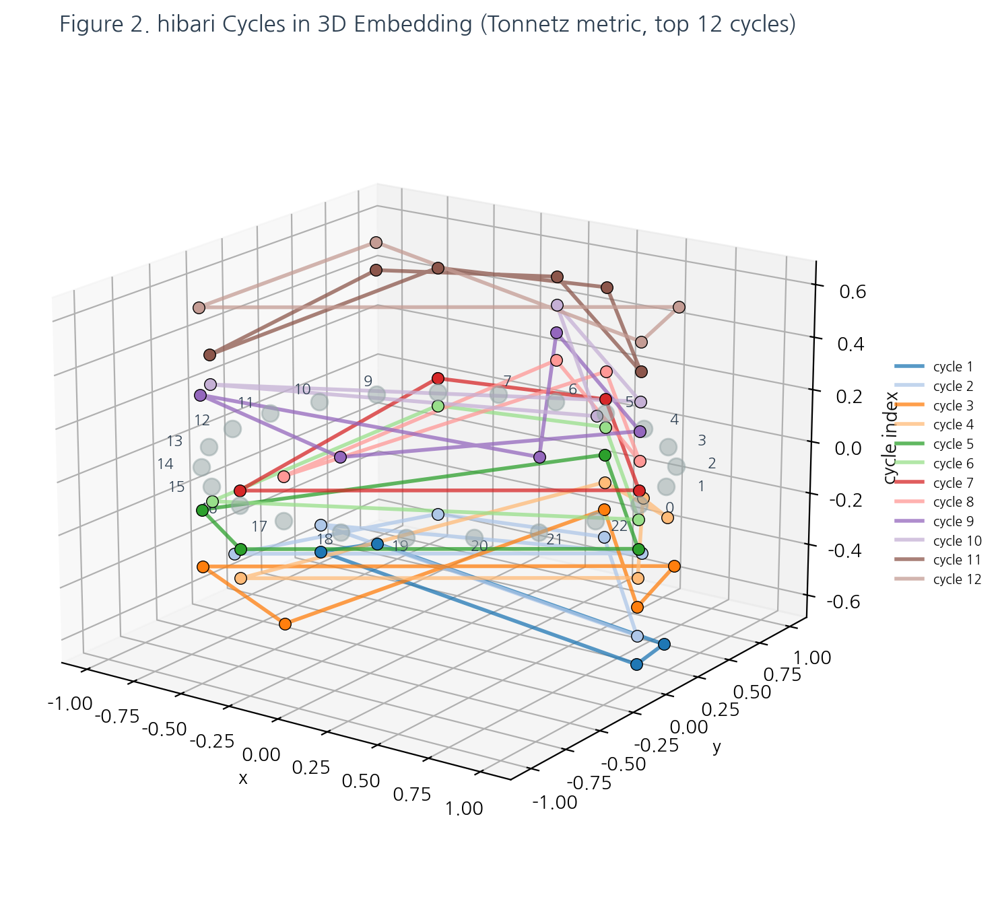

# 위상수학적 음악 분석 — Step 4

## 시각자료 (Figures)

본 장은 논문 본문에 삽입될 6개의 figure를 모아서 제시한다. 각 figure는 `docs/figures/` 폴더 아래의 별도 스크립트로 재현 가능하며, 모든 출력 PNG는 같은 폴더에 저장되어 있다.

| # | 파일 | 생성 스크립트 | 역할 |
|---|---|---|---|
| 1 | `fig1_pipeline.png` | `make_fig1_pipeline.py` | 4-stage 파이프라인 흐름도 |
| 2 | `fig2_cycle3d.png` | `make_fig2_cycle3d.py` | 발견된 cycle의 3D 임베딩 |
| 3 | `fig3_tonnetz_hibari.png` | `make_fig3_tonnetz_hibari.py` | Tonnetz 격자에 hibari 음 배치 |
| 4 | `fig4_barcode.png` | `make_fig4_barcode.py` | Persistence barcode 다이어그램 |
| 5 | `fig5_pianoroll.png` | `make_fig5_pianoroll.py` | 원곡 vs 생성곡 piano roll 비교 |
| 6 | `fig6_js_curve.png` | `make_fig6_js_curve.py` | 학습 epoch별 JS divergence 곡선 |

---

### Figure 1 — TDA Music Pipeline: 4-Stage Flow


__캡션.__ 본 연구의 파이프라인은 네 개의 순차적 stage로 구성된다. Stage 1은 MIDI 원본을 8분음표 단위로 양자화하고 두 악기를 분리한 뒤 note / chord 레이블링을 수행한다. Stage 2는 가중치 행렬을 구축하고 refine 과정을 거쳐 거리 행렬을 만들어 Vietoris-Rips 복합체로부터 persistent homology를 계산한다. Stage 3은 발견된 cycle들의 활성화 정보를 이진 중첩행렬 $O \in \{0,1\}^{T \times K}$로 변환한다. Stage 4는 이 중첩행렬을 seed로 하여 Algorithm 1 (확률적 샘플링) 또는 Algorithm 2 (신경망)로 음악을 생성한다.

---

### Figure 2 — hibari Cycles in 3D Embedding



__캡션.__ Tonnetz 거리 함수로부터 발견된 46개의 H$_1$ cycle 중 상위 12개를 3D 공간에 표시한 것이다. 각 note를 외곽 원(circular layout)에 배치하고, 한 cycle에 속하는 note들을 해당 cycle 고유의 색으로 연결하여 닫힌 polygon으로 그렸다. cycle index($z$축)는 시각적 분리를 위한 offset이다. 서로 다른 cycle이 많은 note를 공유하고 있음을 한눈에 볼 수 있다.

---

### Figure 3 — Tonnetz 격자 위 hibari의 pitch class


__캡션.__ 12개의 pitch class가 배치된 Tonnetz 격자(가로: 완전 5도, 대각선: 장/단 3도) 위에서 hibari가 실제로 사용하는 7개 pitch class (C, D, E, F, G, A, B — C major scale)를 진한 파랑으로 강조하였다. 각 음의 크기는 곡 내 출현 빈도에 비례하며, 빨간 선은 사용된 pitch class 쌍 중 Tonnetz 그래프에서 직접 인접한 관계이다. 사용된 음들이 격자 상에서 연결 성분을 이루며 집중되어 있음을 확인할 수 있다.

---

### Figure 4 — Persistence Barcode Diagram


__캡션.__ hibari의 H$_1$ cycle 중 상위 30개에 대한 persistence barcode이다. 가로축은 rate parameter $r_t$ (filtration scale), 각 막대는 한 cycle의 $[\mathrm{birth}, \mathrm{death}]$ 구간을 나타낸다. 색은 lifespan(death − birth)에 비례하며, 별표(★)는 lifespan이 긴 상위 3개 cycle이다. 긴 막대는 rate 변화에 강건한, 즉 "구조적으로 중요한" cycle을 의미한다 (2.3절 Elder rule).

---

### Figure 5 — Piano Roll 비교


__캡션.__ 위에서부터 순서대로 (a) 원곡 악기 1, (b) 원곡 악기 2, (c) Algorithm 1 + Tonnetz (K=46, seed=42)로 생성된 곡의 piano roll 표현이다. 가로축은 시간(8분음표 단위), 세로축은 MIDI pitch이다. 생성곡은 두 악기의 내용을 하나의 트랙으로 합쳐 표시한 것이며, pitch 분포와 시간적 밀도가 원곡과 유사한 영역에서 활성화되고 있음을 확인할 수 있다 (3.1절 JS divergence 지표와 일관).

---

### Figure 6 — 학습 Epoch별 JS Divergence 곡선


__캡션.__ FC / LSTM / Transformer 세 모델을 동일한 데이터(Tonnetz overlap)와 동일 seed에서 $60$ epoch 학습시키면서, 매 $5$ epoch마다 생성곡을 만들어 원곡과의 pitch JS divergence를 측정한 결과이다. 수평 점선은 이론적 최댓값 $\log 2 \approx 0.693$을 나타낸다. FC 모델이 가장 빠르게 낮은 JS에 수렴하며, 시퀀스 모델은 더 높은 plateau에 머무는 경향을 보인다 — 이는 3.4절 해석 8("hibari는 *out of noise* 앨범의 곡으로서 시간 문맥보다 음의 배치가 핵심")과 일관된 관찰이다.

---

## 재현 방법

```bash
cd tda_pipeline/docs/figures
python make_fig1_pipeline.py        # 즉시
python make_fig2_cycle3d.py         # cache/metric_tonnetz.pkl 필요
python make_fig3_tonnetz_hibari.py  # 즉시
python make_fig4_barcode.py         # pickle/h1_rBD_*.pkl 필요
python make_fig5_pianoroll.py       # 파이프라인 + cache 필요 (~5s)
python make_fig6_js_curve.py        # 모델 학습 수행 (~2-3 min)
```

모든 figure는 200 dpi PNG로 저장되며, 한글 폰트는 `_fontsetup.py`에서 NanumGothic을 자동 등록한다.
