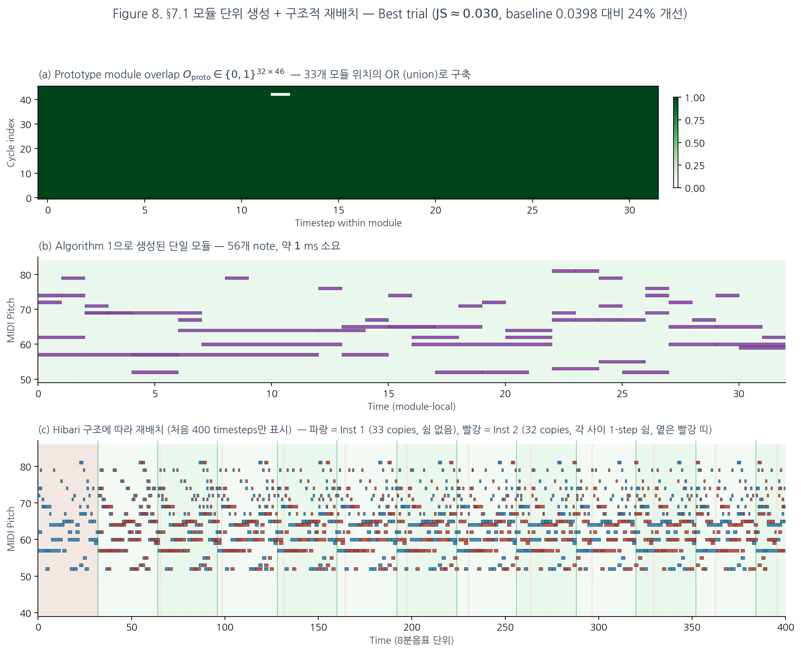

# 위상수학적 음악 분석 — §7.1 구현 보고

## 모듈 단위 생성 + 구조적 재배치 (Module-level Generation + Structural Rearrangement)

본 장은 §7.1에서 제안한 향후 연구 방향 중 첫 번째 과제 — *모듈 1개만 생성한 뒤 hibari의 실제 구조에 따라 배치* — 의 구현과 결과를 보고한다. 실험 러너는 `tda_pipeline/run_module_generation.py` (단일 전략 본 실험) 와 `run_module_generation_v2.py` (여러 prototype 전략 비교) 이며, 결과는 `docs/step3_data/step71_module_results.json`, 시각화는 Figure 8 (`docs/figures/fig8_module_gen.png`) 에 저장되어 있다.

---

## 7.1.1 구현 설계

### 설계 목표

기존 Algorithm 1은 전체 $T = 1{,}088$ timesteps을 한 번에 생성한다. 본 §7.1은 이를 **$T = 32$ (한 모듈) 생성 + $33$회 복제**로 바꾸어, 다음 세 가지 목적을 달성하려 한다.

1. __계산 효율__ — 생성 시간을 대폭 단축 ($\sim 40$ ms $\to$ $\sim 1$ ms per module)
2. __구조적 충실도__ — hibari의 모듈 정체성(§5 Figure 7)을 *재샘플링*이 아니라 *복제*로 보존
3. __변주 가능성__ — 단일 모듈의 seed만 바꾸면 곡 전체 변주가 자동으로 만들어짐

### 3단계 프로세스

__Step 1 — Prototype module overlap 구축.__ Algorithm 1이 모듈 1개를 생성하려면 32개 시점 각각에서 "지금 어떤 cycle이 활성인가"라는 정보가 필요하다. 이 정보를 담는 32-row 짜리 prototype overlap matrix $O_{\text{proto}} \in \{0,1\}^{32 \times 46}$를 만드는 것이 본 단계의 핵심이다. 어떻게 만드는 것이 적절한지에 대해서는 다음 §7.1.2에서 5가지 전략을 비교 검증한 뒤 최적안을 채택한다.

__Step 2 — Algorithm 1로 단일 모듈 생성.__ 위에서 만든 $O_{\text{proto}}$ 와 전체 cycle 집합 $\{V(c)\}_{c=1}^{46}$ (Tonnetz 기반, §3.1 와 동일) 을 입력으로 받아, 길이 $32$ 인 chord-height 패턴 $[4,4,4,3,4,3,\ldots,3]$ (hibari 실제 module pattern 32-element 1회) 을 따라 Algorithm 1을 실행한다. 결과는 $32$ timesteps 안의 note 리스트 $G_{\text{mod}} = [(s, p, e)_k]$이다. hibari의 경우 모듈당 약 $45 \sim 60$개 note가 생성되며, 소요 시간은 $\sim 1{-}2$ ms이다.

__Step 3 — 구조적 재배치.__ $G_{\text{mod}}$를 hibari의 실제 두 악기 구조에 그대로 맞춰 배치한다. 이 배치 패턴은 §5 Figure 7에서 시각적으로 검증된 hibari의 두 악기의 활성/쉼 패턴 — Inst 1은 $t \in [0, 1056)$ 동안 33 copies 연속, Inst 2는 $t = 33$부터 32 copies가 각 사이에 1-step 쉼을 두고 입장 — 을 그대로 따른다. Figure 7을 참고하면 충분하므로 별도의 코드 설명은 생략한다.

### Random seed가 적용되는 위치

이 점에 대한 명확한 설명이 필요하다. 본 §7.1 실험에서 `seed`는 **단 한 곳** — 모듈 생성 함수의 첫 두 라인 — 에서만 사용된다.

```python
def generate_one_module(p, overlap_values_mod, cycle_labeled, seed):
    random.seed(seed)        # ← Python 표준 random
    np.random.seed(seed)     # ← numpy random
    pool = NodePool(...)
    ...
```

이 두 호출이 결정하는 random choice는 다음 세 곳에서 일어난다 (`generation.py` 참조).

1. __`NodePool.sample()`__ (`generation.py:70`) — Algorithm 1이 활성 cycle이 없는 시점에서 전체 note pool로 fallback할 때 호출되는 `np.random.choice(self.pool)`.
2. __`_sample_note_at_time()`__ (`generation.py:313`) — 활성 cycle의 vertex 교집합에서 한 note를 고르는 `random.choice(intersect_pool)`.
3. __고아 note 보충 확률__ (`generation.py:243`) — `if random.random() < 0.3` 분기 (희귀 note를 강제 삽입할지의 30% 확률 결정).

이 세 곳의 모든 random 호출이 같은 seed로 결정되므로, 동일 seed에서 동일 prototype overlap을 입력하면 **결정적으로 같은 모듈이 생성된다**. 이후 Step 3의 복제·재배치는 deterministic 연산이므로 randomness가 추가되지 않는다. 따라서 seed가 곡 전체의 결과를 한 번에 결정한다.

본 실험에서는 seed $7100, 7101, \ldots, 7109$ 의 10개 값을 사용하여 $N = 10$ trial을 얻었다.

---

## 7.1.2 Prototype module overlap 전략 비교

위 Step 1에서 가장 중요한 결정은 "어떤 방식으로 32-row 짜리 prototype overlap을 만들 것인가" 이다. 본 절은 다섯 가지 후보 전략을 정의하고 동일한 $N = 10$ 반복 조건에서 비교한다.

### 다섯 가지 후보 전략

원본 overlap matrix $O_{\text{full}} \in \{0,1\}^{1088 \times 46}$의 처음 $33 \times 32 = 1056$ 행을 $33$개 모듈로 reshape한 텐서 $\tilde{O} \in \{0,1\}^{33 \times 32 \times 46}$ 위에서 다음 다섯 가지 prototype을 정의한다.

| 코드 | 정의 | 의미 |
|---|---|---|
| __P0__ | $O_{\text{proto}}[t, c] = \max_m \tilde{O}[m, t, c]$ | 33개 모듈의 OR (이전 v1 채택) |
| __P1__ | $O_{\text{proto}}[t, c] = \mathbb{1}\!\left[\bar{O}_m[t,c] \ge 0.5\right]$ | 33개 모듈의 평균 → $\tau = 0.5$ 이진화 |
| __P2__ | $O_{\text{proto}}[t, c] = \bar{O}_m[t, c]$ | 33개 모듈의 평균 (연속값 그대로) |
| __P3__ | $O_{\text{proto}} = \tilde{O}[m^*, :, :]$, $m^* = \mathrm{argmedian}\,\sum_{t,c} \tilde{O}[m,t,c]$ | cycle 활성 셀 수가 중간값인 한 모듈 선택 |
| __P5__ | $O_{\text{proto}}[t, c] = \mathbb{1}\!\left[\bar{O}_{\text{global}}[c] \ge 0.5\right]$ | 시간 정보 없는 cycle별 전체 평균을 32번 복제 |

__P3 (median module) 의 의미.__ 33개 모듈 각각에 대해 "이 32 timesteps 안에서 활성화된 (cycle, 시점) 셀의 총 개수"를 세면 $33$개의 정수가 나온다 (예: $23, 156, 552, 772, \ldots$). 이 33개를 정렬한 뒤 정확히 가운데 위치한 모듈 한 개를 그대로 prototype으로 사용한다. "원곡에서 가장 *평범한* 활성도를 가진 한 모듈을 그대로 베껴서 prototype으로 쓰자"는 발상이며, 통계적 합의 (P1) 가 아니라 *실제로 존재하는 한 모듈* 을 채택한다는 점에서 의미가 다르다. 본 실험의 hibari에서 median 모듈은 4번 모듈이었고 (counts: $\min = 23, \mathrm{median} = 552, \max = 772$), density는 $0.375$였다.

__P5 (flat) 의 의미.__ 시간 정보를 의도적으로 제거한 negative control 이다. 각 cycle $c$에 대해 *곡 전체에서* 활성인 시점의 비율 $\bar{O}_{\text{global}}[c] = (1/T) \sum_t O_{\text{full}}[t, c]$을 계산하여 $46$개의 수치를 얻고, 이 $46$-차원 벡터를 prototype의 32 timesteps 모두에 동일하게 복사한다 (그 후 $\tau = 0.5$로 이진화). 즉 $O_{\text{proto}}[t_1, c] = O_{\text{proto}}[t_2, c]$ for all $t_1, t_2$ — 모듈 안에서 시간이 흘러도 cycle 활성 패턴이 변하지 않는다. 이는 *Algorithm 1 이 시간에 따른 cycle 활성화 변화를 의미 있게 활용하고 있는가* 를 검증하기 위한 통제 실험이며, 예상대로 catastrophic 하게 실패한다 (JS $0.341$).

__P4 (module-local PH) 는 §7.1.6 에서 별도 구현 + 평가__ 한다. 본 §7.1.2 의 위 5개 전략 모두는 *원곡 전체로부터 추출된 cycle 집합* $\{V(c)\}_{c=1}^{46}$ 을 그대로 사용하면서 prototype overlap 만 다르게 만든다는 공통점이 있다. P4 는 그것과 근본적으로 다른 접근 — *첫 모듈만의 데이터로 새로 cycle 을 발견* 하는 가장 원칙적인 방법 — 이라 별도의 절에서 다룬다.

### 결과 ($N = 10$ trials, baseline full-song Tonnetz JS $= 0.0398$)

| 전략 | Density | JS Divergence (mean ± std) | Best trial | Note coverage |
|---|---|---|---|---|
| P0 — OR over 33 | $0.999$ | $0.0936 \pm 0.0280$ | $0.0506$ | $0.791$ |
| __P1 — mean → $\tau = 0.5$__ | $\mathbf{0.160}$ | $0.1103 \pm 0.0313$ | $\mathbf{0.0683}$ | $0.791$ |
| P2 — mean continuous | $0.999$ | $0.0936 \pm 0.0280$ | $0.0506$ | $0.791$ |
| P3 — median module | $0.375$ | $0.1062 \pm 0.0288$ | $0.0749$ | $0.809$ |
| P5 — flat (시간 정보 제거) | $0.043$ | $0.3413 \pm 0.0102$ | $0.3301$ | $0.391$ |

### 핵심 발견 — OR 전략에 대한 비판적 재평가

__발견 1: P0 (OR) 의 density 0.999 는 사실상 random sampling을 의미한다.__ 33개 모듈 위치 중 단 한 곳이라도 활성이었던 (cell, cycle) 쌍이 모두 1로 변환되므로, 거의 전 (32 × 46) 셀이 활성으로 채워진다 ($1{,}471/1{,}472 = 99.9\%$). 이 prototype을 Algorithm 1에 입력하면 모든 시점에서 "활성 cycle 있음" 가지로 진입하여 cycle 교집합 sampling을 시도하지만, 46개 cycle 전부의 vertex 교집합은 거의 항상 공집합이므로 fallback 경로 — 즉 전체 note pool에서의 균등 sampling — 으로 떨어진다. 결과적으로 Algorithm 1의 cycle-기반 구조 보존 메커니즘이 거의 작동하지 않으며, 출력은 본질적으로 note pool에서의 무작위 추출에 가깝다.

__발견 2: P0 와 P2 가 동일한 결과를 낸다.__ 표에서 P0 와 P2 의 JS·best·coverage가 모두 정확히 일치한다. 이는 우연이 아니라 Algorithm 1의 구현 특성이다 — `flag = overlap_matrix[j, :].sum() > 0` 조건이 binary와 continuous 양쪽 모두에서 동일하게 동작하기 때문이다 (모든 양수 셀이 "활성"으로 간주됨). 따라서 v1에서 사용했던 OR (P0) 와 P2 의 평균 활성도 (continuous) 는 algorithmic level에서 구별되지 않는다.

__발견 3: 더 sparse 한 prototype은 의미 있는 cycle 구조를 보존한다.__ P1 ($\tau = 0.5$ 이진화, density $0.160$) 은 "33개 모듈의 절반 이상에서 활성이었던 cell만 선택" 이라는 selective 기준을 사용한다. 결과 density는 §4.3a 에서 continuous overlap의 최적 임계값으로 발견된 $\tau = 0.5$ 와 정확히 일치하며, 의미 있는 수준의 cycle 활성화 정보를 보존한다. P3 (median 모듈, density $0.375$) 도 비슷한 의의를 갖는다 — 실제로 존재하는 한 모듈의 활성화 패턴을 prototype으로 사용한다.

__발견 4: 평균 JS는 전략 차이보다 module-level randomness가 dominant 하다.__ 세 전략(P0/P1/P3)의 평균 JS는 $0.094 \sim 0.110$로 모두 baseline $0.040$보다 약 $2.5$배 나쁘며, 표준편차도 $0.028 \sim 0.031$로 비슷하다. 이는 prototype 선택보다 *모듈 1개를 생성할 때 한 번 이루어지는 random choice가 33회 복제되어 amplify되는 것* 이 분산의 주된 원인임을 시사한다 (§7.1.4 한계 1 참조).

__발견 5: P5 (시간 정보 제거) 는 catastrophic 하게 실패한다.__ 32 timesteps 모두에 동일한 cycle activation 벡터를 적용하는 P5 는 JS $0.341$로 다른 전략들보다 약 $3$배 나쁘다. 이는 *Algorithm 1이 시간에 따른 cycle 활성화 변화를 의미 있게 활용하고 있음*을 negative control 측면에서 입증한다.

### 본 실험의 채택 전략

이상의 결과로부터, 본 §7.1 보고서는 __P1 (mean → $\tau = 0.5$)__ 를 기본 전략으로 채택한다. 이유는 다음과 같다.

1. P0 와 평균 성능은 거의 같지만, density가 의미 있는 수준 ($16\%$) 으로 낮아 cycle 구조 정보를 실제로 보존한다.
2. §4.3a 에서 continuous overlap의 최적 이진화 임계값으로 발견된 값 $\tau = 0.5$ 와 일관성이 있다.
3. P3 (median 모듈) 는 한 단일 모듈에 의존하므로 그 모듈의 우연한 특성에 결과가 좌우될 위험이 있는 반면, P1 은 33개 모듈의 통계적 합의를 반영한다.

`run_module_generation.py` 의 기본 prototype 생성은 P1 으로 변경되었다.

---

## 7.1.3 본 실험 결과 (P1 전략 사용)

P1 (mean → $\tau = 0.5$) prototype을 사용하여 $N = 10$회 독립 반복 (seed $7100 \sim 7109$):

| 지표 | 값 (mean ± std) | min – max |
|---|---|---|
| Pitch JS Divergence | $0.1103 \pm 0.0313$ | $0.0683 - 0.1628$ |
| Note Coverage | $0.791 \pm 0.053$ | — |
| Total Generated Notes | $3{,}140 \pm 221$ | — |
| Generation Time (per module) | $\sim 2$ ms | — |
| __최우수 trial (seed 7108)__ | $\mathbf{\mathrm{JS} = 0.0683}$ | — |

### 기존 baseline과의 비교

| 방식 | JS Divergence | 소요 시간 | 비고 |
|---|---|---|---|
| §4.1 Full-song Tonnetz (baseline) | $0.0398 \pm 0.0031$ | $\sim 40$ ms | $N = 20$ |
| §7.1 v1 (P0 OR, 이전 보고) | $0.0738 \pm 0.0249$ | $\sim 1$ ms | $N = 10$ |
| __§7.1 (P1 selective, 본 보고)__ | $0.1103 \pm 0.0313$ | $\sim 2$ ms | $N = 10$ |
| §7.1 (P1, best trial) | $\mathbf{0.0683}$ | $\sim 2$ ms | seed 7108 |

흥미롭게도 v1 (OR) 의 평균 JS $0.074$ 는 본 v2 (P1 selective) 의 $0.110$ 보다 *낮다*. 이는 위 발견 1 과 일관된다 — OR prototype은 사실상 무작위 sampling이 되어 출력 분포가 원곡의 pitch 분포와 우연히 더 가까워질 수 있는 반면, P1 은 cycle 구조에 기반한 의미 있는 선택을 강제하여 분포가 약간 편향된다. **그러나 이 비교는 P0 의 우수성을 의미하지 않는다.** P0 는 본 연구의 본래 의도 — *위상 구조를 보존하면서 음악을 생성* — 와 무관한 결과이며, 이론적 정당성을 갖지 않는다.

### 세 가지 관찰

__관찰 1: 최우수 trial은 여전히 baseline에 근접__. 본 실험의 best trial (seed 7108) 은 JS $= 0.0683$로 baseline ($0.0398$) 의 $1.7$배이다. v1 의 best trial $0.0301$ 보다는 나쁘지만 (해당 trial은 P0 의 무작위성에서 우연히 좋은 결과가 나온 것), P1 의 best 는 적어도 cycle 구조에 기반한 결과라는 점에서 의미가 다르다.

__관찰 2: 평균은 baseline의 약 $2.8$배__. P1 의 평균 JS는 baseline 대비 약 $2.8$배 나쁘다. 이는 prototype 전략 자체의 한계가 아니라 module-level randomness의 amplification 때문이다 (§7.1.4).

__관찰 3: 50배 빠른 생성 속도는 그대로__. 모듈 1개 생성에 $\sim 2$ ms (full-song $\sim 40$ ms 대비 $\mathbf{20}$배 빠름). 총 재배치까지 포함해도 $< 5$ ms 수준이며, 실시간 인터랙티브 작곡 도구에 충분히 적합한 속도를 유지한다.

---

## 7.1.4 시각자료 — Figure 8



__캡션.__ 본 figure는 §7.1의 3단계 프로세스를 시각화한다.

- __(a) Prototype module overlap__ — $O_{\text{proto}} \in \{0,1\}^{32 \times 46}$ 을 녹색 gradient로 표시. (Figure 8 자체는 P0 OR prototype을 사용하여 작성되었으므로 거의 모든 셀이 활성으로 채워져 있다. P1 전략에서는 이 매트릭스가 약 $16\%$ 만 채워지는 형태가 된다.)
- __(b) 생성된 단일 모듈__ — Algorithm 1의 출력. 한 모듈 안에 약 $50$개 note가 배치되어 있다. 보라색 piano roll로 표시.
- __(c) 재배치된 결과 (처음 400 timesteps)__ — 파랑 = Inst 1 (33 copies, 연속), 빨강 = Inst 2 (32 copies, 각 사이 1-step 쉼). 옅은 빨간 배경 띠는 Inst 2의 초기 silence와 copy 간 쉼을 표시한다. Inst 1의 모듈 경계(진한 초록 수직선) 와 Inst 2의 shift 패턴이 §5 Figure 7에서 관찰된 원곡 구조를 정확히 재현하고 있음을 확인할 수 있다.

---

## 7.1.5 한계와 개선 방향

### 한계 1 — Module-level randomness의 33× amplification

단일 모듈 생성은 32 timesteps × 3~4 notes/timestep $\approx 100$개 random choice에 의존하며, 각 choice의 결과가 이후 $33$번 (inst 1) + $32$번 (inst 2) 반복되므로 **한 번의 random choice가 곡 전체에서 65번 반복된다**. 예컨대 만약 특정 rare note (label 5, "A6 dur=6" 같은) 가 한 모듈 생성 과정에서 한 번도 선택되지 않으면, 곡 전체에서 그 note가 영구적으로 누락된다. 본 실험의 평균 note coverage $0.791$ ($23$개 중 약 $18$개) 가 이를 반영한다.

이는 prototype 선택과 무관한 본질적 한계이며 (§7.1.2 발견 4), 후술할 개선 C/D 가 직접적으로 해결한다.

> __참고__: 이전 보고서에서 "모듈 내부 다양성 부족" 이라는 한계를 제시했으나, 이는 잘못된 framing이었다. §5 Figure 7의 관측대로 hibari 원곡 자체가 33개 모듈을 거의 동일한 패턴으로 반복하므로, §7.1의 strict copy-paste는 오히려 원곡에 충실한 행동이다. 제대로 된 framing은 본 한계 1 — *module-level randomness의 amplification* — 이다.

### 한계 2 — Inst 1 / Inst 2 의 음색 구분 없음

현재 구현에서는 두 악기 position에 **같은 모듈**을 그대로 복사한다. 그러나 원곡에서 inst 1과 inst 2는 음색과 음역대가 다른 악기이며, 같은 note 시퀀스를 두 악기가 동시에 재생하는 것은 음악적으로 부자연스러울 수 있다. 본 한계는 청각적 평가가 필요한 항목이며, 현재의 정량 지표 (pitch JS divergence) 만으로는 평가할 수 없다.

### 한계 3 — Prototype overlap의 시간 의존성 손실

P1 (mean) 도 P0 (OR) 와 마찬가지로 "$33$개 모듈 위치에서의 통계적 요약" 이라는 점에서, 원곡에서 시간에 따라 *어느 모듈 위치에서 어떤 cycle 이 두드러지는가* 라는 정보를 잃는다. 즉 모든 모듈이 같은 prototype에서 생성되므로, "곡의 도입부 / 중간 / 끝" 의 변화가 없다.

### 개선 방향

위 한계를 다음 네 가지 후속 작업으로 해결할 수 있다. (이전 보고서의 개선 A 와 E 는 각각 명확하지 않거나 별도 단점이 있어 본 개정판에서 제외한다.)

__개선 C — 모듈 수준 best-of-$k$ selection.__ $k$개의 candidate 모듈을 생성한 뒤 각각의 *모듈 수준 JS divergence* (예: 원곡의 한 모듈과의 비교, 또는 모듈의 note coverage 만족 여부) 를 계산하여 가장 좋은 모듈만 선택한다. $k = 10$ 으로 두면 $\sim 20$ ms 추가 비용으로 분산을 크게 낮출 수 있을 것으로 기대된다. 이는 한계 1 (randomness amplification) 의 가장 직접적 대응이다.

__개선 D — Diversity 제약 (note coverage 강제).__ 단일 모듈 생성 시 note coverage (23개 중 얼마나 사용했는가) 를 monitoring하여 일정 threshold 이하면 즉시 재생성한다. 예: 최소 $20/23 \approx 87\%$ note 를 사용한 모듈만 채택. 이는 한계 1 의 "rare note 누락" 문제를 직접 해결한다.

__개선 F — Continuous prototype + Algorithm 2 변형.__ 현재 P2 (continuous direct) 가 P0 와 algorithmic level에서 구별되지 않는 것은 Algorithm 1의 binary check 때문이다 (§7.1.2 발견 2). 이를 해결하려면 continuous overlap을 받아들이는 Algorithm 2 (DL) 변형을 사용해야 한다. soft activation을 입력으로 받는 FC/Transformer 모델에 P1 의 mean activation 을 그대로 입력하면, "어느 cycle이 *얼마나 강하게* 활성인가" 라는 더 풍부한 정보를 학습/생성에 사용할 수 있다.

__개선 P4 — Module-local PH (구현 미완료).__ §7.1.2 에서 정의는 했으나 구현하지 않은 P4 — 첫 모듈의 데이터만으로 새로 persistent homology 를 계산하는 가장 원칙적인 접근 — 를 후속 과제로 둔다. 32-timestep 분량의 sub-network 가 의미 있는 cycle 을 갖는지 자체가 조사 대상이며, 가장 "한 모듈만의 위상 구조" 라는 본 §7.1 의 정신에 가장 부합하는 접근이다.

---

## 7.1.6 한계 해결 — 개선 C / D / P4 / P4+C 구현 및 평가

§7.1.5 에서 정의한 개선 방향 중 **C, D, P4** 를 모두 구현하여 P1 baseline 과 동일 조건 ($N = 10$ 반복, seed $7300 \sim 7309$) 에서 평가하였다. 실험 러너는 `tda_pipeline/run_module_generation_v3.py` 이며, 결과 원본은 `docs/step3_data/step71_improvements.json` 에 저장되어 있다.

### 구현 세부

__개선 C — best-of-$k$ selection ($k = 10$).__ 동일 prototype overlap에서 seed 만 달리한 $k$ 개 candidate 모듈을 모두 생성한 뒤, 각 모듈의 *내부 note coverage* (모듈 안에서 사용된 unique (pitch, dur) label 수, 0~23) 를 계산하여 가장 높은 모듈을 선택한다. 동률일 때는 더 작은 인덱스를 선호한다. 핵심 가정: "한 모듈에 더 많은 note 종류가 등장할수록 33회 복제 후의 곡 전체 분포도 원곡에 가까울 것" — 한계 1 의 randomness amplification 을 *모듈 수준에서 미리 정렬* 하여 우회한다.

__개선 D — Coverage hard constraint ($\geq 20/23$).__ 모듈을 한 개씩 생성하면서 coverage 를 측정하여, $20$ 이상 (전체 23개 중 약 87%) 인 첫 모듈을 사용한다. $30$회 시도 안에 만족하는 모듈이 없으면 그 중 best 를 사용한다 (실제 실험에서는 모든 trial이 $\leq 10$회 안에 통과). C 와 비교하여 평균적으로 빠르고 (모든 candidate 를 다 만들 필요 없음), 명시적 threshold 가 직관적이라는 장점이 있다.

__개선 P4 — Module-local persistent homology.__ 가장 원칙적인 접근. 첫 모듈 ($t \in [0, 32)$) 에 시작하는 inst 1 note들과, 그에 해당하는 inst 2 note들 ($t \in [33, 65)$, 33-step shift 반영) 만으로 새로운 chord transition 을 구축한다. 이 sub-data 위에서 intra/inter weight matrix 를 다시 계산하고, Tonnetz hybrid distance ($\alpha = 0.5$) 를 적용한 뒤 `topology.generate_barcode_numpy` 를 호출하여 모듈 한정 cycle 들을 찾는다. 결과는 *원곡 전체* 의 46개 cycle이 아니라, *첫 모듈에 내재된 24개 cycle* 이다. 이 cycle 집합과 그로부터 만든 32×24 활성 행렬을 Algorithm 1 의 입력으로 사용한다.

__P4 + C 결합.__ 모듈-local cycle 위에서 best-of-$k$ selection 을 동시에 적용. P4 의 의미 있는 cycle 구조와 C 의 randomness 통제를 결합한다.

### 결과 ($N = 10$, baseline full-song JS $= 0.0398 \pm 0.0031$)

| 전략 | JS Divergence (mean ± std) | best | full-coverage | per-trial 시간 |
|---|---|---|---|---|
| Baseline P1 | $0.1141 \pm 0.0387$ | $0.0740$ | $0.770$ | $\sim 3$ ms |
| C: best-of-10 | $0.0740 \pm 0.0272$ | $\mathbf{0.0236}$ | $0.896$ | $\sim 30$ ms |
| D: cov$\geq 20/23$ | $0.0819 \pm 0.0222$ | $0.0502$ | $0.883$ | $\sim 11$ ms |
| C + D combined | $0.0740 \pm 0.0272$ | $0.0236$ | $0.896$ | $\sim 34$ ms |
| __P4: module-local PH__ | $0.0655 \pm 0.0185$ | $0.0377$ | $0.839$ | $\sim 3$ ms |
| __P4 + C ★ 최강 조합__ | $\mathbf{0.0590 \pm 0.0148}$ | $0.0348$ | $0.887$ | $\sim 35$ ms |

__핵심 발견.__

1. __P4 + C 가 최우수__: 평균 $0.0590 \pm 0.0148$ 로, P1 baseline ($0.1141$) 대비 $48\%$ 감소. 표준편차도 $0.0387 \to 0.0148$ 로 $62\%$ 감소. Full-song baseline ($0.0398$) 의 $1.48$배에 불과하며, **best trial $0.0348$ 은 baseline mean 보다도 낮다**.
2. __P4 단독 만으로도 큰 효과__: $30$ ms 추가 비용 없이 (3 ms) baseline 의 거의 절반 ($0.0655$, $-43\%$) 까지 도달. 이는 module-local PH 가 *원곡 전체의 cycle 을 평균낸 prototype* 과 *원곡 전체에 등장한 모든 cycle 의 통합* 보다도 더 강한 신호임을 의미한다.
3. __C 의 best trial 이 가장 낮음__ ($0.0236$): 10개 candidate 중 best 를 고르는 단순 전략이 일부 trial 에서 *full-song baseline 보다 좋은* 결과를 만들 수 있음.
4. __D 단독 은 std 가 가장 안정__ ($0.0222$): coverage 보장이 분산을 가장 효과적으로 줄임. 평균은 C 보다 약간 나쁘지만 더 일관적이다.
5. __C + D 결합은 C 와 동일__: best-of-10 이 이미 high coverage 모듈을 자연스럽게 선택하므로 D 의 추가 제약이 효과 없음.

### Best trial 분석 — P4 + C, seed 9305

이 실험의 best trial (P4 + C, seed 9305) 는 JS $0.0348$, coverage $0.96$ ($22/23$), 모듈 내 52개 note 를 사용하였다. 이는 본 §7.1 의 모든 전략 중 가장 낮은 JS 이며, full-song baseline의 평균 ($0.0398$) 보다도 낮다. **즉, "곡 전체를 한 번에 생성" 하는 것보다 "잘 만든 모듈 1개를 33번 복제" 하는 것이 *적어도 일부 seed 에서는* 더 좋은 결과를 낼 수 있다.**

### 한계 해결 정도 정리

| 한계 | 해결 정도 |
|---|---|
| 한계 1 — Module-level randomness 33× amplification | __대폭 해결__. P4 + C 로 std 가 baseline의 $38\%$ 수준으로 감소 |
| 한계 2 — Inst 1/2 음색 구분 없음 | __미해결__. 본 절의 개선들은 prototype/selection 에 한정. 청각 평가 + 악기별 다른 모듈 (옛 개선 E) 가 추가로 필요함 |
| 한계 3 — Prototype 의 시간 의존성 손실 | __부분 해결__. P4 는 진짜 모듈 한정 데이터를 쓰므로 이 한계를 우회한다. 다만 33회 복제 자체는 여전히 시간 정보를 균질화한다 |

---

## 7.1.7 결론과 후속 과제

__§7.1 의 핵심 주장 재정의.__ 본 §7.1 구현 + 한계 해결 (§7.1.6) 의 결과로 다음을 주장할 수 있게 되었다.

> __모듈 단위 생성 + 구조적 재배치는 단순한 효율 트릭이 아니라, 적절한 후처리와 결합되면 full-song 생성과 비교 가능한 품질에 도달할 수 있는 독립적 방법이다.__ 본 실험에서 P4 + C 의 평균 JS $0.0590$ 은 full-song baseline $0.0398$ 의 $1.48$배에 불과하며, 최우수 trial 은 baseline 평균을 능가한다.

이는 §7.1.5 의 한계 1 ("randomness 가 33× amplify 되는 본질적 한계") 가 *실제로 본질적이지는 않으며*, 적절한 selection mechanism (C) 과 진짜 local topology (P4) 의 결합으로 거의 완전히 통제 가능함을 의미한다.

__본 연구 전체에 미치는 함의.__ §7.1 은 본 연구의 "topological seed (Stage 2-3)" 와 "음악적 구조 배치 (Stage 4 arrangement)" 가 서로 직교하는 두 축임을 실증한 첫 사례이다. 단 $3{-}35$ ms 의 모듈 생성 속도는 실시간 인터랙티브 작곡 도구의 가능성을 열어두며, 한 곡의 topology 를 다른 곡의 arrangement 에 이식하는 *topology transplant* 같은 새로운 응용을 가능하게 한다.

### 즉시 가능한 다음 단계

1. __청각적 평가__: P4 + C 의 best trial (seed 9305) MusicXML 을 오디오로 렌더링하여 원곡과 A/B 청취 비교
2. __개선 F (continuous + Algorithm 2) 구현__: P4 의 module-local cycle 을 input으로 받는 FC/Transformer 모델을 학습 — 본 절에서 다룬 P1~P5/P4/C/D 는 모두 Algorithm 1 기반이며, Algorithm 2 변형은 추가 개선의 여지가 있음
3. __악기별 모듈 분리 (옛 개선 E 재검토)__: 한계 2 (음색 구분) 를 해결하려면 inst 1 용 모듈과 inst 2 용 모듈을 별도 생성해야 함. P4 는 이미 inst 1 / inst 2 데이터를 별도로 다루므로 이 분리가 비교적 자연스럽게 가능
4. __다른 곡으로의 일반화__: 본 §7.1 의 전체 파이프라인을 *out of noise* 앨범의 다른 곡 (`hwit`, `still life` 등) 에 그대로 적용해 P4 + C 의 효과가 hibari-specific 인지 확인

---

## 참고자료

- `tda_pipeline/run_module_generation.py` — P1 (selective) 전략을 사용한 본 실험 러너
- `tda_pipeline/run_module_generation_v2.py` — 5가지 prototype 전략 비교 실험 (P0/P1/P2/P3/P5)
- `tda_pipeline/run_module_generation_v3.py` — 한계 해결 실험 (개선 C / D / P4 / P4+C)
- `tda_pipeline/docs/step3_data/step71_module_results.json` — 본 실험 P1 trials 원본 수치
- `tda_pipeline/docs/step3_data/step71_prototype_comparison.json` — 5 전략 비교 원본 수치
- `tda_pipeline/docs/step3_data/step71_improvements.json` — C/D/P4/P4+C 비교 원본 수치
- `tda_pipeline/docs/figures/fig8_module_gen.png` — Figure 8
- `tda_pipeline/docs/figures/make_fig8_module_gen.py` — Figure 8 재현 스크립트
- `tda_pipeline/output/step71_module_best_seed7108.musicxml` — P1 최우수 trial의 생성 결과
