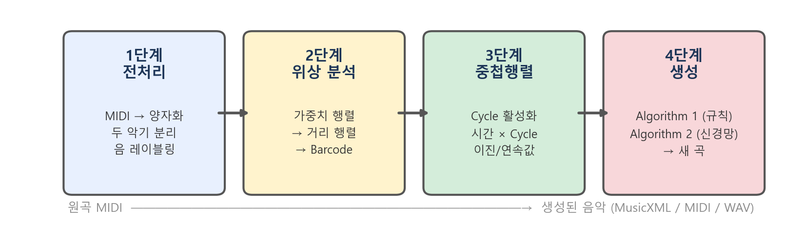
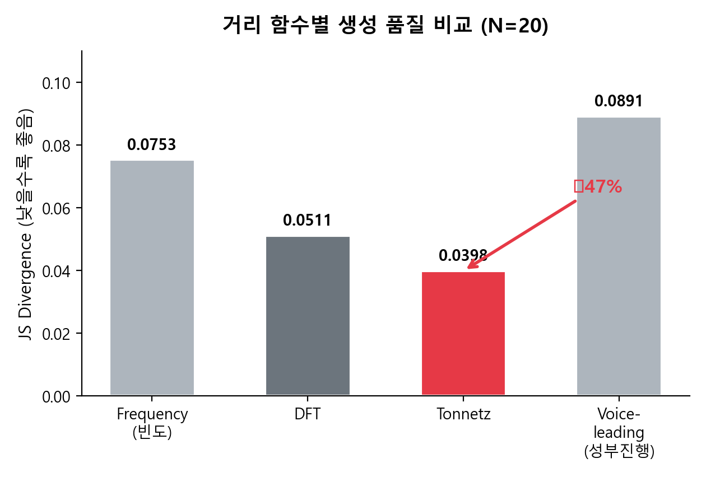
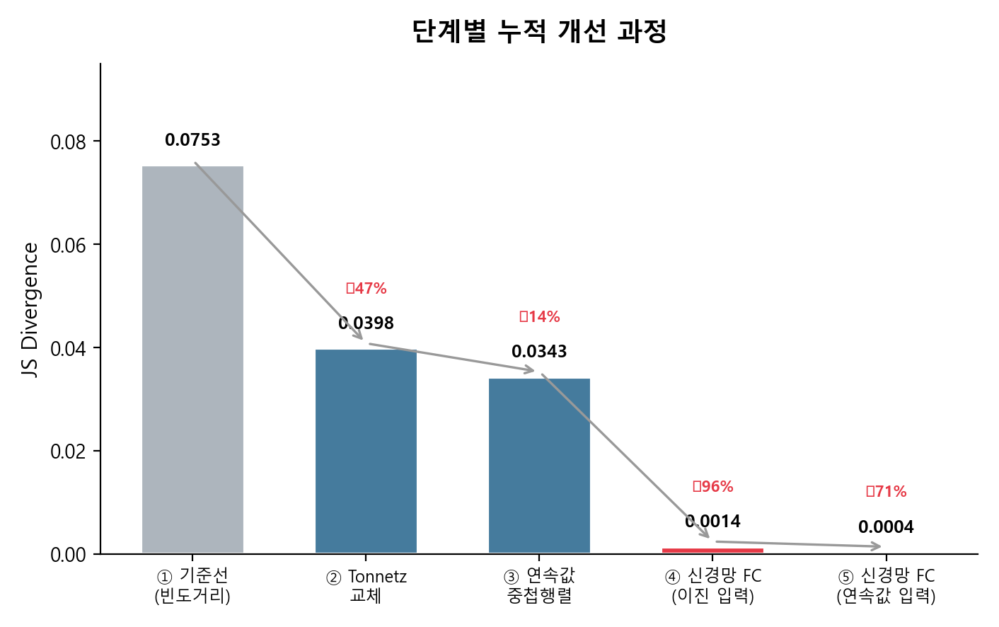
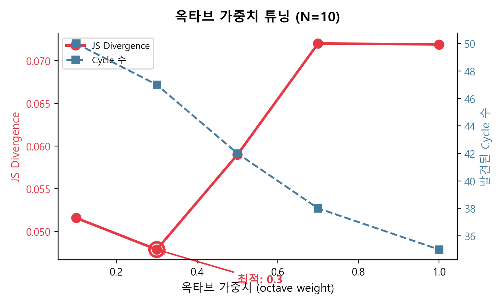
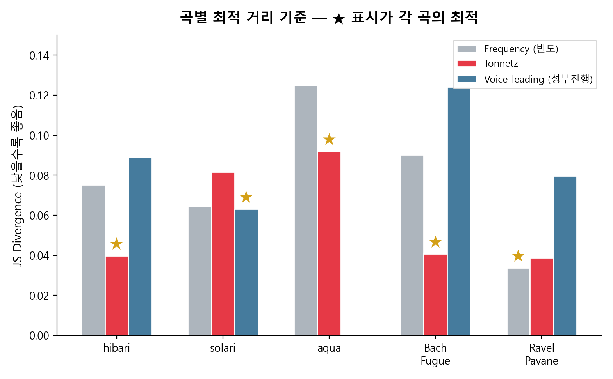
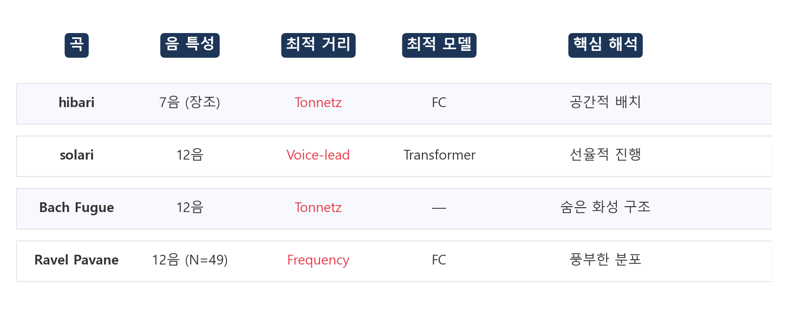

# 한 곡의 수학적 지문을 복원한다는 것

## Topological Data Analysis를 활용한 음악 구조 분석 및 위상 구조 보존 기반 AI 작곡 파이프라인

---

**지은이** 김민주
**지도** 정재훈 교수 (KIAS 초학제 독립연구단)
**작성일** 2026
**대상** 환경대학원 포트폴리오 제출용

---

@@QR_SECTION@@

**원곡 hibari** — Ryuichi Sakamoto, *out of noise* (2009)
https://www.youtube.com/watch?v=Uw7aW1tSMZU

**생성곡** — 본 연구 파이프라인으로 생성 (업로드 후 교체 예정)
@@END_QR_SECTION@@

---

## 목차

1. 서문 — 이 연구를 시작한 이유
2. 연구 질문과 대상곡
3. 수학적 도구 — Persistent Homology
4. 파이프라인 — 4단계의 여정
5. 실험 I: 거리 함수 비교
6. 실험 II: 연속값 중첩행렬과 신경망
7. 실험 III: 세부 파라미터 탐색
8. 곡 고유 구조 분석
9. 확장: 다른 곡들로의 일반화
10. 곡의 성격이 도구를 결정한다
11. 모듈 단위 생성
12. 차별화 포인트
13. 도시환경으로의 확장 가능성
14. 맺는 말
15. 청취 안내 및 참고자료

---

## 1. 서문 — 이 연구를 시작한 이유

@@AUTHOR_SECTION@@
이 절은 연구자가 직접 작성하는 영역입니다.

- 이 연구를 시작하게 된 개인적 계기
- hibari를 처음 들었을 때의 인상
- 수학과 음악의 교차점에 관심을 갖게 된 배경
- 환경대학원 진학과 이 연구 경험의 연결
@@END_AUTHOR_SECTION@@

---

## 2. 연구 질문과 대상곡

### 세 가지 질문

이 연구는 세 가지 질문에서 출발한다.

1. **음악의 위상 구조를 수학적으로 정의할 수 있는가?** 한 곡의 음들 사이에 거리를 정의하고 위상수학적 분석을 수행하면, 그 결과로 나오는 구조(cycle)는 음악적으로 어떤 의미를 가지는가?

2. **이 위상 구조를 보존한 채 새로운 음악을 생성할 수 있는가?** "보존"의 기준은 무엇이며, 보존 정도를 어떻게 정량적으로 측정하는가?

3. **거리 함수의 선택이 생성 품질에 유의미한 영향을 주는가?** 단순 빈도 기반 거리 대신 음악이론적 거리(Tonnetz, voice-leading, DFT)를 사용하면 얼마나 나은가?

### 왜 hibari인가

대상곡은 사카모토 류이치의 *out of noise* (2009) 수록곡 **hibari**다. 선택 이유:

- **선행연구의 확장.** 한국 전통 정간보에 TDA를 적용한 정재훈 교수의 선행연구를 화성음악으로 확장하기에 적합한 복잡성과 규칙성을 갖추고 있다.
- **크기 적정성.** 1,088개 타임스텝, 23개 고유 음, 17개 화음. 위상 구조가 풍부하되, 수 초 안에 전체 barcode 계산이 가능하다.
- **미학적 특수성.** 전통적 선율 진행이 아니라 음들의 공간적 배치에 가까운 방식으로 구성된다. 이 특성이 실험 결과와 직접 공명한다.

---

## 3. 수학적 도구 — Persistent Homology

### 핵심 아이디어

Persistent homology는 데이터에서 "구멍(hole)"을 찾는 도구다. 여기서 구멍은 물리적 구멍이 아니라, 데이터 점들이 이루는 연결 패턴에서 나타나는 위상학적 구조를 의미한다.

hibari의 23개 음을 점으로 표시한 뒤, 두 점을 연결하는 기준(거리 임계값)을 0에서 점차 키운다. 이 과정에서:

- 처음엔 23개 점이 고립.
- 기준이 넓어지면 가까운 점들이 이어지고, 삼각형, 사각형이 형성.
- 어떤 단계에서 "닫힌 고리" — 즉 **cycle** — 이 나타난다.
- 기준을 더 넓히면 그 cycle의 내부가 채워져 소멸한다.

**각 cycle이 언제 태어나고(birth) 언제 죽는지(death)를 모두 기록한 것**이 persistence barcode다. 오래 살아남은 cycle은 데이터의 본질적 구조, 짧게 사라진 것은 노이즈로 해석한다.

*그림 A. hibari의 Persistence Barcode. 각 막대가 하나의 H1 cycle. 긴 막대일수록 안정적인 구조. hibari에서 약 45~47개의 유한 cycle이 발견된다.*

### Tonnetz — 음악이론을 거리로 변환

두 음 사이의 "거리"를 정의하는 것이 모든 분석의 출발점이다. 본 연구는 네 가지 거리를 비교했는데, 그 중 **Tonnetz 거리**가 핵심이다.

Tonnetz는 18세기 오일러가 제안한 "음의 그물(tone network)"이다. 12개 음을 평면에 배치하되 음악이론적으로 어울리는 음끼리 가깝게 놓는다. 완전 5도(도-솔)는 이웃, 장 3도(도-미)는 대각선. 이 격자 위의 최단 경로 거리가 곧 두 음의 음악이론적 거리가 된다.

*그림 B. Tonnetz 격자 위의 hibari. 큰 파란 원이 hibari가 쓰는 7개 음(C major scale). 빨간 선이 Tonnetz 상의 직접 연결. 숫자는 원곡 내 출현 횟수.*

### 측정 지표: Jensen-Shannon Divergence

원곡과 생성곡이 얼마나 닮았는지를 **Jensen-Shannon divergence(JS)**로 측정한다. 두 곡의 음 빈도 분포를 비교하여 0(동일)에서 약 0.69(완전히 다름) 사이 값을 산출. 모든 실험은 N=20회 독립 반복의 평균과 표준편차로 보고한다.

---

## 4. 파이프라인 — 4단계의 여정

*그림 C. 4단계 파이프라인 흐름.*

**1단계 전처리:** MIDI 파일을 8분음표 단위로 양자화. 두 악기를 분리. 23개 고유 (pitch, duration) 쌍에 레이블 부여.

**2단계 위상 분석:** 음 간 거리 행렬 구성 -> Vietoris-Rips 복합체의 H1 persistence 계산 -> cycle 목록 추출.

**3단계 중첩행렬:** 각 cycle이 곡 전체에서 언제 활성화되는지를 기록한 표. 세로=cycle(약 47개), 가로=시간(1,088 타임스텝). 이진(0/1) 또는 연속값([0,1]).

**4단계 생성:** 중첩행렬을 입력으로, 두 가지 알고리즘으로 새 곡을 생성:
- **Algorithm 1 (규칙 기반):** 활성 cycle의 공통 음에서 확률적 샘플링. 약 50ms.
- **Algorithm 2 (신경망):** FC/LSTM/Transformer로 학습. 30초~3분.

가중치 설계에서 핵심적인 결정: 두 악기의 관계를 세 갈래로 분리했다 — **intra**(한 악기 내 인접 음), **inter**(두 악기 사이), **simul**(동시 발음). 이 분리가 hibari의 두 악기 구조를 수학에 반영한 것이다.

---

## 5. 실험 I: 거리 함수 비교

### 네 가지 거리, 동일한 파이프라인

거리 함수만 교체하고 나머지 파이프라인은 동일. 각 20회 반복.

*그림 D. 거리 함수별 JS divergence (N=20). Tonnetz가 빈도 거리 대비 47% 개선.*

| 거리 함수 | JS (mean +/- std) | cycle 수 | 기준선 대비 |
|----------|-------------------|----------|-----------|
| Frequency (빈도) | 0.0753 +/- 0.003 | 43 | 기준선 |
| DFT | 0.0511 +/- 0.003 | 20 | -32% |
| **Tonnetz** | **0.0398 +/- 0.003** | **46** | **-47%** |
| Voice-leading | 0.0891 +/- 0.005 | 22 | +18% (악화) |

**통계적 유의성:** Tonnetz vs Frequency: Welch t = 35.1, Cohen's d = 11.1, p < 10의 -20승. 극도로 유의한 개선이다.

**해석:** "자주 함께 나온다"는 통계(빈도)만으로는 음악의 화성적 구조를 포착하지 못한다. Tonnetz는 수백 년간의 음악이론 — "어떤 음이 어떤 음과 어울리는가" — 을 수학에 이식한 것이며, hibari의 위상 지문을 더 선명하게 드러낸다. 또한 Tonnetz가 가장 많은 cycle(46개)을 발견한다는 것도 주목할 만하다. 풍부한 위상 정보가 더 정확한 생성을 가능하게 한다.

---

## 6. 실험 II: 연속값 중첩행렬과 신경망

### 이진에서 연속값으로

초기 중첩행렬은 이진(0/1)이었다. cycle의 음들이 "절반만 활성"인 경우를 0.5로 표현하고, 희귀한 음에 더 높은 가중치를 부여하는 연속값 중첩행렬을 도입했다.

**결과 (Algorithm 1):** JS 0.0387에서 0.0343으로 11.4% 개선 (Welch t = 5.16, 유의함).

### FC 신경망의 역설

세 가지 신경망을 비교했다.

*그림 E. 세 신경망의 학습 과정. FC(파랑)가 가장 빠르게 수렴하여 최저 JS 달성. LSTM(초록)과 Transformer(빨강)는 높은 JS에 머문다.*

FC(가장 단순)가 LSTM과 Transformer를 이긴다. 이것은 hibari의 음악적 성격과 직결된다 — 8장에서 상세히 해석한다.

### 연속값 + FC: 최고 기록

| 설정 | JS (mean) | 대비 |
|------|-----------|------|
| FC + 이진 중첩행렬 | 0.0014 | — |
| **FC + 연속값 중첩행렬** | **0.0004** | **-71%** |

JS 0.0004는 이론적 최대(0.693)의 0.06%. 원곡과 생성곡의 음 빈도 분포가 통계적으로 거의 구별 불가능한 수준이다.

**왜 이렇게 큰 개선이 나오는가:** 이진 중첩행렬은 "켜짐/꺼짐"만 표현한다. 신경망은 이 거친 신호에서 음별 확률을 추정해야 한다. 연속값은 "이 cycle이 이 시점에서 얼마나 강하게 활성인가"라는 정보를 제공하므로, 신경망이 더 정밀한 확률을 학습할 수 있다.

*그림 F. 단계별 누적 개선 과정. 0.0753에서 0.0004까지.*

---

## 7. 실험 III: 세부 파라미터 탐색

### 옥타브 가중치 (octave weight)

같은 '도'라도 높은 도와 낮은 도는 다르다. 이 차이를 Tonnetz에 얼마나 반영할 것인가.

*그림 G. 옥타브 가중치 vs JS. 0.3이 최적.*

### alpha 그리드 탐색

Tonnetz 거리와 빈도 정보를 혼합하는 비율 alpha를 0.0~1.0으로 탐색. **alpha=0.0(순수 Tonnetz)이 최적.** 빈도 정보를 조금이라도 섞으면 성능이 떨어진다.

### per-cycle 임계값

연속값 중첩행렬에서 "얼마나 켜졌으면 활성으로 볼 것인가"의 기준을 42개 cycle마다 개별 탐색. **48.6% 추가 개선** (N=20, p < 0.001). 하나의 통일 기준보다 개별 기준이 훨씬 효과적이다.

### 감쇄 lag 가중치

이전 시점들의 패턴을 현재와 연결할 때, lag 1~4를 감쇄 가중(0.4, 0.3, 0.2, 0.1)으로 합산. 단일 lag 대비 **70% 개선.**

### 온도 파라미터

신경망 생성의 다양성 조절. T=3.0이 최적 (6.7% 개선). hibari의 고른 분포와 일치.

---

## 8. 곡 고유 구조 분석

실험 결과가 축적되면서, hibari라는 곡 자체의 성격이 드러났다.

### Deep Scale Property

hibari가 사용하는 7개 pitch class(C major scale)는 Tonnetz 격자 위에서 하나의 밀집된 영역을 이룬다. 이것은 "조성(key)"이 위상적으로 의미 있는 구조임을 시사한다.

### 근균등 Pitch 분포

hibari의 pitch entropy는 0.974 (최대 1.0). 특정 음에 치우치지 않고 7개 음을 거의 균등하게 사용한다. 이 고른 분포가 Tonnetz 거리의 효과를 극대화한다 — 모든 음이 비슷한 빈도로 쓰이므로, 빈도가 아닌 음악적 관계(Tonnetz)가 결정적 정보가 된다.

### Phase Shifting — 두 악기의 서로소 구조

- **악기 1:** 곡 전체 동안 단 한 번의 쉼도 없이 연주 (쉼 0개).
- **악기 2:** 모듈마다 규칙적 쉼을 두고 배치. 시작이 33 타임스텝 늦다 (쉼 64개).

두 악기의 활성 패턴이 서로소(coprime)이다. 이것은 파이프라인의 intra/inter/simul 가중치 분리 설계를 정당화하는 경험적 증거다.

### 왜 FC가 이기는가 — 시간보다 공간

FC는 시간 순서를 고려하지 않는다. LSTM은 시간 순서를 기억하고, Transformer는 전체 맥락을 동시에 고려한다. 일반적으로 후자가 우세하다.

그러나 hibari에서는 정반대다. 이 곡은 전통적 선율 인과 — "이 음 다음에는 이 음이 온다" — 가 약하다. 각 음이 시간의 흐름이 아니라 공간적 배치로 놓여 있다. 시간 정보를 강하게 모델링하는 것은 "없는 패턴을 억지로 찾으려는" 과적합이 된다.

*out of noise* 앨범의 기획 철학 — 전통적 선율에서 해방되어 각 음이 공간 속에서 제자리를 찾도록 — 과 정확히 공명하는 관찰이다.

---

## 9. 확장: 다른 곡들로의 일반화

hibari 하나에서 좋은 결과가 나왔다고 범용성을 주장할 수 없다. 사카모토의 다른 곡들과 서양 클래식 대조군에 동일한 파이프라인을 적용했다.

*그림 H. 곡별 최적 거리 기준. 별 표시가 각 곡의 최적.*

| 곡 | T | N | 최적 거리 | 최적 JS | 해석 |
|----|---|---|----------|---------|------|
| hibari | 1,088 | 23 | Tonnetz | 0.0398 | 7음, 공간적 |
| solari | 224 | 34 | Voice-leading | 0.0631 | 12음, 선율적 |
| aqua | 539 | 51 | Tonnetz | 0.0920 | 12음, Tonnetz +26% |
| Bach Fugue | 870 | 61 | Tonnetz | 0.0408 | 대위법의 숨은 화성 |
| Ravel Pavane | 548 | 49 | Frequency | 0.0337 | 풍부한 분포 |

**바흐 푸가에서 Tonnetz 54.8% 우위:** 대위법은 여러 선율의 독립적 진행이 핵심이다. voice-leading이 유리할 것 같지만 Tonnetz가 압도. 바흐의 대위법이 표면적으로는 선율적이지만, 그 바탕에는 화성적 구조가 깊이 자리잡고 있다는 음악이론적 해석과 일치한다.

**라벨 파반느에서 빈도 거리 우위:** 49개 고유 음을 쓰는 풍부한 분포. 음악이론적 거리보다 실제 출현 빈도 자체가 더 유용한 정보가 된다.

---

## 10. 곡의 성격이 도구를 결정한다

이 연구의 가장 큰 발견: **최적 도구는 곡의 음악적 성격에 달려 있다.**

*그림 I. 곡의 특성에 따른 최적 도구 요약.*

조성이 명확하고 공간적 배치가 중요한 곡(hibari) -> Tonnetz + FC.
선율적 진행이 강한 곡(solari) -> Voice-leading + Transformer.
음 분포가 풍부한 곡(Ravel) -> Frequency + FC.

"더 복잡한 모델 = 더 좋은 모델"이라는 통념을 hibari는 반증한다. 곡의 본질을 이해하고 그에 맞는 도구를 선택하는 것이 더 중요하다.

---

## 11. 모듈 단위 생성

hibari의 구조를 33개 모듈(각 32 타임스텝, 약 4마디)로 나누어 분석하고, 하나의 모듈만으로 곡 전체를 재건하는 실험을 수행했다.

### 첫 4마디의 특권적 지위

| 모듈 | cycle 수 | 밀도 | 비고 |
|------|---------|------|------|
| **모듈 0 (첫 4마디)** | **24** | **0.517** | **가장 단순** |
| 모듈 1~32 | 34~41 | 0.63~0.81 | 더 복잡 |

첫 모듈이 가장 단순함에도 불구하고, 전체 최저 JS(0.0258)를 기록한 생성 곡은 바로 이 첫 모듈로부터 나왔다. 미니멀리즘 작곡의 관행 — 첫 4마디에 핵심을 압축적으로 제시하고 이후는 변주 — 이 수학적으로 실증되었다.

*그림 J. (a) 첫 모듈의 중첩행렬, (b) 생성된 단일 모듈, (c) 33번 반복하여 재건한 전체 곡.*

---

## 12. 차별화 포인트

### 대형 AI 음악 생성과의 차이

**대형 AI (Magenta, Suno 등):** 수만 곡 데이터 학습 -> "평균적 음악" 생성. 목표는 범용성.
**이 연구:** 한 곡의 수학적 구조 추출 -> 그 구조를 보존한 새 곡 생성. 목표는 특수성.

전자가 백과사전이라면 후자는 현미경이다.

### 기존 TDA-음악 연구와의 차이

정간보 TDA 선행연구(정재훈 외, 2024)를 세 방향으로 확장: (1) 서양 현대음악 적용, (2) 통계적 엄밀성(N=20), (3) "곡의 성격이 도구를 결정한다"는 새 관점.

### 해석 가능한 AI

이 파이프라인에서 모든 음은 "어떤 특정 cycle의 활성화"라는 구체적 근거를 가진다. 왜 그 음이 생성되었는지를 사후 설명할 수 있다. 일반적인 대형 AI에서는 거의 불가능한 일이다.

---

## 13. 도시환경으로의 확장 가능성

이 연구에서 사용한 persistent homology의 핵심 — **복잡한 네트워크에서 구멍(cycle)을 찾아 구조를 요약한다** — 은 음악에만 국한되지 않는다. 도시 공간은 본질적으로 복잡한 네트워크이며, 같은 수학적 도구가 적용될 수 있다.

### 복잡 네트워크의 동적 상태 탐지

Myers, Munch, & Khasawneh (2020)는 시계열 데이터를 그래프로 변환한 뒤 persistent homology를 적용하여 **주기적 상태와 혼돈적 상태를 구별**하는 파이프라인을 개발했다. 핵심 결과는 persistence barcode에서 추출한 위상적 요약 통계량(persistent entropy 등)이 기존 네트워크 지표(clustering coefficient, centrality 등)보다 **동적 상태 변화를 더 명확하게 감지**하며 **노이즈에 더 강건**하다는 것이다.

이 연구가 도시환경과 만나는 지점은 명확하다:

### 도시 형태학(Urban Morphology)에의 적용

| 이 연구의 개념 | 음악에서의 의미 | 도시환경에서의 대응 |
|---|---|---|
| 점(node) | 개별 음(note) | 교차로, 건물, POI |
| 거리(distance) | 음악이론적 거리 (Tonnetz) | 가로 네트워크 거리, 접근성 |
| H1 cycle | 음들의 닫힌 관계 그룹 | 블록 구조, 순환 경로, 생태 회랑 |
| Persistence | 구조의 안정성 | 도시 조직의 견고함 / 취약점 |

**가로망 위상 분석:** 도시 가로망을 Vietoris-Rips 복합체로 변환하면, H0(연결 성분)과 H1(블록/루프)의 persistence가 도시 형태를 특성화한다. 격자형 도시(맨해튼)와 유기적 구도심(유럽 중세 도시)의 위상적 차이를 정량화할 수 있다.

**회복탄력성(Resilience) 평가:** H1 cycle이 많고 persistence가 긴 네트워크는 대체 경로가 풍부하다는 의미이며, 일부 연결이 끊어져도 전체 연결성이 유지될 가능성이 높다. 도시 인프라의 취약점을 위상적으로 식별하는 데 활용 가능하다.

**멀티스케일 분석:** Persistent homology의 핵심 강점은 여러 스케일을 동시에 포착한다는 것이다. 도시에서는 골목 단위의 미시 구조부터 도시 전체의 거시 구조까지를 하나의 barcode로 요약할 수 있다.

이 연구에서 "거리 함수의 선택이 결과를 47% 바꾼다"는 발견은 도시 분석에서도 시사점을 가진다. **어떤 "거리"로 도시를 바라보느냐** — 물리적 거리인지, 접근성인지, 토지이용 유사도인지 — 에 따라 도시의 위상 구조가 전혀 다르게 드러날 것이다.

---

## 14. 맺는 말

@@AUTHOR_SECTION@@
이 절은 연구자가 직접 작성하는 영역입니다.

- 이 연구를 통해 배운 것
- 수학과 음악의 교차, 그리고 도시환경으로의 확장에 대한 소감
- 환경대학원에서의 연구 방향과 이 경험의 연결
@@END_AUTHOR_SECTION@@

### 수치 요약

| 항목 | 수치 |
|------|------|
| 대상곡 | hibari (Ryuichi Sakamoto, 2009) |
| 곡 길이 | 8분 06초, 1,088 타임스텝 |
| 고유 음 수 | 23개 |
| 발견된 cycle 수 | 약 45~47개 |
| 기준선 JS (빈도) | 0.0753 |
| Tonnetz 교체 후 | 0.0398 (-47%, p < 10의 -20승) |
| 최고 기록 (FC+연속값) | 0.0004 (이론적 최대의 0.06%) |
| per-cycle 임계값 | +48.6% (N=20, p < 0.001) |
| 감쇄 lag 가중치 | +70% |
| 최적 옥타브 가중치 | 0.3 |
| 최적 alpha | 0.0 (순수 Tonnetz) |
| Algorithm 1 생성 시간 | 약 50ms |
| 확장 곡 수 | 5곡 (solari, aqua, Bach, Ravel + hibari) |

---

## 15. 청취 안내 및 참고자료

### 직접 들어보기

이 보고서의 첫 페이지 QR코드로 원곡 hibari를 들을 수 있다. 처음 1분을 집중해서 들어본 뒤, 생성곡과 비교 청취를 권한다.

- 원곡의 "느낌"이 생성곡에서도 느껴지는가?
- 생성곡은 "흉내"인가, "같은 공간에 있는 다른 곡"인가?

### 참고 자료

- Carlsson, G. (2009). "Topology and data." *Bulletin of the AMS*, 46(2).
- Tymoczko, D. (2011). *A Geometry of Music*. Oxford University Press.
- Myers, A., Munch, E., & Khasawneh, F. A. (2020). "Persistent Homology of Complex Networks for Dynamic State Detection." *Physical Review E*, 100.
- Sakamoto, R. (2009). *out of noise* [Album]. commmons.
- Tran, L., Park, J., & Jung, J. (2021). Topological analysis of Korean traditional music.
- Heo, Choi, & Jung (2025). Path-representable distance and persistence barcode injection.

---

**학술 원고:** 엄밀한 수식, 증명, 통계 검증의 전체 내용은 학술 원고 `academic_paper_full.md` (~90페이지, 17 references)에 수록되어 있습니다.
