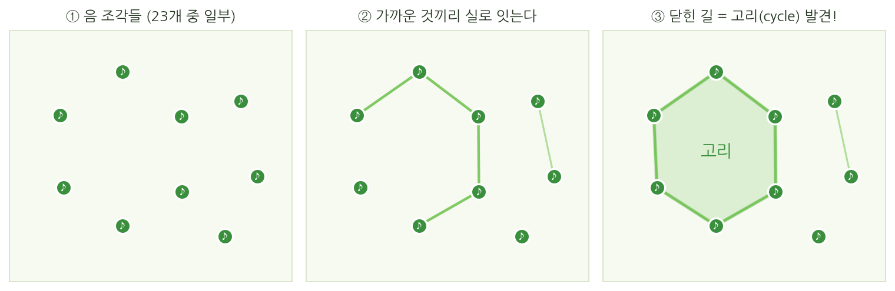
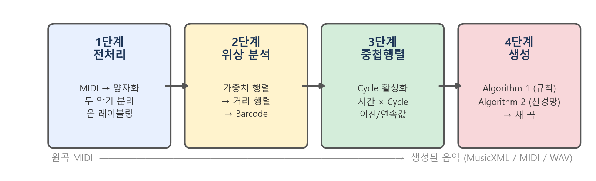
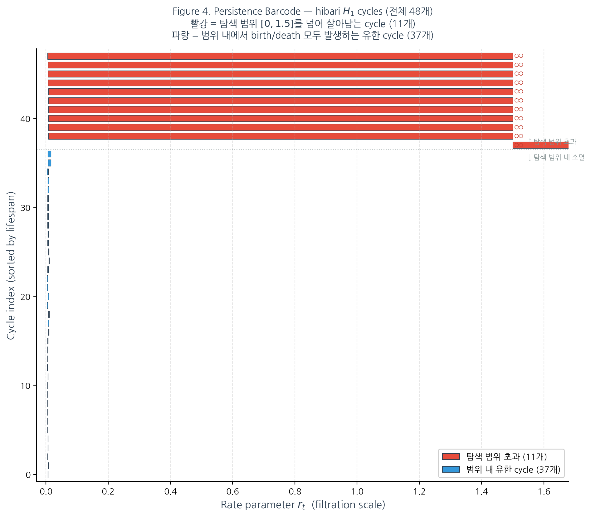
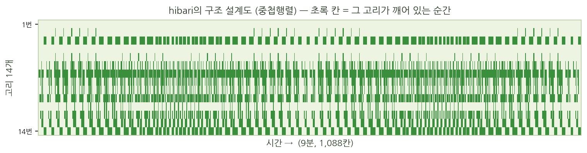
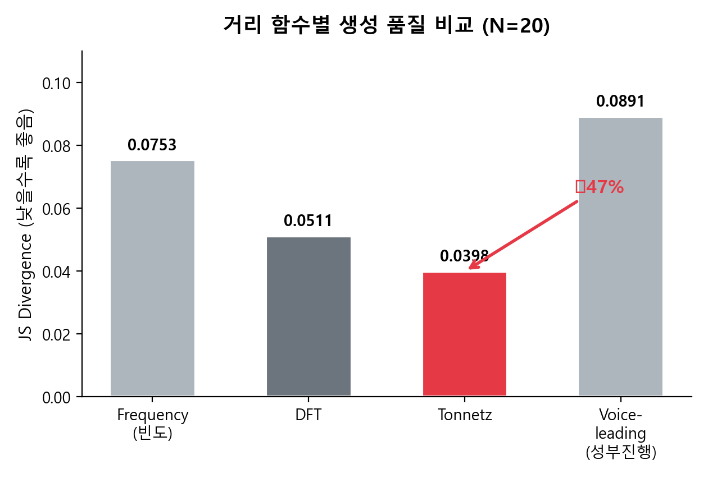
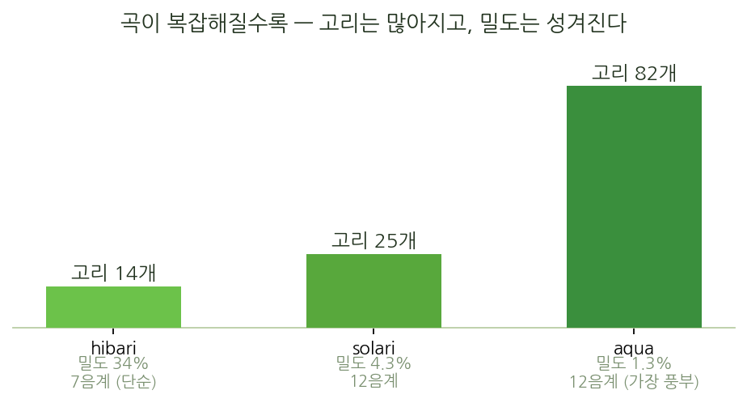
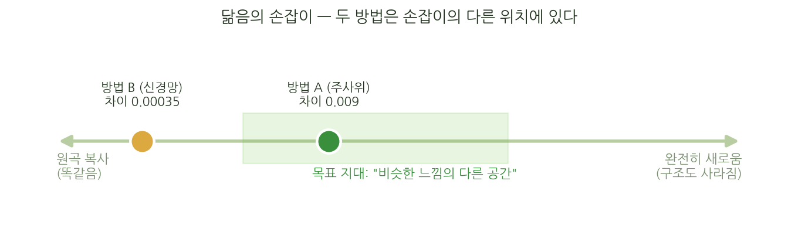

# 음악의 모양을 세다 — 위상수학으로 곡의 구조를 읽고, 그 구조로 새 음악을 만든 기록

**저자:** 김민주
**지도:** 정재훈 (KIAS 초학제 독립연구단)
**작성일:** 2026.09.02

---

## 이 문서를 읽는 법

이 글은 **수학이나 프로그래밍을 몰라도 끝까지 읽을 수 있게** 쓰였습니다. 전문 용어가 나오면 그 자리에서 일상어로 풀어 씁니다.

한 문단으로 줄이면 이렇습니다.

사카모토 류이치의 곡 〈hibari〉를 **위상수학(topology)** 이라는 도구로 분석해 곡 안에 숨은 "구조"를 뽑아냈고, 그 구조를 유지한 채 새 음악을 만드는 파이프라인을 설계했습니다. 여러 실험에서 좋은 수치가 나왔습니다. **그런데 그 수치가 정말 제가 의도한 것을 재고 있는지 스스로 검증했더니, 재고 있지 않았습니다.** 코드 결함 네 건을 찾아 고쳤고, 제가 발표했던 주장 다섯 건을 철회했으며, 무엇보다 **연구의 목표 지표 자체가 무효**임을 확인했습니다. 지금은 목표를 다시 정의하고 그 위에서 연구를 다시 쌓고 있습니다.

이 문서의 절반은 **무엇을 만들었나**이고, 나머지 절반은 **그것을 어떻게 스스로 무너뜨렸나**입니다. 후자가 이 연구에서 제가 가장 자랑스러워하는 부분입니다.

---

## 1부 · 무엇을 하려 했나

### 1.1 음악의 "구조"란 무엇인가

음악을 들을 때 우리는 음 하나하나를 따로 듣지 않습니다. 어떤 선율이 **되돌아왔다**고 느끼고, 두 성부가 **같은 자리로 모였다**고 느낍니다. 악보에 적힌 것은 음표의 나열이지만, 우리가 듣는 것은 그 나열이 만드는 **모양**입니다.

문제는 이 "모양"을 어떻게 수학으로 붙잡느냐입니다. 음의 높이를 숫자로 세거나, 화음의 빈도를 세는 방법은 오래전부터 있었습니다. 하지만 그것들은 **얼마나 자주 나왔나**를 셀 뿐, **어떻게 돌아왔나**를 재지 못합니다.

### 1.2 위상수학이 왜 여기 오는가

위상수학은 "늘이고 구부려도 변하지 않는 성질"을 다루는 분야입니다. 가장 유명한 예가 **도넛과 머그컵**입니다. 둘 다 구멍이 하나씩 있고, 찰흙으로 만들었다면 찢지 않고 서로 바꿀 수 있습니다. 위상수학의 눈으로 보면 둘은 **같은 것**입니다.

여기서 중요한 것은 **구멍의 개수**가 "모양의 정체"를 말해 준다는 점입니다. 그리고 구멍은 늘이거나 구부려도 사라지지 않습니다.

음악에 적용하면 이렇게 됩니다.

- 음들을 **점**으로 놓습니다.
- 서로 "가까운" 음들끼리 **선**으로 잇습니다.
- 그러면 어떤 음들이 **고리(cycle)** 를 이룹니다 — 출발한 자리로 돌아오는 길입니다.

이 고리가 바로 "선율이 되돌아온다"는 감각의 수학적 대응물입니다. 그리고 이 고리는 **어떤 음이 몇 번 나왔나**와는 다른 정보입니다. 빈도를 세는 방법이 놓치는 것을 잡습니다.

### 1.3 "가깝다"를 정하는 것이 전부다

그런데 "가까운 음끼리 잇는다"에서 **가깝다**가 무슨 뜻인지 정해야 합니다. 이 정의를 바꾸면 그려지는 고리도 달라집니다. 이 연구가 실제로 씨름한 문제가 이것입니다.

네 가지 정의를 비교했습니다.

| 정의 | "가깝다"의 뜻 | 비유 |
|---|---|---|
| **frequency** (빈도) | 곡 안에서 자주 붙어 나온 음끼리 가깝다 | 자주 같이 다니는 사람이 친하다 |
| **Tonnetz** (음망) | 화성적으로 가까운 음끼리 가깝다 (3화음 관계) | 족보상 가까운 친척 |
| **voice leading** (성부 진행) | 목소리가 조금만 움직여 갈 수 있으면 가깝다 | 걸어서 갈 수 있는 거리 |
| **DFT** (푸리에) | 화음의 "지문"이 닮으면 가깝다 | 얼굴이 닮았다 |

DFT를 조금 더 풀면 이렇습니다. 화음을 12개 음이름의 켜짐/꺼짐 목록으로 적은 뒤 **주파수 분해**를 합니다. 그러면 화음마다 고유한 지문 같은 것이 나오는데, 이 지문은 **조를 옮겨도 변하지 않습니다**. 도-미-솔을 레-파#-라로 옮겨도 지문은 같습니다. 즉 "무슨 음인가"가 아니라 "어떤 종류의 화음인가"를 봅니다.

### 1.4 이 연구가 던진 질문

1. 음악의 구조를 위상수학으로 **잡을 수 있는가**?
2. 잡았다면 그 구조를 **유지한 채 새 음악을 만들 수 있는가**?
3. "가깝다"의 정의를 바꾸면 **결과가 실제로 달라지는가**?

그리고 나중에 추가된, 결국 가장 중요해진 질문:

4. **내가 쓰는 자(尺)가 정말 내가 재려는 것을 재고 있는가?**

---

## 2부 · 어떻게 만들었나

전체는 네 단계입니다.

### 2.1 1단계 — 악보를 좌표로

MIDI 파일(악보의 디지털 형식)을 읽어 두 성부로 나누고, 시간을 8분음표 단위로 잘랐습니다. 〈hibari〉는 이 처리를 거치면 **고유한 음이 23개**, 시간 칸이 **1088칸**입니다.

여기서 한 가지 결정을 했습니다. 원래는 음마다 "높이"와 "길이"를 함께 봤는데, 그러면 종류가 너무 많아져 계산이 무거워집니다. 그래서 모든 음의 길이를 최소 단위로 정규화하고 **긴 음은 짧은 음을 이어 붙인 것**으로 해석했습니다. 악보에서 붙임줄(tie)로 적는 것과 같은 발상입니다.

### 2.2 2단계 — 구멍 찾기

이제 23개 음을 점으로 놓고, 앞에서 정한 "가깝다"에 따라 거리를 계산합니다. 그다음 **거리 기준을 0에서부터 서서히 늘려 갑니다.**

- 기준이 아주 작으면 아무것도 연결되지 않습니다.
- 기준을 키우면 가까운 것부터 이어지기 시작합니다.
- 어느 순간 **고리**가 생깁니다.
- 더 키우면 고리 안쪽이 메워져 **사라집니다.**

이 "언제 생겼다가 언제 사라졌는가"를 전부 기록한 것을 **persistence(지속성)** 라고 부릅니다. 잠깐 생겼다 사라지는 고리는 잡음이고, **오래 버티는 고리가 진짜 구조**입니다.

〈hibari〉에서는 이렇게 **오래 버티는 고리가 14개** 나왔습니다.

다만 이 개수는 고정된 상수가 아닙니다. "가깝다"의 정의와 설정을 바꾸면 고리 수도 달라집니다 — 뒤에 나오는 비교표에서 정의마다 개수가 다른 것은 그 때문입니다. 14개는 이 연구가 최종적으로 채택한 설정에서의 값입니다.

### 2.3 3단계 — 중첩행렬, 구조의 악보

고리를 찾았으니 이제 **언제 그 고리가 울리고 있는가**를 봐야 합니다.

시간을 가로, 고리를 세로로 놓고 "이 시점에 이 고리가 활성인가"를 칠한 표를 만듭니다. 이것을 **중첩행렬(Overlap Matrix)** 이라 부릅니다. 1088칸 × 14개 고리짜리 표입니다.

이 표가 이 연구의 심장입니다. **곡의 음표가 아니라 곡의 구조만 남긴 악보**이기 때문입니다. 그래서 이 표를 씨앗으로 삼으면, 음표는 다르지만 구조는 같은 음악을 만들 수 있습니다.

### 2.4 4단계 — 두 가지 생성 방식

**Algorithm 1 — 규칙 기반 (약 50밀리초)**
매 시점마다 "지금 켜져 있는 고리들이 **공통으로** 포함하는 음"이 무엇인지 보고, 그 안에서 뽑습니다. 켜진 고리가 없으면 곡 전체의 음 빈도에서 뽑습니다.

**Algorithm 2 — 신경망 (약 30초~3분)**
중첩행렬을 입력하면 원곡을 복원하도록 신경망을 학습시킵니다. 완전연결(FC)·LSTM·Transformer 세 종류를 비교했습니다.

두 방식의 성격이 다릅니다. Algorithm 1은 **규칙을 지키면서 매번 다른 것**을 만들고, Algorithm 2는 **원곡을 더 정확히 재현**합니다. 창의성과 충실도의 맞바꿈입니다.

---

## 3부 · 무엇을 찾았나

### 3.1 "가깝다"의 정의는 실제로 결과를 바꾼다

같은 조건을 **20회 독립 반복**해 비교했습니다. 평가에는 생성 결과의 음 분포가 원곡과 얼마나 닮았는지를 재는 값을 썼습니다(Jensen-Shannon divergence, 이하 **JS**). 0이면 완전히 같고, 클수록 다릅니다.

| 정의 | JS (낮을수록 원곡과 닮음) | 찾은 고리 수 |
|---|---|---|
| **DFT** | **0.0216** ★ | 17 |
| frequency | 0.0247 | 1 |
| Tonnetz | 0.0493 | 47 |
| voice leading | 0.0528 | 19 |

DFT가 frequency보다 **12.4% 낮았습니다** (p = 7.8 × 10⁻⁶). 우연이 아닙니다.

여기서 흥미로운 것은 **고리 수가 좋고 나쁨을 결정하지 않는다**는 점입니다. Tonnetz는 고리를 47개나 찾았지만 3위에 그쳤고, frequency는 **단 1개**만 찾았는데 2위였습니다. 많이 찾는 것과 잘 찾는 것은 다릅니다.

### 3.2 곡마다 최적 도구가 다르다

〈hibari〉 하나로는 일반화할 수 없어 다른 곡들에도 같은 파이프라인을 적용했습니다.

| 곡 | 성격 | 가장 좋았던 정의 | JS |
|---|---|---|---|
| hibari (사카모토) | 7음 음계 | **DFT** | 0.0216 |
| solari (사카모토) | 12음 | frequency | 0.0131 |
| aqua (사카모토) | 12음 | **판별 불가** (p = 0.69) | 0.0086 ≈ 0.0088 |
| Bach 푸가 | 대위법, 12음 | **Tonnetz** | 0.0130 |
| Ravel 파반느 | 12음 | **Tonnetz** | 0.0156 |

**곡마다 최적 도구가 다르다**는 것은 관찰로 남습니다. 하지만 솔직히 말하면, "어떤 성격의 곡이 어떤 정의를 부르는가"에 대한 **설명은 갖고 있지 않습니다.** 처음에는 설명을 붙였지만, 나중에 수치를 다시 계산했더니 다섯 곡 중 세 곡의 순위가 바뀌었고 aqua는 아예 판별이 되지 않았습니다. 그 설명은 사후 해석이었습니다. 그래서 철회했습니다.

곡의 위상적 규모 자체가 다르다는 것은 남습니다.

| 곡 | 고리 수 | 중첩행렬이 채워진 비율 |
|---|---|---|
| hibari (7음 음계) | 14 | 34.1% |
| solari (12음) | 25 | 4.3% |
| aqua (12음) | 82 | 1.3% |

화성 어휘가 풍부해질수록 고리는 많아지지만 각 고리는 드물게만 울립니다. 구조가 **더 많고 더 성기게** 흩어집니다.

### 3.3 위상 손실 디퓨전 — 그리고 그 공은 어디로 갔나

최근 이미지 생성에서 쓰이는 **디퓨전(diffusion)** 기법을 중첩행렬 생성에 접목했습니다. 노이즈에서 시작해 조금씩 정리해 나가며 그럴듯한 표를 만드는 방식입니다.

여기에 "위상 구조를 지키라"는 조건(위상 손실)을 학습에 넣었고, 결과가 크게 좋아졌습니다. 이전 방식 대비 구조 유사도가 **0.0274에서 0.0030으로 개선**됐습니다.

**그런데 성분 제거 실험을 해 봤더니 공은 위상 손실이 아니었습니다.**

| 조건 | 구조 유사도 (낮을수록 좋음) | 95% 신뢰구간 |
|---|---|---|
| 위상 손실 **있음** | 0.00309 | [0.00154, 0.00477] |
| 위상 손실 **없음** (구조만 동일) | **0.00217** | [0.00127, 0.00350] |

신뢰구간이 겹치고, 오히려 위상 손실 **없는** 쪽이 평균이 좋습니다. 개선을 만든 것은 손실 함수가 아니라 **신경망 구조를 바꾼 것**이었습니다. 제가 자랑하려던 부분은 기여하지 않았습니다.

한편 **모티브 조건부 통제**는 성공했습니다. 곡의 일부를 고정하고 나머지만 다시 만들게 하면, 고정한 부분은 **100% 보존**되고 자유 영역만 6~15% 달라집니다. 이건 재현됐습니다.

---

## 4부 · 그리고 스스로 무너뜨렸다

여기서부터가 이 연구의 진짜 이야기입니다.

### 4.1 왜 자기검증을 시작했나

수치가 계속 좋아졌습니다. 좋아질수록 불안했습니다. 특히 이런 일이 반복됐습니다.

- 어떤 수정을 하면 **JS는 좋아지는데 협화도는 나빠졌습니다.**
- 블라인드 비교(어느 쪽이 무엇인지 모르고 듣기)에서 **지표가 좋다고 한 쪽을 귀가 고르지 않았습니다.**

그래서 규칙을 하나 세웠습니다.

**"개선했다"고 말하려면, 그 개선을 만들었다고 주장한 그 메커니즘만 제거한 대조군을 반드시 함께 돌린다.**

그리고 이 규칙이 이후 **네 번** 제 헤드라인을 무너뜨렸습니다.

### 4.2 코드 결함 네 건

**① 번호 규약 불일치.** 음에 번호를 매기는 방식이 두 군데에서 어긋나 있었습니다(1번부터 vs 0번부터). 그래서 뽑힌 음이 **전부 한 칸씩 밀려 해석**되고 있었습니다. 마지막 번호는 아예 해석이 안 돼 조용히 버려졌습니다.

**② 웹에 배포한 코드의 같은 계열 버그.** 브라우저용으로 옮긴 코드에도 같은 종류의 오류가 있었습니다. 실제로 실행해 채점해 보니 결과가 **4.5배 나빴습니다.** 고친 뒤 원본과 오차 범위 안으로 들어왔습니다.

**③ 경로 문제**와 **④ 카메라 오류 삼킴** — 실험 스크립트가 어디서 실행되느냐에 따라 다른 파일을 읽던 문제, 그리고 오류를 조용히 무시해 사용자에게 아무 표시도 안 하던 문제입니다.

### 4.3 철회한 주장 다섯 건

| 철회한 주장 | 실제로 확인한 것 |
|---|---|
| "온도 파라미터 3.0이 최적" | 정본 경로는 온도를 **아예 쓰지 않습니다**. 원래 실험을 다시 돌리면 순위가 뒤집힙니다 |
| "감쇄 가중치가 7.1% 개선" | 정본 조건에서는 오히려 **8.2% 나쁩니다** (p = 0.011) |
| "거리 정의 비교에서 38.2% 개선" | 버그로 비교 기준이 부풀려져 있었습니다. 실제는 **12.4%** |
| "곡마다 최적 정의가 이러하다" | 다섯 곡 중 **세 곡의 순위가 바뀌었고** 한 곡은 판별 불가 |
| "32주기 리듬 구조가 81% 기여" | 71%가 **대비 증폭 아티팩트**였습니다 |

세 번째 항목이 특히 깨끗하게 드러났습니다. 각 거리 정의가 **버그 경로에 노출된 비율**이 효과 크기를 정확히 예측했기 때문입니다.

| 정의 | 버그 경로 노출 | 수정 후 변화 |
|---|---|---|
| frequency | 70.3% | **−28.3%** (기준이 이만큼 부풀어 있었음) |
| voice leading | 5.1% | −6.7% |
| DFT | 7.7% | +1.7% (판별 불가, p = 0.49) |
| Tonnetz | **0%** | **0.0%** — 20회 전부 비트 단위 동일 |

노출이 0%인 Tonnetz가 완전히 동일하게 나온 것이 **검증 장치가 제대로 작동했다는 증거**입니다.

### 4.4 가장 큰 것 — 목표 지표가 무효였다

앞의 것들은 개별 수치 문제입니다. 이건 다릅니다.

우연히 대조군의 JS 값이 이상하게 좋은 것을 보고 파고들었습니다. 그래서 **위상 구조를 얼마나 쓰는지**를 0%에서 100%까지 바꿔 가며 JS를 재 봤습니다.

| 위상 구조를 안 쓰는 비율 | JS (낮을수록 좋다고 여겨 온 값) |
|---|---|
| 18% (정본 설정) | 0.0375 |
| 50% | 0.0136 |
| 75% | 0.0040 |
| **100% (위상 전혀 사용 안 함)** | **0.00087** |

상관계수 **−0.961** (p = 0.009). **완벽하게 단조 감소합니다.**

그리고 이유를 직접 계산해 확인했습니다. 음을 뽑는 주머니는 **원곡의 음 빈도 그대로** 만들어집니다. 실측하면 주머니의 음 분포와 원곡의 음 분포는 **JS = 0.000000, 상관 = 1.000000** — 완전히 같습니다.

즉 **주머니에서 아무렇게나 뽑기만 해도 원곡의 음 분포가 정확히 재현됩니다.**

결론은 피할 수 없습니다.

**위상 구조를 하나도 쓰지 않은 생성(0.00087)이 이 연구의 최고 기록(0.00902)을 10배 이깁니다.**

"JS가 낮다"는 것은 "위상을 잘 썼다"를 뜻할 수 없습니다. 오히려 **반대 신호**입니다. JS로 내린 모든 비교 결론은 의도한 것과 다른 것을 재고 있었습니다.

아래는 이 발견 **이전에** 제가 그렸던 그림입니다. 두 생성 방식이 "원곡 복사"와 "완전히 새로움" 사이의 좋은 자리에 놓여 있다는 설명이었습니다.

그림 자체는 틀리지 않았습니다. **가로축이 틀렸습니다.** 저 축은 위상 구조를 안 쓸수록 왼쪽으로 가므로, 저기서 "좋은 자리"에 있다는 것은 아무것도 보장하지 않습니다.

무엇이 무효가 **아닌지**도 좁혀 두었습니다. **같은 노출 비율끼리의 비교는 여전히 유효합니다.** 그래서 앞의 재산출은 노출도를 함께 보고했고, 노출 0%인 Tonnetz는 비트 단위로 동일했습니다.

### 4.5 그러면 귀는 뭐라고 하는가

지표를 믿을 수 없다면 남은 것은 사람의 귀입니다. **어느 쪽이 무엇인지 모르는 상태**에서 듣는 비교를 세 차례 했습니다.

누적 결과: **18쌍 중 11쌍(61%)** 에서 지표와 귀가 일치했습니다. 신뢰구간은 [36%, 83%] — **동전 던지기(50%)를 배제하지 못합니다.**

특히 확인된 것 하나: 코드 결함 ②를 고친 것은 **3쌍 전부에서 귀에 들렸습니다.** 버그 수정은 진짜였습니다. 반면 협화도가 더 높다고 계산된 쪽은 2:2로 갈렸습니다.

### 4.6 지표를 새로 찾아봤다 — 그것도 실패했다

청취자가 남긴 이유를 모아 보니 일관됐습니다. "더 탄력적", "쉬어가는 느낌", "더 역동적인 멜로디", "화성적으로 더 역동적", "리듬감이 있다". **전부 곡 내부의 변화에 대한 말이고, "원곡과 닮았다"는 말은 하나도 없었습니다.**

그래서 가설을 세웠습니다. **청취자는 원곡과의 거리가 아니라 곡 안의 변화량으로 고르는 것 아닐까.**

이번에는 순서를 지켰습니다. **계산하기 전에 예측을 문서로 못박고 커밋했습니다.** 지표 넷을 정의하고, 각각 어느 방향으로 나올지, 어떤 검정을 쓸지, 실패하면 무엇을 하지 않을지까지 미리 적었습니다.

결과: **넷 다 실패했습니다.**

| 지표 | 예측 | 결과 (탐색 15쌍 + 확증 6쌍) |
|---|---|---|
| 음정 다양도 | 65% 이상 맞힘 | 57% |
| 타건 밀도 변동 | 70% 이상 | **43%** (예측과 반대) |
| 음 길이 다양도 | 65% 이상 | 48% |
| 화성 변화량 | 70% 이상 | 62% |

전부 통계적으로 유의하지 않았습니다. 그리고 가장 유망했던 "화성 변화량"의 성적은 대체하려던 기존 지표와 **정확히 동률**이었습니다.

**다만 이 실패에는 제 설계 결함도 있습니다.** 확증 회차에서 12쌍 중 6쌍이 "모르겠다"로 빠졌는데, 6쌍으로는 **어떤 답이 와도 통계적 유의에 도달할 수 없었습니다.** 사전등록에 검정력 계산을 넣지 않은 것이 누락입니다. 정직한 서술은 "가설 기각"이 아니라 **"확증 실패, 검정력 부족으로 판별 불가"** 입니다.

그래도 검정력과 무관하게 남는 관찰이 하나 있습니다.

**지표를 크게 벌린 쌍일수록 오히려 판별하지 못했습니다.** (판별한 쌍의 평균 격차 +35%, 못 한 쌍 +164%.) 수치를 키우는 것과 체감을 키우는 것은 다른 일입니다.

---

## 5부 · 다시 세운다

### 5.1 목표를 바꿨다

"더 좋은 음악을 만든다"는 목표는 측정할 수가 없었습니다. 그래서 목표를 다시 정의했습니다.

**사람들이 상호작용하면서, 음악을 자기 의도대로 만들 수 있다는 감각을 얻는 것.**

이렇게 바꾸니 실험 방식이 통째로 달라집니다.

| | 옛 기준 | 새 기준 |
|---|---|---|
| 묻는 것 | 생성물이 원곡에 가까운가 | **내 조작이 들리고 방향이 맞는가** |
| 청취 질문 | "어느 쪽이 마음에 드나?" | **"어느 쪽이 더 촘촘한가?"** |
| 정답 | 없음 | **있음** |

이 차이가 실험 비용을 바꿉니다. 선호에는 정답이 없어 잡음이 크고, 지금 관찰된 61% 수준이라면 **74쌍**이 필요합니다. 반면 판별에는 정답이 있어 정답률 80%면 **9쌍**이면 끝납니다.

그리고 무엇보다, **판별이야말로 "의도대로 만드는 감각"의 정의**입니다.

### 5.2 새 기준으로 도구를 보니, 손잡이 셋 중 둘이 죽어 있었다

웹 대시보드에는 조절 슬라이더가 셋 있습니다 — 밀도, 음역, 온도.

**기본 화면(사용자가 처음 보는 상태)에서 실제로 측정했습니다.** 40회 반복, 그리고 "의미는 없고 난수 소비만 바꾸는" 대조군을 함께 돌렸습니다.

| 손잡이 | 기본 화면에서의 결과 |
|---|---|
| 온도 | **40회 전부 출력이 완전히 동일 — 완전히 죽어 있음** |
| 음역 | **40회 전부 출력이 완전히 동일 — 완전히 죽어 있음** |
| 밀도 | 살아 있음 (음이 143개 늘어남) |

이유는 구조적입니다. 온도와 음역은 "켜진 고리가 없을 때만 쓰는 예비 주머니"에만 작용하는데, 기본 설정에서는 그 주머니를 **한 번도 쓰지 않습니다.**

### 5.3 그런데 그 전에는 더 나빴다 — 반응하는 척하는 손잡이

수정 전에는 온도를 올리면 **음의 96.3%가 바뀌었습니다.** 주머니를 한 번도 안 쓰는데도요.

원인을 추적했더니 주머니를 만들 때 **의미 없이 섞는 과정**이 있었고, 그 주머니 크기가 온도에 따라 달라지면서 **난수가 통째로 밀렸습니다.** 즉 슬라이더를 움직이면 실제로는 **주사위를 다시 굴린 것**과 같았습니다.

이것을 확정하기 위해 "의미는 없고 난수 소비만 바꾸는" 대조군을 만들었더니, **온도의 효과가 그 대조군보다 오히려 약했습니다.**

**죽은 손잡이보다 반응하는 척하는 손잡이가 나쁩니다.** 사용자에게 틀린 모형을 학습시키기 때문입니다.

수정은 간단했습니다. 섞는 과정은 결과에 아무 영향이 없으므로 **지우는 것이 답**이었습니다. 그리고 손잡이가 이 설정에서 작동하지 않을 때는 **왜 작동하지 않는지 문장으로 표시**하고 비활성화하도록 했습니다.

### 5.4 지금 진행 중인 것

손잡이가 **어느 세기부터 실제로 들리는지**를 재는 청취 실험을 설계했습니다. 밀도·음역·온도 각각을 약·중·강 세 단계로 벌리고, 여기에 **아무 차이가 없는 대조 쌍 셋**을 섞었습니다.

여기서 나올 결과는 곧 **슬라이더 눈금을 어디에 둘 것인가**에 대한 답입니다. 사람이 못 듣는 범위에 눈금을 두는 것은 의미가 없으니까요.

---

## 6부 · 이 연구에서 배운 것

수치나 알고리즘보다 오래 남을 것들입니다.

### 6.1 메커니즘을 뺀 대조군을 반드시 만들어라

"A를 넣었더니 좋아졌다"는 **A가 좋게 만들었다**를 뜻하지 않습니다. **A만 빼고 나머지는 같은 조건**을 함께 돌려야 알 수 있습니다.

이 원칙이 이 연구에서 헤드라인을 네 번 무너뜨렸습니다. 위상 손실이 그랬고, 리듬 모델이 그랬고, 온도 슬라이더가 그랬습니다.

### 6.2 계산하기 전에 예측을 적어라

결과를 본 뒤에 "이게 우리 가설과 맞다"고 말하는 것은 너무 쉽습니다. 그래서 **예측을 먼저 커밋**했습니다. 기록의 순서 자체가 증거가 됩니다.

실제로 이 습관 덕분에, 제 예측 중 무엇이 맞고 무엇이 빗나갔는지 셀 수 있었습니다. 예를 들어 "무작위 잡음이 모든 지표에서 최고값을 받을 것"이라는 제 우려는 **넷 중 하나에서만 맞았습니다.**

### 6.3 평균이 신호를 지운다

여러 경우를 평균 내면 방향이 서로 다른 효과들이 상쇄됩니다. 올바른 질문은 종종 "커졌나"가 아니라 **"지시를 따라갔나"** 입니다.

### 6.4 조용한 오류 처리는 자기 버그를 감춘다

이번에도 겪었습니다. 대시보드에 표시를 추가하다가 이름을 하나 틀렸는데, 오류를 조용히 무시하는 코드가 그것을 삼켜 **화면에 빈칸만 나왔습니다.** 오류를 보고하도록 고치자 즉시 드러났습니다.

### 6.5 좋은 결과를 지키는 것보다 왜 나왔는지 아는 것이 낫다

이 연구에서 제가 발표했던 수치 여럿이 지금은 남아 있지 않습니다. 하지만 **왜 그 수치가 나왔는지는 알고 있고, 그 과정은 전부 기록으로 남아 있습니다.**

결과는 바뀔 수 있지만 검증 절차는 남습니다. 그게 자산입니다.

---

## 7부 · 직접 만져 보기

이 연구의 방법론과 생성 알고리즘은 **설치 없이 브라우저에서 바로 체험**할 수 있습니다. 모든 계산이 사용자 브라우저 안에서 실행됩니다.

**https://doobmm.github.io/hibari_tda/**

{width=22%}

- **Guided Tour** — 음에서 시작해 거리, 고리 발견, 중첩행렬, 생성까지 6단계로 따라가는 입문 경로입니다.
- **중첩행렬 대시보드** — 표를 직접 칠해서 30초짜리 음악을 즉석에서 만들고 들어 볼 수 있습니다. MIDI로 저장도 됩니다. *라이브 모드*에서는 칠하는 즉시 음악이 다시 만들어집니다.
- **α 슬라이더 (vineyard)** — "가깝다"의 정의를 연속적으로 바꾸면서 **위상 구조가 자라나고 사라지는 과정**을 밀어 보고 들을 수 있습니다.
- **모바일 센서 모드** — 기울이기·흔들기·카메라 색조로 음악을 조작합니다.
- **곡 전환** — hibari · solari · aqua 세 곡을 토글로 비교합니다.

---

## 부록 A · 기술적 세부는 어디에 있나

이 문서는 의도적으로 수식과 구현 세부를 생략했습니다. 필요하시면 다음을 참고하실 수 있습니다.

| 자료 | 내용 | 주의 |
|---|---|---|
| `academic_paper_full.pdf` | 전체 학술 원고 (수식·증명·전체 실험) | **2026년 8월 16일 기준**입니다. 4부의 지표 무효화와 5부의 목표 재정의는 반영돼 있지 않습니다 |
| `docs/step3_data/*.json` | 모든 실험의 원본 수치 | 이 문서의 모든 숫자의 출처입니다 |
| 커밋 기록 | 각 실험의 설계·대조군·한계·판정 | 예측이 결과보다 먼저 기록됐음을 증명합니다 |

**전체 원고를 읽으실 때 유의하실 점**을 밝혀 둡니다. 그 문서의 초록에는 "intra / inter / simul 세 갈래 가중치 분리 설계"가 경험적으로 정당화됐다는 서술이 있는데, 확인 결과 **정본 설정은 세 번째 갈래(simul)를 사용하지 않습니다.** 세 번째 갈래를 넣으면 정본 조건에서 성능이 약 3배 나빠집니다 (p < 10⁻³⁸). 이 서술은 정정 대상입니다.

## 부록 B · 이 문서의 숫자를 어떻게 읽나

- **JS (Jensen-Shannon divergence)** — 두 분포가 얼마나 다른가. 0이면 같고, 이론 최댓값은 약 0.693입니다. 본문의 0.00902는 그 **1.3%** 수준입니다.
- **p 값** — "이 차이가 순전히 우연일 확률". 관례상 0.05보다 작으면 우연으로 보기 어렵다고 봅니다. p = 7.8 × 10⁻⁶은 10만 번에 한 번 미만입니다.
- **상관계수 r** — −1에서 +1 사이. −0.961은 "거의 완벽하게 반비례한다"는 뜻입니다.
- **신뢰구간** — 참값이 있을 만한 범위. 두 조건의 구간이 겹치면 **차이를 확정할 수 없습니다.**
- **N = 20** — 같은 조건을 20번 독립 반복했다는 뜻입니다. 한 번의 운을 배제하기 위한 것이며, **설계가 옳다는 증거는 아닙니다.** 그건 다른 설계와 비교해야 알 수 있습니다.

---

## 맺으며

이 연구는 "음악의 구조를 위상수학으로 잡을 수 있는가"에서 출발했습니다. 파이프라인은 작동하고, 브라우저에서 누구나 만져 볼 수 있으며, 구조를 유지한 변주를 만들어 냅니다.

동시에 이 연구는 **제가 세운 결론 여럿을 제 손으로 무너뜨린 기록**이기도 합니다. 목표로 삼았던 자가 엉뚱한 것을 재고 있었다는 것을, 다른 누구도 아닌 제가 찾아냈습니다.

전제를 바꾸면 결론이 달라진다는 것을, 제 자신의 결론으로 확인했습니다.
